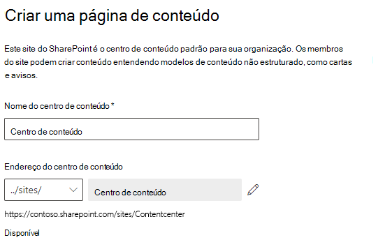

# Configuração do SharePoint SyntexSet up SharePoint Syntex

Os administradores podem usar o Centro de administração do Microsoft 365 para configurar o [Microsoft SharePoint Syntex](index.md).Admins can use the Microsoft 365 admin center to set up [Microsoft SharePoint Syntex](index.md). 

Considere o seguinte antes de começar:Consider the following before you start:

- Em quais sites do Microsoft Office SharePoint Online você habilitará o processamento de formulários?In which SharePoint sites will you enable form processing? Todos, alguns ou sites selecionados?All of them, some, or select sites?
- Como você nomeará seu centro de conteúdo padrão?What will you name your default content center?

É possível alterar suas configurações após a configuração inicial no Centro de administração do Microsoft 365.You can change your settings after initial setup in the Microsoft 365 admin center.

Antes da configuração, certifique-se de planejar a melhor maneira de estabelecer e configurar a compreensão de conteúdo no seu ambiente.Prior to setup, make sure to plan for the best way to set up and configure content understanding in your environment. Por exemplo, você precisa tomar as seguintes decisões:For example, you need to make the following decisions:

- Os sites do Microsoft Office SharePoint Online nos quais você deseja habilitar o processamento de formulários - todos, alguns ou sites selecionadosThe SharePoint sites in which you want to enable form processing - all of them, some, or selected sites
- O nome e os administradores do seu centro de conteúdoThe name and admins for your content center

## RequisitosRequirements 

> [!NOTE]
> Você precisa ter permissões administrativas globais ou de administrador do SharePoint para poder acessar o Centro de administração do Microsoft 365 e configurar o SharePoint Syntex.You must have Global admin or SharePoint admin permissions to be able to access the Microsoft 365 admin center and set up SharePoint Syntex.

Como administrador, também é possível fazer alterações nas configurações selecionadas a qualquer momento após a configuração e ao longo das configurações de gerenciamento de compreensão de conteúdo no Centro de Administração do Microsoft 365.As an admin, you can also make changes to your selected settings anytime after setup, and throughout the content understanding management settings in the Microsoft 365 Admin Center.

### LicenciamentoLicensing

Para usar o SharePoint Syntex, sua organização deve ter uma assinatura do SharePoint Syntex e cada usuário deve ter as seguintes licenças atribuídas:To use SharePoint Syntex, your organization must have a subscription to SharePoint Syntex, and each user must have the following licenses assigned:

- SharePoint SyntexSharePoint Syntex
- SharePoint Syntex - tipo SPOSharePoint Syntex - SPO type
- Serviço de dados comum para SharePoint SyntexCommon Data Service for SharePoint Syntex

Se você cancelar sua assinatura do SharePoint Syntex em uma data futura (ou se sua avaliação expirar), os usuários não poderão mais criar ou executar modelos de processamento de formulários ou compreensão de documentos, e o modelo do centro de conteúdo não estará mais disponível.If you cancel your SharePoint Syntex subscription at a future date (or your trial expires), users will no longer be able to create or run document understanding or form processing models, and the content center template will no longer be available. Além disso, relatórios de armazenamento de termos, importação de taxonomia SKOS e push de tipo de conteúdo não estarão mais disponíveis.Additionally, term store reports, SKOS taxonomy import, and Content type push will no longer be available. Nenhum conteúdo será excluído e as permissões do site não serão alteradas.No content will be deleted and site permissions will not be changed.

### Créditos do Construtor de IAAI Builder credits

Se você tiver 300 ou mais licenças do SharePoint Syntex para o SharePoint Syntex na sua organização, você receberá um milhão de créditos do Construtor de IA.If you have 300 or more SharePoint Syntex licenses for SharePoint Syntex in your organization, you will be allocated one million AI Builder credits. Se você tiver menos de 300 licenças, você deve comprar créditos do Construtor de IA para usar o processamento de formulários.If you have fewer than 300 licenses, you must purchase AI Builder credits in order to use forms processing.

Você pode estimar a capacidade correta do Construtor de IA com a [calculadora do Construtor de IA](https://powerapps.microsoft.com/ai-builder-calculator).You can estimate the AI Builder capacity that’s right for you with the [AI Builder calculator](https://powerapps.microsoft.com/ai-builder-calculator).

Vá até o [Centro de administração da Plataforma Power ](https://admin.powerplatform.microsoft.com/resources/capacity) para verificar seus créditos e uso.Go to the [Power Platform admin center](https://admin.powerplatform.microsoft.com/resources/capacity) to check your credits and usage.

## Para configurar o SharePoint SyntexTo set up SharePoint Syntex

1. No centro de administração do Microsoft 365, selecione **Configurar** e visualize a seção **Arquivos e conteúdo**.In the Microsoft 365 admin center, select **Setup**, and then view the **Files and content** section.

2. Na seção **Arquivos e conteúdo**, selecione **Automatizar a compreensão de conteúdo**.In the **Files and content** section, select **Automate content understanding**. 

3. Na página **Compreensão automatizada de conteúdo**, clique em **Começar** para percorrer o processo de instalação.On the **Automate content understanding** page, click **Get started** to walk through the setup process. 

    > [!div class="mx-imgBorder"]
    >  

4. Na página **Configurar Processamento de Formulário**, você pode escolher se quer permitir que os usuários sejam capazes de criar modelos de processamento de formulários em bibliotecas específicas de documentos do SharePoint.On the **Configure Form Processing** page, you can choose if you want to let users be able to create form processing models in specific SharePoint document libraries. Uma opção de menu estará disponível na faixa de opções da biblioteca de documentos para **Criar um modelo de processamento de formulário** nas bibliotecas de documentos do SharePoint nas quais ele está ativado.A menu option will be available in the document library ribbon to **Create a form processing model** in SharePoint document libraries in which it is enabled.
 
     Para **Quais bibliotecas do SharePoint devem exibir a opção para criar um modelo de processamento de formulário**, você pode selecionar:For **Which SharePoint libraries should show option to create a form processing model**, you can select: 
      - **Bibliotecas em todos os sites do Microsoft Office SharePoint Online** para torná-lo disponível para todas as bibliotecas do SharePoint em sua organização.**Libraries in all SharePoint sites** to make it available to all SharePoint libraries in your organization. 
      - **Bibliotecas em sites selecionados do Microsoft Office SharePoint Online** e, a seguir, selecione os sites nos quais deseja disponibilizá-las ou carregue uma lista de até 50 sites.**Libraries in selected SharePoint sites**, and then select the sites in which you want to make it available or upload a list of up to 50 sites. 
      - **Nenhuma biblioteca do SharePoint** se você não deseja torná-lo disponível para nenhum site (você pode alterar isto após a configuração).**No SharePoint libraries** if you don't want to make it available to any sites (you can change this after setup).

   > [!div class="mx-imgBorder"]
   > 

   > [!Note]
   > A remoção de um site após a sua insalubridade não afeta os modelos existentes aplicados às bibliotecas naquele site ou a capacidade de aplicar modelos de compreensão de documentos a uma biblioteca.Removing a site after it has been included does not affect existing models applied to the libraries in that site or the ability to apply document understanding models to a library. 
    
5. Na página **Criar Centro de Conteúdo**, você pode criar um site de centro de conteúdo do SharePoint, no qual seus usuários poderão criar e gerenciar modelos de compreensão de documentos.On the **Create Content Center** page, you can create a SharePoint content center site on which your users can create and manage document understanding models.

    1. Para **Nome do site**, digite o nome que você quer dar ao site do centro de conteúdo.For **Site name**, type the name you want to give your content center site.
    
    1. O **Endereço do site** mostrará o URL do seu site, baseado no que você selecionou para o nome do site.The **Site address** will show the URL for your site, based on what you selected for the site name. Se você desejar mudá-lo, clique em **Editar**.If you want to change it, click **Edit**.

       > [!div class="mx-imgBorder"]
       >  

       Selecione **Avançar**.Select **Next**.

6. Na página **Revisão e acabamento**, você pode olhar para a configuração selecionada e escolher fazer alterações.On the **Review and finish** page, you can look at your selected setting and choose to make changes. Se estiver satisfeito com as suas seleções, selecione **Ativar**.If you are satisfied with your selections, select **Activate**.

7. Na página de confirmação, clique em **Concluído**.On the confirmation page, click **Done**.

8. Você retornará à sua página **Compreensão automatizada de conteúdo**.You'll be returned to your **Automate content understanding** page. A partir desta página, é possível selecionar **Gerenciar** para fazer quaisquer alterações em suas configurações.From this page, you can select **Manage** to make any changes to your configuration settings. 

## Atribua licençasAssign licenses

Uma vez configurado o SharePoint Syntex, será necessário atribuir licenças para os usuários que farão uso dos recursos do SharePoint Syntex.Once you have configured SharePoint Syntex, you must assign licenses for the users who will be using any SharePoint Syntex features.

Atribuição de licenças:To assign licenses:

1. No Centro de administração do Microsoft 365, em **Usuários**, clique em **Usuários ativos**.In the Microsoft 365 admin center, under **Users**, click **Active users**.

2. Selecione os usuários que você deseja licenciar, e escolha **Gerenciar licenças de produtos**.Select the users that you want to license, and choose **Manage product licenses**.

3. Escolha **Aplicativos** no menu suspenso.Choose **Apps** from the drop-down menu.

4. Selecione **Mostrar aplicativos para o SharePoint Syntex**.Select **Show apps for  SharePoint Syntex**. Em **Aplicativos**, certifique-se de que **Common Data Service para o SharePoint Syntex**, **SharePoint Syntex** e **SharePoint Syntex - tipo de SPO** estão todos selecionados.Under **Apps**, make sure **Common Data Service for SharePoint Syntex**, **SharePoint Syntex**, and **SharePoint Syntex - SPO type** are all selected.

    > [!div class="mx-imgBorder"]
    > 

5. Clique em **Salvar alterações**.Click **Save changes**.

## Confira tambémSee also

[Visão geral do modelo de processamento de formulários](/ai-builder/form-processing-model-overview).[Overview of the form processing model](/ai-builder/form-processing-model-overview)

[Passo a passo: como construir um modelo de compreensão de documentos (vídeo)Step-by-Step: How to Build a Document Understanding Model (video)](https://www.youtube.com/watch?v=DymSHObD-bg)
