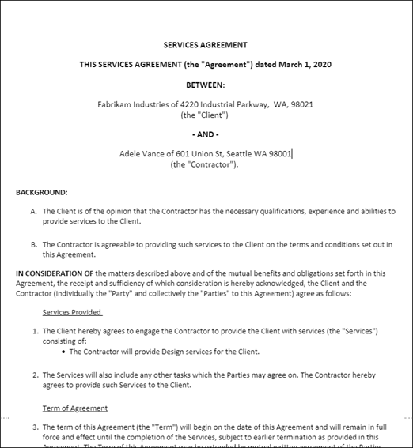

# Gerenciar contratos usando uma solução Microsoft 365 de segurançaManage contracts using a Microsoft 365 solution

Este artigo descreve como criar uma solução de gerenciamento de contratos para sua organização usando SharePoint Syntex e componentes de Microsoft 365.This article describes how to create a contracts management solution for your organization by using SharePoint Syntex and components of Microsoft 365. Ele fornece uma estrutura para ajudá-lo a planejar e criar uma solução que se ajuste às suas necessidades de negócios exclusivas.It provides you with a framework to help you plan and create a solution that fits your unique business needs. Mesmo se essa solução não atender às suas necessidades de negócios como um todo, partes dela podem ser adotadas em seu planejamento para criar uma solução de gerenciamento de contratos personalizada.Even if this solution doesn't suit your business needs as a whole, parts of it can be adopted in your planning to create a custom contract management solution.

## Identificar o problema de negóciosIdentify the business problem

A primeira etapa no planejamento do sistema de gerenciamento de contratos é entender o problema que você está tentando resolver.The first step in planning your contract management system is to understand the problem you're trying to solve. Para essa solução, quatro problemas principais precisam ser resolvidos:For this solution, four key issues need to be addressed:

- **Identificar contratos**.**Identify contracts**. Sua organização trabalha com muitos documentos, como faturas, contratos, instruções de trabalho e assim por diante.Your organization works with many documents, such as invoices, contracts, statements of work, and so on.  Alguns são ativos digitais enviados por email e alguns são ativos de papel enviados por email tradicional.Some are digital assets sent through email, and some are paper assets sent through traditional mail. Você precisa de uma maneira de identificar todos os contratos de clientes de todos os outros documentos e classificá-los como tal.You need a way to identify all customer contracts from all other documents, and then classifying them as such.

- **Acompanhe o histórico de aprovações de contrato.****Track the history of contract approvals**. Sua organização precisa de uma maneira confiável de descobrir se os contratos foram aprovados ou rejeitados e se o pagamento foi processado.Your organization needs a reliable way to find whether contracts have been either approved or rejected, and whether payment has been processed. 

- **Site para gerenciar aprovações de contrato**.**Site to manage contract approvals**. Sua organização precisa configurar um site colaborativo no qual todos os participantes necessários possam revisar facilmente contratos.Your organization needs to set up a collaborative site in which all required stakeholders can easily review contracts. As partes interessadas devem ser capazes de revisar todo o contrato, se necessário, mas principalmente se preocupam em ver vários campos principais de cada contrato (por exemplo, nome do cliente, número de PO e custo total).Stakeholders should be able to review the whole contract if needed, but mostly care about seeing several key fields from each contract (for example, customer name, PO number, and total cost). As partes interessadas devem ser capazes de aprovar ou rejeitar facilmente contratos de entrada.Stakeholders should be able to easily approve or reject incoming contracts.

- **Roteia contratos revisados**.**Route reviewed contracts**. Contratos aprovados e rejeitados precisam ser roteados por meio de um fluxo de trabalho específico.Approved and rejected contracts need to be routed through a specific workflow. Os contratos aprovados precisam ser roteados para um aplicativo de terceiros para processamento de pagamento.Approved contracts need to be routed to a third-party application for payment processing. Os contratos rejeitados precisam ser roteados para revisão adicional.Rejected contracts need to be routed for additional review.

## Visão geral da soluçãoOverview of the solution

  

Esta orientação de solução de gerenciamento de contratos inclui quatro componentes de Microsoft 365:This contract management solution guidance includes four components of Microsoft 365:

- **Microsoft SharePoint Syntex**: crie modelos para identificar e classificar seus arquivos de contrato e, em seguida, extrair os dados apropriados deles.**Microsoft SharePoint Syntex**: Create models to identify and classify your contract files and then extract the appropriate data from them.

- **Listas SharePoint** Microsoft : Use a formatação disponível em listas SharePoint modernas para apresentar contratos em um formato amigável para os negócios.**Microsoft SharePoint lists**: Use the formatting available in modern SharePoint lists to present contracts in a business-friendly format.

- **Microsoft Teams**: use a funcionalidade de um canal Teams e guias associadas para permitir que seus participantes revisem e gerenciem contratos.**Microsoft Teams**: Use the functionality of a Teams channel and associated tabs to allow your stakeholders to review and manage contracts.

- **Power Automate**: use fluxos para orientar contratos por meio do processo de aprovação e, em seguida, para um aplicativo de terceiros para pagamento.**Power Automate**: Use flows to guide contracts through the approval process, and then to a third-party application for payment.

### Como tudo funcionaHow it all works

  

1. Os documentos são carregados em uma biblioteca SharePoint de documentos.Documents are uploaded to a SharePoint document library. Um SharePoint de entendimento de documentos Syntex foi aplicado à biblioteca de documentos.A SharePoint Syntex document understanding model has been applied to the document library. Ele verifica cada arquivo para ver se algum corresponder a um tipo de conteúdo "contrato" que ele está treinado para procurar.It checks each file to see if any match a "contract" content type it's trained to look for. Se encontrar uma combinação, ele classifica o arquivo como um "contrato" e atualiza o tipo de conteúdo do documento.If it finds a match, it classifies the file as a "contract" and updates the content type for the document.

2. O modelo também retira dados específicos de cada arquivo de contrato que as partes interessadas em ver, como *o Cliente,* o Prestador *de* Serviços e o valor da *taxa.*The model also pulls out specific data from each contract file that stakeholders are interested in seeing, such as the *Client*, *Contractor*, and *Fee amount*.

    A página a seguir é um exemplo de um contrato que o modelo é treinado para identificar.The following page is an example of a contract that the model is trained to identify.

      

3. No Microsoft Teams, todos os participantes são membros de um canal seguro Teams no qual todos os contratos na biblioteca de documentos ficam visíveis para aprovação ou rejeição.In Microsoft Teams, all stakeholders are members of a secure Teams channel in which all contracts in the document library are visible for approval or rejection. Usando Teams funcionalidade, todas as partes interessadas são notificadas quando novos contratos precisam ser revistos.By using Teams functionality, all stakeholders are notified when new contracts need to be reviewed.
 
4. Usando o Power Automate, os contratos são movidos pelo processo de aprovação no Teams canal.By using Power Automate, contracts are moved through the approval process in the Teams channel. Quando um membro aprova um contrato, o status do contrato é alterado para aprovar, todos os membros são notificados por meio de uma postagem de Teams e um item de linha é criado para mostrar que o contrato está pronto para pagamento.When a member approves a contract, the contract status is changed to approve, all members are notified through a Teams post, and a line item is created to show that the contract is ready for payout. Esse processo pode ser estendido para gravar diretamente em um aplicativo financeiro de terceiros para pagamento.This process can be extended to write directly to a third-party financial application for payment.

5.  Quando um membro rejeita um contrato, o status é alterado para rejeitado e todos os membros são notificados por meio de Teams postagem.When a member rejects a contract, the status is changed to rejected, and all members are notified through a Teams post.

## Criar a soluçãoCreate the solution

As próximas seções entrarão em detalhes sobre como configurar a solução de gerenciamento de contratos.The next sections will go into detail about how to configure your contracts management solution. Ele é dividido em três etapas:It's divided into three steps:

- [Etapa 1. Use SharePoint Syntex para identificar arquivos de contrato e extrair dadosStep 1. Use SharePoint Syntex to identify contract files and extract data](solution-manage-contracts-step1.md)
- [Etapa 2. Use Microsoft Teams para criar seu canal de gerenciamento de contratosStep 2. Use Microsoft Teams to create your contract management channel](solution-manage-contracts-step2.md)
- [Etapa 3. Use Power Automate para criar seu fluxo para processar seus contratosStep 3. Use Power Automate to create your flow to process your contracts](solution-manage-contracts-step3.md)
