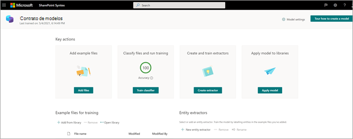
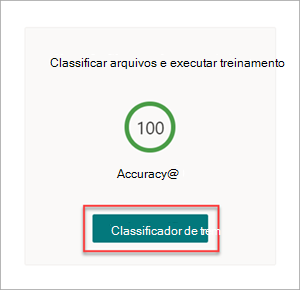
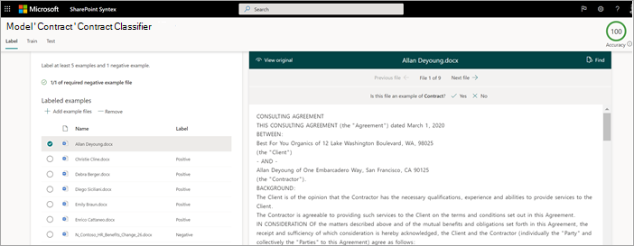
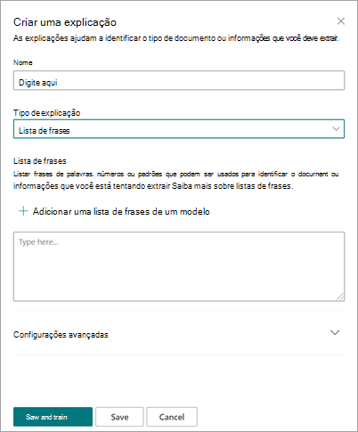
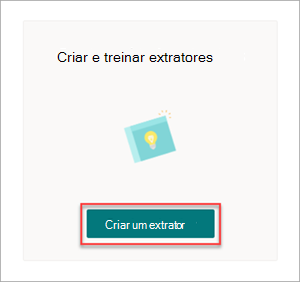
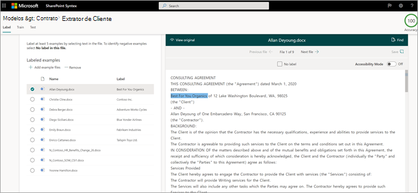
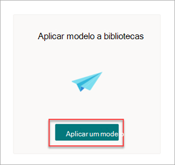

# Etapa 1. Use SharePoint Syntex para identificar arquivos de contrato e extrair dados

Sua organização precisa de uma maneira de identificar e classificar todos os documentos de contrato dos muitos arquivos recebidos. Você também deseja poder exibir rapidamente vários elementos-chave em cada um dos arquivos de contrato identificados (por exemplo, *Cliente,* Prestador de Serviços *e* Valor *da Taxa).* Você pode fazer isso usando SharePoint [Syntex](index.md) para criar um modelo de compreensão de documentos e aplica-lo a uma biblioteca de documentos.

## Visão geral do processo

[A compreensão do](document-understanding-overview.md) documento usa modelos de inteligência artificial (AI) para automatizar a classificação de arquivos e a extração de informações. Os modelos de compreensão de documentos também são ideais para extrair informações de documentos não estruturados e semiestruturados, onde as informações de que você precisa não estão contidas em tabelas ou formulários, como contratos.

1. Primeiro, você precisa encontrar pelo menos cinco arquivos de exemplo que você pode usar para "treinar" o modelo para pesquisar características específicas do tipo de conteúdo que você está tentando identificar (um contrato). 

2. Usando SharePoint Syntex, crie um novo modelo de compreensão de documentos. Usando seus arquivos de exemplo, você precisa [criar um classificador](create-a-classifier.md). Ao treinar o classificador com seus arquivos de exemplo, você o ensina a pesquisar características específicas do que você verá nos contratos da sua empresa. Por exemplo, crie uma ["explicação"](create-a-classifier.md#create-an-explanation) que procure cadeias de caracteres específicas que estão em seus contratos, como Contrato de *Serviço,* Termos de Contrato *e* *Compensação.* Você pode até mesmo treinar sua explicação para procurar essas cadeias de caracteres em seções específicas do documento ou localizadas ao lado de outras cadeias de caracteres. Quando você acha que treinou seu classificador com as informações necessárias, você pode testar seu modelo em um conjunto de exemplos de arquivos para ver o quão eficiente ele é. Após o teste, se necessário, você pode optar por fazer alterações em suas explicações para torná-las mais eficientes. 

3. Em seu modelo, você pode [criar um extrator](create-an-extractor.md) para extrair partes específicas de dados de cada contrato. Por exemplo, para cada contrato, as informações que você mais se preocupa são quem é o cliente, o nome do prestador de serviços e o custo total.

4. Depois de criar seu modelo com êxito, [aplique-o a](apply-a-model.md)uma SharePoint de documentos. À medida que você carrega documentos na biblioteca de documentos, seu modelo de compreensão de documentos será executado e identificará e classificará todos os arquivos que corresponderem ao tipo de conteúdo de contratos definido em seu modelo. Todos os arquivos classificados como contratos serão exibidos em um exibição de biblioteca personalizado. Os arquivos também exibirão os valores de cada contrato que você definiu em seu extrator.

   

5. Se você tiver requisitos de retenção para seus  contratos, também poderá usar seu modelo para aplicar um rótulo de retenção que impedirá que seus contratos sejam excluídos por um período de tempo especificado.

## Etapas para criar e treinar seu modelo

> [!NOTE]
> Para essas etapas, você pode usar os arquivos de exemplo no repositório Ativos da Solução de Gerenciamento de [Contratos.](https://github.com/pnp/syntex-samples/tree/main/scenario%20assets/Contracts%20Management) Os exemplos neste repositório contêm os arquivos de modelo de compreensão do documento e os arquivos usados para treinar o modelo.

### Criar um modelo de contrato

A primeira etapa é criar seu modelo de contrato.

1. No centro de conteúdo, selecione **Novo**, e depois **Criar um modelo**.

2. No painel **Novo modelo de compreensão de** documento, no campo **Nome,** digite o nome do modelo. Para essa solução de gerenciamento de contrato, você pode nomear o modelo *Contract*.

4. Escolha **Criar**. Isso cria uma página inicial para o modelo. 

    

### Treine seu modelo para classificar um tipo de arquivo

#### Adicionar arquivos de exemplo para seu modelo

Você precisa adicionar pelo menos cinco arquivos de exemplo que são documentos de contrato e um arquivo de exemplo que não seja um documento de contrato (por exemplo, uma instrução de trabalho). 

1. Na página **Modelos > Contrato,** em **Ações principais** Adicionar arquivos  >  **de exemplo,** selecione Adicionar **arquivos**.

   

2. Na página **Selecionar arquivos de exemplo para seu modelo,** abra a pasta Contrato, selecione arquivos que deseja usar e selecione **Adicionar**. Se você não tiver arquivos de exemplo, selecione **Upload** adicioná-los.

#### Rotular os arquivos como exemplos positivos ou negativos

1. Na página **Modelos > Contrato,** em **Ações** principais Classificar arquivos e executar  >  treinamento, selecione **Classificador de trem**.

   

2. Na página Modelos > Classificador de Contrato **>,** no visualizador na parte superior do primeiro arquivo de exemplo, você verá texto perguntando se o arquivo é um exemplo do modelo de contrato que você criou. Se for um exemplo positivo, selecione **Sim**. Se for um exemplo negativo, selecione **Não**.

3. Na lista **Exemplos rotulados** à esquerda, selecione outros arquivos que você deseja usar como exemplos e rotule-os. 

     

#### Adicionar pelo menos uma explicação para treinar o classificador 

1. Na página **Modelos > contrato > classificador de** contrato, selecione a **guia** Trem.

2. Na seção **Arquivos treinados,** você verá uma lista dos arquivos de exemplo que você rotulou anteriormente. Selecione um dos arquivos positivos da lista para exibi-lo no visualizador.

3. Na seção **Explicações,** selecione **Novo** e, em **seguida, Em Branco**.

4. Na página **Criar uma explicação**:

    a. No campo **Nome,** digite o nome da explicação (como &quot;Contrato").

    b. No campo **Tipo de explicação,** selecione **Lista de** frases , porque você adiciona uma cadeia de caracteres de texto.

    c. Na caixa **de listagem Frase,** digite a cadeia de caracteres (como "AGREEMENT"). Você pode selecionar **Case sensitive** se a cadeia de caracteres precisar ser sensível a minúsculas.

    d. Selecione **Salvar e treinar**.

     

#### Testar seu modelo

Você pode testar seu modelo de contrato em arquivos de exemplo que ele não viu antes. Isso é opcional, mas pode ser uma prática útil.

1. Na página **Modelos > contrato > classificador de** contrato, selecione a **guia** Testar. Isso executa o modelo em seus arquivos de exemplo não rotulados.

2. Na lista **Arquivos de Teste,** seus arquivos de exemplo são exibidos e mostram se o modelo previu que eles sejam positivos ou negativos. Use essas informações para ajudá-lo a determinar a eficácia do seu classificador na identificação de seus documentos.

     

3. Quando terminar, selecione **Exit Training**.

### Criar e treinar um extrator

1. Na página **Modelos > Contrato,** em **Principais** ações Criar e  >  **treinar** extratores, selecione **Criar extrator**.

   

2. No painel **Novo extrator de entidade,** no campo **Novo** nome, digite o nome do seu extrator. Por exemplo, *nomeia-o Cliente* se você quiser extrair o nome do cliente de cada contrato.

3. Quando terminar, selecione **Criar**.

#### Rotular a entidade que você deseja extrair

Quando você cria o extrator, a página do extrator é aberta. Aqui você vê uma lista com seus arquivos de amostra, e o primeiro arquivo da lista é exibido no visualizador.

 

Para rotular a entidade:

1. No visualizador, selecione os dados que deseja extrair dos arquivos. Por exemplo, se você quiser extrair o *Cliente*, realça o valor do cliente no primeiro arquivo (neste exemplo, *Best For You Organics*) e selecione **Salvar**. Você verá o valor exibido do arquivo na **lista Exemplos** rotulados, na **coluna Rótulo.**

2. Selecione **Próximo arquivo** para salvar automaticamente e abrir o próximo arquivo na lista no visualizador. Ou selecione **Salvar** e selecione outro arquivo na **lista Exemplos rotulados.**

3. No visualizador, repita as etapas 1 e 2 e repita até salvar o rótulo em todos os arquivos.

Depois de rotular os arquivos, um banner de notificação será exibido informando que você deve passar para o treinamento. Você pode optar por rotular mais documentos ou avançar para o treinamento.

#### Adicione uma explicação

Você pode criar uma explicação que fornece uma dica sobre o formato da entidade em si e as variações que ele pode ter nos arquivos de exemplo. Por exemplo, um valor de data pode estar em vários formatos diferentes, como:

- 14/10/2019
- 14 de outubro de 2019
- Segunda-feira, 14 de outubro de 2019

Para ajudar a identificar *a Data de* Início do Contrato, você pode criar uma explicação de padrão.

1. Na seção **Explicações,** selecione **Novo** e, em **seguida, Em Branco**.

2. Na página **Criar uma explicação**:

    a. No campo **Nome,** digite o nome da explicação (como *Data*).

    b. No campo **Tipo de explicação,** selecione **Lista de padrões**.

    c. No campo **Valor,** forneça a variação de data conforme aparecem nos arquivos de exemplo. Por exemplo, se você tem formatos de data que aparecem como 0/00/0000, digite quaisquer variações que aparecem em seus documentos, como por exemplo:

    - 0/0/0000
    - 0/00/0000
    - 00/0/0000
    - 00/00/0000

4. Selecione **Salvar e treinar**.

#### Testar seu modelo novamente

Você pode testar seu modelo de contrato em arquivos de exemplo que ele não viu antes. Isso é opcional, mas pode ser uma prática útil.

1. Na página **Modelos > contrato > classificador de** contrato, selecione a **guia** Testar. Isso executa o modelo em seus arquivos de exemplo não rotulados.

2. Na lista **Arquivos de teste,** seus arquivos de exemplo são exibidos e mostram se o modelo é capaz de extrair as informações necessárias. Use essas informações para ajudá-lo a determinar a eficácia do seu classificador na identificação de seus documentos.

3. Quando terminar, selecione **Exit Training**.

### Aplicar seu modelo a uma biblioteca de documentos

Para aplicar seu modelo a uma biblioteca SharePoint de documentos:

1. Na página **Modelos > Contrato,** em **Principais** ações Aplicar modelo a  >  **bibliotecas,** selecione Aplicar **modelo**.

   

2. No painel **Adicionar Contrato,** selecione o site SharePoint que contém a biblioteca de documentos à qual você deseja aplicar o modelo. Se o site não for mostrado na lista, use a caixa de pesquisa para localizá-lo. Selecione **Adicionar**.

    > [!NOTE]
    > Você deve ter permissões de *Gerenciar Lista* ou direitos de *Editar* na biblioteca de documentos para a qual você está aplicando o modelo.

3. Depois de selecionar o site, selecione a biblioteca de documentos à qual deseja aplicar o modelo.

4. Como o modelo está associado a um tipo de conteúdo, ao aplicá-lo à biblioteca, ele adicionará o tipo de conteúdo e sua exibição com os rótulos que você extraiu mostrando como colunas. Esse modo de exibição é o modo de exibição padrão da biblioteca por padrão, mas você  pode optar por não ser o modo de exibição padrão selecionando Configurações avançadas e **des** marcando a caixa de seleção Definir esse novo modo de exibição como padrão.

5. Selecione **Adicionar** para aplicar o modelo à biblioteca.

6. Na página **Modelos > Contrato,** na seção **Bibliotecas** com este modelo, você verá a URL do site SharePoint listada.

    

Depois de aplicar o modelo à biblioteca de documentos, você pode começar a carregar documentos no site e ver os resultados.

## Próxima etapa

[Etapa 2. Use Microsoft Teams para criar seu canal de gerenciamento de contratos](solution-manage-contracts-step2.md)