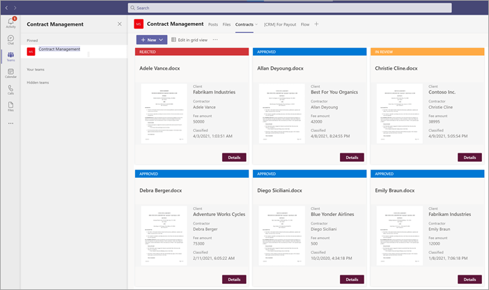
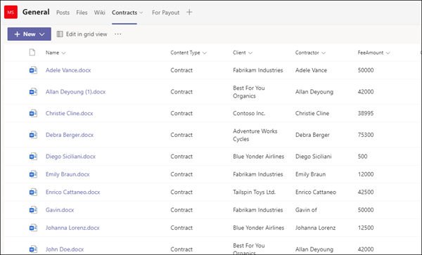
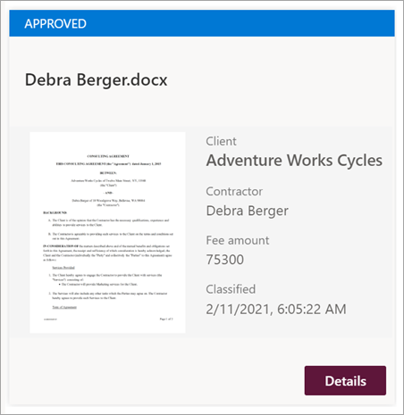

# <a name="step-2-use-microsoft-teams-to-create-your-contract-management-channel"></a><span data-ttu-id="c9aca-104">Etapa 2.</span><span class="sxs-lookup"><span data-stu-id="c9aca-104">Step 2.</span></span> <span data-ttu-id="c9aca-105">Use Microsoft Teams para criar seu canal de gerenciamento de contratos</span><span class="sxs-lookup"><span data-stu-id="c9aca-105">Use Microsoft Teams to create your contract management channel</span></span>

<span data-ttu-id="c9aca-106">Quando sua organização configura uma solução de gerenciamento de contratos, você precisa de um local central no qual os participantes possam revisar e gerenciar contratos.</span><span class="sxs-lookup"><span data-stu-id="c9aca-106">When your organization sets up a contracts management solution, you need a central location in which stakeholders can review and manage contracts.</span></span> <span data-ttu-id="c9aca-107">Para isso, você pode [usar](https://docs.microsoft.com/microsoftteams/) Microsoft Teams para configurar um canal Teams e usar os recursos em Teams para:</span><span class="sxs-lookup"><span data-stu-id="c9aca-107">For this purpose, you can use [Microsoft Teams](https://docs.microsoft.com/microsoftteams/) to set up a Teams channel and use the features in Teams to:</span></span>

- <span data-ttu-id="c9aca-108">**Crie um local para que as partes interessadas vejam facilmente todos os contratos que exigem ação.**</span><span class="sxs-lookup"><span data-stu-id="c9aca-108">**Create a location for stakeholders to easily see all contracts that require action.**</span></span> <span data-ttu-id="c9aca-109">Por exemplo, Teams você pode criar uma guia **Contratos** no canal Gerenciamento de Contratos no qual os membros podem ver uma exibição de azulejo útil de todos os contratos que precisam de aprovação.</span><span class="sxs-lookup"><span data-stu-id="c9aca-109">For example, in Teams you can create a **Contracts** tab in the Contract Management channel in which members can see a useful tile view of all contracts that need approval.</span></span> <span data-ttu-id="c9aca-110">Você também pode configurar o modo de exibição para que cada "cartão" lista os dados importantes com os quais você se importa (como *Cliente,* Prestador de Serviços *e* *Valor da Taxa).*</span><span class="sxs-lookup"><span data-stu-id="c9aca-110">You can also configure the view so that each "card" lists the important data you care about (such as *Client*, *Contractor*, and *Fee amount*).</span></span>

     

- <span data-ttu-id="c9aca-112">**Ter um local para os membros interagirem uns com os outros e ver eventos importantes.**</span><span class="sxs-lookup"><span data-stu-id="c9aca-112">**Have a location for members to interact with each other and see important events.**</span></span> <span data-ttu-id="c9aca-113">Por exemplo, Teams, a guia **Postagens** pode ser usada para ter conversas, obter atualizações e ver ações (como um membro rejeitando um contrato).</span><span class="sxs-lookup"><span data-stu-id="c9aca-113">For example, in Teams, the **Posts** tab can be used to have conversations, get updates, and see actions (such as a member rejecting a contract).</span></span> <span data-ttu-id="c9aca-114">Quando algo aconteceu (como um novo contrato enviado para aprovação), a guia **Postagens** pode ser usada não apenas para anuiá-lo, mas também para manter um registro dele.</span><span class="sxs-lookup"><span data-stu-id="c9aca-114">When something has happened (such as a new contract submitted for approval), the **Posts** tab can be used not only to announce it, but also to keep a record of it.</span></span> <span data-ttu-id="c9aca-115">E se os membros assinarem as notificações, eles serão notificados sempre que houver uma atualização.</span><span class="sxs-lookup"><span data-stu-id="c9aca-115">And if members subscribe to notifications, they'll get notified whenever there's an update.</span></span> 

     </br> 

- <span data-ttu-id="c9aca-117">**Tenha um local para os membros ver contratos aprovados para saber quando eles podem ser enviados para pagamento.**</span><span class="sxs-lookup"><span data-stu-id="c9aca-117">**Have a location for members to see approved contracts to know when they can be submitted for payment.**</span></span> <span data-ttu-id="c9aca-118">Em Teams, você pode criar um canal <b>para</b> pagamento que lista todos os contratos que precisarão ser enviados ao pagamento.</span><span class="sxs-lookup"><span data-stu-id="c9aca-118">In Teams, you can create a <b>For Payment</b> channel that will list all contracts that will need to be submitted to payment.</span></span> <span data-ttu-id="c9aca-119">Você pode estender facilmente essa solução para gravar essas informações diretamente em um aplicativo financeiro de terceiros (por exemplo, Dynamics CRM).</span><span class="sxs-lookup"><span data-stu-id="c9aca-119">You can easily extend this solution to instead write this information directly to a third-party financial application (for example, Dynamics CRM).</span></span>

## <a name="attach-your-sharepoint-document-library-to-the-contracts-tab"></a><span data-ttu-id="c9aca-120">Anexar sua SharePoint de documentos à guia Contratos</span><span class="sxs-lookup"><span data-stu-id="c9aca-120">Attach your SharePoint document library to the Contracts tab</span></span> 

<span data-ttu-id="c9aca-121">Depois de criar uma guia **Contratos** em seu canal de Gerenciamento de Contratos, você precisará anexar sua SharePoint [de documentos a ela.](https://support.microsoft.com/office/add-a-sharepoint-page-list-or-document-library-as-a-tab-in-teams-131edef1-455f-4c67-a8ce-efa2ebf25f0b)</span><span class="sxs-lookup"><span data-stu-id="c9aca-121">After you create a **Contracts** tab in your Contracts Management channel, you need to [attach your SharePoint document library to it](https://support.microsoft.com/office/add-a-sharepoint-page-list-or-document-library-as-a-tab-in-teams-131edef1-455f-4c67-a8ce-efa2ebf25f0b).</span></span> <span data-ttu-id="c9aca-122">A SharePoint de documentos que você deseja anexar é a que você aplicou seu modelo de entendimento de documento SharePoint Syntex na seção anterior.</span><span class="sxs-lookup"><span data-stu-id="c9aca-122">The SharePoint document library you want to attach is the one in which you applied your SharePoint Syntex document understanding model to in the previous section.</span></span>

<span data-ttu-id="c9aca-123">Depois de anexar a SharePoint de documentos, você poderá exibir quaisquer contratos confidenciais por meio de um modo de exibição de lista padrão.</span><span class="sxs-lookup"><span data-stu-id="c9aca-123">After you attach the SharePoint document library, you'll be able to view any classified contracts through a default list view.</span></span>

    

## <a name="customize-your-contracts-tab-tile-view"></a><span data-ttu-id="c9aca-125">Personalizar o seu exibição de tile de tabulação Contratos</span><span class="sxs-lookup"><span data-stu-id="c9aca-125">Customize your Contracts tab tile view</span></span>

> [!NOTE]
> <span data-ttu-id="c9aca-126">Esta seção faz referência a exemplos de código que estão contidos no arquivo **ContractCard.json** incluído no arquivo zip **solutionfiles.**</span><span class="sxs-lookup"><span data-stu-id="c9aca-126">This section references code examples that are contained in the **ContractCard.json** file that is included in the **solutionfiles** zip file.</span></span>

<span data-ttu-id="c9aca-127">Enquanto Teams permite que você veja seus contratos em uma exibição de azulejo, talvez você queira personalizá-los para exibir os dados de contrato que você deseja tornar visíveis no cartão de contrato.</span><span class="sxs-lookup"><span data-stu-id="c9aca-127">While Teams lets you view your contracts in a tile view, you might want to customize it to view the contract data you want to make visible in the contract card.</span></span> <span data-ttu-id="c9aca-128">Por exemplo, para a guia **Contratos,** é importante que os membros vejam o cliente, o contratado e o valor da taxa no cartão de contrato.</span><span class="sxs-lookup"><span data-stu-id="c9aca-128">For example, for the **Contracts** tab, it is important for members to see the client, contractor, and fee amount on the contract card.</span></span> <span data-ttu-id="c9aca-129">Todos esses campos foram extraídos de cada contrato por meio do seu modelo SharePoint Syntex que foi aplicado à biblioteca de documentos.</span><span class="sxs-lookup"><span data-stu-id="c9aca-129">All of these fields were extracted from each contract through your SharePoint Syntex model that was applied to your document library.</span></span> <span data-ttu-id="c9aca-130">Você também deseja poder alterar a barra de header de azulejo para cores diferentes para cada status para que os membros possam ver facilmente onde o contrato está no processo de aprovação.</span><span class="sxs-lookup"><span data-stu-id="c9aca-130">You also want to be able to change the tile header bar to different colors for each status so that members can easily see where the contract is in the approval process.</span></span> <span data-ttu-id="c9aca-131">Por exemplo, todos os contratos aprovados terão uma barra de header azul.</span><span class="sxs-lookup"><span data-stu-id="c9aca-131">For example, all approved contracts will have a blue header bar.</span></span>

   

<span data-ttu-id="c9aca-133">A exibição de azulejo personalizada que você usa exige que você faça alterações no arquivo JSON usado para formatar o exibição de azulejo atual.</span><span class="sxs-lookup"><span data-stu-id="c9aca-133">The custom tile view you use requires you to make changes to the JSON file used to format the current tile view.</span></span> <span data-ttu-id="c9aca-134">Você pode fazer referência ao arquivo JSON usado para criar o exibição de cartão baixando oContractCard.js **no** arquivo.</span><span class="sxs-lookup"><span data-stu-id="c9aca-134">You can reference the JSON file used to create the card view by downloading the **ContractCard.json** file.</span></span> <span data-ttu-id="c9aca-135">Nas seções a seguir, você verá seções específicas do código para recursos que estão nos cartões de contrato.</span><span class="sxs-lookup"><span data-stu-id="c9aca-135">In the following sections, you'll see specific sections of the code for features that are in the contract cards.</span></span>

<span data-ttu-id="c9aca-136">Se você quiser ver ou fazer alterações no código JSON para seu exibição no canal Teams, no canal Teams, selecione o menu suspenso exibir e selecione **Formatar** o exibição atual .</span><span class="sxs-lookup"><span data-stu-id="c9aca-136">If you want to see or make changes to the JSON code for your view in your Teams channel, in the Teams channel, select the view drop-down menu, and then select **Format current view**.</span></span>

    

## <a name="card-size-and-shape"></a><span data-ttu-id="c9aca-138">Tamanho e forma do cartão</span><span class="sxs-lookup"><span data-stu-id="c9aca-138">Card size and shape</span></span>

<span data-ttu-id="c9aca-139">No arquivo **ContractCard.js** on que você baixou no arquivo ZIP de referência, consulte a seção a seguir para ver o código de como o tamanho e a forma do cartão são formatados.</span><span class="sxs-lookup"><span data-stu-id="c9aca-139">In the **ContractCard.json** file that you downloaded in the reference zip file, look at the following section to see the code for how the size and shape of the card is formatted.</span></span>

```JSON
                  {
                    "elmType": "div",
                    "style": {
                      "background-color": "#f5f5f5",
                      "padding": "5px",
                      "width": "180px"
                    },
                    "children": [
                      {
                        "elmType": "img",
                        "attributes": {
                          "src": "@thumbnail.large"
                        },
                        "style": {
                          "width": "185px",
                          "height": "248px"
                        }
                      }
```


## <a name="contract-status"></a><span data-ttu-id="c9aca-140">Status do contrato</span><span class="sxs-lookup"><span data-stu-id="c9aca-140">Contract status</span></span>

<span data-ttu-id="c9aca-141">O código a seguir permite definir o status de cada cartão de título.</span><span class="sxs-lookup"><span data-stu-id="c9aca-141">The following code lets you define the status of each title card.</span></span> <span data-ttu-id="c9aca-142">Observe que cada valor de status (*Novo*, *Em revisão,* Aprovado e *Rejeitado*) exibirá um código de cor diferente para cada um.</span><span class="sxs-lookup"><span data-stu-id="c9aca-142">Note that each status value (*New*, *In review*, *Approved*, and *Rejected*) will display a different color code for each.</span></span> <span data-ttu-id="c9aca-143">No arquivo **ContractCard.json** que você baixou, veja a seção que define o status.</span><span class="sxs-lookup"><span data-stu-id="c9aca-143">In the **ContractCard.json** file that you downloaded, look at the section that defines the status.</span></span>

```JSON
          {
            "elmType": "div",
            "children": [
              {
                "elmType": "div",
                "style": {
                  "color": "white",
                  "background-color": "=if([$Status] == 'New', '#00b7c3', if([$Status] == 'In review', '#ffaa44', if([$Status] == 'Approved', '#0078d4', if([$Status] == 'Rejected', '#d13438', '#8378de'))))",
                  "padding": "5px 15px",
                  "height": "auto",
                  "text-transform": "uppercase",
                  "font-size": "12.5px"
                },
                "txtContent": "[$Status]"
              }
```


## <a name="extracted-fields"></a><span data-ttu-id="c9aca-144">Campos extraídos</span><span class="sxs-lookup"><span data-stu-id="c9aca-144">Extracted fields</span></span>

<span data-ttu-id="c9aca-145">Cada cartão de contrato exibirá três campos que foram extraídos para cada contrato (*Client,* *Contractor* e *Fee Amount*).</span><span class="sxs-lookup"><span data-stu-id="c9aca-145">Each contract card will display three fields that were extracted for each contract (*Client*, *Contractor*, and *Fee Amount*).</span></span> <span data-ttu-id="c9aca-146">Além disso, você também deseja exibir a hora/data em que o arquivo foi classificado pelo modelo SharePoint Syntex usado para identificá-lo.</span><span class="sxs-lookup"><span data-stu-id="c9aca-146">Additionally, you also want to display the time/date that the file was classified by the SharePoint Syntex model used to identify it.</span></span> 

<span data-ttu-id="c9aca-147">No arquivo **ContractCard.json** que você baixou, as seções a seguir definem cada uma delas.</span><span class="sxs-lookup"><span data-stu-id="c9aca-147">In the **ContractCard.json** file that you downloaded, the following sections define each of these.</span></span>

### <a name="client"></a><span data-ttu-id="c9aca-148">Client</span><span class="sxs-lookup"><span data-stu-id="c9aca-148">Client</span></span>

<span data-ttu-id="c9aca-149">Esta seção define como "Cliente" será exibido no cartão e usa o valor do contrato específico.</span><span class="sxs-lookup"><span data-stu-id="c9aca-149">This section defines how "Client" will display on the card, and uses the value for the specific contract.</span></span>

```JSON
                      {
                        "elmType": "div",
                        "style": {
                          "color": "#767676",
                          "font-size": "12px"
                        },
                        "txtContent": "Client"
                      },
                      {
                        "elmType": "div",
                        "style": {
                          "margin-bottom": "12px",
                          "font-size": "16px",
                          "font-weight": "600"
                        },
                        "txtContent": "[$Client]"
                      },
```

### <a name="contractor"></a><span data-ttu-id="c9aca-150">Prestador de serviços</span><span class="sxs-lookup"><span data-stu-id="c9aca-150">Contractor</span></span>

<span data-ttu-id="c9aca-151">Esta seção define como o "Contratado" será exibido no cartão e usa o valor do contrato específico.</span><span class="sxs-lookup"><span data-stu-id="c9aca-151">This section defines how the "Contractor" will display on the card, and uses the value for the specific contract.</span></span>

```JSON
                      {
                        "elmType": "div",
                        "style": {
                          "color": "#767676",
                          "font-size": "12px"
                        },
                        "txtContent": "Client"
                      },
                      {
                        "elmType": "div",
                        "style": {
                          "margin-bottom": "12px",
                          "font-size": "16px",
                          "font-weight": "600"
                        },
                        "txtContent": "[$Client]"
},
```


### <a name="fee-amount"></a><span data-ttu-id="c9aca-152">Valor da taxa</span><span class="sxs-lookup"><span data-stu-id="c9aca-152">Fee Amount</span></span>

<span data-ttu-id="c9aca-153">Esta seção define como o "Valor da Taxa" será exibido no cartão e usa o valor do contrato específico.</span><span class="sxs-lookup"><span data-stu-id="c9aca-153">This section defines how the "Fee Amount" will display on the card, and uses the value for the specific contract.</span></span>

```JSON
                      {
                        "elmType": "div",
                        "txtContent": "Fee amount",
                        "style": {
                          "color": "#767676",
                          "font-size": "12px",
                          "margin-bottom": "2px"
                        }
                      },
                      {
                        "elmType": "div",
                        "style": {
                          "margin-bottom": "12px",
                          "font-size": "14px"
                        },
                        "txtContent": "[$FeeAmount]"
                      },
```


### <a name="classification-date"></a><span data-ttu-id="c9aca-154">Data da classificação</span><span class="sxs-lookup"><span data-stu-id="c9aca-154">Classification date</span></span>

<span data-ttu-id="c9aca-155">Esta seção define como "Classificação" será exibida no cartão e usa o valor do contrato específico.</span><span class="sxs-lookup"><span data-stu-id="c9aca-155">This section defines how "Classification" will display on the card, and uses the value for the specific contract.</span></span>

```JSON
                      {
                        "elmType": "div",
                        "txtContent": "Classified",
                        "style": {
                          "color": "#767676",
                          "font-size": "12px",
                          "margin-bottom": "2px"
                        }
                      },
                      {
                        "elmType": "div",
                        "style": {
                          "margin-bottom": "12px",
                          "font-size": "14px"
                        },
                        "txtContent": "[$PrimeLastClassified]"
                      }
```

## <a name="next-step"></a><span data-ttu-id="c9aca-156">Próxima etapa</span><span class="sxs-lookup"><span data-stu-id="c9aca-156">Next step</span></span>

[<span data-ttu-id="c9aca-157">Etapa 3. Use Power Automate para criar seu fluxo para processar seus contratos</span><span class="sxs-lookup"><span data-stu-id="c9aca-157">Step 3. Use Power Automate to create your flow to process your contracts</span></span>](solution-manage-contracts-step3.md)
