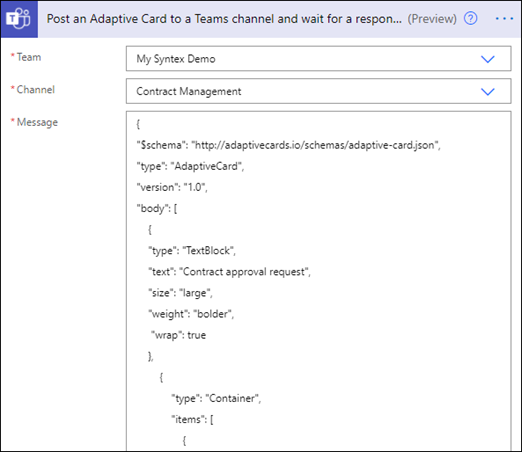
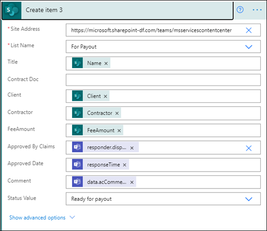
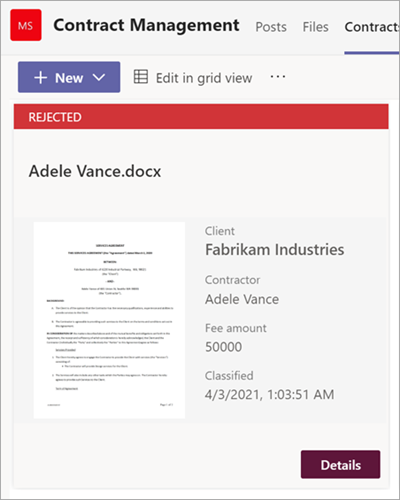

# <a name="step-3-use-power-automate-to-create-your-flow-to-process-your-contracts"></a><span data-ttu-id="90f4c-104">Etapa 3.</span><span class="sxs-lookup"><span data-stu-id="90f4c-104">Step 3.</span></span> <span data-ttu-id="90f4c-105">Use Power Automate para criar seu fluxo para processar seus contratos</span><span class="sxs-lookup"><span data-stu-id="90f4c-105">Use Power Automate to create your flow to process your contracts</span></span>

<span data-ttu-id="90f4c-106">Você criou seu canal de Gerenciamento de Contratos e anexou sua SharePoint de documentos.</span><span class="sxs-lookup"><span data-stu-id="90f4c-106">You've created your Contract Management channel and have attached your SharePoint document library.</span></span> <span data-ttu-id="90f4c-107">A próxima etapa é criar um fluxo Power Automate para processar seus contratos que seu modelo SharePoint Syntex identifica e classifica.</span><span class="sxs-lookup"><span data-stu-id="90f4c-107">The next step is to create a Power Automate flow to process your contracts that your SharePoint Syntex model identifies and classifies.</span></span> <span data-ttu-id="90f4c-108">Você pode fazer essa etapa criando [um fluxo Power Automate na biblioteca SharePoint de documentos.](https://support.microsoft.com/office/create-a-flow-for-a-list-or-library-in-sharepoint-or-onedrive-a9c3e03b-0654-46af-a254-20252e580d01)</span><span class="sxs-lookup"><span data-stu-id="90f4c-108">You can do this step by [creating a Power Automate flow in your SharePoint document library](https://support.microsoft.com/office/create-a-flow-for-a-list-or-library-in-sharepoint-or-onedrive-a9c3e03b-0654-46af-a254-20252e580d01).</span></span>

<span data-ttu-id="90f4c-109">Para a solução de gerenciamento de contratos, você deseja criar um fluxo Power Automate para fazer as seguintes ações:</span><span class="sxs-lookup"><span data-stu-id="90f4c-109">For your contracts management solution, you want to create a Power Automate flow to do the following actions:</span></span>

-  <span data-ttu-id="90f4c-110">Depois que um contrato tiver sido classificado pelo seu modelo SharePoint Syntex, altere o status do contrato para **Em revisão.**</span><span class="sxs-lookup"><span data-stu-id="90f4c-110">After a contract has been classified by your SharePoint Syntex model, change the contract status to **In review**.</span></span>
- <span data-ttu-id="90f4c-111">Em seguida, o contrato é revisado e aprovado ou rejeitado.</span><span class="sxs-lookup"><span data-stu-id="90f4c-111">The contract is then reviewed and is either approved or rejected.</span></span>
- <span data-ttu-id="90f4c-112">Para contratos aprovados, as informações do contrato são postadas em uma guia para processamento de pagamento.</span><span class="sxs-lookup"><span data-stu-id="90f4c-112">For approved contracts, the contract information is posted to a tab for payment processing.</span></span>
- <span data-ttu-id="90f4c-113">Para contratos rejeitados, a equipe é notificada para análise posterior.</span><span class="sxs-lookup"><span data-stu-id="90f4c-113">For rejected contracts, the team is notified for further analysis.</span></span> 

<span data-ttu-id="90f4c-114">O diagrama a seguir mostra o fluxo Power Automate para a solução de gerenciamento de contratos.</span><span class="sxs-lookup"><span data-stu-id="90f4c-114">The following diagram shows the Power Automate flow for the contract management solution.</span></span>


## <a name="prepare-your-contract-for-review"></a><span data-ttu-id="90f4c-116">Preparar seu contrato para revisão</span><span class="sxs-lookup"><span data-stu-id="90f4c-116">Prepare your contract for review</span></span>

<span data-ttu-id="90f4c-117">Quando um contrato é identificado e classificado pelo seu modelo de SharePoint de entendimento do documento Syntex, o fluxo de Power Automate primeiro alterará o status para **Em revisão**.</span><span class="sxs-lookup"><span data-stu-id="90f4c-117">When a contract is identified and classified by your SharePoint Syntex document understanding model, the Power Automate flow will first change the status to **In review**.</span></span>


<span data-ttu-id="90f4c-119">Depois de fazer check-out do arquivo, altere o valor de status para **Em revisão**.</span><span class="sxs-lookup"><span data-stu-id="90f4c-119">After checking out the file, change the status value to **In review**.</span></span>


<span data-ttu-id="90f4c-121">A próxima etapa é criar um cartão adaptável informando que o contrato está aguardando revisão e postagem no canal gerenciamento de contratos.</span><span class="sxs-lookup"><span data-stu-id="90f4c-121">The next step is to create an adaptive card stating that the contract is waiting for review and posting it to the Contract Management channel.</span></span>




<span data-ttu-id="90f4c-124">O código a seguir é o JSON usado para esta etapa no Power Automate fluxo.</span><span class="sxs-lookup"><span data-stu-id="90f4c-124">The following code is the JSON used for this step in the Power Automate flow.</span></span>

```JSON
{
"$schema": "http://adaptivecards.io/schemas/adaptive-card.json",
"type": "AdaptiveCard",
"version": "1.0",
"body": [
    {
    "type": "TextBlock",
    "text": "Contract approval request",
    "size": "large",
    "weight": "bolder",
     "wrap": true
    },
        {
            "type": "Container",
            "items": [
                {
                    "type": "FactSet",
                    "spacing": "Large",
                    "facts": [
                        {
                            "title": "Client",
                            "value": "@{triggerOutputs()?['body/Client']}"
                        },
                        {
                            "title": "Contractor",
                            "value": "@{triggerOutputs()?['body/Contractor']}"
                        },
                        {
                            "title": "Fee amount",
                            "value": "@{triggerOutputs()?['body/FeeAmount']}"
                        },
                        {
                            "title": "Date created",
                            "value": "@{triggerOutputs()?['body/Modified']} "
                        },
                        {
                            "title": "Link",
                            "value": "[@{triggerOutputs()?['body/{FilenameWithExtension}']}](@{triggerOutputs()?['body/{Link}']})"
                        }
                    ]
                }
            ]
         },
    {
    "type": "TextBlock",
    "text": "Comment:"
    },
        {
            "type": "Input.Text",
            "placeholder": "Enter comments",
            "id": "acComments"
        }
],
"actions": [
    {
    "type": "Action.Submit",
    "title": "Approve",
    "data": {
        "x": "Approve"
    }
    },
    {
    "type": "Action.Submit",
    "title": "Reject",
    "data": {
        "x": "Reject"
    }
    }
]
}
```


## <a name="conditional"></a><span data-ttu-id="90f4c-125">Condicional</span><span class="sxs-lookup"><span data-stu-id="90f4c-125">Conditional</span></span>

<span data-ttu-id="90f4c-126">Em seu fluxo, em seguida, você precisa criar uma condição na qual seu contrato será aprovado ou rejeitado.</span><span class="sxs-lookup"><span data-stu-id="90f4c-126">In your flow, next you need to create a condition in which your contract will be either  approved or rejected.</span></span>


## <a name="if-the-contract-is-approved"></a><span data-ttu-id="90f4c-128">Se o contrato for aprovado</span><span class="sxs-lookup"><span data-stu-id="90f4c-128">If the contract is approved</span></span>

<span data-ttu-id="90f4c-129">Quando um contrato é aprovado, ocorrem as seguintes coisas:</span><span class="sxs-lookup"><span data-stu-id="90f4c-129">When a contract has been approved, the following things occur:</span></span>

- <span data-ttu-id="90f4c-130">Na guia **Contratos,** o status no cartão de contrato mudará para **Aprovado**.</span><span class="sxs-lookup"><span data-stu-id="90f4c-130">On the **Contracts** tab, the status in the contract card will change to **Approved**.</span></span>

   

- <span data-ttu-id="90f4c-132">Em seu fluxo, o status é alterado para **Aprovado**.</span><span class="sxs-lookup"><span data-stu-id="90f4c-132">In your flow, the status is changed to **Approved**.</span></span>

   

- <span data-ttu-id="90f4c-134">Nesta solução, os dados do contrato serão adicionados à guia **Para** Pagamento para que os pagamentos possam ser gerenciados.</span><span class="sxs-lookup"><span data-stu-id="90f4c-134">In this solution, the contract data will be added to the **For Payout** tab so that the payouts can be managed.</span></span> <span data-ttu-id="90f4c-135">Esse processo pode ser estendido para permitir que o fluxo envie os contratos para pagamento por um aplicativo financeiro de terceiros (por exemplo, Dynamics CRM).</span><span class="sxs-lookup"><span data-stu-id="90f4c-135">This process can be extended to allow the flow to submit the contracts for payment by a third-party financial application (for example, Dynamics CRM).</span></span>

   

- <span data-ttu-id="90f4c-137">No fluxo, você cria o item a seguir para mover contratos aprovados para a **guia Para Pagamento.**</span><span class="sxs-lookup"><span data-stu-id="90f4c-137">In the flow, you create the following item to move approved contracts to the **For Payout** tab.</span></span>

   

- <span data-ttu-id="90f4c-139">Um cartão adaptável informando que o contrato foi aprovado é criado e postado no canal Gerenciamento de Contratos.</span><span class="sxs-lookup"><span data-stu-id="90f4c-139">An adaptive card stating that the contract has been approved is created and posted to the Contract Management channel.</span></span>

   

   


   <span data-ttu-id="90f4c-142">O código a seguir é o JSON usado para esta etapa no Power Automate fluxo.</span><span class="sxs-lookup"><span data-stu-id="90f4c-142">The following code is the JSON used for this step in the Power Automate flow.</span></span>

```JSON
{ 
    "type": "AdaptiveCard",
    "body": [
        {
            "type": "Container",
            "style": "emphasis",
            "items": [
                {
                    "type": "ColumnSet",
                    "columns": [
                        {
                            "type": "Column",
                            "items": [
                                {
                                    "type": "TextBlock",
                                    "size": "Large",
                                    "weight": "Bolder",
                                    "text": "CONTRACT APPROVED"
                                }
                            ],
                            "width": "stretch"
                        }
                    ]
                }
            ],
            "bleed": true
        },
        {
            "type": "Container",
            "items": [
                {
                    "type": "FactSet",
                    "spacing": "Large",
                    "facts": [
                        {
                            "title": "Client",
                            "value": "@{triggerOutputs()?['body/Client']}"
                        },
                        {
                            "title": "Contractor",
                            "value": "@{triggerOutputs()?['body/Contractor']}"
                        },
                        {
                            "title": "Fee amount",
                            "value": "@{triggerOutputs()?['body/FeeAmount']}"
                        },
                        {
                            "title": "Approval by",
                            "value": "@{body('Post_an_Adaptive_Card_to_a_Teams_channel_and_wait_for_a_response')?['responder']['displayName']}"
                        },
                        {
                            "title": "Approved date",
                            "value": "@{body('Post_an_Adaptive_Card_to_a_Teams_channel_and_wait_for_a_response')?['responseTime']}"
                        },
                        {
                            "title": "Approval comment",
                            "value": "@{body('Post_an_Adaptive_Card_to_a_Teams_channel_and_wait_for_a_response')?['data']['acComments']}"
                        },
                        {
                            "title": " ",
                            "value": " "
                        },
                        {
                            "title": "Status",
                            "value": "Ready for payout"
                        }
                    ]
                }
            ]
        }
    ],
    "$schema": "http://adaptivecards.io/schemas/adaptive-card.json",
    "version": "1.2",
    "fallbackText": "This card requires Adaptive Cards v1.2 support to be rendered properly."
}
```

## <a name="if-the-contract-is-rejected"></a><span data-ttu-id="90f4c-143">Se o contrato for rejeitado</span><span class="sxs-lookup"><span data-stu-id="90f4c-143">If the contract is rejected</span></span>

<span data-ttu-id="90f4c-144">Quando um contrato é rejeitado, ocorrem as seguintes coisas:</span><span class="sxs-lookup"><span data-stu-id="90f4c-144">When a contract has been rejected, the following things occur:</span></span>

- <span data-ttu-id="90f4c-145">Na guia **Contratos,** o status no cartão de contrato mudará para **Rejeitado**.</span><span class="sxs-lookup"><span data-stu-id="90f4c-145">On the **Contracts** tab, the status in the contract card will change to **Rejected**.</span></span>

   

- <span data-ttu-id="90f4c-147">Em seu fluxo, você faz check-out do arquivo de contrato, altera o status para **Rejeitado** e, em seguida, faz check-in do arquivo novamente.</span><span class="sxs-lookup"><span data-stu-id="90f4c-147">In your flow, you check out the contract file, change the status to **Rejected**, and then check the file back in.</span></span>

   

- <span data-ttu-id="90f4c-149">Em seu fluxo, você cria um cartão adaptável informando que o contrato foi rejeitado.</span><span class="sxs-lookup"><span data-stu-id="90f4c-149">In your flow, you create an adaptive card stating that the contract has been rejected.</span></span>

   

<span data-ttu-id="90f4c-151">O código a seguir é o JSON usado para esta etapa no Power Automate fluxo.</span><span class="sxs-lookup"><span data-stu-id="90f4c-151">The following code is the JSON used for this step in the Power Automate flow.</span></span>

```JSON
{ 
    "type": "AdaptiveCard",
    "body": [
        {
            "type": "Container",
            "style": "attention",
            "items": [
                {
                    "type": "ColumnSet",
                    "columns": [
                        {
                            "type": "Column",
                            "items": [
                                {
                                    "type": "TextBlock",
                                    "size": "Large",
                                    "weight": "Bolder",
                                    "text": "CONTRACT REJECTED"
                                }
                            ],
                            "width": "stretch"
                        }
                    ]
                }
            ],
            "bleed": true
        },
        {
            "type": "Container",
            "items": [
                {
                    "type": "FactSet",
                    "spacing": "Large",
                    "facts": [
                        {
                            "title": "Client",
                            "value": "@{triggerOutputs()?['body/Client']}"
                        },
                        {
                            "title": "Contractor",
                            "value": "@{triggerOutputs()?['body/Contractor']}"
                        },
                        {
                            "title": "Fee amount",
                            "value": "@{triggerOutputs()?['body/FeeAmount']}"
                        },
                        {
                            "title": "Rejected by",
                            "value": "@{body('Post_an_Adaptive_Card_to_a_Teams_channel_and_wait_for_a_response')?['responder']['displayName']}"
                        },
                        {
                            "title": "Rejected date",
                            "value": "@{body('Post_an_Adaptive_Card_to_a_Teams_channel_and_wait_for_a_response')?['responseTime']}"
                        },
                        {
                            "title": "Comment",
                            "value": "@{body('Post_an_Adaptive_Card_to_a_Teams_channel_and_wait_for_a_response')?['data']['acComments']}"
                        },
                        {
                            "title": " ",
                            "value": " "
                        },
                        {
                            "title": "Status",
                            "value": "Needs review"
                        }
                    ]
                }
            ]
        }
    ],
    "$schema": "http://adaptivecards.io/schemas/adaptive-card.json",
    "version": "1.2",
    "fallbackText": "This card requires Adaptive Cards v1.2 support to be rendered properly."
}
```

- <span data-ttu-id="90f4c-152">O cartão é postado no canal Gerenciamento de Contratos.</span><span class="sxs-lookup"><span data-stu-id="90f4c-152">The card is posted in the Contract Management channel.</span></span>

   