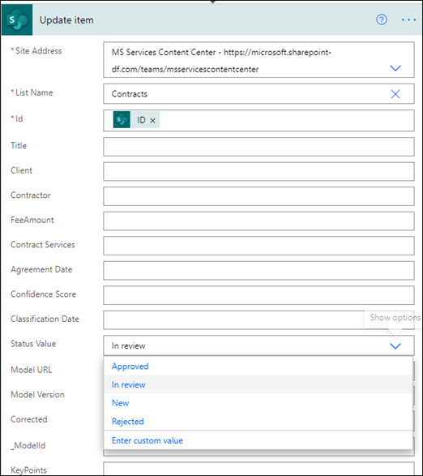

# <a name="step-3-use-power-automate-to-create-your-flow-to-process-your-contracts"></a>Etapa 3. Use Power Automate para criar seu fluxo para processar seus contratos

Você criou seu canal de Gerenciamento de Contratos e anexou sua SharePoint de documentos. A próxima etapa é criar um fluxo Power Automate para processar seus contratos que seu modelo SharePoint Syntex identifica e classifica. Você pode fazer essa etapa criando [um fluxo Power Automate na biblioteca SharePoint de documentos.](https://support.microsoft.com/office/create-a-flow-for-a-list-or-library-in-sharepoint-or-onedrive-a9c3e03b-0654-46af-a254-20252e580d01)

Para a solução de gerenciamento de contratos, você deseja criar um fluxo Power Automate para fazer as seguintes ações:

-  Depois que um contrato tiver sido classificado pelo seu modelo SharePoint Syntex, altere o status do contrato para **Em revisão.**
- Em seguida, o contrato é revisado e aprovado ou rejeitado.
- Para contratos aprovados, as informações do contrato são postadas em uma guia para processamento de pagamento.
- Para contratos rejeitados, a equipe é notificada para análise posterior. 

O diagrama a seguir mostra o fluxo Power Automate para a solução de gerenciamento de contratos.


## <a name="prepare-your-contract-for-review"></a>Preparar seu contrato para revisão

Quando um contrato é identificado e classificado pelo seu modelo de SharePoint de entendimento do documento Syntex, o fluxo de Power Automate primeiro alterará o status para **Em revisão**.


Depois de fazer check-out do arquivo, altere o valor de status para **Em revisão**.



A próxima etapa é criar um cartão adaptável informando que o contrato está aguardando revisão e postagem no canal gerenciamento de contratos.


O código a seguir é o JSON usado para esta etapa no Power Automate fluxo.

```JSON
{
"$schema": "http://adaptivecards.io/schemas/adaptive-card.json",
"type": "AdaptiveCard",
"version": "1.0",
"body": [
    {
    "type": "TextBlock",
    "text": "Contract approval request",
    "size": "large",
    "weight": "bolder",
     "wrap": true
    },
        {
            "type": "Container",
            "items": [
                {
                    "type": "FactSet",
                    "spacing": "Large",
                    "facts": [
                        {
                            "title": "Client",
                            "value": "@{triggerOutputs()?['body/Client']}"
                        },
                        {
                            "title": "Contractor",
                            "value": "@{triggerOutputs()?['body/Contractor']}"
                        },
                        {
                            "title": "Fee amount",
                            "value": "@{triggerOutputs()?['body/FeeAmount']}"
                        },
                        {
                            "title": "Date created",
                            "value": "@{triggerOutputs()?['body/Modified']} "
                        },
                        {
                            "title": "Link",
                            "value": "[@{triggerOutputs()?['body/{FilenameWithExtension}']}](@{triggerOutputs()?['body/{Link}']})"
                        }
                    ]
                }
            ]
         },
    {
    "type": "TextBlock",
    "text": "Comment:"
    },
        {
            "type": "Input.Text",
            "placeholder": "Enter comments",
            "id": "acComments"
        }
],
"actions": [
    {
    "type": "Action.Submit",
    "title": "Approve",
    "data": {
        "x": "Approve"
    }
    },
    {
    "type": "Action.Submit",
    "title": "Reject",
    "data": {
        "x": "Reject"
    }
    }
]
}
```


## <a name="conditional"></a>Condicional

Em seu fluxo, em seguida, você precisa criar uma condição na qual seu contrato será aprovado ou rejeitado.


## <a name="if-the-contract-is-approved"></a>Se o contrato for aprovado

Quando um contrato é aprovado, ocorrem as seguintes coisas:

- Na guia **Contratos,** o status no cartão de contrato mudará para **Aprovado**.

   

- Em seu fluxo, o status é alterado para **Aprovado**.

   

- Nesta solução, os dados do contrato serão adicionados à guia **Para** Pagamento para que os pagamentos possam ser gerenciados. Esse processo pode ser estendido para permitir que o fluxo envie os contratos para pagamento por um aplicativo financeiro de terceiros (por exemplo, Dynamics CRM).

   

- No fluxo, você cria o item a seguir para mover contratos aprovados para a **guia Para Pagamento.**

   

- Um cartão adaptável informando que o contrato foi aprovado é criado e postado no canal Gerenciamento de Contratos.

   

   


   O código a seguir é o JSON usado para esta etapa no Power Automate fluxo.

```JSON
{ 
    "type": "AdaptiveCard",
    "body": [
        {
            "type": "Container",
            "style": "emphasis",
            "items": [
                {
                    "type": "ColumnSet",
                    "columns": [
                        {
                            "type": "Column",
                            "items": [
                                {
                                    "type": "TextBlock",
                                    "size": "Large",
                                    "weight": "Bolder",
                                    "text": "CONTRACT APPROVED"
                                }
                            ],
                            "width": "stretch"
                        }
                    ]
                }
            ],
            "bleed": true
        },
        {
            "type": "Container",
            "items": [
                {
                    "type": "FactSet",
                    "spacing": "Large",
                    "facts": [
                        {
                            "title": "Client",
                            "value": "@{triggerOutputs()?['body/Client']}"
                        },
                        {
                            "title": "Contractor",
                            "value": "@{triggerOutputs()?['body/Contractor']}"
                        },
                        {
                            "title": "Fee amount",
                            "value": "@{triggerOutputs()?['body/FeeAmount']}"
                        },
                        {
                            "title": "Approval by",
                            "value": "@{body('Post_an_Adaptive_Card_to_a_Teams_channel_and_wait_for_a_response')?['responder']['displayName']}"
                        },
                        {
                            "title": "Approved date",
                            "value": "@{body('Post_an_Adaptive_Card_to_a_Teams_channel_and_wait_for_a_response')?['responseTime']}"
                        },
                        {
                            "title": "Approval comment",
                            "value": "@{body('Post_an_Adaptive_Card_to_a_Teams_channel_and_wait_for_a_response')?['data']['acComments']}"
                        },
                        {
                            "title": " ",
                            "value": " "
                        },
                        {
                            "title": "Status",
                            "value": "Ready for payout"
                        }
                    ]
                }
            ]
        }
    ],
    "$schema": "http://adaptivecards.io/schemas/adaptive-card.json",
    "version": "1.2",
    "fallbackText": "This card requires Adaptive Cards v1.2 support to be rendered properly."
}
```

## <a name="if-the-contract-is-rejected"></a>Se o contrato for rejeitado

Quando um contrato é rejeitado, ocorrem as seguintes coisas:

- Na guia **Contratos,** o status no cartão de contrato mudará para **Rejeitado**.

   

- Em seu fluxo, você faz check-out do arquivo de contrato, altera o status para **Rejeitado** e, em seguida, faz check-in do arquivo novamente.

   

- Em seu fluxo, você cria um cartão adaptável informando que o contrato foi rejeitado.

   

O código a seguir é o JSON usado para esta etapa no Power Automate fluxo.

```JSON
{ 
    "type": "AdaptiveCard",
    "body": [
        {
            "type": "Container",
            "style": "attention",
            "items": [
                {
                    "type": "ColumnSet",
                    "columns": [
                        {
                            "type": "Column",
                            "items": [
                                {
                                    "type": "TextBlock",
                                    "size": "Large",
                                    "weight": "Bolder",
                                    "text": "CONTRACT REJECTED"
                                }
                            ],
                            "width": "stretch"
                        }
                    ]
                }
            ],
            "bleed": true
        },
        {
            "type": "Container",
            "items": [
                {
                    "type": "FactSet",
                    "spacing": "Large",
                    "facts": [
                        {
                            "title": "Client",
                            "value": "@{triggerOutputs()?['body/Client']}"
                        },
                        {
                            "title": "Contractor",
                            "value": "@{triggerOutputs()?['body/Contractor']}"
                        },
                        {
                            "title": "Fee amount",
                            "value": "@{triggerOutputs()?['body/FeeAmount']}"
                        },
                        {
                            "title": "Rejected by",
                            "value": "@{body('Post_an_Adaptive_Card_to_a_Teams_channel_and_wait_for_a_response')?['responder']['displayName']}"
                        },
                        {
                            "title": "Rejected date",
                            "value": "@{body('Post_an_Adaptive_Card_to_a_Teams_channel_and_wait_for_a_response')?['responseTime']}"
                        },
                        {
                            "title": "Comment",
                            "value": "@{body('Post_an_Adaptive_Card_to_a_Teams_channel_and_wait_for_a_response')?['data']['acComments']}"
                        },
                        {
                            "title": " ",
                            "value": " "
                        },
                        {
                            "title": "Status",
                            "value": "Needs review"
                        }
                    ]
                }
            ]
        }
    ],
    "$schema": "http://adaptivecards.io/schemas/adaptive-card.json",
    "version": "1.2",
    "fallbackText": "This card requires Adaptive Cards v1.2 support to be rendered properly."
}
```

- O cartão é postado no canal Gerenciamento de Contratos.

   