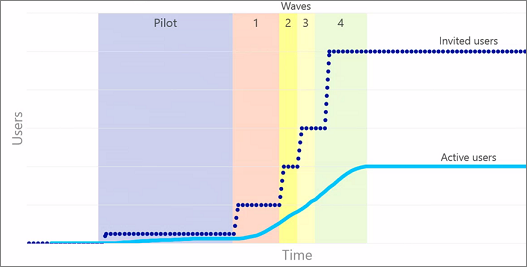

# Planejamento do seu plano de lançamento do portal no SharePoint Online

Um portal é um site do SharePoint na intranet que tem um grande número de visualizadores de site que consomem o conteúdo dele. Em grandes organizações pode haver vários deles; por exemplo, um portal da empresa e um portal do RH. Normalmente, os portais têm relativamente poucas pessoas que criam e escrevem o site e seu conteúdo. A maioria dos visitantes do portal apenas lê e consome o conteúdo.

Este artigo descreve como planejar sua implantação e o plano de distribuição para o SharePoint Online. Ele também fornece abordagens a seguir, pois testes de carga tradicionais não são permitidos no SharePoint Online. O SharePoint Online é um serviço de nuvem e os recursos de carga, a saúde e o equilíbrio geral da carga no serviço são gerenciados pela Microsoft.

Para ajudar na criação de um portal bem-sucedido, siga os princípios básicos, práticas e recomendações detalhados na [criação,](https://go.microsoft.com/fwlink/?linkid=2105838) lançamento e manutenção de um portal saudável 

A abordagem de implantação é realçada abaixo.

## Visão geral do planejamento de capacidade no SharePoint Online
Para usar com eficiência a capacidade e lidar com o crescimento inesperado, em qualquer farm, temos automação que acompanha determinados cenários de uso. Embora o crescimento exato seja imprevisível para qualquer locatário em qualquer farm, a soma agregada de solicitações é previsível ao longo do tempo. Identificando as tendências de crescimento no SharePoint Online, podemos planejar uma expansão futura. Para obter mais informações sobre [planejamento de capacidade e teste de carga do SharePoint Online.](capacity-planning-and-load-testing-sharepoint-online.md)

Uma parte importante de uma iniciação bem-sucedida é a abordagem de "onda" ou "lançamento em fases" detalhada abaixo. 

## Posso carregar o SharePoint Online de teste?
O SharePoint Online é um ambiente compartilhado multi-inquilino que é balanceado entre farms e a escala é ajustada de forma contínua. O teste de carga de um ambiente, como o SharePoint Online, cuja escala muda continuamente não só lhe dará resultados inesperados, mas não é permitido. 

Saiba mais: Planejamento  [de capacidade e teste de carga do SharePoint Online](capacity-planning-and-load-testing-sharepoint-online.md)

## Otimizar páginas seguindo as diretrizes recomendadas
As páginas de uma implantação local não devem ser movidas simplesmente como estão para o SharePoint Online sem revisá-las em relação às diretrizes recomendadas para o SharePoint Online. A melhor abordagem é sempre otimizar qualquer home page para qualquer site ou portal no SharePoint, pois é aqui que a maioria dos usuários em sua organização acessará como ponto de partida para seu(s) site(s).

Alguns fatores básicos devem ser considerados:
- As implantações locais podem aproveitar caches tradicionais do lado do servidor, como cache de objetos, cache de saída e cache de blob. Com as diferenças de topologia na nuvem, essas opções não estão necessariamente disponíveis, pois as diferenças de escala grandes as torna abordagens menos viáveis.
- Quaisquer páginas/recursos/personalizações usadas para consumo de nuvem devem ser otimizadas para maior latência, bem como para os locais distribuídos de usuários, para que os usuários em áreas ou regiões diferentes tenham uma experiência mais consistente. A nuvem oferece otimizações como REDES de Distribuição de Conteúdo (CDN) para otimizar para uma base de usuários distribuídos, bem como para o SharePoint moderno, o último bem conhecido (LKG) é usado por nossas Web Parts OOTB (out-of-box).

### O que fazer:
 - Para todas as páginas do site no SharePoint Online, use a ferramenta Diagnóstico de [Página,](https://aka.ms/perftool)que é uma extensão do Chromium que ajudará na análise e no fornecimento de orientações. Isso pode ser usado por proprietários, editores, administradores e desenvolvedores do site, pois ele foi projetado para ser um ponto de partida para análise e otimização.
 - Os desenvolvedores também devem usar ferramentas de desenvolvimento como a ferramenta de desenvolvedor de navegador F12, bem como CTRL-F12 no navegador em páginas modernas. [O Fiddler](https://www.telerik.com/download/fiddler) também pode ser usado para revisar o peso do tamanho (o tamanho da página em megabytes) da página e o número de chamadas e elementos que estão afetando a carga geral da página. 

Esta seção foi um breve resumo para otimizar as páginas.  Para saber mais, confira: [Criação, lançamento e manutenção de um portal saudável.](https://go.microsoft.com/fwlink/?linkid=2105838)

## Seguir uma abordagem de roll-out Wave /Phased
A abordagem tradicional de big bang para lançamentos de site não permitirá a verificação de que personalizações, fontes externas, serviços ou processos foram testados na escala correta. Isso não significa que levará meses para ser lançado, mas é recomendável pelo menos vários dias dependendo do tamanho da sua organização. Seguir um plano de lançamento por onda oferece a opção de pausar e resolver problemas antes de prosseguir com a próxima fase e, portanto, reduz o número potencial de usuários afetados por qualquer problema. O SharePoint como serviço dimensiona sua capacidade com base no uso e no uso previsto e, embora não seja necessário que você nos notifique de seu lançamento, você deve seguir as diretrizes para garantir o sucesso.
  
Conforme mostrado na imagem a seguir, geralmente o número de usuários convidados é significativamente maior do que aqueles que realmente usam o site. Esta imagem mostra uma estratégia sobre como lançar uma versão. Esse método ajuda a identificar maneiras de melhorar o site do SharePoint antes que a maioria dos usuários o veja.
  

  
Na fase piloto, é bom receber comentários dos usuários que a organização confia e sabe que serão envolvidos. Dessa forma, é possível avaliar como o sistema está sendo usado, bem como seu desempenho.
  
Durante cada uma das ondas, reúna feedback do usuário sobre os recursos, bem como o desempenho durante cada onda de implantação. Isso tem a vantagem de introduzir lentamente o sistema e fazer melhorias à medida que o sistema obtém mais uso. Isso também nos permite reagir à carga aumentada à medida que o site é lançado para cada vez mais usuários e combinado com as diretrizes para otimização de página garante uma experiência positiva para seus usuários.

### O que fazer:
- Decida o tempo de cada fase e verifique se você tem uma oportunidade de contingência/pausa, caso precise fazer ajustes antes de continuar
- Planeje seu primeiro grupo de usuários que você deseja habilitar, para garantir que você receba os comentários necessários para continuar. Isso significa que, sempre que possível, selecione um grupo ativo de usuários que fornecerá comentários em tempo hábil
- Ao planejar cada onda, tente começar com uma pequena base de usuários (menos de 5.000 usuários) e aumente os tamanhos de grupo conforme você prossesse com cada onda. Isso ajuda a criar uma abordagem escalonada e permite oportunidades de pausa mais fáceis que podem ser necessárias.
