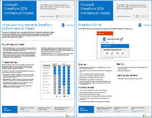

# Modelos de arquitetura para SharePoint, Exchange, Skype for Business e LyncArchitectural models for SharePoint, Exchange, Skype for Business, and Lync

Os cartazes de ti deste artigo descrevem os modelos de arquitetura e as opções de implantação para o SharePoint, o Exchange, o Skype for Business e o Lync.The IT posters in this article describe the architectural models and deployment options for SharePoint, Exchange, Skype for Business, and Lync. Eles também fornecem informações de design para implantar o SharePoint no Microsoft Azure.They also provide design information for deploying SharePoint in Microsoft Azure.
  
Usando o Microsoft 365, você pode fornecer serviços de colaboração e comunicação conhecidos através da nuvem.By using Microsoft 365, you can provide familiar collaboration and communication services through the cloud. Com algumas exceções, a experiência do usuário permanece a mesma, quer você esteja mantendo uma implantação local ou usando o Microsoft 365.With a few exceptions, the user experience remains the same whether you're maintaining an on-premises deployment or using Microsoft 365. 

Essa experiência de usuário unificada complica a decisão de onde colocar cada carga de trabalho.This unified user experience complicates the decision of where to place each workload. Ele também levanta perguntas:It also raises questions:
  
- Como escolher uma plataforma para cargas de trabalho individuais?How do you choose a platform for individual workloads?
    
- Faz sentido manter algum serviço local?Does it make sense to keep any service on-premises?
    
- Em que cenário uma implantação híbrida é adequada?In what scenario is a hybrid deployment appropriate?
    
- Como o Azure se encaixa na imagem?How does Azure fit into the picture?
    
- Quais configurações de cargas de trabalho do Office Server o Azure oferece suporte?What configurations of Office server workloads does Azure support?
    
> [!TIP]
> A maioria dos cartazes deste artigo está disponível em vários idiomas.Most posters in this article are available in multiple languages. Idiomas disponíveis incluem chinês, inglês, francês, alemão, italiano, japonês, coreano, Português, russo e espanhol.Available languages include Chinese, English, French, German, Italian, Japanese, Korean, Portuguese, Russian, and Spanish. Para baixar um cartaz em um desses idiomas, na imagem em miniatura do pôster, selecione **mais idiomas**.To download a poster in one of these languages, under the poster thumbnail image, select **More languages**.
  
Envie-nos suas sugestões!Let us know what you think! Envie um email para [cloudadopt@microsoft.com](mailto:cloudadopt@microsoft.com).Send us email at [cloudadopt@microsoft.com](mailto:cloudadopt@microsoft.com). 
  
Use os links a seguir para obter os cartazes necessários:Use the following links to get the posters you need:
  
- **Modelos arquitetônicos** : Use estes recursos para determinar a plataforma e a configuração ideais para o SharePoint 2016 e o Skype for Business 2015.**Architectural models** : Use these resources to determine your ideal platform and configuration for SharePoint 2016 and Skype for Business 2015.
    
  - [Modelos arquitetônicos do Microsoft SharePoint 2016Microsoft SharePoint 2016 architectural models](architectural-models-for-sharepoint-exchange-skype-for-business-and-lync.md#SP2016_ArchModel)
    
  - [Bancos de dados do SharePoint Server 2016SharePoint Server 2016 databases](architectural-models-for-sharepoint-exchange-skype-for-business-and-lync.md#SP2016_Databases)
    
  - [Modelos arquitetônicos do Microsoft Skype for Business 2015Microsoft Skype for Business 2015 architectural models](architectural-models-for-sharepoint-exchange-skype-for-business-and-lync.md#SfB2015_ArchModel)
    
- **Plataforma** : Use estes recursos para determinar a plataforma e a configuração ideais para o SharePoint 2013, o Exchange 2013 e o Lync 2013.**Platform** : Use these resources to determine your ideal platform and configuration for SharePoint 2013, Exchange 2013, and Lync 2013.
    
  - [Opções de plataforma do SharePoint 2013SharePoint 2013 platform options](architectural-models-for-sharepoint-exchange-skype-for-business-and-lync.md#SP2013_Options)
    
  - [Opções de plataforma do Exchange 2013Exchange 2013 platform options](architectural-models-for-sharepoint-exchange-skype-for-business-and-lync.md#Exch2013_options)
    
  - [Opções da plataforma do Lync 2013Lync 2013 platform options](architectural-models-for-sharepoint-exchange-skype-for-business-and-lync.md#Lync2013_Options)
    
- **SharePoint server 2013 no Azure** : Use estes cartazes de ti para projetar e configurar as cargas de trabalho do SharePoint Server 2013 nos serviços de infraestrutura do Azure.**SharePoint Server 2013 in Azure** : Use these IT posters to design and configure SharePoint Server 2013 workloads in Azure infrastructure services.
    
  - [Sites da Internet no Azure usando o SharePoint Server 2013Internet sites in Azure using SharePoint Server 2013](architectural-models-for-sharepoint-exchange-skype-for-business-and-lync.md#Azure_sharepoint2013)
    
  - [Exemplo de design: sites da Internet no Azure para SharePoint 2013Design sample: Internet sites in Azure for SharePoint 2013](architectural-models-for-sharepoint-exchange-skype-for-business-and-lync.md#DesignSampleInternetSites)
    
  - [Recuperação de desastre do SharePoint para o AzureSharePoint disaster recovery to Azure](architectural-models-for-sharepoint-exchange-skype-for-business-and-lync.md#sharepoint_recovery_Azure)
    
## Cartazes com modelos de arquiteturaArchitectural models posters

Os cartazes de ti do SharePoint 2016 e do Skype for Business 2015 fornecem uma maneira de comparar métodos de implantação em um formato fácil de imprimir.The IT posters for SharePoint 2016 and Skype for Business 2015 provide a way to compare deployment methods in an easy-to-print format. A lista de cartazs todas as opções de configuração ou plataforma.The posters list all configuration or platform options. Eles fornecem as seguintes informações para cada opção:They provide the following information for each option:
  
- **Visão geral** : um breve resumo da plataforma, incluindo um diagrama conceitual.**Overview** : A brief summary of the platform, including a conceptual diagram.
    
- **Melhor para** : cenários comuns que são ideais para a plataforma.**Best for** : Common scenarios that are ideally suited for the platform.
    
- **Requisitos de licença** : as licenças de que você precisa para a implantação.**License requirements** : The licenses you need for deployment.
    
- **Tarefas de arquitetura** : as decisões que você precisa tomar como arquiteto.**Architecture tasks** : The decisions you need to make as an architect.
    
- **Tarefas ou responsabilidades de profissionais de ti** : as responsabilidades diárias que sua equipe de ti precisa planejar.**IT pro tasks or responsibilities** : The daily responsibilities that your IT staff needs to plan for.
    

### Modelos de arquitetura do Microsoft SharePoint Server 2016Microsoft SharePoint Server 2016 Architectural Models

|ItemItem|DescriçãoDescription|
|---|---|
|[          ](https://www.microsoft.com/download/details.aspx?id=52650)[          ](https://www.microsoft.com/download/details.aspx?id=52650)   [PDF](https://download.microsoft.com/download/4/F/A/4FA0F94B-EE2F-41DB-A047-D9864FEF41E9/SharePoint2016ArchitecturalModels.pdf)  \| [Visio](https://download.microsoft.com/download/4/F/A/4FA0F94B-EE2F-41DB-A047-D9864FEF41E9/SharePoint2016ArchitecturalModels.vsdx)  \| [Mais idiomas](https://www.microsoft.com/download/details.aspx?id=52650)[PDF](https://download.microsoft.com/download/4/F/A/4FA0F94B-EE2F-41DB-A047-D9864FEF41E9/SharePoint2016ArchitecturalModels.pdf)  \| [Visio](https://download.microsoft.com/download/4/F/A/4FA0F94B-EE2F-41DB-A047-D9864FEF41E9/SharePoint2016ArchitecturalModels.vsdx)  \| [More languages](https://www.microsoft.com/download/details.aspx?id=52650)|Este cartaz de ti descreve as configurações locais do SharePoint Online, do Azure e do SharePoint que os responsáveis pelas decisões de negócios e os arquitetos de soluções precisam saber.This IT poster describes the SharePoint Online, Azure, and SharePoint on-premises configurations that business decision makers and solutions architects need to know about.    - **SharePoint Online (SaaS)** : consumir o SharePoint por meio de um modelo de assinatura de software como serviço (SaaS).- **SharePoint Online (SaaS)** : Consume SharePoint through a software as a service (SaaS) subscription model.   - **SharePoint híbrido** : Mova seus sites e aplicativos do SharePoint para a nuvem em seu próprio ritmo.- **SharePoint hybrid** : Move your SharePoint sites and apps to the cloud at your own pace.   - **SharePoint no Azure (IaaS)** : Estenda seu ambiente local para o Azure e implante os servidores do SharePoint 2016.- **SharePoint in Azure (IaaS)** : Extend your on-premises environment into Azure, and deploy SharePoint 2016 servers there. (Esse modelo é recomendado para ambientes de alta disponibilidade ou recuperação de desastres e ambientes de desenvolvimento/teste.)(This model is recommended for high availability or disaster recovery environments and dev/test environments.)   - **SharePoint local** : planejar, implantar, manter e personalizar seu ambiente do SharePoint em um datacenter que você mantém.- **SharePoint on-premises** : Plan, deploy, maintain, and customize your SharePoint environment in a datacenter that you maintain.|
   

### Bancos de dados do SharePoint Server 2016SharePoint Server 2016 Databases

|ItemItem|DescriçãoDescription|
|---|---|
|   [PDF](https://download.microsoft.com/download/D/5/D/D5DC1121-8BC5-4953-834F-1B5BB03EB691/DBrefguideSPS2016_tabloid.pdf)  \| [Visio](https://download.microsoft.com/download/D/5/D/D5DC1121-8BC5-4953-834F-1B5BB03EB691/DBrefguideSPS2016_tabloid.vsdx)  \| [Mais idiomas](https://www.microsoft.com/download/details.aspx?id=55041)[PDF](https://download.microsoft.com/download/D/5/D/D5DC1121-8BC5-4953-834F-1B5BB03EB691/DBrefguideSPS2016_tabloid.pdf)  \| [Visio](https://download.microsoft.com/download/D/5/D/D5DC1121-8BC5-4953-834F-1B5BB03EB691/DBrefguideSPS2016_tabloid.vsdx)  \| [More languages](https://www.microsoft.com/download/details.aspx?id=55041)|Este cartaz de ti é uma referência rápida para os bancos de dados do SharePoint Server 2016.This IT poster is a quick reference for SharePoint Server 2016 databases. Você verá detalhes de cada banco de dados:You'll see details for each database:    - Tamanho- Size   - Diretrizes de escala- Scaling guidance   - Padrões I/O- I/O patterns   - Requisitos- Requirements     A primeira página mostra os bancos de dados de sistema do SharePoint e os aplicativos de serviço que possuem vários bancos de dados.The first page shows the SharePoint system databases and the service applications that have multiple databases. A segunda página mostra todos os aplicativos de serviços que têm bancos de dados únicos.The second page shows all of the service applications that have single databases.     Para obter mais informações, consulte [Database Types and Descriptions in SharePoint Server 2016](https://docs.microsoft.com/SharePoint/technical-reference/database-types-and-descriptions).For more information, see [Database types and descriptions in SharePoint Server 2016](https://docs.microsoft.com/SharePoint/technical-reference/database-types-and-descriptions).|
   

### Modelos de arquitetura para o Microsoft Skype for Business 2015Microsoft Skype for Business 2015 Architectural Models

|ItemItem|DescriçãoDescription|
|---|---|
|   [PDF](https://download.microsoft.com/download/7/7/4/7741262C-A60D-41F7-863B-99BF5964FBFE/Skype%20for%20Business%20Architectural%20Models.pdf)  \| [Visio](https://download.microsoft.com/download/7/7/4/7741262C-A60D-41F7-863B-99BF5964FBFE/Skype%20for%20Business%20Architectural%20Models.vsd)  \| [Mais idiomas](https://www.microsoft.com/download/details.aspx?id=55022)[PDF](https://download.microsoft.com/download/7/7/4/7741262C-A60D-41F7-863B-99BF5964FBFE/Skype%20for%20Business%20Architectural%20Models.pdf)  \| [Visio](https://download.microsoft.com/download/7/7/4/7741262C-A60D-41F7-863B-99BF5964FBFE/Skype%20for%20Business%20Architectural%20Models.vsd)  \| [More languages](https://www.microsoft.com/download/details.aspx?id=55022)|Este cartaz descreve o Skype for Business Online, local, híbrido e Cloud Private Branch Exchange (PBX).This poster describes Skype for Business Online, on-premises, hybrid, and cloud private branch exchange (PBX). Também descreve a integração com as configurações do Exchange e do SharePoint que os responsáveis pelas decisões de negócios e os arquitetos de soluções precisam saber.It also describes integration with Exchange and SharePoint configurations that business decision makers and solutions architects need to know about.    O cartaz destina-se aos profissionais de ti para aumentar a conscientização dos modelos arquitetônicos fundamentais através dos quais o Skype for Business Online e o Skype for Business no local podem ser consumidos.The poster is intended for IT pros to raise awareness of the fundamental architectural models through which Skype for Business Online and Skype for Business on-premises can be consumed.   Comece com a configuração mais adequada às necessidades e aos planos da sua organização.Start with the configuration that best suits your organization's needs and plans. Considere e use outras configurações conforme necessário.Consider and use other configurations as needed. Por exemplo, você pode querer considerar a integração com o Exchange e o SharePoint ou uma solução que aproveita a oferta do Cloud PBX da Microsoft.For example, you might want to consider integration with Exchange and SharePoint or a solution that takes advantage of the Microsoft cloud PBX offering.|
   
## Cartazes com opções de plataformaPlatform options posters

Os cartazes de ti para o SharePoint 2013, o Exchange 2013 e o Lync 2013 fornecem uma maneira de comparar os métodos de implantação rapidamente.The IT posters for SharePoint 2013, Exchange 2013, and Lync 2013 provide a way to compare the deployment methods at a glance. Cada cartaz lista todas as opções de configurações ou plataformas.Each poster lists all of the configurations or platform options. Ele fornece as seguintes informações para cada opção:It provides the following information for each option:
  
- **Visão geral** : um breve resumo da plataforma, incluindo um diagrama conceitual.**Overview** : A brief summary of the platform, including a conceptual diagram.
    
- **Melhor para** : cenários comuns que são ideais para a plataforma.**Best for** : Common scenarios that are ideally suited for the platform.
    
- **Requisitos de licença** : as licenças de que você precisa para a implantação.**License requirements** : The licenses you need for deployment.
    
- **Tarefas de arquitetura** : as decisões que você precisa tomar como arquiteto.**Architecture tasks** : The decisions you need to make as an architect.
    
- **Tarefas ou responsabilidades de profissionais de ti** : as responsabilidades diárias que sua equipe de ti precisa planejar.**IT pro tasks or responsibilities** : The daily responsibilities that your IT staff needs to plan for.
    

## Opções de Plataforma para o SharePoint 2013SharePoint 2013 Platform Options

|ItemItem|DescriçãoDescription|
|---|---|
|   [PDF](https://go.microsoft.com/fwlink/p/?LinkId=324594)  \| [Visio](https://go.microsoft.com/fwlink/p/?LinkId=324593)  \| [Mais idiomas](https://www.microsoft.com/download/details.aspx?id=40332)[PDF](https://go.microsoft.com/fwlink/p/?LinkId=324594)  \| [Visio](https://go.microsoft.com/fwlink/p/?LinkId=324593)  \| [More languages](https://www.microsoft.com/download/details.aspx?id=40332)|Para os responsáveis por decisões de negócios e arquitetos, este cartaz mostra as opções de plataforma para o SharePoint 2013, SharePoint no Microsoft 365, híbrido local com Microsoft 365, Azure e implantações somente no local.For business decision makers and architects, this poster shows the platform options for SharePoint 2013, SharePoint in Microsoft 365, on-premises hybrid with Microsoft 365, Azure, and on-premises-only deployments. Ele inclui uma visão geral de cada arquitetura, recomendações, requisitos de licença e listas de arquiteto e tarefas de profissionais de ti para cada plataforma.It includes an overview of each architecture, recommendations, license requirements, and lists of architect and IT pro tasks for each platform. O cartaz realça várias soluções do SharePoint no Azure.The poster highlights several SharePoint solutions on Azure.|
   

## Opções de plataforma para o Exchange 2013Exchange 2013 Platform Options

|ItemItem|DescriçãoDescription|
|---|---|
|[          ](https://www.microsoft.com/download/details.aspx?id=42676)[          ](https://www.microsoft.com/download/details.aspx?id=42676)   [PDF](https://go.microsoft.com/fwlink/p/?LinkID=398740)  \| [Visio](https://go.microsoft.com/fwlink/p/?LinkID=398742)  \| [Mais idiomas](https://www.microsoft.com/download/details.aspx?id=42676)[PDF](https://go.microsoft.com/fwlink/p/?LinkID=398740)  \| [Visio](https://go.microsoft.com/fwlink/p/?LinkID=398742)  \| [More languages](https://www.microsoft.com/download/details.aspx?id=42676)|Para profissionais e arquitetos de decisões de negócios, este cartaz descreve as opções de plataforma para o Exchange 2013.For business decision makers and architects, this poster describes the platform options for Exchange 2013. Os clientes podem escolher entre o Exchange Online com o Microsoft 365, o Exchange híbrido, o Exchange Server local e o Exchange hospedado.Customers can choose from Exchange Online with Microsoft 365, hybrid Exchange, Exchange Server on-premises, and hosted Exchange. O cartaz detalha cada opção de arquitetura, incluindo os cenários ideais para cada, os requisitos de licença e as responsabilidades de profissionais de ti.The poster details each architectural option, including the ideal scenarios for each, the license requirements, and IT pro responsibilities.|
   

## Opções de plataforma para o Lync 2013Lync 2013 Platform Options

|ItemItem|DescriçãoDescription|
|---|---|
|[          ](https://www.microsoft.com/download/details.aspx?id=41677)[          ](https://www.microsoft.com/download/details.aspx?id=41677)   [PDF](https://go.microsoft.com/fwlink/p/?LinkID=391837)  \| [Visio](https://go.microsoft.com/fwlink/p/?LinkID=391839)  \| [Mais idiomas](https://www.microsoft.com/download/details.aspx?id=41677)[PDF](https://go.microsoft.com/fwlink/p/?LinkID=391837)  \| [Visio](https://go.microsoft.com/fwlink/p/?LinkID=391839)  \| [More languages](https://www.microsoft.com/download/details.aspx?id=41677)|Para profissionais e arquitetos de decisões de negócios, este cartaz descreve as opções de plataforma para o Lync 2013.For business decision makers and architects, this poster describes the platform options for Lync 2013. Os clientes podem escolher entre o Lync Online e o Microsoft 365, o Hybrid Lync, o Lync Server local e o Lync hospedado.Customers can choose from Lync Online with Microsoft 365, hybrid Lync, Lync Server on-premises, and hosted Lync. O cartaz de ti detalha cada opção de arquitetura, incluindo os cenários ideais para cada, os requisitos de licença e as responsabilidades de profissionais de ti.The IT poster details each architectural option, including the ideal scenarios for each, the license requirements, and IT pro responsibilities.|
   

## Cartazes com soluções do SharePoint no AzureSharePoint in Azure solutions posters

Os cartazes de ti do SharePoint no Azure mostram soluções baseadas no Azure que usam o SharePoint Server 2013.The IT posters for SharePoint in Azure show Azure-based solutions that use SharePoint Server 2013.
  

### Sites da Internet no Microsoft Azure usando o SharePoint Server 2013Internet Sites in Microsoft Azure Using SharePoint Server 2013

|ItemItem|DescriçãoDescription|
|---|---|
|[          ](https://www.microsoft.com/download/details.aspx?id=41992)[          ](https://www.microsoft.com/download/details.aspx?id=41992)   [PDF](https://go.microsoft.com/fwlink/p/?LinkId=392552)  \| [Visio](https://go.microsoft.com/fwlink/p/?LinkId=392551)  \| [Mais idiomas](https://www.microsoft.com/download/details.aspx?id=41992)[PDF](https://go.microsoft.com/fwlink/p/?LinkId=392552)  \| [Visio](https://go.microsoft.com/fwlink/p/?LinkId=392551)  \| [More languages](https://www.microsoft.com/download/details.aspx?id=41992)|Este cartaz descreve as principais atividades de design e a arquitetura recomendada para sites voltados para a Internet no Azure.This poster outlines key design activities and recommended architecture for internet-facing sites in Azure.     Para saber mais, confira os seguintes artigos:For more information, see the following articles:     - [Sites da Internet no Azure usando o SharePoint Server 2013](internet-sites-in-microsoft-azure-using-sharepoint-server-2013.md)- [Internet sites in Azure using SharePoint Server 2013](internet-sites-in-microsoft-azure-using-sharepoint-server-2013.md)   - [Arquiteturas do Azure para o SharePoint 2013](microsoft-azure-architectures-for-sharepoint-2013.md)- [Azure architectures for SharePoint 2013](microsoft-azure-architectures-for-sharepoint-2013.md)|
   

### Sites da Internet no Azure para SharePoint 2013Internet sites in Azure for SharePoint 2013

|ItemItem|DescriçãoDescription|
|---|---|
|[          ](https://www.microsoft.com/download/details.aspx?id=41991)[          ](https://www.microsoft.com/download/details.aspx?id=41991)   [PDF](https://go.microsoft.com/fwlink/p/?LinkId=392549)  \| [Visio](https://go.microsoft.com/fwlink/p/?LinkId=392548)  \| [Mais idiomas](https://www.microsoft.com/download/details.aspx?id=41991)[PDF](https://go.microsoft.com/fwlink/p/?LinkId=392549)  \| [Visio](https://go.microsoft.com/fwlink/p/?LinkId=392548)  \| [More languages](https://www.microsoft.com/download/details.aspx?id=41991)|Use este exemplo de design como ponto de partida para sua própria arquitetura de um site voltado para a Internet no Azure usando o SharePoint Server 2013.Use this design sample as a starting point for your own architecture of an internet-facing site in Azure using SharePoint Server 2013.    Para saber mais, confira os seguintes artigos:For more information, see the following articles:     - [Sites da Internet no Azure usando o SharePoint Server 2013](internet-sites-in-microsoft-azure-using-sharepoint-server-2013.md)- [Internet sites in Azure using SharePoint Server 2013](internet-sites-in-microsoft-azure-using-sharepoint-server-2013.md)   - [Arquiteturas do Azure para o SharePoint 2013](microsoft-azure-architectures-for-sharepoint-2013.md)- [Azure architectures for SharePoint 2013](microsoft-azure-architectures-for-sharepoint-2013.md)|
   

### Recuperação de desastres do SharePoint para o Microsoft AzureSharePoint Disaster Recovery to Microsoft Azure

|ItemItem|DescriçãoDescription|
|---|---|
|[          ](https://www.microsoft.com/download/details.aspx?id=41993)[          ](https://www.microsoft.com/download/details.aspx?id=41993)   [PDF](https://go.microsoft.com/fwlink/p/?LinkId=392555)  \| [Visio](https://go.microsoft.com/fwlink/p/?LinkId=392554)  \| [Mais idiomas](https://www.microsoft.com/download/details.aspx?id=41993)[PDF](https://go.microsoft.com/fwlink/p/?LinkId=392555)  \| [Visio](https://go.microsoft.com/fwlink/p/?LinkId=392554)  \| [More languages](https://www.microsoft.com/download/details.aspx?id=41993)|Este cartaz de TI mostra os princípios de arquitetura de um ambiente de recuperação de desastre no Azure.This IT poster shows architecture principles for a disaster recovery environment in Azure.    Para saber mais, confira os seguintes artigos:For more information, see the following articles:     - [Recuperação de desastre do SharePoint Server 2013 no Azure](sharepoint-server-2013-disaster-recovery-in-microsoft-azure.md)- [SharePoint Server 2013 disaster recovery in Azure](sharepoint-server-2013-disaster-recovery-in-microsoft-azure.md)   - [Arquiteturas do Azure para o SharePoint 2013](microsoft-azure-architectures-for-sharepoint-2013.md)- [Azure architectures for SharePoint 2013](microsoft-azure-architectures-for-sharepoint-2013.md)|
   
## Confira tambémSee also

- [Centro de soluções e arquitetura da Microsoft 365Microsoft 365 solution and architecture center](../solutions/solution-architecture-center.md)
  
- [Modelos de arquitetura em nuvem da MicrosoftMicrosoft cloud architecture models](../solutions/cloud-architecture-models.md)
  
- [Guias de laboratório de teste do Microsoft 365Microsoft 365 test lab guides](m365-enterprise-test-lab-guides.md)
  
- [Soluções híbridasHybrid solutions](hybrid-solutions.md)

