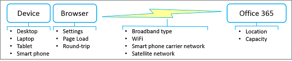

# Práticas recomendadas para usar o Office 365 em uma rede lentaBest practices for using Office 365 on a slow network

Não seria bom se sua conexão com a Internet fosse sempre rápida e nunca baixada?Wouldn't it be nice if your Internet connection was always fast and never down? Talvez esse dia venha.Perhaps that day will come. Mas, enquanto isso, há coisas práticas que você pode fazer para trabalhar em torno de uma rede desarmada e ainda fazer seu trabalho do dia a dia.But in the meantime, there are practical things you can do to work around a balky network and still get your day-to-day work done. Embora o Office 365 seja um serviço baseado em nuvem, ele também fornece muitas maneiras de trabalhar com seu conteúdo offline e manter suas alterações sincronizadas sem problemas.Although Office 365 is a cloud-based service, it also provides many ways to work with your content offline and to smoothly keep your changes synchronized. Além disso, às vezes é mais eficiente trabalhar com conteúdo offline apenas porque os aplicativos são executados mais rapidamente e a interface do usuário é mais responsiva.Besides, it's sometimes more efficient to work with content offline just because applications run faster and the user interface is more responsive. O ponto é este: o Office 365 oferece o melhor de ambos os mundos.The point is this: Office 365 gives you the best of both worlds. Veja como tirar proveito disso.Here's how to take advantage of that. 
  
> [!TIP]
> Quer ver o quão lenta (ou rápida) sua conexão de rede é?Want to see how slow (or fast) your network connection is? Experimente o [ teste de Velocidade OOKLA ou ](https://www.speedtest.net/) o Aplicativo de Teste de Velocidade de [Rede](https://www.windowsphone.com/store/app/network-speed-test/9b9ae06b-2961-41ef-987d-b09567cffe70).Try the [ OOKLA Speed test ](https://www.speedtest.net/) or the [Network Speed Test App](https://www.windowsphone.com/store/app/network-speed-test/9b9ae06b-2961-41ef-987d-b09567cffe70). 

## Por que minha rede é tão lenta?Why is my network so slow?

Embora você não tenha controle sobre o desempenho da rede em si, isso ajuda a entender o que está acontecendo nos bastidores.Although you don't have control over network performance itself, it helps to understand what's going on behind the scenes. A Internet é extremamente complexa, mas há alguns conceitos que podem ajudá-lo a entender a situação muito melhor.The Internet is enormously complex, but there are a few concepts that can help you understand the situation much better. Seguir as práticas recomendadas neste artigo pode ajudar a resolver problemas de desempenho e reduzir a frustração.Following the best practices in this article can help workaround performance issues and reduce frustration.
  
**Principais fatores que afetam o desempenho da rede****Major factors that affect network performance**

  
 **Largura de banda e latência** As duas medidas mais importantes do desempenho da rede são largura de banda e latência:**Bandwidth and latency** The two most important measures of network performance are bandwidth and latency: 
  
- Largura de banda é a taxa de taxa de transferência medida em bits por segundo.Bandwidth is the rate of throughput measured in bits per second. Maior é melhor.Bigger is better. A largura de banda é como um cano de água.Bandwidth is like a water pipe. Quanto maior o pipe, mais água você pode "passar" por ele.The larger the pipe, the more water that you can "put through" it.

- Latência é o tempo necessário para que o conteúdo receba de um servidor ou serviço para seu dispositivo e é medido em milissegundos.Latency is the time it takes for content to get from a server or service to your device and is measured in milliseconds. Mais rápido é melhor.Faster is better. A latência pode ser causada por vários fatores, incluindo baixa largura de banda, uma conexão esparsa ou o tempo de transmissão.Latency can be caused by a number of factors including low bandwidth, a sparse connection, or transmission time.

 **Problemas comuns** Além da largura de banda e latência, outros problemas têm impacto no desempenho da rede e são geralmente imprevisíveis.**Common issues** Besides bandwidth and latency, other issues have an impact on network performance and are often unpredictable. O desempenho da rede pode oscilar com base na hora do dia ou em sua localização física.Network performance can fluctuate based on the time of the day or your physical location. A rede pode ficar bloqueada quando determinados eventos ocorrem que aumentarão o uso da Internet, como um desastre natural ou um evento público importante.The network can become clogged when certain events occur that spike the use of the Internet, such as a natural disaster or a major public event. O tamanho e a complexidade da página que está sendo carregada e o número e o tamanho dos arquivos que estão sendo transferidos têm uma relação direta com o desempenho.The size and complexity of the page being loaded and the number and size of files being transferred have a direct bearing on performance. Uma conexão WiFi pode degradar temporariamente: por exemplo, você sonda uma grande reunião de conferência de milhares solicitando que todos tweetem ao mesmo tempo.A WiFi connection can temporarily degrade: for example, you poll a large conference meeting of thousands by requesting everyone to tweet at the same time. 
  
 **Considerações sobre uma rede de satélite** Uma rede de satélite é útil quando uma rede terrestre não é viável, como o país de origem, um barco de navegação ou uma área científica remota.**Considerations for a satellite network** A satellite network is useful when a terrestrial network is not feasible, such as the back country, a cruise ship, or a remote scientific area. Essas redes dependem de satélites posicionados em uma órbita geossíncrona 22.000 milhas acima do equador.These networks rely on satellites positioned in a geosynchronous orbit 22,000 miles above the equator. No entanto, uma transmissão realmente percorre cerca de 90.000 milhas e, portanto, uma rede de satélite tem uma latência mais lenta (500 ms ou mais) do que uma rede terrestre (20 a 50ms).However, a transmission actually travels about 90,000 miles, and so a satellite network has a slower latency (500 ms or more) than a terrestrial network (20 to 50ms). Sob as melhores condições, você pode não notar essa latência, mas para baixar arquivos grandes, transmitir vídeos e jogar jogos, você provavelmente perceberá.Under the best of conditions, you may not notice this latency, but for downloading large files, streaming videos, and playing games, you probably will. Outro problema é "fade de chuva" em que o clima pesado, como trovoadas e nevascas, pode interromper temporariamente a transmissão de satélite.Another issue is "rain fade" in which heavy weather, such as thunderstorms and blizzards, can temporarily interrupt satellite transmission.
  
## Tem certeza de que é a rede?Are you sure it's the network?

Sempre que você tiver problemas de desempenho, primeiro certifique-se de que seu dispositivo não seja a causa raiz do problema.Whenever you experience performance problems, first make sure that your device is not the root cause of the problem. Há duas coisas que você pode fazer que podem fazer uma grande melhoria:There are two things you can do that might make a big improvement:
  
- Certifique-se de que o dispositivo está funcionando bem e se não há malware no computador.Make sure your device is running well and there is no malware on your computer.

- Se possível, compre mais memória.If possible, buy more memory. Adicionar memória é a maneira mais simples e frequentemente mais eficaz de melhorar o desempenho em seu dispositivo.Adding memory is the simplest and often most effective way to improve performance on your device. É especialmente útil ao trabalhar com arquivos e vídeos grandes.It's especially helpful when working with large files and videos.

Para obter mais informações, consulte [ Desempenho e manutenção do Windows ](https://windows.microsoft.com/windows/performance-maintenance-help#performance-maintenance-help) e Dicas para melhorar o desempenho do computador no Windows [10](https://support.microsoft.com/en-za/help/4002019/windows-10-improve-pc-performance).For more information, see [ Windows Performance and maintenance ](https://windows.microsoft.com/windows/performance-maintenance-help#performance-maintenance-help) and [Tips to improve PC performance in Windows 10](https://support.microsoft.com/en-za/help/4002019/windows-10-improve-pc-performance).

## Práticas recomendadas para usar seu navegadorBest practices for using your browser

Seu navegador é seu gateway para o Office 365, portanto, ele pode ter um impacto no desempenho, especialmente com o tempo necessário para carregar uma página e a frequência de ida e volta para o serviço do Office 365.Your browser is your gateway to Office 365, so it can have an impact on performance, especially with the time it takes to load a page and how often you round trip to the Office 365 service.
  
 **Navegadores em geral****Browsers in general**
  
Aqui estão algumas sugestões para navegadores em geral:Here are some suggestions for browsers in general:
  
- Desabilite os complementos do navegador que podem afetar o desempenho ou que você realmente não precisa.Disable browser add-ons that might impact performance or that you don't really need.

- Aumente o tamanho do cache para seus arquivos temporários da Internet.Increase the cache size for your temporary internet files.

- Depois de entrar em sua conta de trabalho ou de estudante, mantenha a janela do navegador aberta durante todo o dia.Once you have signed into your work or school account, keep the browser window open throughout the day. Você pode abrir outras guias e janelas sem entrar novamente.You can open other tabs and windows without signing in again. Se você precisar entrar em outra conta, use a Navegação Privada.If you need to sign in to another account, use Private Browsing. 

- Depois que cada página for baixada e aberta, mantenha-as abertas usando guias.Once each page is downloaded and open, keep them open by using tabs. É fácil navegar entre guias e usar a página mais adiante no dia.It's easy to navigate between tabs and use the page later on in the day. Atualize uma página somente se precisar dos dados mais recentes nessa página.Refresh a page only if you need the latest data on that page.

- Se uma página estiver demorando muito para abrir, pare o download da página (pressione ESC) e atualize a página (pressione F5).If a page is taking too long to open, stop the page download (press ESC) and then refresh the page (press F5). 

-  Quando possível, reduza viagens de ida e volta para o Office 365.When possible, reduce round trips to Office 365. Por exemplo, em vez de fazer pajamento por meio de listas ou bibliotecas, use a pesquisa para localizar arquivos em uma biblioteca grande e filtrar em uma lista para obter diretamente os resultados que você deseja.For example, rather than paging through lists or libraries, use search to locate files in a large library and filtering in a list to get directly to the results you want. Ou crie exibições que minimizem o tempo de carregamento da página.Or, create views that minimize page load time. Para obter mais informações, consulte [Manage large lists and libraries in Office 365](https://support.office.com/article/b4038448-ec0e-49b7-b853-679d3d8fb784#BKMK_PAGES).For more information, see [Manage large lists and libraries in Office 365](https://support.office.com/article/b4038448-ec0e-49b7-b853-679d3d8fb784#BKMK_PAGES).

- Se o desempenho do vídeo for ruim, você poderá baixar o vídeo e assisti-lo em seu dispositivo.If video performance is poor, you may be able to download the video and watch it on your device. Um link de download pode estar disponível ou você pode clicar com o botão direito do mouse no link de vídeo e selecionar **Salvar Destino como**.A download link may be available, or you may be able to right click the video link, and select **Save Target as**.

 **Específico do navegador****Browser-specific**
  
Aqui estão algumas sugestões para seu navegador específico:Here are some suggestions for your specific browser:
  
- **Internet Explorer** Atualize para o Internet Explorer Versão 11 ou posterior para melhorias substanciais de desempenho em relação às versões anteriores.**Internet Explorer** Upgrade to Internet Explorer Version 11 or later for substantial performance improvements over previous versions. Para obter mais informações, consulte [Guia de solução de problemas do Internet Explorer](https://support.microsoft.com/help/2437121/troubleshooting-guide-for-internet-explorer-when-you-access-office-365).For more information, see [Troubleshooting guide for Internet Explorer](https://support.microsoft.com/help/2437121/troubleshooting-guide-for-internet-explorer-when-you-access-office-365).

- **FireFox** Para obter mais informações, consulte [Firefox is slow or stops working](https://support.mozilla.org/products/firefox/fix-problems/slowness-or-hanging).**FireFox** For more information, see [Firefox is slow or stops working](https://support.mozilla.org/products/firefox/fix-problems/slowness-or-hanging).

- **Safari** Para obter mais informações, consulte [Apple - Safari](https://www.apple.com/safari/).**Safari** For more information, see [Apple - Safari](https://www.apple.com/safari/).

- **Chrome** Para obter mais informações, consulte [Ajuda do Chrome](https://support.google.com/chrome/?hl=en).**Chrome** For more information, see [Chrome Help](https://support.google.com/chrome/?hl=en).
  
## Práticas recomendadas para usar o Outlook e o Outlook Web AppBest practices for using Outlook and Outlook Web App

Ler, escrever e organizar emails é uma grande parte do dia de todos.Reading, writing, and organizing email is a big part of everyone's day. O Outlook e o Outlook Web App (OWA) oferecem suporte offline.Both Outlook and Outlook Web App (OWA) offer offline support. Usar um aplicativo de email em seu smartphone é outra alternativa útil.Using an email app on your smart phone is another useful alternative. Use as seguintes opções que melhor se ajustam às suas necessidades:Use the following options that best fit your needs:
  
- Atualize para a versão mais recente do Outlook para melhorias substanciais de desempenho em relação às versões anteriores.Upgrade to the latest version of Outlook for substantial performance improvements over previous versions. 

-  O Outlook Web App permite que você crie mensagens offline, contatos e eventos de calendário que são carregados quando o OWA é o próximo capaz de se conectar ao Office 365.Outlook Web App lets you create offline messages, contacts, and calendar events that are uploaded when OWA is next able to connect to Office 365. Para obter mais informações sobre como configurar e usar o OWA no modo offline, consulte [Using Outlook Web App offline](https://support.office.com/article/3214839c-0604-4162-8a97-6856b4c27b36).For more information about setting up and using OWA in offline mode, see [Using Outlook Web App offline](https://support.office.com/article/3214839c-0604-4162-8a97-6856b4c27b36).

- O Outlook permite que você trabalhe no modo em cache, no qual ele se conecta automaticamente sempre que possível.Outlook lets you work in cached mode, in which it automatically connects whenever possible. Você pode fazer com que o Outlook baixe sua caixa de correio inteira ou apenas uma parte dela.You can have Outlook download your entire mailbox, or just a portion of it. Para obter mais informações, [consulte Ativar o modo Cache do Exchange](https://support.office.com/article/7885af08-9a60-4ec3-850a-e221c1ed0c1c) e Trabalhar offline no [Outlook](https://support.office.com/article/f3a1251c-6dd5-4208-aef9-7c8c9522d633).For more information, see [Turn on Cached Exchange Mode](https://support.office.com/article/7885af08-9a60-4ec3-850a-e221c1ed0c1c) and [Work offline in Outlook](https://support.office.com/article/f3a1251c-6dd5-4208-aef9-7c8c9522d633).

- O Outlook também oferece um modo offline.Outlook also offers an offline mode. Para usar isso, você deve primeiro configurar o modo em cache para que as informações da sua conta são copiadas para o computador.To use this, you must first set up cached mode so that information from your account is copied down to your computer. No modo offline, o Outlook tentará se conectar usando as configurações de envio e recebimento ou quando você o definir manualmente para funcionar online.In offline mode, Outlook will try to connect using the send and receive settings, or when you manually set it to work online. Para obter mais informações, consulte [Work offline to avoid data connection charges](https://support.office.com/article/827fe51f-5609-4062-82b4-3578057f9282), Change send and receive [settings when](https://support.office.com/article/f681ec10-cb14-40cb-8709-1909a13c304a)you work offline , and Switch from working offline to [online](https://support.office.com/article/2460e4a8-16c7-47fc-b204-b1549275aac9).For more information, see [Work offline to avoid data connection charges](https://support.office.com/article/827fe51f-5609-4062-82b4-3578057f9282), [Change send and receive settings when you work offline](https://support.office.com/article/f681ec10-cb14-40cb-8709-1909a13c304a), and [Switch from working offline to online](https://support.office.com/article/2460e4a8-16c7-47fc-b204-b1549275aac9).

- Se você tiver um telefone inteligente, poderá usá-lo para triagem de seu email e calendário pela rede da operadora de telefonia.If you have a smart phone, you can use it to triage your email and calendar over your phone carrier's network.

> [!NOTE]
> Aqui estão algumas orientações sobre quando usar o Outlook ou o OWA.Here is some guidance on when to use Outlook or OWA. Se o espaço em disco não for um problema em seu dispositivo, o Outlook terá um conjunto completo de recursos e poderá funcionar melhor para você.If disk space is not an issue on your device, Outlook has a full set of features and might work best for you. Se o espaço em disco for um problema em seu dispositivo, considere usar o OWA, que tem um subconjunto de recursos, mas também funciona melhor em uma situação online.If disk space is an issue on your device, consider using OWA which has a subset of features, but also works best in an online situation. Obviamente, você pode usar porque eles funcionam bem juntos.Of course, you can use either because they work well together.
  
## Práticas recomendadas para usar o OneDrive for BusinessBest practices for using OneDrive for Business

O OneDrive for Business foi projetado do zero para funcionar com seus arquivos online e offline.OneDrive for Business is designed from the ground up to work with your files online and offline. Depois de configurar, a sincronização de alterações ocorre automaticamente e de forma confiável em qualquer lugar e sempre que você as faz.Once you set it up, synchronization of changes occurs automatically and reliably wherever and whenever you make them. Se a rede for lenta, você poderá trabalhar com a versão offline dos arquivos.If the network is slow, you can work with the offline version of the files.
  
O aplicativo de sincronização do OneDrive for Business vem com uma assinatura comercial do SharePoint Online e do Office 365 ou você pode [baixar](https://support.microsoft.com/kb/2903984) o aplicativo de sincronização do OneDrive for Business gratuitamente.The OneDrive for Business sync app comes with a SharePoint Online and Office 365 business subscription, or you can [download](https://support.microsoft.com/kb/2903984) the OneDrive for Business sync app for free. Este aplicativo também é mais rápido do que usar os **comandos Abrir no Explorer** ou **Carregar.**This app is also faster than using the **Open in Explorer** or **Upload** commands. Para obter mais informações, consulte Configurar seu computador para sincronizar seus arquivos do [OneDrive for Business no Office 365](https://support.office.com/article/23e1f12b-d896-4cb1-a238-f91d19827a16).For more information, see [Set up your computer to sync your OneDrive for Business files in Office 365](https://support.office.com/article/23e1f12b-d896-4cb1-a238-f91d19827a16).
  
Aqui estão algumas orientações adicionais para usar o aplicativo de sincronização do OneDrive for Business:Here's some additional guidance for using the OneDrive for Business sync app:
  
- Se você estiver sincronizando uma biblioteca grande pela primeira vez, inicie a sincronização durante o horário de folga, por exemplo, durante a noite.If you're syncing a large library for the first time, start the sync during off hours, for example, overnight.

- Você pode usar o [recurso Parar de sincronizar uma biblioteca](https://support.office.com/article/a7e41f1f-3a98-4ca7-9443-f10250688330) com o aplicativo do OneDrive for Business para interromper temporariamente a sincronização de atualizações.You can use the [Stop syncing a library with the OneDrive for Business app](https://support.office.com/article/a7e41f1f-3a98-4ca7-9443-f10250688330) feature to temporarily stop syncing updates. No entanto, use esse recurso por breves períodos, como algumas horas por vez, para evitar a fila de grandes quantidades de atualizações e minimizar o risco de conflitos de mesclagem se várias pessoas trabalharem no mesmo documento.However, use this feature for brief periods, such as a few hours at a time, to avoid queuing large numbers of updates, and to minimize the risk of merge conflicts if several people work on the same document.
  
## Práticas recomendadas para usar o OneNoteBest practices for using OneNote

Cada site de equipe do SharePoint tem um bloco de anotações do OneNote integrado e você pode criar facilmente o seu próprio.Every SharePoint team site has a built-in OneNote notebook and you can easily create your own. O OneNote é uma ótima maneira de coletar informações em tempo há tempo que você precisa todos os dias para realizar tarefas.OneNote is a great way to collect timely information that you need every day to get tasks done. Por exemplo, muitas equipes usam o OneNote como ponto de coleta para reuniões semanais, notas de projeto, ideias, planos e relatórios de status.For example, many teams use OneNote as a collection point for weekly meetings, project notes, ideas, plans, and status reports. Você pode organizar perfeitamente essas informações diferentes usando páginas, seções e guias.You can neatly organize this disparate information by using pages, sections, and tabs.
  
A beleza do OneNote é que você pode acessar o conteúdo de praticamente qualquer dispositivo, seja uma área de trabalho, um laptop, um tablet ou um smartphone.The beauty of OneNote is that you can access the content from virtually any device, whether a desktop, a laptop, a tablet, or a smart phone. E você não precisa se preocupar em salvar ou sincronizar porque o OneNote faz isso para você.And you don't have to worry about saving or synchronizing because OneNote does it for you.
  
Para obter mais informações, consulte [Microsoft OneNote](https://office.microsoft.com/onenote).For more information, see [Microsoft OneNote](https://office.microsoft.com/onenote).

## Práticas recomendadas para usar o Skype for Business e o Lync OnlineBest practices for using Skype for Business and Lync Online

Veja a seguir diretrizes gerais para usar o Skype for Business ou o Lync Online quando sua rede estiver lenta:The following are general guidelines for using Skype for Business or Lync Online when your network is slow:

- Use mensagens instantâneas sempre que possível porque funciona bem em uma rede lenta.Use instant messaging whenever you can because it works well on a slow network.

- Evite fazer chamadas telefônicas em uma rede virtual privada (VPN) ou conexões de serviço de acesso remoto (RAS).Avoid making phone calls over a virtual private network (VPN) or remote access service (RAS) connections.

- Certifique-se de que seu dispositivo de áudio seja aprovado.Make sure your audio device is approved. Para obter mais informações, consulte [Telefones e dispositivos qualificados para o Microsoft Lync](/skypeforbusiness/lync-cert/ip-phones).For more information, see [Phones and Devices Qualified for Microsoft Lync](/skypeforbusiness/lync-cert/ip-phones).

- Ao usar o PowerPoint em uma apresentação online, reduza o tamanho e a complexidade dos slides.When using PowerPoint in an online presentation, reduce the size and complexity of the slides. Para obter mais informações, consulte [Dicas para melhorar o desempenho de sua apresentação](https://support.office.com/article/34c82835-5f23-4bf0-98cc-72235bbd2949).For more information, see [Tips for improving the performance of your presentation](https://support.office.com/article/34c82835-5f23-4bf0-98cc-72235bbd2949).

- O desempenho de vídeo depende muito do desempenho da rede.Video performance is very dependent on network performance. Evite usar vídeo se a rede estiver lenta.Avoid using video if your network is slow.

Para obter mais informações, consulte Qualidade ruim de áudio ou vídeo no [Lync Online](https://support.microsoft.com/kb/2386655)ou como solucionar problemas de conexão [no Skype for Business](https://support.office.com/article/troubleshoot-connection-issues-in-skype-for-business-ca302828-783f-425c-bbe2-356348583771).For more information, see [Poor audio or video quality in Lync Online](https://support.microsoft.com/kb/2386655), or how to [troubleshoot connection issues in Skype for Business](https://support.office.com/article/troubleshoot-connection-issues-in-skype-for-business-ca302828-783f-425c-bbe2-356348583771).
  
## Práticas recomendadas para usar listas do SharePointBest practices for using SharePoint lists

Trabalhar com dados de lista offline para "limpar", analisar ou relatar dados é uma ótima maneira de minimizar o impacto de uma rede lenta.Working with list data offline to "scrub", analyze, or report data is a great way to minimize the impact of a slow network. Você pode ler e gravar a maioria das listas do Microsoft Access 2019 e do Microsoft Access 2016 vinculando-se a elas.You can read and write most lists from Microsoft Access 2019 and Microsoft Access 2016 by linking to them. Você também pode exportar uma lista para uma Tabela do Excel, que cria uma conexão de dados de ida e volta entre a tabela do Excel e a lista.You can also export a list to an Excel Table, which creates a one-way data connection between the Excel table and the list. Saiba como trabalhar [offline com tabelas vinculadas a listas do SharePoint](https://support.office.com/article/work-offline-with-tables-that-are-linked-to-sharepoint-lists-5d66594a-6176-4a25-a198-320f13ccf41e).Learn how to [Work offline with tables that are linked to SharePoint lists](https://support.office.com/article/work-offline-with-tables-that-are-linked-to-sharepoint-lists-5d66594a-6176-4a25-a198-320f13ccf41e).
  
Para obter mais informações, consulte a seção "Mais sobre como gerenciar listas grandes" em Gerenciar listas e bibliotecas grandes [no Office 365](https://support.office.com/article/b4038448-ec0e-49b7-b853-679d3d8fb784).For more information, see the section "More about managing large lists" in [Manage large lists and libraries in Office 365](https://support.office.com/article/b4038448-ec0e-49b7-b853-679d3d8fb784).
  
## Práticas recomendadas para personalizar páginas da WebBest practices for customizing web pages

Ao personalizar uma página da Web, você pode inadvertidamente causar um desempenho ruim com a página.When you customize a web page, you may inadvertently cause poor performance with the page. Vários fatores podem ter impacto, como a complexidade e o tamanho da página, quantas Web Parts são adicionadas, quantos itens de lista ou biblioteca são inicialmente exibidos e a maneira como você codifica a página.A number of factors can have an impact, such as the complexity and size of the page, how many web parts are added, how many list or library items are initially displayed, and the way you code the page.
  
Para obter mais informações, consulte [Ajustar o desempenho do SharePoint Online](tune-sharepoint-online-performance.md).For more information, see [Tune SharePoint Online performance](tune-sharepoint-online-performance.md).
  
## Práticas recomendadas para usar o Project OnlineBest practices for using Project Online

As diretrizes a seguir podem ajudar a melhorar o desempenho da rede.The following guidelines can help improve network performance.
  
- O Project Online e o SharePoint Online exigem sincronização, o que pode levar tempo.Project Online and SharePoint Online require synchronization, which can be time consuming. Se suas equipes de projeto têm baixa rotatividade, desabilite a Sincronização de Sites do Project para melhorar o desempenho das Páginas de Detalhes do Projeto e publicação do projeto.If your project teams have low turnover, disable Project Site Sync to improve the Project Publish and Project Detail Pages performance. Limite a sincronização do Active Directory a grupos de recursos que realmente precisam usar o sistema e monitore possíveis problemas de permissão após a sincronização de grupos grandes.Limit Active Directory sync to groups of resources that actually need to use the system, and monitor any potential permission issues after the synchronization of large groups.

- Se sua organização usa sites de projeto, crie-os sob demanda, em vez de automaticamente.If your organization uses project sites, create them on demand rather than automatically. Isso acelera a primeira experiência de publicação e evita a criação de sites e conteúdo desnecessários.This speeds up the first publishing experience and avoids creating unnecessary sites and content.

- As PdP (Páginas de Detalhes do Projeto) podem disparar um recálculo de todo o projeto e dar início a ações de fluxo de trabalho, ambas podem ser operações de alto desempenho.Project Detail Pages (PDP) can trigger a recalculation of the entire project and kick off workflow actions, both of which can be performance-intensive operations. Para evitar a acionamento de dois processos de atualização ao mesmo tempo no mesmo PDP, evite atualizar os campos de calendário (Data de Início, Data de Concluir, Data de Status e Data Atual) e os campos não agendados (nome do projeto, descrição e proprietário).To avoid triggering two update processes at the same time on the same PDP, avoid updating the calendar fields (Start date, Finish date, Status date, and Current date) and the non-scheduled fields (project name, description, and owner).

- Reduza o número de Web Parts e campos personalizados exibidos em cada PDP.Reduce the number of Web Parts and custom fields displayed on each PDP. Crie um PDP dedicado com os únicos campos que exigem atualização para melhorar a carga e economizar tempo.Create a dedicated PDP with the only fields that require updating to improve load and save time.

- Ao usar o OData para relatórios, limite a quantidade de dados consultados em tempo de execução usando a filtragem do lado do servidor.When you use OData for reporting, limit the amount of data you query at runtime by using server-side filtering.

Para obter mais informações, consulte [Tune Project Online performance](https://support.office.com/article/12ba0ebd-c616-42e5-b9b6-cad570e8409c).For more information, see [Tune Project Online performance](https://support.office.com/article/12ba0ebd-c616-42e5-b9b6-cad570e8409c).
  
## Qual é a melhor maneira de relatar problemas?What's the best way to report problems?

A Microsoft melhora continuamente o desempenho geral do Office 365 monitorando a rede, medindo largura de banda e latência, melhorando o tempo de carregamento da página, reduzindo a E/S do disco, redesenhando páginas para usar a Estratégia mínima de Download, adicionando hardware a data centers e adicionando mais data centers.Microsoft continually improves the overall performance of Office 365 by monitoring the network, measuring bandwidth and latency, improving page load time, reducing disk I/O, redesigning pages to use Minimal Download Strategy, adding hardware to data centers and adding more data centers. Para obter mais informações sobre como verificar seu status atual e problemas de relatório, consulte Como verificar a saúde [do serviço do Office 365.](view-service-health.md)For more information about checking your current status and reporting issues, see [How to check Office 365 service health](view-service-health.md).
  
## Confira tambémSee also

[Planejamento de rede e ajuste de desempenho para o Office 365Network planning and performance tuning for Office 365](network-planning-and-performance.md)
  
[Princípios de conectividade de rede do Office 365Office 365 Network Connectivity Principles](microsoft-365-network-connectivity-principles.md)
  
[Gerenciar pontos de extremidade do Office 365Managing Office 365 endpoints](https://support.office.com/article/99cab9d4-ef59-4207-9f2b-3728eb46bf9a)
  
[Perguntas frequentes sobre pontos de extremidade do Office 365Office 365 endpoints FAQ](https://support.office.com/article/d4088321-1c89-4b96-9c99-54c75cae2e6d)
