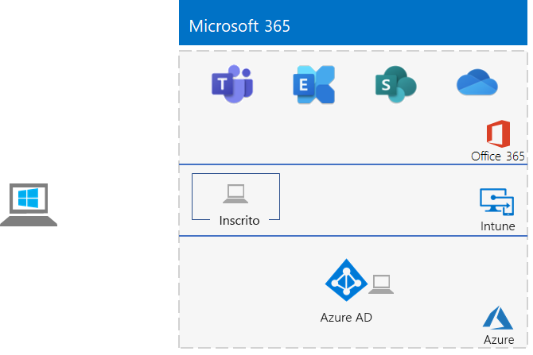

# <a name="identity-and-device-access-prerequisites-for-cloud-only-in-your-microsoft-365-test-environment"></a>Pré-requisitos de acesso ao dispositivo e identidade somente nuvem no seu ambiente de teste do Microsoft 365.

*Este Guia de Laboratório de Teste só pode ser usado para o Microsoft 365 para ambientes de teste corporativos.*

[Configurações de identidade](../security/office-365-security/microsoft-365-policies-configurations.md) e acesso a dispositivos são um conjunto de configurações recomendadas e políticas de acesso condicional para proteger o acesso a todos os serviços integrados ao Azure Active Directory (Azure AD).

Este artigo descreve como configurar um ambiente de teste do Microsoft 365 que atenda aos requisitos das [ configurações com pré-requisitos somente nuvem ](../security/office-365-security/identity-access-prerequisites.md#prerequisites) para acesso ao dispositivo e identidade.

Existem oito fases para configurar este ambiente de teste:

1. Criar seu ambiente de teste simples
2. Configurar localizações nomeadas
3. Configurar a redefinição de senha de autoatendimento
4. Configurar autenticação multifatorial
5. Habilitar o registro automático de dispositivo de computadores Windows ingressados no domínio
6. Configurar a proteção de senha do Azure AD 
7. Habilitar o Azure AD Identity Protection
8. Habilitar a autenticação moderna do Exchange Online e Skype for Business Online

## <a name="phase-1-build-out-your-lightweight-microsoft-365-test-environment"></a>Fase 1: Criar seu ambiente de teste simples do Microsoft 365 

Siga as instruções em [Configuração de base leve](lightweight-base-configuration-microsoft-365-enterprise.md).
Esta é a configuração resultante.


 
## <a name="phase-2-configure-named-locations"></a>Fase 2: Configurar localizações nomeadas

Primeiro, determine os endereços IP públicos ou intervalos de endereços usados pela sua organização.

Em seguida, siga as instruções em [Configurar locais nomeados no Azure Active Directory](/azure/active-directory/reports-monitoring/quickstart-configure-named-locations) para adicionar os endereços ou intervalos de endereços como locais nomeados. 

## <a name="phase-3-configure-self-service-password-reset"></a>Fase 3: Configurar redefinição de senha de autoatendados

Siga as instruções em [Fase 3 da redefinição de senha do Guia do Laboratório de Teste](password-reset-m365-ent-test-environment.md#phase-3-configure-and-test-password-reset). 

Ao habilitar a redefinição de senha para as contas em um grupo específico do Azure AD, adicione essas contas ao grupo **Redefinição de senha**:

- Usuário 2
- Usuário 3
- Usuário 4
- Usuário 5

Teste a redefinição de senha apenas na conta do Usuário 2.

## <a name="phase-4-configure-multi-factor-authentication"></a>Fase 4: Configurar a autenticação multifatória

Siga as instruções na [Fase 2 de autenticação multifator do Guia de Laboratório de Teste](multi-factor-authentication-microsoft-365-test-environment.md#phase-2-enable-and-test-multi-factor-authentication-for-the-user-2-account) para as seguintes contas de usuário:

- Usuário 2
- Usuário 3
- Usuário 4
- Usuário 5

Teste a autenticação multifator apenas para a conta de Usuário 2.

## <a name="phase-5-enable-automatic-device-registration-of-domain-joined-windows-computers"></a>Fase 5: Habilitar o registro automático de dispositivos de computadores Windows ingressados no domínio 

Siga [estas instruções para](/azure/active-directory/devices/hybrid-azuread-join-plan) habilitar o registro automático de dispositivos de computadores Windows ingressados no domínio.

## <a name="phase-6-configure-azure-ad-password-protection"></a>Fase 6: Configurar a proteção de senha do Azure AD 

Siga [estas instruções para](/azure/active-directory/authentication/concept-password-ban-bad) bloquear senhas fracas conhecidas e suas variantes.

## <a name="phase-7-enable-azure-ad-identity-protection"></a>Fase 7: ativar a proteção de identidade do Azure AD

Siga as instruções na [Fase 2 do Guia do Laboratório de Teste do Azure AD Identity Protection](azure-ad-identity-protection-microsoft-365-test-environment.md#phase-2-use-azure-ad-identity-protection). 

## <a name="phase-8-enable-modern-authentication-for-exchange-online-and-skype-for-business-online"></a>Fase 8: habilite a autenticação moderna para o Exchange Online e o Skype for Business Online

Para o Exchange Online, siga [estas instruções](/Exchange/clients-and-mobile-in-exchange-online/enable-or-disable-modern-authentication-in-exchange-online#enable-or-disable-modern-authentication-in-exchange-online-for-client-connections-in-outlook-2013-or-later). 

Para o Skype for Business Online:

1. Conecte-se ao [Skype for Business Online](/SkypeForBusiness/set-up-your-computer-for-windows-powershell/set-up-your-computer-for-windows-powershell).

2. Execute este comando.

  ```powershell
  Set-CsOAuthConfiguration -ClientAdalAuthOverride Allowed
  ```

3. Verifique se a alteração foi bem-sucedida com esse comando.

  ```powershell
  Get-CsOAuthConfiguration
  ```

O resultado é um ambiente de teste que atende aos requisitos da configuração de [pré-requisito](../security/office-365-security/identity-access-prerequisites.md#prerequisites) somente na nuvem para acesso à identidade e ao dispositivo. 

## <a name="next-step"></a>Próxima etapa

Use [Políticas comuns de acesso a identidades e dispositivos](../security/office-365-security/identity-access-policies.md) para configurar as políticas criadas com base nos pré-requisitos e proteger identidades e dispositivos.

## <a name="see-also"></a>Confira também

[Guias adicionais de laboratório de teste de identidade](m365-enterprise-test-lab-guides.md#identity)

[Roteiro de identidade](identity-roadmap-microsoft-365.md)

[Guias do Laboratório de Teste do Microsoft 365 para empresas](m365-enterprise-test-lab-guides.md)

[Visão geral do Microsoft 365 para empresas](microsoft-365-overview.md)

[Documentação do Microsoft 365 para empresas](/microsoft-365-enterprise/)