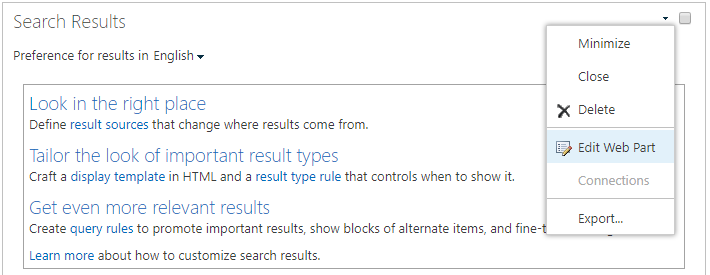

# <a name="configure-search-for-microsoft-365-multi-geo"></a>Configurar a Pesquisa do Microsoft 365 Multi-Geo

Em um ambiente multigeográfico, cada localização geográfica tem seu próprio índice de pesquisa e Centro de pesquisa. Quando um usuário pesquisa, é realizado o fan out para todos os índices e os resultados retornados são mesclados.

Por exemplo, um usuário em uma localização geográfica pode pesquisar por um conteúdo armazenado em outra localização geográfica ou por um conteúdo em um site do SharePoint restrito a uma localização geográfica diferente. Se o usuário tiver acesso a esse conteúdo, a pesquisa mostrará o resultado.

## <a name="which-search-clients-work-in-a-multi-geo-environment"></a>Quais clientes de pesquisa funcionam em um ambiente multigeográfico?

Esses clientes podem retornar resultados de todas as localizações geográficas:

- OneDrive for Business
- Delve
- A home page do SharePoint
- O Centro de Pesquisa
- Aplicativos de pesquisa personalizada que usam a API de pesquisa do SharePoint

### <a name="onedrive-for-business"></a>OneDrive for Business

Assim que o ambiente multigeográfico for configurado, os usuários que pesquisam no OneDrive obtêm resultados de todas as localizações geográficas.

### <a name="delve"></a>Delve

Assim que o ambiente multigeográfico for configurado, os usuários que pesquisam no Delve obtêm resultados de todas as localizações geográficas.

O feed do Delve e o cartão de perfil mostram apenas as visualizações dos arquivos que estão armazenadas em uma localização central. Para arquivos que estão armazenados em localizações de satélite, o ícone para o tipo de arquivo é mostrado em vez disso.

### <a name="the-sharepoint-home-page"></a>A home page do SharePoint

Assim que o ambiente multigeográfico for configurado, os usuários verão notícias, sites recentes e seguidos a partir de várias localizações geográficas na home page do SharePoint. Se eles usarem a caixa de pesquisa na home page do SharePoint, receberão resultados mesclados de várias localizações geográficas.

### <a name="the-search-center"></a>O Centro de Pesquisa

Após a configuração do ambiente multigeográfico, cada Centro de Pesquisa continua mostrando apenas os resultados da própria localização geográfica. Os administradores devem [alterar as configurações de cada Centro de Pesquisa](#_Set_up_a_1) para obter resultados de todas as localizações geográficas. Posteriormente, os usuários que pesquisarem no Centro de Pesquisa obterão resultados de todas as localizações geográficas.

### <a name="custom-search-applications"></a>Aplicativos de pesquisa personalizada

Como de costume, os aplicativos de pesquisa personalizada interagem com os índices de pesquisa usando as APIs REST existentes da Pesquisa do SharePoint. Para obter resultados de todas ou de algumas localizações geográficas, o aplicativo deve [ligar para a API e incluir os novos parâmetros de consulta multigeográfica](#_Get_custom_search) na solicitação. Isso dispara um fan-out da consulta para todas as localizações geográficas.

## <a name="whats-different-about-search-in-a-multi-geo-environment"></a>O que a pesquisa em um ambiente multigeográfico tem de diferente?

Alguns recursos de pesquisa que talvez você conheça funcionam diferente em um ambiente multigeográfico.

<table>
<thead>
<tr class="header">
<th align="left"><strong>Recurso</strong></th>
<th align="left"><strong>Como funciona</strong></th>
<th align="left"><strong>Solução alternativa</strong></th>
</tr>
</thead>
<tbody>
<tr class="odd">
<td align="left">Resultados promovidos</td>
<td align="left">Você pode criar regras de consulta com nos resultados promovidos em diferentes níveis: do locatário inteiro, um conjunto de sites ou um site. Em um ambiente multigeográfico, definir resultados promovidos no nível do locatário para promover os resultados para os Centros de Pesquisa em todos as localizações geográficas. Se você deseja promover resultados no Centro de pesquisa que está na localização geográfica do conjunto de sites ou site, defina os resultados promovidos no nível do site ou conjunto de sites. Esses resultados não são promovidos em outras localizações geográficas.</td>
<td align="left">Se você não precisar de diferentes resultados promovidos por localização geográfica, como diferentes regras de viagens, recomendamos definir resultados promovidos no nível do locatário.</td>
</tr>
<tr class="even">
<td align="left">Refinadores de pesquisa</td>
<td align="left">A pesquisa retorna refinadores de todas as localizações geográficas de um locatário e os agrega. A agregação é um esforço dentro do melhor possível, quer dizer, as contagens de refinador podem não estar 100% corretas. Para a maioria dos cenários orientados por pesquisa, esse nível e precisão é suficiente. </td>
<td align="left">Para os aplicativos orientados por pesquisa que dependem da integridade do refinador, consulte cada localização geográfica individualmente.</td>
</tr>
<tr class="odd">
<td align="left"></td>
<td align="left">A pesquisa multigeográfica não dá suporte a bucketing dinâmico para refinadores numéricos.</td>
<td align="left">Use o <a href="/sharepoint/dev/general-development/query-refinement-in-sharepoint">parâmetro "Discretize"</a> para refinadores numéricos.</td>
</tr>
<tr class="even">
<td align="left">IDs do documento</td>
<td align="left">Se você estiver desenvolvendo um aplicativo orientado por pesquisa que depende de IDs de documento, observe que as IDs de documento em um ambiente multigeográfico não são exclusivas entre localizações geográficas, elas são exclusivas por localização geográfica.</td>
<td align="left">Adicionar uma coluna que identifique a localização geográfica. Use essa coluna para ter exclusividade. Esta coluna é chamada "GeoLocationSource".</td>
</tr>
<tr class="odd">
<td align="left">Número de resultados</td>
<td align="left">A página de resultados de pesquisa mostra os resultados combinados das localizações geográficas, mas não é possível paginar mais de 500 resultados.</td>
<td align="left"></td>
</tr>
<tr class="even">
<td align="left">Pesquisa híbrida</td>
<td align="left">Em um ambiente do SharePoint híbrido com <a href="/sharepoint/hybrid/learn-about-cloud-hybrid-search-for-sharepoint">pesquisa híbrida de nuvem</a>, o conteúdo local é adicionado ao índice do Microsoft 365 da localização central.</td>
<td align="left"></td>
</tr>
</tbody>
</table>

## <a name="whats-not-supported-for-search-in-a-multi-geo-environment"></a>O que a pesquisa em um ambiente multigeográfico não suporta?

Alguns dos recursos de pesquisa que talvez você conheça não são suportados em um ambiente multigeográfico.

<table>
<thead>
<tr class="header">
<th align="left"><strong>Recurso de pesquisa</strong></th>
<th align="left"><strong>Observação</strong></th>
</tr>
</thead>
<tbody>
<tr class="odd">
<td align="left">Autenticação somente aplicativo</td>
<td align="left">A autenticação somente de aplicativos (acesso privilegiado dos serviços) não tem suporte na pesquisa multigeográfica.</td>
</tr>
<tr class="even">
<td align="left">Usuários convidados</td>
<td align="left">Os usuários convidados só obtêm resultados da localização geográfica da qual estão pesquisando.</td>
</tr>
</tbody>
</table>

## <a name="how-does-search-work-in-a-multi-geo-environment"></a>Como a pesquisa funciona em um ambiente multigeográfico?

Todos os clientes de pesquisa usam as APIs REST de Pesquisa existentes do SharePoint para interagir com os índices de pesquisa.


1. Um cliente pesquisa chama o ponto de extremidade da API REST com a propriedade de consulta EnableMultiGeoSearch= true.
2. A consulta é enviada a todas as localizações geográficas no locatário.
3. Os resultados de pesquisa de cada localização geográfica são mesclados e classificados.
4. O cliente obtém resultados de pesquisa unificados.

<span id="_Set_up_a" class="anchor"><span id="_Ref501388384" class="anchor"></span></span>Observe que não mesclamos os resultados da pesquisa até recebemos resultados de todas as localizações geográficas. Isso significa que pesquisas multigeográficas têm latência adicional comparadas com pesquisas em um ambiente com localização geográfica única.

<span id="_Set_up_a_1" class="anchor"><span id="_Ref505252370" class="anchor"></span></span>
## <a name="get-a-search-center-to-show-results-from-all-geo-locations"></a>Obter um centro de pesquisa para mostrar resultados de todas as localizações geográficas

Cada centro de pesquisa tem vários verticais e você precisará configurar cada vertical individualmente.

1. Certifique-se de executar essas etapas com uma conta que tenha permissão para editar a página de resultados de pesquisa e a Web Part de resultados de pesquisa.

2. Navegue até a página de resultados de pesquisa (confira a [lista](https://support.office.com/article/174d36e0-2f85-461a-ad9a-8b3f434a4213) das páginas de resultados de pesquisa)

3. Selecione o eixo vertical a configurar, clique no ícone de engrenagem **Configurações** no canto superior direito e, em seguida, clique em **Editar página**. A página de resultados de pesquisa abre no modo de edição.

   

4. Na Web Part de Resultados de Pesquisa, mova o ponteiro para o canto superior direito da web part, clique na seta e, em seguida, clique em **Editar Web Part** no menu. O painel de ferramentas da Web Part de Resultados de Pesquisa é aberto na faixa de opções no canto superior direito da página.

   

5. No painel de ferramentas da Web Part, na seção **Configurações**, em **Configurações de controle de resultados**, marque **Mostrar resultados multigeográficos** para obter a Web Part de resultados de pesquisa para mostrar resultados de todas as localizações geográficas.

6. Clique em **OK** para salvar as alterações e fechar o painel de ferramentas da Web Part.

7. Verifique as suas alterações na Web Part de resultados da pesquisa clicando em **Check-In** na guia Página do menu principal.

8. Publique as alterações usando o link fornecido na observação na parte superior da página.

<span id="_Get_custom_search" class="anchor"><span id="_Ref501388387" class="anchor"></span></span>
## <a name="get-custom-search-applications-to-show-results-from-all-or-some-geo-locations"></a>Obter aplicativos de pesquisa personalizada para mostrar resultados de todas ou algumas localizações geográficas

Os aplicativos de pesquisa personalizados têm resultados de todas as localizações geográficas, especificando parâmetros de consulta com a solicitação para a API REST de Pesquisa do SharePoint. Dependendo dos parâmetros de consulta, a consulta é ampliada para todas as localizações geográficas ou para algumas localizações geográficas. Por exemplo, se você precisar consultar apenas um subconjunto de localizações geográficas para encontrar informações relevantes, poderá controlar o fan para apenas estes. Se a solicitação for bem-sucedida, a API REST de Pesquisa do SharePoint retornará dados de resposta.

### <a name="requirement"></a>Requisito

Para cada local geográfico, certifique-se de que todos os usuários na organização tiverem o nível de permissão **ler** do site raiz (por exemplo, contoso **APAC**.sharepoint.com/ e a contoso **EU**.sharepoint.com/). [Saiba mais sobre permissões](https://support.office.com/article/understanding-permission-levels-in-sharepoint-87ecbb0e-6550-491a-8826-c075e4859848).

### <a name="query-parameters"></a>Parâmetros de consulta

EnableMultiGeoSearch, isso é um valor Booleano que especifica se o fan ou deve ser realizado para os índices das outras localizações geográficas do locatário multigeográfico. Definido como **verdadeiro** para realizar o fan out da consulta. **falso** para não realizar o fan out da consulta. Se você não incluir esse parâmetro, o valor padrão será **falso**, exceto ao fazer uma chamada da API REST em um site que use o modelo do Centro de Pesquisa Corporativo; nesse caso, o valor padrão será **verdadeiro**. Se você usa o parâmetro em um ambiente que não é multigeográfico, o parâmetro será ignorado.

ClientType - Isso é uma cadeia de caracteres. Insira um nome exclusivo do cliente para cada aplicativo de pesquisa. Se esse parâmetro não for incluído, o fan out da consulta não é feito em outra localizações geográficas.

MultiGeoSearchConfiguration - Isso é uma lista opcional de localizações geográficas filiais em um locatário multigeográfico para realizar o fan out da consulta quando **EnableMultiGeoSearch** for **verdadeiro**. Se você não incluir este parâmetro ou deixar em branco, o fan out da consulta é feito para todas as localizações geográficas. Para cada localização geográfica, insira os seguintes itens no formato JSON:

<table>
<thead>
<tr class="header">
<th align="left">Item</th>
<th align="left">Descrição</th>
</tr>
</thead>
<tbody>
<tr class="odd">
<td align="left">DataLocation</td>
<td align="left">Localização geográfica, por exemplo, NAM.</td>
</tr>
<tr class="even">
<td align="left">EndPoint</td>
<td align="left">O ponto de extremidade ao qual se conectar, por exemplo, https://contoso.sharepoint.com</td>
</tr>
<tr class="odd">
<td align="left">SourceId</td>
<td align="left">O GUID da fonte de resultados, por exemplo, B81EAB55-3140-4312-B0F4-9459D1B4FFEE.</td>
</tr>
</tbody>
</table>

Se você omitir DataLocation ou EndPoint ou se um DataLocation estiver duplicado, a solicitação falhará. [Você pode obter informações sobre o ponto de extremidade das localizações geográficas de um locatário usando o Microsoft Graph](/sharepoint/dev/solution-guidance/multigeo-discovery).

### <a name="response-data"></a>Dado de resposta

MultiGeoSearchStatus – Isso é uma propriedade que a API de pesquisa do SharePoint retorna em resposta a uma solicitação. O valor da propriedade é uma cadeia de caracteres e fornece as seguintes informações sobre os resultados que a API de pesquisa do SharePoint retorna:

<table>
<thead>
<tr class="header">
<th align="left">Valor</th>
<th align="left">Descrição</th>
</tr>
</thead>
<tbody>
<tr class="odd">
<td align="left">Completo</td>
<td align="left">Total de resultados de <strong>todas</strong> as localizações geográficas.</td>
</tr>
<tr class="even">
<td align="left">Parcial</td>
<td align="left">Os resultados parciais de uma ou mais localizações geográficas. Os resultados são incompletos devido a um erro transitório.</td>
</tr>
</tbody>
</table>

### <a name="query-using-the-rest-service"></a>Consulta usando o serviço REST

Com uma solicitação GET, você especifica os parâmetros da consulta na URL. Com uma solicitação POST, você passa os parâmetros de consulta no corpo no formato JavaScript Object Notation (JSON).

#### <a name="request-headers"></a>Cabeçalhos de solicitação

<table>
<thead>
<tr class="header">
<th align="left">Nome</th>
<th align="left">Valor</th>
</tr>
</thead>
<tbody>
<tr class="odd">
<td align="left">Content-Type</td>
<td align="left">application/json;odata=verbose</td>
</tr>
</tbody>
</table>

#### <a name="sample-get-request-thats-fanned-out-to-all-geo-locations"></a>Exemplo de solicitação GET da qual se realiza fan-out para **todas** as localizações geográficas

https:// \<tenant\> / \_ api/search/query?querytext='sharepoint'&Properties='EnableMultiGeoSearch:true'&ClientType='my \_ \_ client id'

#### <a name="sample-get-request-to-fan-out-to-some-geo-locations"></a>Exemplo de solicitação GET da qual realizar fan-out para **algumas** localizações geográficas

https:// \<tenant\> / \_ api/search/query?querytext='site'&ClientType='my_client_id'&Properties='EnableMultiGeoSearch:true, MultiGeoSearchConfiguration:[{DataLocation \\ :"NAM" \\ ,Endpoint \\ :"https \\ ://contosoNAM.sharepoint.com" \\ ,SourceId \\ :"B81EAB55-3140-4312-B0F4-9459D1B4FFEE"} \\ ,{DataLocation \\ :"CAN" \\ ,Endpoint \\ :"https \\ ://contosoCAN.sharepoint-df.com"}]'

> [!NOTE]
> Vírgulas e dois-pontos na lista de localizações geográficas para a propriedade MultiGeoSearchConfiguration são precedidas pelo caractere **barra invertida**. Isso ocorre porque solicitações GET usam dois-pontos para separar propriedades e vírgulas para separar os argumentos das propriedades. Sem uma barra invertida como um caractere de escape, a propriedade MultiGeoSearchConfiguration será interpretada incorretamente.

#### <a name="sample-post-request-thats-fanned-out-to-all-geo-locations"></a>Exemplo de solicitação POST da qual se realiza fan-out para **todas** as localizações geográficas

```text
    {
    "request": {
            "__metadata": {
            "type": "Microsoft.Office.Server.Search.REST.SearchRequest"
        },
        "Querytext": "sharepoint",
        "Properties": {
            "results": [
                {
                    "Name": "EnableMultiGeoSearch",
                    "Value": {
                        "QueryPropertyValueTypeIndex": 3,
                        "BoolVal": true
                    }
                }
            ]
        },
        "ClientType": "my_client_id"
        }
    }
```

#### <a name="sample-post-request-thats-fanned-out-to-some-geo-locations"></a>Exemplo de solicitação POST da qual se realiza fan-out para **algumas** localizações geográficas

```text
    {
        "request": {
            "Querytext": "SharePoint",
            "ClientType": "my_client_id",
            "Properties": {
                "results": [
                    {
                        "Name": "EnableMultiGeoSearch",
                        "Value": {
                            "QueryPropertyValueTypeIndex": 3,
                            "BoolVal": true
                        }
                    },
                    {
                        "Name": "MultiGeoSearchConfiguration",
                        "Value": {
                        "StrVal": "[{\"DataLocation\":\"NAM\",\"Endpoint\":\"https://contoso.sharepoint.com\",\"SourceId\":\"B81EAB55-3140-4312-B0F4-9459D1B4FFEE\"},{\"DataLocation\":\"CAN\",\"Endpoint\":\"https://contosoCAN.sharepoint.com\"}]",
                            "QueryPropertyValueTypeIndex": 1
                        }
                    }
                ]
            }
        }
    }
```

### <a name="query-using-csom"></a>Consulta usando o CSOM

Vejamos um exemplo de consulta CSOM da qual se faz fan-out para **todas** as localizações geográficas:

```text
var keywordQuery = new KeywordQuery(ctx);
keywordQuery.QueryText = query.SearchQueryText;
keywordQuery.ClientType = <enter a string here>;
keywordQuery["EnableMultiGeoSearch"] = true;
```