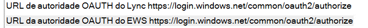

# <a name="how-to-configure-skype-for-business-on-premises-to-use-hybrid-modern-authentication"></a><span data-ttu-id="be529-103">Como configurar o Skype for Business no local para usar a autenticação moderna híbrida</span><span class="sxs-lookup"><span data-stu-id="be529-103">How to configure Skype for Business on-premises to use Hybrid Modern Authentication</span></span>

<span data-ttu-id="be529-104">*Esse artigo se aplica ao Microsoft 365 Enterprise e ao Office 365 Enterprise.*</span><span class="sxs-lookup"><span data-stu-id="be529-104">*This article applies to both Microsoft 365 Enterprise and Office 365 Enterprise.*</span></span>

<span data-ttu-id="be529-105">A autenticação moderna é um método de gerenciamento de identidades que oferece autenticação e autorização de usuário mais seguras, está disponível para o Skype for Business Server local e o Exchange Server local e o Skype-Domain híbridas do Skype for Business.</span><span class="sxs-lookup"><span data-stu-id="be529-105">Modern Authentication, is a method of identity management that offers more secure user authentication and authorization, is available for Skype for Business server on-premises and Exchange server on-premises, and split-domain Skype for Business hybrids.</span></span>
  
 <span data-ttu-id="be529-106">**Importante** Gostaria de saber mais sobre a autenticação moderna (MA) e por que você pode preferir usá-la em sua empresa ou organização?</span><span class="sxs-lookup"><span data-stu-id="be529-106">**Important** Would you like to know more about Modern Authentication (MA) and why you might prefer to use it in your company or organization?</span></span> <span data-ttu-id="be529-107">Consulte [este documento](hybrid-modern-auth-overview.md) para obter uma visão geral.</span><span class="sxs-lookup"><span data-stu-id="be529-107">Check [this document](hybrid-modern-auth-overview.md) for an overview.</span></span> <span data-ttu-id="be529-108">Se você precisa saber quais topologias do Skype for Business são compatíveis com o MA, está documentado aqui!</span><span class="sxs-lookup"><span data-stu-id="be529-108">If you need to know what Skype for Business topologies are supported with MA, that's documented here!</span></span>
  
 <span data-ttu-id="be529-109">**Antes de começar**, eu uso estes termos:</span><span class="sxs-lookup"><span data-stu-id="be529-109">**Before we begin**, I use these terms:</span></span>
  
- <span data-ttu-id="be529-110">Autenticação moderna (MA)</span><span class="sxs-lookup"><span data-stu-id="be529-110">Modern Authentication (MA)</span></span>

- <span data-ttu-id="be529-111">Autenticação moderna híbrida (HMA)</span><span class="sxs-lookup"><span data-stu-id="be529-111">Hybrid Modern Authentication (HMA)</span></span>

- <span data-ttu-id="be529-112">Exchange local (EXCH)</span><span class="sxs-lookup"><span data-stu-id="be529-112">Exchange on-premises (EXCH)</span></span>

- <span data-ttu-id="be529-113">Exchange Online (EXO)</span><span class="sxs-lookup"><span data-stu-id="be529-113">Exchange Online (EXO)</span></span>

- <span data-ttu-id="be529-114">Skype for Business local (SFB)</span><span class="sxs-lookup"><span data-stu-id="be529-114">Skype for Business on-premises (SFB)</span></span>

- <span data-ttu-id="be529-115">Skype for Business online (SFBO)</span><span class="sxs-lookup"><span data-stu-id="be529-115">Skype for Business Online (SFBO)</span></span>

<span data-ttu-id="be529-116">Além disso, se um gráfico neste artigo tiver um objeto que está acinzentado ou esmaecido que significa que o elemento mostrado em cinza **não está** incluído na configuração específica do ma.</span><span class="sxs-lookup"><span data-stu-id="be529-116">Also, if a graphic in this article has an object that's grayed-out or dimmed that means the element shown in gray **isn't** included in MA-specific configuration.</span></span>
  
## <a name="read-the-summary"></a><span data-ttu-id="be529-117">Leia o resumo</span><span class="sxs-lookup"><span data-stu-id="be529-117">Read the summary</span></span>

<span data-ttu-id="be529-118">Este resumo divide o processo em etapas que podem ser perdidas durante a execução e é bom para uma lista de verificação geral para acompanhar onde você está no processo.</span><span class="sxs-lookup"><span data-stu-id="be529-118">This summary breaks down the process into steps that might otherwise get lost during the execution, and is good for an overall checklist to keep track of where you are in the process.</span></span>
  
1. <span data-ttu-id="be529-119">Primeiro, verifique se você atende a todos os pré-requisitos.</span><span class="sxs-lookup"><span data-stu-id="be529-119">First, make sure you meet all the prerequisites.</span></span>

1. <span data-ttu-id="be529-120">Como muitos **pré-requisitos** são comuns para o Skype for Business e o Exchange, [consulte o artigo de visão geral de sua lista de verificação de pré-](hybrid-modern-auth-overview.md)requisito.</span><span class="sxs-lookup"><span data-stu-id="be529-120">Since many **prerequisites** are common for both Skype for Business and Exchange, [see the overview article for your pre-req checklist](hybrid-modern-auth-overview.md).</span></span> <span data-ttu-id="be529-121">Faça isso  *antes*  de começar qualquer uma das etapas neste artigo.</span><span class="sxs-lookup"><span data-stu-id="be529-121">Do this  *before*  you begin any of the steps in this article.</span></span>

1. <span data-ttu-id="be529-122">Colete as informações específicas da HMA necessárias em um arquivo ou no OneNote.</span><span class="sxs-lookup"><span data-stu-id="be529-122">Collect the HMA-specific info you'll need in a file, or OneNote.</span></span>

1. <span data-ttu-id="be529-123">Ative a autenticação moderna para o EXO (se ainda não estiver ativada).</span><span class="sxs-lookup"><span data-stu-id="be529-123">Turn ON Modern Authentication for EXO (if it isn't already turned on).</span></span>

1. <span data-ttu-id="be529-124">Ative a autenticação moderna para o SFBO (se ainda não estiver ativada).</span><span class="sxs-lookup"><span data-stu-id="be529-124">Turn ON Modern Authentication for SFBO (if it isn't already turned on).</span></span>

1. <span data-ttu-id="be529-125">Ative a autenticação moderna híbrida para o Exchange local.</span><span class="sxs-lookup"><span data-stu-id="be529-125">Turn ON Hybrid Modern Authentication for Exchange on-premises.</span></span>

1. <span data-ttu-id="be529-126">Ative a autenticação moderna híbrida para o Skype for Business no local.</span><span class="sxs-lookup"><span data-stu-id="be529-126">Turn ON Hybrid Modern Authentication for Skype for Business on-premises.</span></span>

<span data-ttu-id="be529-127">Essas etapas ativam MA para SFB, SFBO, EXCH e EXO-ou seja, todos os produtos que podem participar de uma configuração de HMA de SFB e SFBO (incluindo dependências em EXCH/EXO).</span><span class="sxs-lookup"><span data-stu-id="be529-127">These steps turn on MA for SFB, SFBO, EXCH, and EXO - that is, all the products that can participate in an HMA configuration of SFB and SFBO (including dependencies on EXCH/EXO).</span></span> <span data-ttu-id="be529-128">Em outras palavras, se seus usuários estiverem hospedados em/têm caixas de correio criadas em qualquer parte do híbrido (EXO + SFBO, EXO + SFB, EXCH + SFBO ou EXCH + SFB), o produto final terá a seguinte aparência:</span><span class="sxs-lookup"><span data-stu-id="be529-128">In other words, if your users are homed in/have mailboxes created in any part of the Hybrid (EXO + SFBO, EXO + SFB, EXCH + SFBO, or EXCH + SFB), your finished product will look like this:</span></span>
  

  
<span data-ttu-id="be529-130">Como você pode ver, há quatro lugares diferentes para ativar MA!</span><span class="sxs-lookup"><span data-stu-id="be529-130">As you can see there are four different places to turn on MA!</span></span> <span data-ttu-id="be529-131">Para obter a melhor experiência do usuário, recomendamos que você ative o MA nos quatro desses locais.</span><span class="sxs-lookup"><span data-stu-id="be529-131">For the best user experience, we recommend you turn on MA in all four of these locations.</span></span> <span data-ttu-id="be529-132">Se você não conseguir ativar o MA em todos esses locais, ajuste as etapas para ativar o MA somente nos locais necessários para o seu ambiente.</span><span class="sxs-lookup"><span data-stu-id="be529-132">If you can't turn MA on in all these locations, adjust the steps so that you turn on MA only in the locations that are necessary for your environment.</span></span>
  
<span data-ttu-id="be529-133">Consulte o [tópico sobre capacidade de suporte para o Skype for Business com ma](https://technet.microsoft.com/library/mt803262.aspx) para topologias suportadas.</span><span class="sxs-lookup"><span data-stu-id="be529-133">See the [Supportability topic for Skype for Business with MA](https://technet.microsoft.com/library/mt803262.aspx) for supported topologies.</span></span>
  
 <span data-ttu-id="be529-134">**Importante** Verifique se você atendeu a todos os pré-requisitos antes de começar.</span><span class="sxs-lookup"><span data-stu-id="be529-134">**Important** Double-check that you've met all the prerequisites before you begin.</span></span> <span data-ttu-id="be529-135">Você encontrará essas informações na [visão geral da autenticação moderna híbrida e nos pré-requisitos](hybrid-modern-auth-overview.md).</span><span class="sxs-lookup"><span data-stu-id="be529-135">You'll find that information in [Hybrid modern authentication overview and prerequisites](hybrid-modern-auth-overview.md).</span></span>
  
## <a name="collect-all-hma-specific-info-youll-need"></a><span data-ttu-id="be529-136">Coletar todas as informações específicas da HMA necessárias</span><span class="sxs-lookup"><span data-stu-id="be529-136">Collect all HMA-specific info you'll need</span></span>

<span data-ttu-id="be529-137">Depois de verificar novamente se você atende aos [pré-requisitos](hybrid-modern-auth-overview.md) para usar a autenticação moderna (consulte a observação acima), você deve criar um arquivo para armazenar as informações necessárias para configurar a HMA nas etapas adiante.</span><span class="sxs-lookup"><span data-stu-id="be529-137">After you've double-checked that you meet the [prerequisites](hybrid-modern-auth-overview.md) to use Modern Authentication (see the note above), you should create a file to hold the info you'll need for configuring HMA in the steps ahead.</span></span> <span data-ttu-id="be529-138">Exemplos usados neste artigo:</span><span class="sxs-lookup"><span data-stu-id="be529-138">Examples used in this article:</span></span>
  
- <span data-ttu-id="be529-139">**SIP/domínio SMTP**</span><span class="sxs-lookup"><span data-stu-id="be529-139">**SIP/SMTP domain**</span></span>

  - <span data-ttu-id="be529-140">Ex.</span><span class="sxs-lookup"><span data-stu-id="be529-140">Ex.</span></span> <span data-ttu-id="be529-141">contoso.com (é federado com o Office 365)</span><span class="sxs-lookup"><span data-stu-id="be529-141">contoso.com (is federated with Office 365)</span></span>

- <span data-ttu-id="be529-142">**ID do locatário**</span><span class="sxs-lookup"><span data-stu-id="be529-142">**Tenant ID**</span></span>

  - <span data-ttu-id="be529-143">O GUID que representa o locatário do Office 365 (no logon de contoso.onmicrosoft.com).</span><span class="sxs-lookup"><span data-stu-id="be529-143">The GUID that represents your Office 365 tenant (at the login of contoso.onmicrosoft.com).</span></span>

- <span data-ttu-id="be529-144">**SFB 2015 CU5 Web Service URLs**</span><span class="sxs-lookup"><span data-stu-id="be529-144">**SFB 2015 CU5 Web Service URLs**</span></span>

<span data-ttu-id="be529-145">Você precisará de URLs de serviços Web internos e externos para todos os pools do SfB 2015 implantados.</span><span class="sxs-lookup"><span data-stu-id="be529-145">you'll need internal and external web service URLs for all SfB 2015 pools deployed.</span></span> <span data-ttu-id="be529-146">Para obtê-los, execute o seguinte no Shell de gerenciamento do Skype for Business:</span><span class="sxs-lookup"><span data-stu-id="be529-146">To obtain these, run the following from Skype for Business Management Shell:</span></span>
  
```powershell
Get-CsService -WebServer | Select-Object PoolFqdn, InternalFqdn, ExternalFqdn | FL
```

- <span data-ttu-id="be529-147">Ex.</span><span class="sxs-lookup"><span data-stu-id="be529-147">Ex.</span></span> <span data-ttu-id="be529-148">Internamente https://lyncwebint01.contoso.com</span><span class="sxs-lookup"><span data-stu-id="be529-148">Internal: https://lyncwebint01.contoso.com</span></span>

- <span data-ttu-id="be529-149">Ex.</span><span class="sxs-lookup"><span data-stu-id="be529-149">Ex.</span></span> <span data-ttu-id="be529-150">Externo https://lyncwebext01.contoso.com</span><span class="sxs-lookup"><span data-stu-id="be529-150">External: https://lyncwebext01.contoso.com</span></span>

<span data-ttu-id="be529-151">Se você estiver usando um servidor Standard Edition, a URL interna ficará em branco.</span><span class="sxs-lookup"><span data-stu-id="be529-151">If you're using a Standard Edition server, the internal URL will be blank.</span></span> <span data-ttu-id="be529-152">Nesse caso, use o FQDN do pool para a URL interna.</span><span class="sxs-lookup"><span data-stu-id="be529-152">In this case, use the pool fqdn for the internal URL.</span></span>
  
## <a name="turn-on-modern-authentication-for-exo"></a><span data-ttu-id="be529-153">Ativar a autenticação moderna para o EXO</span><span class="sxs-lookup"><span data-stu-id="be529-153">Turn on Modern Authentication for EXO</span></span>

<span data-ttu-id="be529-154">Siga as instruções aqui: [Exchange Online: como habilitar seu locatário para autenticação moderna.](https://social.technet.microsoft.com/wiki/contents/articles/32711.exchange-online-how-to-enable-your-tenant-for-modern-authentication.aspx)</span><span class="sxs-lookup"><span data-stu-id="be529-154">Follow the instructions here: [Exchange Online: How to enable your tenant for modern authentication.](https://social.technet.microsoft.com/wiki/contents/articles/32711.exchange-online-how-to-enable-your-tenant-for-modern-authentication.aspx)</span></span>
  
## <a name="turn-on-modern-authentication-for-sfbo"></a><span data-ttu-id="be529-155">Ativar a autenticação moderna para o SFBO</span><span class="sxs-lookup"><span data-stu-id="be529-155">Turn on Modern Authentication for SFBO</span></span>

<span data-ttu-id="be529-156">Siga as instruções aqui: [Skype for Business Online: habilitar seu locatário para autenticação moderna](https://social.technet.microsoft.com/wiki/contents/articles/34339.skype-for-business-online-enable-your-tenant-for-modern-authentication.aspx).</span><span class="sxs-lookup"><span data-stu-id="be529-156">Follow the instructions here: [Skype for Business Online: Enable your tenant for modern authentication](https://social.technet.microsoft.com/wiki/contents/articles/34339.skype-for-business-online-enable-your-tenant-for-modern-authentication.aspx).</span></span>
  
## <a name="turn-on-hybrid-modern-authentication-for-exchange-on-premises"></a><span data-ttu-id="be529-157">Ativar a autenticação moderna híbrida para o Exchange local</span><span class="sxs-lookup"><span data-stu-id="be529-157">Turn on Hybrid Modern Authentication for Exchange on-premises</span></span>

<span data-ttu-id="be529-158">Siga as instruções aqui: [como configurar o Exchange Server no local para usar a autenticação moderna híbrida](configure-exchange-server-for-hybrid-modern-authentication.md).</span><span class="sxs-lookup"><span data-stu-id="be529-158">Follow the instructions here: [How to configure Exchange Server on-premises to use Hybrid Modern Authentication](configure-exchange-server-for-hybrid-modern-authentication.md).</span></span>
  
## <a name="turn-on-hybrid-modern-authentication-for-skype-for-business-on-premises"></a><span data-ttu-id="be529-159">Ativar a autenticação moderna híbrida para o Skype for Business no local</span><span class="sxs-lookup"><span data-stu-id="be529-159">Turn on Hybrid Modern Authentication for Skype for Business on-premises</span></span>

### <a name="add-on-premises-web-service-urls-as-spns-in-azure-active-directory"></a><span data-ttu-id="be529-160">Adicionar URLs de serviços Web locais como SPNs no Azure Active Directory</span><span class="sxs-lookup"><span data-stu-id="be529-160">Add on-premises web service URLs as SPNs in Azure Active Directory</span></span>

<span data-ttu-id="be529-161">Agora, você precisará executar comandos para adicionar as URLs (coletadas anteriormente) como entidades de serviço no SFBO.</span><span class="sxs-lookup"><span data-stu-id="be529-161">Now you'll need to run commands to add the URLs (collected earlier) as Service Principals in SFBO.</span></span>
  
 <span data-ttu-id="be529-162">**Observação** Os SPNs (nomes de entidade de serviço) identificam os serviços Web e os associam a um objeto de segurança (como um nome de conta ou grupo) para que o serviço possa atuar em nome de um usuário autorizado.</span><span class="sxs-lookup"><span data-stu-id="be529-162">**Note** Service principal names (SPNs) identify web services and associate them with a security principal (such as an account name or group) so that the service can act on the behalf of an authorized user.</span></span> <span data-ttu-id="be529-163">Os clientes que se autenticam em um servidor fazem uso de informações contidas em SPNs.</span><span class="sxs-lookup"><span data-stu-id="be529-163">Clients authenticating to a server make use of information that's contained in SPNs.</span></span>
  
1. <span data-ttu-id="be529-164">Primeiro, conecte-se ao Azure Active Directory (Azure AD) com [estas instruções](https://docs.microsoft.com/powershell/azure/active-directory/overview?view=azureadps-1.0).</span><span class="sxs-lookup"><span data-stu-id="be529-164">First, connect to Azure Active Directory (Azure AD) with [these instructions](https://docs.microsoft.com/powershell/azure/active-directory/overview?view=azureadps-1.0).</span></span>

2. <span data-ttu-id="be529-165">Execute este comando, no local, para obter uma lista de URLs de serviços Web do SFB.</span><span class="sxs-lookup"><span data-stu-id="be529-165">Run this command, on-premises, to get a list of SFB web service URLs.</span></span>

   <span data-ttu-id="be529-166">Observe que o AppPrincipalId começa com `00000004` .</span><span class="sxs-lookup"><span data-stu-id="be529-166">Note that the AppPrincipalId begins with `00000004`.</span></span> <span data-ttu-id="be529-167">Isso corresponde ao Skype for Business online.</span><span class="sxs-lookup"><span data-stu-id="be529-167">This corresponds to Skype for Business Online.</span></span>

   <span data-ttu-id="be529-168">Anote (e captura de tela para comparação posterior) a saída desse comando, que incluirá uma URL SE e um WS, mas que basicamente consiste em SPNs que começam com `00000004-0000-0ff1-ce00-000000000000/` .</span><span class="sxs-lookup"><span data-stu-id="be529-168">Take note of (and screenshot for later comparison) the output of this command, which will include an SE and WS URL, but mostly consist of SPNs that begin with `00000004-0000-0ff1-ce00-000000000000/`.</span></span>

```powershell
Get-MsolServicePrincipal -AppPrincipalId 00000004-0000-0ff1-ce00-000000000000 | Select -ExpandProperty ServicePrincipalNames
```

3. <span data-ttu-id="be529-169">Se as URLs de SFB internas **ou** externas do local estiverem ausentes (por exemplo, https://lyncwebint01.contoso.com e https://lyncwebext01.contoso.com) precisaremos adicionar esses registros específicos a essa lista.</span><span class="sxs-lookup"><span data-stu-id="be529-169">If the internal **or** external SFB URLs from on-premises are missing (for example, https://lyncwebint01.contoso.com and https://lyncwebext01.contoso.com) we will need to add those specific records to this list.</span></span>

    <span data-ttu-id="be529-170">Certifique-se de substituir  *as URLs de exemplo* abaixo por suas URLs reais nos comandos Add!</span><span class="sxs-lookup"><span data-stu-id="be529-170">Be sure to replace  *the example URLs* below with your actual URLs in the Add commands!</span></span>
  
```powershell
$x= Get-MsolServicePrincipal -AppPrincipalId 00000004-0000-0ff1-ce00-000000000000
$x.ServicePrincipalnames.Add("https://lyncwebint01.contoso.com/")
$x.ServicePrincipalnames.Add("https://lyncwebext01.contoso.com/")
Set-MSOLServicePrincipal -AppPrincipalId 00000004-0000-0ff1-ce00-000000000000 -ServicePrincipalNames $x.ServicePrincipalNames
```
  
4. <span data-ttu-id="be529-171">Verifique se os novos registros foram adicionados executando o comando **Get-MsolServicePrincipal** da etapa 2 novamente e examinando a saída.</span><span class="sxs-lookup"><span data-stu-id="be529-171">Verify your new records were added by running the **Get-MsolServicePrincipal** command from step 2 again, and looking through the output.</span></span> <span data-ttu-id="be529-172">Compare a lista ou captura de tela antes da nova lista de SPNs.</span><span class="sxs-lookup"><span data-stu-id="be529-172">Compare the list or screenshot from before to the new list of SPNs.</span></span> <span data-ttu-id="be529-173">Você também pode capturar a nova lista para seus registros.</span><span class="sxs-lookup"><span data-stu-id="be529-173">You might also screenshot the new list for your records.</span></span> <span data-ttu-id="be529-174">Se você tiver êxito, verá as duas novas URLs na lista.</span><span class="sxs-lookup"><span data-stu-id="be529-174">If you were successful, you'll see the two new URLs in the list.</span></span> <span data-ttu-id="be529-175">Indo em nosso exemplo, a lista de SPNs agora incluirá as URLs específicas https://lyncwebint01.contoso.com e https://lyncwebext01.contoso.com/ .</span><span class="sxs-lookup"><span data-stu-id="be529-175">Going by our example, the list of SPNs will now include the specific URLs https://lyncwebint01.contoso.com and https://lyncwebext01.contoso.com/.</span></span>

### <a name="create-the-evosts-auth-server-object"></a><span data-ttu-id="be529-176">Criar o objeto de servidor de autenticação EvoSTS</span><span class="sxs-lookup"><span data-stu-id="be529-176">Create the EvoSTS Auth Server Object</span></span>

<span data-ttu-id="be529-177">Execute o seguinte comando no Shell de gerenciamento do Skype for Business.</span><span class="sxs-lookup"><span data-stu-id="be529-177">Run the following command in the Skype for Business Management Shell.</span></span>
  
```powershell
New-CsOAuthServer -Identity evoSTS -MetadataURL https://login.windows.net/common/FederationMetadata/2007-06/FederationMetadata.xml -AcceptSecurityIdentifierInformation $true -Type AzureAD
```

### <a name="enable-hybrid-modern-authentication"></a><span data-ttu-id="be529-178">Habilitar a autenticação moderna híbrida</span><span class="sxs-lookup"><span data-stu-id="be529-178">Enable Hybrid Modern Authentication</span></span>

<span data-ttu-id="be529-179">Esta é a etapa que realmente ativa MA.</span><span class="sxs-lookup"><span data-stu-id="be529-179">This is the step that actually turns on MA.</span></span> <span data-ttu-id="be529-180">Todas as etapas anteriores podem ser executadas antecipadamente sem alterar o fluxo de autenticação do cliente.</span><span class="sxs-lookup"><span data-stu-id="be529-180">All the previous steps can be run ahead of time without changing the client authentication flow.</span></span> <span data-ttu-id="be529-181">Quando estiver pronto para alterar o fluxo de autenticação, execute este comando no Shell de gerenciamento do Skype for Business.</span><span class="sxs-lookup"><span data-stu-id="be529-181">When you're ready to change the authentication flow, run this command in the Skype for Business Management Shell.</span></span>

```powershell
Set-CsOAuthConfiguration -ClientAuthorizationOAuthServerIdentity evoSTS
```

## <a name="verify"></a><span data-ttu-id="be529-182">Verify</span><span class="sxs-lookup"><span data-stu-id="be529-182">Verify</span></span>

<span data-ttu-id="be529-183">Depois de habilitar a HMA, o próximo login de um cliente usará o novo fluxo de autenticação.</span><span class="sxs-lookup"><span data-stu-id="be529-183">Once you enable HMA, a client's next login will use the new auth flow.</span></span> <span data-ttu-id="be529-184">Observe que apenas a ativação da HMA não acionará uma nova autenticação para qualquer cliente.</span><span class="sxs-lookup"><span data-stu-id="be529-184">Note that just turning on HMA won't trigger a reauthentication for any client.</span></span> <span data-ttu-id="be529-185">Os clientes são autenticados com base no tempo de vida dos tokens de autenticação e/ou certs que eles têm.</span><span class="sxs-lookup"><span data-stu-id="be529-185">The clients reauthenticate based on the lifetime of the auth tokens and/or certs they have.</span></span>
  
<span data-ttu-id="be529-186">Para testar se a HMA está funcionando depois de tê-la habilitado, saia do SFB de teste do cliente Windows e certifique-se de clicar em excluir minhas credenciais.</span><span class="sxs-lookup"><span data-stu-id="be529-186">To test that HMA is working after you've enabled it, sign out of a test SFB Windows client and be sure to click 'delete my credentials'.</span></span> <span data-ttu-id="be529-187">Entre novamente.</span><span class="sxs-lookup"><span data-stu-id="be529-187">Sign in again.</span></span> <span data-ttu-id="be529-188">Agora, o cliente deve usar o fluxo de autenticação moderna e seu logon incluirá um prompt do **Office 365** para uma conta de ' trabalho ou escola ', visto imediatamente antes de o cliente entrar em contato com o servidor e fizer o login.</span><span class="sxs-lookup"><span data-stu-id="be529-188">The client should now use the Modern Auth flow and your login will now include an **Office 365** prompt for a 'Work or school' account, seen right before the client contacts the server and logs you in.</span></span>
  
<span data-ttu-id="be529-189">Você também deve verificar as ' informações de configuração ' para clientes do Skype for Business para uma ' autoridade OAuth '.</span><span class="sxs-lookup"><span data-stu-id="be529-189">You should also check the 'Configuration Information' for Skype for Business Clients for an 'OAuth Authority'.</span></span> <span data-ttu-id="be529-190">Para fazer isso no computador cliente, pressione a tecla CTRL ao mesmo tempo em que você clica com o botão direito do mouse no ícone do Skype for Business na bandeja de notificação do Windows.</span><span class="sxs-lookup"><span data-stu-id="be529-190">To do this on your client computer, hold down the CTRL key at the same time you right-click the Skype for Business Icon in the Windows Notification tray.</span></span> <span data-ttu-id="be529-191">Clique em **informações de configuração** no menu exibido.</span><span class="sxs-lookup"><span data-stu-id="be529-191">Click **Configuration Information** in the menu that appears.</span></span> <span data-ttu-id="be529-192">Na janela ' informações de configuração do Skype for Business ' que aparecerá na área de trabalho, procure o seguinte:</span><span class="sxs-lookup"><span data-stu-id="be529-192">In the 'Skype for Business Configuration Information' window that will appear on the desktop, look for the following:</span></span>
  

  
<span data-ttu-id="be529-194">Você também deve manter pressionada a tecla CTRL ao mesmo tempo em que clicar com o botão direito do mouse no ícone do cliente Outlook (também na bandeja de notificações do Windows) e clicar em "status da conexão".</span><span class="sxs-lookup"><span data-stu-id="be529-194">You should also hold down the CTRL key at the same time you right-click the icon for the Outlook client (also in the Windows Notifications tray) and click 'Connection Status'.</span></span> <span data-ttu-id="be529-195">Procure o endereço SMTP do cliente em relação a um tipo Authn de ' portador \* ', que representa o token de portador usado no OAuth.</span><span class="sxs-lookup"><span data-stu-id="be529-195">Look for the client's SMTP address against an AuthN type of 'Bearer\*', which represents the bearer token used in OAuth.</span></span>
  
## <a name="related-articles"></a><span data-ttu-id="be529-196">Artigos relacionados</span><span class="sxs-lookup"><span data-stu-id="be529-196">Related articles</span></span>

<span data-ttu-id="be529-197">[Link de volta para a visão geral da autenticação moderna](hybrid-modern-auth-overview.md).</span><span class="sxs-lookup"><span data-stu-id="be529-197">[Link back to the Modern Authentication overview](hybrid-modern-auth-overview.md).</span></span>
  
<span data-ttu-id="be529-198">Você precisa saber como usar a ADAL (autenticação moderna) para os clientes do Skype for Business?</span><span class="sxs-lookup"><span data-stu-id="be529-198">Do you need to know how to use Modern Authentication (ADAL) for your Skype for Business clients?</span></span> <span data-ttu-id="be529-199">Temos as etapas [aqui](https://technet.microsoft.com/library/mt710548.aspx).</span><span class="sxs-lookup"><span data-stu-id="be529-199">We've got steps [here](https://technet.microsoft.com/library/mt710548.aspx).</span></span>
