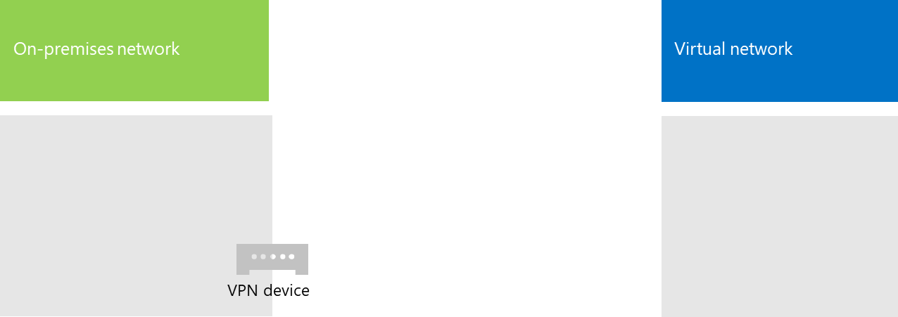

# <a name="connect-an-on-premises-network-to-a-microsoft-azure-virtual-network"></a>Conectar uma rede local a uma rede virtual do Microsoft Azure

Uma rede virtual entre locais do Azure está conectada à sua rede local, ampliando sua rede para incluir sub-redes e máquinas virtuais hospedadas em serviços na infraestrutura do Azure. Esta conexão permite que os computadores na sua rede local acessem diretamente máquinas virtuais no Azure e vice-versa. 

Por exemplo, um servidor de sincronização de diretório executando em uma máquina virtual do Azure precisa consultar seus controladores de domínio no local para alterações nas contas e sincronizar essas alterações com sua assinatura do Microsoft 365. Este artigo mostra como configurar uma rede virtual do Azure entre locais usando uma conexão VPN (rede virtual privada) de site a site que está pronta para hospedar máquinas virtuais do Azure.

## <a name="configure-a-cross-premises-azure-virtual-network"></a>Configurar uma rede virtual do Azure entre locais

Suas máquinas virtuais no Azure não precisam ser isoladas do seu ambiente local. Para conectar as máquinas virtuais do Azure aos recursos da sua rede local, é preciso configurar uma rede virtual do Azure entre locais. O diagrama a seguir mostra os componentes necessários para implantar uma rede virtual do Azure entre locais com uma máquina virtual no Azure.
  

 
No diagrama, há duas redes conectadas por uma conexão VPN site a site: a rede local e a rede virtual do Azure. A conexão VPN site a site:

- Ocorre entre dois pontos de extremidade endereçáveis ​​e localizados na Internet pública.
- É encerrada por um dispositivo VPN na rede local e um gateway VPN Azure na rede virtual do Azure.

A rede virtual do Azure hospeda máquinas virtuais. O tráfego originado das máquinas virtuais na rede virtual do Azure é encaminhado ao gateway VPN que, então, encaminha o tráfego pela conexão VPN site a site para o dispositivo VPN na rede local. A infraestrutura de roteamento da rede local encaminha então o tráfego ao seu destino.

>[!Note]
>Você também pode usar o [ExpressRoute](https://azure.microsoft.com/services/expressroute/), que é uma conexão direta entre sua organização e a rede da Microsoft. O tráfego pelo ExpressRoute não viaja pela Internet pública. Este artigo não descreve o uso do ExpressRoute.
>
  
Para configurar a conexão VPN entre a rede local e sua rede virtual do Azure, siga estas etapas: 
  
1. **Local** Defina e crie um roteamento de rede local para o espaço de endereço da rede virtual do Azure que aponte para o seu dispositivo VPN local.
    
2. **Microsoft Azure:** Crie uma rede virtual do Azure com uma conexão VPN site a site. 
    
3. **Local:** Configure o hardware ou software local de seu dispositivo VPN para encerrar a conexão VPN, que usa o protocolo IPsec (segurança).
    
Depois de estabelecer a conexão VPN de site a site, você pode adicionar máquinas virtuais do Azure às sub-redes da rede virtual.
  
## <a name="plan-your-azure-virtual-network"></a>Planejar sua rede virtual do Azure
<a name="PlanningVirtual"></a>

### <a name="prerequisites"></a>Pré-requisitos
<a name="Prerequisites"></a>

- Uma assinatura do Azure. Para saber mais sobre assinaturas do Azure, vá para a [página Como comprar o Azure](https://azure.microsoft.com/pricing/purchase-options/).
    
- Um espaço de endereço IPv4 privado disponível para atribuir à rede virtual e às suas sub-redes, com espaço suficiente para ampliação a fim de acomodar a quantidade de máquinas virtuais necessárias agora e no futuro.
    
- Um dispositivo VPN disponível em sua rede local para encerrar a conexão VPN site a site compatível com os requisitos para IPsec. Para saber mais, confira [VPN para conexões de rede virtual de site a site](https://go.microsoft.com/fwlink/p/?LinkId=393093).
    
- As alterações realizadas à sua infraestrutura de roteamento para que o tráfego direcionado ao espaço de endereço da rede virtual do Azure seja encaminhado para o dispositivo VPN que hospeda a conexão VPN site a site.
    
- Um proxy da Web que dê aos computadores conectados à rede local e à rede virtual do Azure acesso à Internet.
    
### <a name="solution-architecture-design-assumptions"></a>Suposições de design de arquitetura da solução

A lista a seguir representa as opções de design que foram feitas para a arquitetura dessa solução. 
  
- Essa solução usa uma única rede virtual do Azure com uma conexão VPN de site a site. A rede virtual do Azure hospeda uma única sub-rede que pode conter várias máquinas virtuais. 
    
- Você pode usar o RRAS (Serviço de Roteamento e Acesso Remoto) no Windows Server 2016 ou Windows Server 2012 para estabelecer uma conexão VPN IPsec de site a site entre a rede local e a rede virtual do Azure. Você também pode usar outras opções, como dispositivos VPN Cisco ou Juniper Networks.
    
- A rede local pode ainda ter serviços de rede como o AD (Active Directory) do Windows Server, o DNS (Sistema de Nomes de Domínio) e servidores proxy. Dependendo dos requisitos, pode ser vantajoso colocar alguns desses recursos de rede na rede virtual no Azure.
    
Para uma rede virtual do Azure existente com uma ou mais sub-redes, determine se há um espaço de endereço remanescente para uma sub-rede adicional a fim de hospedar as máquinas virtual necessárias, com base em seus requisitos. Se você não tem um espaço de endereço remanescente para uma sub-rede adicional, crie outra rede virtual que tenha sua própria conexão VPN site a site.
  
### <a name="plan-the-routing-infrastructure-changes-for-the-azure-virtual-network"></a>Planejar as alterações da infraestrutura de roteamento para a rede virtual do Azure

Você deve configurar sua infraestrutura de roteamento local para encaminhar o tráfego destinado ao espaço de endereço da rede virtual do Azure no dispositivo VPN local que hospeda a conexão VPN site a site.
  
O método exato de atualização da infraestrutura de roteamento depende de como você gerencia suas informações de roteamento, que pode ser:
  
- Atualizações da tabela de roteamento com base em configuração manual.
    
- Atualizações da tabela de roteamento com base em protocolos de roteamento, como protocolo RIP (Routing Information Protocol) ou protocolo OSPF (Open Shortest Path First).
    
Consulte seu especialista em roteamento para garantir que o tráfego destinado à rede virtual do Azure seja encaminhado ao dispositivo VPN local.
  
### <a name="plan-for-firewall-rules-for-traffic-to-and-from-the-on-premises-vpn-device"></a>Planejar regras de firewall para tráfego que entra e sai do dispositivo VPN local

Se seu dispositivo VPN está em uma rede de perímetro que tem um firewall entre a rede de perímetro e a Internet, pode ser necessário configurar o firewall com as seguintes regras para possibilitar a conexão VPN de site a site.
  
- Tráfego para o dispositivo VPN (vindo da Internet):
    
  - Endereço IP de destino do dispositivo VPN e protocolo IP 50
    
  - Endereço IP de destino do dispositivo VPN e porta de destino UDP 500
    
  - Endereço IP de destino do dispositivo VPN e porta de destino UDP 4500
    
- Tráfego do dispositivo VPN (indo para a Internet):
    
  - Endereço IP de origem do dispositivo VPN e protocolo IP 50
    
  - Endereço IP de origem do dispositivo VPN e porta de origem UDP 500
    
  - Endereço IP de origem do dispositivo VPN e porta de origem UDP 4500
    
### <a name="plan-for-the-private-ip-address-space-of-the-azure-virtual-network"></a>Planejar para um espaço de endereço IP privado da rede virtual do Azure

O espaço de endereço IP privado da rede virtual do Azure deve pode acomodar endereços usados pelo Azure para hospedar a rede virtual e ao menos uma sub-rede que tenha endereços suficientes para suas máquinas virtuais do Azure.
  
Para determinar a quantidade de endereços necessários para a sub-rede, conte o número de máquinas virtuais necessárias agora, estime o crescimento futuro e use a tabela a seguir para determinar o tamanho da sub-rede.
  
|**Número de máquinas virtuais necessárias**|**Número de bits de host necessário**|**Tamanho da sub-rede**|
|:-----|:-----|:-----|
|1 a 3  <br/> |3  <br/> |/29  <br/> |
|4 a 11  <br/> |4  <br/> |/28  <br/> |
|12 a 27  <br/> |5  <br/> |/27  <br/> |
|28 a 59  <br/> |6  <br/> |/26  <br/> |
|60 a 123  <br/> |7  <br/> |/25  <br/> |
   
### <a name="planning-worksheet-for-configuring-your-azure-virtual-network"></a>Planilha de planejamento para configurar sua rede virtual do Azure
<a name="worksheet"> </a>

Antes de criar uma rede virtual do Azure para hospedar máquinas virtuais, você deve determinar as configurações necessárias nas tabelas a seguir.
  
Para as configurações da rede virtual, preencha a Tabela V.
  
 **Tabela V: Configuração de rede virtual entre locais**
  
|**Item**|**Elemento Configuration**|**Descrição**|**Valor**|
|:-----|:-----|:-----|:-----|
|1.  <br/> |Nome da rede virtual  <br/> |Um nome a atribuir à rede virtual do Azure (por exemplo, DirSyncNet).  <br/> | |
|2.  <br/> |Local da rede virtual  <br/> |O datacenter do Azure que conterá a rede virtual (como Oeste dos EUA).  <br/> |  <br/> |
|3.  <br/> |Endereço IP do dispositivo VPN  <br/> |O endereço IPv4 público da interface de seu dispositivo VPN na Internet. Trabalhe com seu departamento de TI para determinar este endereço.  <br/> |  <br/> |
|4.  <br/> |Espaço de endereço da rede virtual  <br/> |O espaço de endereço (definido em um único prefixo de endereço privado) para a rede virtual. Trabalhe com seu departamento de TI para determinar este espaço de endereço. O espaço de endereço deve estar no formato Roteamento entre Domínios sem Classificação (CIDR), também conhecido como formato de prefixo de rede. 10.24.64.0/20 é um exemplo.  <br/> | <br/> |
|5.  <br/> |Chave compartilhada IPsec  <br/> |Uma cadeia alfanumérica aleatória com 32 caracteres, que será usada para autenticar ambos os lados da conexão VPN site a site. Trabalhe com seu departamento de TI ou de segurança para determinar este valor de chave e armazená-lo em um local seguro. Como alternativa, confira [Criar uma cadeia de caracteres aleatória para uma chave pré-compartilhada IPsec](https://social.technet.microsoft.com/wiki/contents/articles/32330.create-a-random-string-for-an-ipsec-preshared-key.aspx).<br/> | <br/> |
   
Preencha a Tabela S para as sub-redes desta solução.
  
- Para a primeira sub-rede, determine um espaço de endereço de 28 bits (com um comprimento de prefixo /28) para a sub-rede do gateway do Azure. Confira [Calcular o espaço de endereço da sub-rede do gateway para as redes virtuais do Azure](https://blogs.technet.microsoft.com/solutions_advisory_board/2016/12/01/calculating-the-gateway-subnet-address-space-for-azure-virtual-networks/) para instruções sobre como determinar este espaço de endereço.
    
- Para a segunda sub-rede, especifique um nome amigável, um único espaço de endereço IP com base no espaço de endereço da rede virtual e uma finalidade descritiva.
    
Trabalhe com seu departamento de TI para determinar esses espaços de endereço a partir do espaço de endereço da rede virtual. Ambos os espaços de endereço devem estar no formato CIDR.
  
 **Tabela S: Sub-redes na rede virtual**
  
|**Item**|**Nome da sub-rede**|**Espaço de endereço da sub-rede**|**Objetivo**|
|:-----|:-----|:-----|:-----|
|1.  <br/> |GatewaySubnet  <br/> |  <br/> |A sub-rede usada pelo gateway do Azure.  <br/> |
|2.  <br/> |  <br/> |  <br/> |  <br/> |
   
Para servidores de DNS locais que você deseja que sejam usados pelas máquinas virtuais da rede virtual, preencha a Tabela D. Dê a cada servidor DNS um nome amigável e um único endereço IP. Esse nome amigável não precisa corresponder ao nome do host ou ao nome do computador do servidor DNS. Observe que duas entradas em branco estão listadas, mas você pode adicionar mais. Trabalhe com seu departamento de TI para determinar esta lista.
  
 **Tabela D: servidores DNS locais**
  
|**Item**|**Nome amigável do servidor DNS**|**Endereço IP do servidor DNS**|
|:-----|:-----|:-----|
|1.  <br/> |  <br/> |  <br/> |
|2.  <br/> |  <br/> |  <br/> |
   
Para direcionar os pacotes da rede virtual do Azure para a rede de sua organização por uma conexão VPN de site a site, é preciso configurar a rede virtual com uma rede local. Essa rede local contém uma lista de espaços de endereço (no formato CIDR) para todos os locais da rede local de sua organização que as máquinas virtuais da rede virtual devem acessar. Essa lista pode conter todos os locais na rede ou em uma sub-rede locais. A lista de espaços de endereço que define sua rede local deve ser exclusiva e não deve coincidir com os espaços de endereço usados para essa rede virtual ou suas outras redes virtuais entre locais.
  
Para o conjunto de espaços de endereço da rede local, preencha a Tabela L. Observe que há três entradas em branco listadas, mas geralmente você precisará de mais. Trabalhe com seu departamento de TI para determinar esta lista.
  
 **Tabela L: Prefixos de endereço para a rede local**
  
|**Item**|**Espaço de endereço da rede local**|
|:-----|:-----|
|1.  <br/> |  <br/> |
|2.  <br/> |  <br/> |
|3.  <br/> |  <br/> |
   
## <a name="deployment-roadmap"></a>Roteiro de implantação
<a name="DeploymentRoadmap"> </a>

A criação da rede virtual entre locais e a adição de máquinas virtuais no Azure tem três fases:
  
- Fase 1: Preparar sua rede local.
    
- Fase 2: Criar a rede virtual entre locais no Azure.
    
- Fase 3 (Opcional): Adicionar máquinas virtuais.
    
### <a name="phase-1-prepare-your-on-premises-network"></a>Fase 1: Preparar sua rede local
<a name="Phase1"></a>

Você deve configurar sua rede local com uma rota que aponte e, por fim, gere tráfego destinado para o espaço de endereço da rede virtual ao roteador na borda da rede local. Confira o administrador da rede para determinar como adicionar a rota à infraestrutura de roteamento da rede local.
  
Esta é a configuração resultante.
  

  
### <a name="phase-2-create-the-cross-premises-virtual-network-in-azure"></a>Fase 2: criar a rede virtual entre locais no Azure
<a name="Phase2"></a>

Primeiro, abra um prompt do Azure PowerShell. Se o Azure PowerShell ainda não estiver instalado, confira [Introdução ao Azure PowerShell](https://docs.microsoft.com/powershell/azure/get-started-azureps).

 
Em seguida, entre com sua conta do Azure usando este comando.
  
```powershell
Connect-AzAccount
```

Para obter o nome de sua assinatura, use este comando.
  
```powershell
Get-AzSubscription | Sort SubscriptionName | Select SubscriptionName
```

Defina sua assinatura do Azure com esses comandos. Substitua tudo o que está entre aspas, incluindo os caracteres < e >, pelo nome de assinatura correto.
  
```powershell
$subscrName="<subscription name>"
Select-AzSubscription -SubscriptionName $subscrName
```

Depois, crie um novo grupo de recursos para sua rede virtual. Para determinar um nome de grupo de recursos exclusivo, use este comando para listar os grupos de recurso existentes.
  
```powershell
Get-AzResourceGroup | Sort ResourceGroupName | Select ResourceGroupName
```

Crie o novo grupo de recursos com estes comandos.
  
```powershell
$rgName="<resource group name>"
$locName="<Table V - Item 2 - Value column>"
New-AzResourceGroup -Name $rgName -Location $locName
```

Em seguida, crie a rede virtual do Azure.
  
```powershell
# Fill in the variables from previous values and from Tables V, S, and D
$rgName="<name of your new resource group>"
$locName="<Azure location of your new resource group>"
$vnetName="<Table V - Item 1 - Value column>"
$vnetAddrPrefix="<Table V - Item 4 - Value column>"
$gwSubnetPrefix="<Table S - Item 1 - Subnet address space column>"
$SubnetName="<Table S - Item 2 - Subnet name column>"
$SubnetPrefix="<Table S - Item 2 - Subnet address space column>"
$dnsServers=@( "<Table D - Item 1 - DNS server IP address column>", "<Table D - Item 2 - DNS server IP address column>" )
$locShortName=(Get-AzResourceGroup -Name $rgName).Location

# Create the Azure virtual network and a network security group that allows incoming remote desktop connections to the subnet that is hosting virtual machines
$gatewaySubnet=New-AzVirtualNetworkSubnetConfig -Name "GatewaySubnet" -AddressPrefix $gwSubnetPrefix
$vmSubnet=New-AzVirtualNetworkSubnetConfig -Name $SubnetName -AddressPrefix $SubnetPrefix
New-AzVirtualNetwork -Name $vnetName -ResourceGroupName $rgName -Location $locName -AddressPrefix $vnetAddrPrefix -Subnet $gatewaySubnet,$vmSubnet -DNSServer $dnsServers
$rule1=New-AzNetworkSecurityRuleConfig -Name "RDPTraffic" -Description "Allow RDP to all VMs on the subnet" -Access Allow -Protocol Tcp -Direction Inbound -Priority 100 -SourceAddressPrefix Internet -SourcePortRange * -DestinationAddressPrefix * -DestinationPortRange 3389
New-AzNetworkSecurityGroup -Name $SubnetName -ResourceGroupName $rgName -Location $locShortName -SecurityRules $rule1
$vnet=Get-AzVirtualNetwork -ResourceGroupName $rgName -Name $vnetName
$nsg=Get-AzNetworkSecurityGroup -Name $SubnetName -ResourceGroupName $rgName
Set-AzVirtualNetworkSubnetConfig -VirtualNetwork $vnet -Name $SubnetName -AddressPrefix $SubnetPrefix -NetworkSecurityGroup $nsg
$vnet | Set-AzVirtualNetwork
```

Esta é a configuração resultante.
  

  
Em seguida, use estes comandos para criar os gateways para a conexão VPN site a site.
  
```powershell
# Fill in the variables from previous values and from Tables V and L
$vnetName="<Table V - Item 1 - Value column>"
$localGatewayIP="<Table V - Item 3 - Value column>"
$localNetworkPrefix=@( <comma-separated, double-quote enclosed list of the local network address prefixes from Table L, example: "10.1.0.0/24", "10.2.0.0/24"> )
$vnetConnectionKey="<Table V - Item 5 - Value column>"
$vnet=Get-AzVirtualNetwork -Name $vnetName -ResourceGroupName $rgName
# Attach a virtual network gateway to a public IP address and the gateway subnet
$publicGatewayVipName="PublicIPAddress"
$vnetGatewayIpConfigName="PublicIPConfig"
New-AzPublicIpAddress -Name $vnetGatewayIpConfigName -ResourceGroupName $rgName -Location $locName -AllocationMethod Dynamic
$publicGatewayVip=Get-AzPublicIpAddress -Name $vnetGatewayIpConfigName -ResourceGroupName $rgName
$vnetGatewayIpConfig=New-AzVirtualNetworkGatewayIpConfig -Name $vnetGatewayIpConfigName -PublicIpAddressId $publicGatewayVip.Id -SubnetId $vnet.Subnets[0].Id
# Create the Azure gateway
$vnetGatewayName="AzureGateway"
$vnetGateway=New-AzVirtualNetworkGateway -Name $vnetGatewayName -ResourceGroupName $rgName -Location $locName -GatewayType Vpn -VpnType RouteBased -IpConfigurations $vnetGatewayIpConfig
# Create the gateway for the local network
$localGatewayName="LocalNetGateway"
$localGateway=New-AzLocalNetworkGateway -Name $localGatewayName -ResourceGroupName $rgName -Location $locName -GatewayIpAddress $localGatewayIP -AddressPrefix $localNetworkPrefix
# Create the Azure virtual network VPN connection
$vnetConnectionName="S2SConnection"
$vnetConnection=New-AzVirtualNetworkGatewayConnection -Name $vnetConnectionName -ResourceGroupName $rgName -Location $locName -ConnectionType IPsec -SharedKey $vnetConnectionKey -VirtualNetworkGateway1 $vnetGateway -LocalNetworkGateway2 $localGateway
```

Esta é a configuração resultante.
  

  
Em seguida, configure seu dispositivo VPN local para se conectar ao gateway de VPN do Azure. Para saber mais, confira [Sobre dispositivos VPN para conexões de rede virtual do Azure de site a site](https://docs.microsoft.com/azure/vpn-gateway/vpn-gateway-about-vpn-devices).
  
Para configurar seu dispositivo VPN, você precisará do seguinte:
  
- O endereço IPv4 público do gateway VPN do Azure para sua rede virtual. Use o comando **Get-AzPublicIpAddress -Name $vnetGatewayIpConfigName -ResourceGroupName $rgName** para exibir este endereço.
    
- A chave IPsec pré-compartilhada para a conexão VPN site a site (Tabela V – Item 5 – coluna Valor).
    
Esta é a configuração resultante.
  

  
### <a name="phase-3-optional-add-virtual-machines"></a>Fase 3 (Opcional): Adicionar máquinas virtuais

Crie as máquinas virtuais de que você precisa no Azure. Para saber mais, confira [Criar uma máquina virtual do Windows com o portal do Azure](https://go.microsoft.com/fwlink/p/?LinkId=393098).
  
Use as seguintes configurações:
  
- Na guia **Básico**, selecione a mesma assinatura e grupo de recursos como sua rede virtual. Você precisará dessas informações posteriormente para entrar na máquina virtual. Na seção **Detalhes da instância**, escolha o tamanho apropriado da máquina virtual. Registre o nome de usuário de conta de administrador e a senha em local seguro. 
    
- Na guia **Rede**, escolha o nome da rede e da sub-rede virtuais para hospedar máquinas virtuais (não a GatewaySubnet). Deixe todas as configurações com os valores padrão.
    
Verifique se a máquina virtual está usando o DNS corretamente (examine o DNS interno) para garantir que os registros de Endereço (A) foram adicionados à sua nova máquina virtual. Para acessar a Internet, suas máquinas virtuais do Azure devem estar configuradas para usar o servidor proxy da sua rede local. Entre em contato com o administrador da rede para etapas de configuração adicionais a executar no servidor.
  
Esta é a configuração resultante.
  

  
## <a name="next-step"></a>Próxima etapa
  
[Implantar a sincronização de diretórios do Microsoft 365 no Microsoft Azure](deploy-microsoft-365-directory-synchronization-dirsync-in-microsoft-azure.md)
