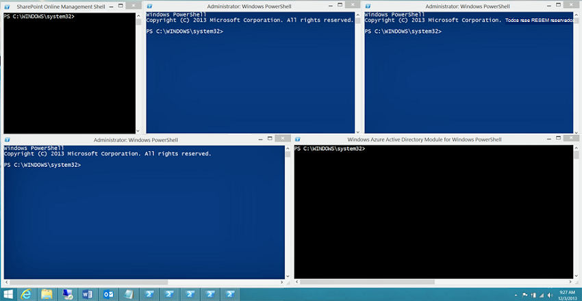

# <a name="connect-to-all-microsoft-365-services-in-a-single-windows-powershell-window"></a><span data-ttu-id="5a3bf-103">Conectar-se a todos os serviços do Microsoft 365 usando uma única janela do PowerShell do Windows</span><span class="sxs-lookup"><span data-stu-id="5a3bf-103">Connect to all Microsoft 365 services in a single Windows PowerShell window</span></span>

<span data-ttu-id="5a3bf-104">Quando você usa o PowerShell para gerenciar o Microsoft 365, é possível ter até cinco sessões diferentes do PowerShell do Windows abertas ao mesmo tempo, correspondentes ao Centro de Administração do Microsoft 365, ao SharePoint Online, ao Exchange Online, ao Skype for Business Online, ao Microsoft Teams e ao Centro de Conformidade &amp; Segurança.</span><span class="sxs-lookup"><span data-stu-id="5a3bf-104">When you use PowerShell to manage Microsoft 365, it is possible to have up to five different Windows PowerShell sessions open at the same time corresponding to Microsoft 365 admin center, SharePoint Online, Exchange Online, Skype for Business Online, Microsoft Teams, and the Security &amp; Compliance Center.</span></span> <span data-ttu-id="5a3bf-105">Com cinco métodos de conexão diferentes em sessões separadas do PowerShell do Windows, sua área de trabalho poderia ficar assim:</span><span class="sxs-lookup"><span data-stu-id="5a3bf-105">With five different connection methods in separate Windows PowerShell sessions, your desktop could look like this:</span></span>
  

  
<span data-ttu-id="5a3bf-107">Não é uma forma ideal de gerenciar o Microsoft 365 porque não é possível trocar dados entre essas cinco janelas para o gerenciamento de diversos serviços.</span><span class="sxs-lookup"><span data-stu-id="5a3bf-107">This is not optimal for managing Microsoft 365 because you can't exchange data among those five windows for cross-service management.</span></span> <span data-ttu-id="5a3bf-108">Este tópico descreve como usar uma única instância do PowerShell do Windows a partir da qual você pode gerenciar suas contas do Microsoft 365, do Skype for Business Online, do Exchange Online, do SharePoint Online, do Microsoft Teams e do Centro de Conformidade &amp; Segurança.</span><span class="sxs-lookup"><span data-stu-id="5a3bf-108">This topic describes how to use a single instance of Windows PowerShell from which you can manage Microsoft 365 accounts, Skype for Business Online, Exchange Online, SharePoint Online, Microsoft Teams, and the Security &amp; Compliance Center.</span></span>

>[!Note]
><span data-ttu-id="5a3bf-109">Atualmente este artigo contém apenas os comandos necessários para se conectar com a nuvem Mundial (+GCC).</span><span class="sxs-lookup"><span data-stu-id="5a3bf-109">This article currently only contains the commands to connect to the Worldwide (+GCC) cloud.</span></span> <span data-ttu-id="5a3bf-110">As observações adicionais fornecem os links para artigos que contêm informações sobre como se conectar a outras nuvens do Microsoft 365.</span><span class="sxs-lookup"><span data-stu-id="5a3bf-110">Additional notes provide links to articles with information about connecting to the other Microsoft 365 clouds.</span></span>
>

## <a name="before-you-begin"></a><span data-ttu-id="5a3bf-111">Antes de começar</span><span class="sxs-lookup"><span data-stu-id="5a3bf-111">Before you begin</span></span>

<span data-ttu-id="5a3bf-112">Antes que você possa gerenciar o Microsoft 365 inteiro a partir de uma única instância do PowerShell do Windows, considere os seguinte pré-requisitos:</span><span class="sxs-lookup"><span data-stu-id="5a3bf-112">Before you can manage all of Microsoft 365 from a single instance of Windows PowerShell, consider the following prerequisites:</span></span>
  
- <span data-ttu-id="5a3bf-113">A conta corporativa ou de estudante do Microsoft 365 que você usa para esses procedimentos precisa ser membro de uma função de administrador do Microsoft 365.</span><span class="sxs-lookup"><span data-stu-id="5a3bf-113">The Microsoft 365 work or school account that you use for these procedures needs to be a member of a Microsoft 365 admin role.</span></span> <span data-ttu-id="5a3bf-114">Para obter mais informações, confira o artigo [Sobre funções de administrador](https://docs.microsoft.com/microsoft-365/admin/add-users/about-admin-roles?view=o365-worldwide).</span><span class="sxs-lookup"><span data-stu-id="5a3bf-114">For more information, see [About admin roles](https://docs.microsoft.com/microsoft-365/admin/add-users/about-admin-roles?view=o365-worldwide).</span></span> <span data-ttu-id="5a3bf-115">Isso é obrigatório para o PowerShell no Microsoft 365, mas não necessariamente para todos os demais serviços do Microsoft 365.</span><span class="sxs-lookup"><span data-stu-id="5a3bf-115">This a requirement for PowerShell for Microsoft 365, not necessarily for all other Microsoft 365 services.</span></span>
    
- <span data-ttu-id="5a3bf-116">Você pode usar as seguintes versões de 64 bits do Windows:</span><span class="sxs-lookup"><span data-stu-id="5a3bf-116">You can use the following 64-bit versions of Windows:</span></span>
    
  - <span data-ttu-id="5a3bf-117">Windows 10</span><span class="sxs-lookup"><span data-stu-id="5a3bf-117">Windows 10</span></span>
    
  - <span data-ttu-id="5a3bf-118">Windows 8.1 ou Windows 8</span><span class="sxs-lookup"><span data-stu-id="5a3bf-118">Windows 8.1 or Windows 8</span></span>
    
  - <span data-ttu-id="5a3bf-119">Windows Server 2019</span><span class="sxs-lookup"><span data-stu-id="5a3bf-119">Windows Server 2019</span></span>
    
  - <span data-ttu-id="5a3bf-120">Windows Server 2016</span><span class="sxs-lookup"><span data-stu-id="5a3bf-120">Windows Server 2016</span></span>
    
  - <span data-ttu-id="5a3bf-121">Windows Server 2012 R2 ou Windows Server 2012</span><span class="sxs-lookup"><span data-stu-id="5a3bf-121">Windows Server 2012 R2 or Windows Server 2012</span></span>
    
  - <span data-ttu-id="5a3bf-122">Windows 7 Service Pack 1 (SP1)\*</span><span class="sxs-lookup"><span data-stu-id="5a3bf-122">Windows 7 Service Pack 1 (SP1)\*</span></span>
    
  - <span data-ttu-id="5a3bf-123">Windows Server 2008 R2 SP1\*</span><span class="sxs-lookup"><span data-stu-id="5a3bf-123">Windows Server 2008 R2 SP1\*</span></span>
    
    <span data-ttu-id="5a3bf-124">\*É necessário instalar o Microsoft .NET Framework 4.5.*x* e, em seguida, o Windows Management Framework 3.0 ou o Windows Management Framework 4.0.</span><span class="sxs-lookup"><span data-stu-id="5a3bf-124">\* You need to install the Microsoft .NET Framework 4.5.*x* and then either the Windows Management Framework 3.0 or the Windows Management Framework 4.0.</span></span> <span data-ttu-id="5a3bf-125">Para obter mais informações, consulte [Instalar o .NET Framework](https://go.microsoft.com/fwlink/p/?LinkId=257868) e [Windows Management 3.0](https://go.microsoft.com/fwlink/p/?LinkId=272757), ou o [Windows Management Framework 4.0](https://go.microsoft.com/fwlink/p/?LinkId=391344).</span><span class="sxs-lookup"><span data-stu-id="5a3bf-125">For more information, see [Installing the .NET Framework](https://go.microsoft.com/fwlink/p/?LinkId=257868) and [Windows Management Framework 3.0](https://go.microsoft.com/fwlink/p/?LinkId=272757) or [Windows Management Framework 4.0](https://go.microsoft.com/fwlink/p/?LinkId=391344).</span></span>
    
    <span data-ttu-id="5a3bf-126">É preciso usar a versão de 64 bits do Windows devido aos requisitos do módulo do Skype for Business Online e de um dos módulos do Microsoft 365.</span><span class="sxs-lookup"><span data-stu-id="5a3bf-126">You need to use a 64-bit version of Windows because of the requirements for the Skype for Business Online module and one of the Microsoft 365 modules.</span></span>
    
- <span data-ttu-id="5a3bf-127">É preciso instalar os módulos necessários para o Azure Active Directory (Azure AD), o Exchange Online, o SharePoint Online, o Skype for Business Online e o Teams:</span><span class="sxs-lookup"><span data-stu-id="5a3bf-127">You need to install the modules that are required for Azure Active Directory (Azure AD), Exchange Online, SharePoint Online, Skype for Business Online and Teams:</span></span>
    
   - [<span data-ttu-id="5a3bf-128">Azure Active Directory V2</span><span class="sxs-lookup"><span data-stu-id="5a3bf-128">Azure Active Directory V2</span></span>](connect-to-microsoft-365-powershell.md#connect-with-the-azure-active-directory-powershell-for-graph-module)
   - [<span data-ttu-id="5a3bf-129">Shell de Gerenciamento do SharePoint Online</span><span class="sxs-lookup"><span data-stu-id="5a3bf-129">SharePoint Online Management Shell</span></span>](https://go.microsoft.com/fwlink/p/?LinkId=255251)
   - [<span data-ttu-id="5a3bf-130">Skype for Business Online, Módulo do PowerShell do Windows</span><span class="sxs-lookup"><span data-stu-id="5a3bf-130">Skype for Business Online, Windows PowerShell Module</span></span>](https://go.microsoft.com/fwlink/p/?LinkId=532439)
   - [<span data-ttu-id="5a3bf-131">PowerShell do Exchange Online V2</span><span class="sxs-lookup"><span data-stu-id="5a3bf-131">Exchange Online PowerShell V2</span></span>](https://docs.microsoft.com/powershell/exchange/exchange-online/exchange-online-powershell-v2/exchange-online-powershell-v2?view=exchange-ps#install-and-maintain-the-exchange-online-powershell-v2-module)
   - [<span data-ttu-id="5a3bf-132">Visão Geral do PowerShell do Teams</span><span class="sxs-lookup"><span data-stu-id="5a3bf-132">Teams PowerShell Overview</span></span>](https://docs.microsoft.com/microsoftteams/teams-powershell-overview)
    
-  <span data-ttu-id="5a3bf-133">O PowerShell do Windows precisa ser configurado para executar os scripts assinados do Skype for Business Online e do Centro de Conformidade &amp; Segurança.</span><span class="sxs-lookup"><span data-stu-id="5a3bf-133">Windows PowerShell needs to be configured to run signed scripts for Skype for Business Online and the Security &amp; Compliance Center.</span></span> <span data-ttu-id="5a3bf-134">Para fazer isso, execute o comando a seguir em uma janela elevada do PowerShell do Windows (uma janela do PowerShell do Windows que você abre quando seleciona **Executar como administrador**):</span><span class="sxs-lookup"><span data-stu-id="5a3bf-134">To do this, run the following command in an elevated Windows PowerShell session (a Windows PowerShell window you open by selecting **Run as administrator**).</span></span>
    
   ```powershell
   Set-ExecutionPolicy RemoteSigned
   ```

## <a name="connection-steps-when-using-just-a-password"></a><span data-ttu-id="5a3bf-135">Etapas de conexão quando estiver usando apenas uma senha</span><span class="sxs-lookup"><span data-stu-id="5a3bf-135">Connection steps when using just a password</span></span>

<span data-ttu-id="5a3bf-136">Estas são as etapas para se conectar a todos os serviços em uma única janela do PowerShell quando você estiver usando apenas uma senha para entrar.</span><span class="sxs-lookup"><span data-stu-id="5a3bf-136">Here are the steps to connect to all the services in a single PowerShell window when you are using just a password for sign-in.</span></span>
  
1. <span data-ttu-id="5a3bf-137">Abra o PowerShell do Windows.</span><span class="sxs-lookup"><span data-stu-id="5a3bf-137">Open Windows PowerShell.</span></span>
    
2. <span data-ttu-id="5a3bf-138">Execute este comando e digite as credenciais da sua conta corporativa ou de estudante do Microsoft 365.</span><span class="sxs-lookup"><span data-stu-id="5a3bf-138">Run this command and enter your Microsoft 365 work or school account credentials.</span></span>
    
   ```powershell
   $credential = Get-Credential
   ```

3. <span data-ttu-id="5a3bf-139">Execute este comando para se conectar ao Azure AD usando o PowerShell do Azure Active Directory para o módulo Gráfico.</span><span class="sxs-lookup"><span data-stu-id="5a3bf-139">Run this command to connect to Azure AD using the Azure Active Directory PowerShell for Graph module.</span></span>
    
   ```powershell
   Connect-AzureAD -Credential $credential
   ```
  
   <span data-ttu-id="5a3bf-140">Alternativamente, se você estiver usando o Módulo do Microsoft Azure Active Directory para o módulo PowerShell do Windows, execute este comando.</span><span class="sxs-lookup"><span data-stu-id="5a3bf-140">Alternately, if you are using the Microsoft Azure Active Directory Module for Windows PowerShell module, run this command.</span></span>
      
   ```powershell
   Connect-MsolService -Credential $credential
   ```

   > [!Note]
   > <span data-ttu-id="5a3bf-141">O PowerShell Core não é compatível com o módulo do Microsoft Azure Active Directory para módulo e cmdlets do Windows PowerShell com **MSol** no nome.</span><span class="sxs-lookup"><span data-stu-id="5a3bf-141">PowerShell Core does not support the Microsoft Azure Active Directory Module for Windows PowerShell module and cmdlets with **Msol** in their name.</span></span> <span data-ttu-id="5a3bf-142">Para continuar usando esses cmdlets, você deve executá-los a partir do Windows PowerShell.</span><span class="sxs-lookup"><span data-stu-id="5a3bf-142">To continue using these cmdlets, you must run them from Windows PowerShell.</span></span>

4. <span data-ttu-id="5a3bf-143">Execute estes comandos para se conectar ao SharePoint Online.</span><span class="sxs-lookup"><span data-stu-id="5a3bf-143">Run these commands to connect to SharePoint Online.</span></span> <span data-ttu-id="5a3bf-144">Especifique o nome da organização para o seu domínio.</span><span class="sxs-lookup"><span data-stu-id="5a3bf-144">Specify the organization name for your domain.</span></span> <span data-ttu-id="5a3bf-145">Por exemplo, para "litwareinc.onmicrosoft.com" o valor nome da organização é "litwareinc".</span><span class="sxs-lookup"><span data-stu-id="5a3bf-145">For example, for "litwareinc.onmicrosoft.com", the  organization name value is "litwareinc".</span></span>
    
   ```powershell
   $orgName="<for example, litwareinc for litwareinc.onmicrosoft.com>"
   Connect-SPOService -Url https://$orgName-admin.sharepoint.com -Credential $userCredential
   ```

5. <span data-ttu-id="5a3bf-146">Execute estes comandos para se conectar ao Skype for Business Online.</span><span class="sxs-lookup"><span data-stu-id="5a3bf-146">Run these commands to connect to Skype for Business Online.</span></span> <span data-ttu-id="5a3bf-147">Um aviso sobre o aumento do valor de `WSMan NetworkDelayms` é esperado na primeira vez que você se conectar e deve ser ignorado.</span><span class="sxs-lookup"><span data-stu-id="5a3bf-147">A warning about increasing the `WSMan NetworkDelayms` value is expected the first time you connect and should be ignored.</span></span>
     
   ```powershell
   Import-Module SkypeOnlineConnector
   $sfboSession = New-CsOnlineSession -Credential $credential
   Import-PSSession $sfboSession
   ```

6. <span data-ttu-id="5a3bf-148">Execute este comando para se conectar ao Exchange Online.</span><span class="sxs-lookup"><span data-stu-id="5a3bf-148">Run this command to connect to Exchange Online.</span></span>
    
   ```powershell
   Connect-ExchangeOnline -Credential $credential -ShowProgress $true
   ```

   > [!Note]
   > <span data-ttu-id="5a3bf-149">Para se conectar às nuvens do Exchange Online para Microsoft 365 que não sejam Mundiais, use o parâmetro **-ExchangeEnvironmentName**.</span><span class="sxs-lookup"><span data-stu-id="5a3bf-149">To connect to Exchange Online for Microsoft 365 clouds other than Worldwide, use the **-ExchangeEnvironmentName** parameter.</span></span> <span data-ttu-id="5a3bf-150">Confira o artigo [Conectar-se ao ExchangeOnline](https://docs.microsoft.com/powershell/module/exchange/powershell-v2-module/connect-exchangeonline?view=exchange-ps) para obter mais informações.</span><span class="sxs-lookup"><span data-stu-id="5a3bf-150">See [Connect-ExchangeOnline](https://docs.microsoft.com/powershell/module/exchange/powershell-v2-module/connect-exchangeonline?view=exchange-ps) for more information.</span></span>

7. <span data-ttu-id="5a3bf-151">Execute estes comandos para se conectar ao PowerShell do Teams.</span><span class="sxs-lookup"><span data-stu-id="5a3bf-151">Run these commands to connect to Teams PowerShell.</span></span>
    
   ```powershell
   Import-Module MicrosoftTeams
   Connect-MicrosoftTeams -Credential $credential
   ```
  
   > [!Note]
   > <span data-ttu-id="5a3bf-152">Para se conectar às nuvens do Microsoft Teams que não sejam Mundiais, confira o artigo [Conectar-se ao MicrosoftTeams](https://docs.microsoft.com/powershell/module/teams/connect-microsoftteams?view=teams-ps).</span><span class="sxs-lookup"><span data-stu-id="5a3bf-152">To connect to Microsoft Teams clouds other than Worldwide, see [Connect-MicrosoftTeams](https://docs.microsoft.com/powershell/module/teams/connect-microsoftteams?view=teams-ps).</span></span>

8. <span data-ttu-id="5a3bf-153">Execute estes comandos para se conectar ao Centro de Conformidade &amp; Segurança.</span><span class="sxs-lookup"><span data-stu-id="5a3bf-153">Run these commands to connect to the Security &amp; Compliance Center.</span></span>
    
   ```powershell
   $SccSession = New-PSSession -ConfigurationName Microsoft.Exchange -ConnectionUri https://ps.compliance.protection.outlook.com/powershell-liveid/ -Credential $credential -Authentication "Basic" -AllowRedirection
   Import-PSSession $SccSession -Prefix cc
   ```

   > [!Note]
   > <span data-ttu-id="5a3bf-154">Para se conectar às nuvens do Centro de Conformidade &amp; Segurança do Microsoft 365 que não sejam Mundiais, confira o artigo [Conectar-se ao PowerShell do Centro de Conformidade & Segurança](https://docs.microsoft.com/powershell/exchange/office-365-scc/connect-to-scc-powershell/connect-to-scc-powershell).</span><span class="sxs-lookup"><span data-stu-id="5a3bf-154">To connect to the Security &amp; Compliance Center for Microsoft 365 clouds other than Worldwide, see [Connect to Security & Compliance Center PowerShell](https://docs.microsoft.com/powershell/exchange/office-365-scc/connect-to-scc-powershell/connect-to-scc-powershell).</span></span>

<span data-ttu-id="5a3bf-155">Aqui estão todos os comandos em um único bloco quando estiver usando o PowerShell do Azure Active Directory para o módulo Gráfico.</span><span class="sxs-lookup"><span data-stu-id="5a3bf-155">Here are all the commands in a single block when using the Azure Active Directory PowerShell for Graph module.</span></span> <span data-ttu-id="5a3bf-156">Especifique o nome do seu host de domínio e, em seguida, execute todos eles ao mesmo tempo.</span><span class="sxs-lookup"><span data-stu-id="5a3bf-156">Specify the name of your domain host, and then run them all at one time.</span></span>
  
```powershell
$orgName="<for example, litwareinc for litwareinc.onmicrosoft.com>"
$credential = Get-Credential
Connect-AzureAD -Credential $credential
Import-Module Microsoft.Online.SharePoint.PowerShell -DisableNameChecking
Connect-SPOService -Url https://$orgName-admin.sharepoint.com -credential $credential
Import-Module SkypeOnlineConnector
$sfboSession = New-CsOnlineSession -Credential $credential
Import-PSSession $sfboSession
$SccSession = New-PSSession -ConfigurationName Microsoft.Exchange -ConnectionUri https://ps.compliance.protection.outlook.com/powershell-liveid/ -Credential $credential -Authentication "Basic" -AllowRedirection
Import-PSSession $SccSession -Prefix cc
Connect-ExchangeOnline -Credential $credential -ShowProgress $true
Import-Module MicrosoftTeams
Connect-MicrosoftTeams -Credential $credential
```

<span data-ttu-id="5a3bf-157">Alternativamente, aqui estão todos os comandos em um único bloco se você estiver usando o Módulo do Microsoft Azure Active Directory para o módulo PowerShell do Windows.</span><span class="sxs-lookup"><span data-stu-id="5a3bf-157">Alternately, here are all the commands in a single block when using the Microsoft Azure Active Directory Module for Windows PowerShell module.</span></span> <span data-ttu-id="5a3bf-158">Especifique o nome do seu host de domínio e, em seguida, execute todos eles ao mesmo tempo.</span><span class="sxs-lookup"><span data-stu-id="5a3bf-158">Specify the name of your domain host, and then run them all at one time.</span></span>
  
```powershell
$orgName="<for example, litwareinc for litwareinc.onmicrosoft.com>"
$credential = Get-Credential
Connect-MsolService -Credential $credential
Import-Module Microsoft.Online.SharePoint.PowerShell -DisableNameChecking
Connect-SPOService -Url https://$orgName-admin.sharepoint.com -credential $credential
Import-Module SkypeOnlineConnector
$sfboSession = New-CsOnlineSession -Credential $credential
Import-PSSession $sfboSession
$SccSession = New-PSSession -ConfigurationName Microsoft.Exchange -ConnectionUri https://ps.compliance.protection.outlook.com/powershell-liveid/ -Credential $credential -Authentication "Basic" -AllowRedirection
Import-PSSession $SccSession -Prefix cc
Connect-ExchangeOnline -Credential $credential -ShowProgress $true
Import-Module MicrosoftTeams
Connect-MicrosoftTeams -Credential $credential
```

<span data-ttu-id="5a3bf-159">Quando estiver pronto para fechar a janela do PowerShell do Windows, execute este comando para remover as sessões ativas do Skype for Business Online, SharePoint Online, Centro de Conformidade &amp; Segurança e Teams:</span><span class="sxs-lookup"><span data-stu-id="5a3bf-159">When you are ready to close down the Windows PowerShell window, run this command to remove the active sessions to Skype for Business Online, SharePoint Online, the Security &amp; Compliance Center, and Teams:</span></span>
  
```powershell
Remove-PSSession $sfboSession ; Remove-PSSession $SccSession ; Disconnect-SPOService ; Disconnect-MicrosoftTeams 
```

## <a name="connection-steps-when-using-multi-factor-authentication"></a><span data-ttu-id="5a3bf-160">Etapas de conexão quando estiver usando a autenticação multifator</span><span class="sxs-lookup"><span data-stu-id="5a3bf-160">Connection steps when using multi-factor authentication</span></span>

<span data-ttu-id="5a3bf-161">Aqui estão todos os comandos em um único bloco para se conectar ao Azure AD, SharePoint Online, Skype for Business, Exchange Online e Teams usando uma autenticação multifator em uma única janela usando o PowerShell do Azure Active Directory para o módulo Gráfico.</span><span class="sxs-lookup"><span data-stu-id="5a3bf-161">Here are all the commands in a single block to connect to Azure AD, SharePoint Online, Skype for Business, Exchange Online, and Teams using multi-factor authentication in a single window using the Azure Active Directory PowerShell for Graph module.</span></span> <span data-ttu-id="5a3bf-162">Especifique o nome do usuário principal (UPN) de uma conta de usuário e o nome do seu host de domínio e, em seguida, execute todos eles de uma só vez.</span><span class="sxs-lookup"><span data-stu-id="5a3bf-162">Specify the user principal name (UPN) name of a user account and your domain host name, and then run them all at one time.</span></span>

```powershell
$acctName="<UPN of the account, such as belindan@litwareinc.onmicrosoft.com>"
$orgName="<for example, litwareinc for litwareinc.onmicrosoft.com>"
#Azure Active Directory
Connect-AzureAD
#SharePoint Online
Connect-SPOService -Url https://$orgName-admin.sharepoint.com
#Skype for Business Online
$sfboSession = New-CsOnlineSession -UserName $acctName
Import-PSSession $sfboSession
#Exchange Online
Connect-ExchangeOnline -UserPrincipalName $acctName -ShowProgress $true
#Teams
Import-Module MicrosoftTeams
Connect-MicrosoftTeams
```

<span data-ttu-id="5a3bf-163">Alternativamente, aqui estão todos os comandos se você estiver usando o Módulo do Microsoft Azure Active Directory para o módulo PowerShell do Windows.</span><span class="sxs-lookup"><span data-stu-id="5a3bf-163">Alternately, here are all the commands when using the Microsoft Azure Active Directory Module for Windows PowerShell module.</span></span>

```powershell
$acctName="<UPN of the account, such as belindan@litwareinc.onmicrosoft.com>"
$orgName="<for example, litwareinc for litwareinc.onmicrosoft.com>"
#Azure Active Directory
Connect-MsolService
#SharePoint Online
Connect-SPOService -Url https://$orgName-admin.sharepoint.com
#Skype for Business Online
$sfboSession = New-CsOnlineSession -UserName $acctName
Import-PSSession $sfboSession
#Exchange Online
Connect-ExchangeOnline -UserPrincipalName $acctName -ShowProgress $true
#Teams
Import-Module MicrosoftTeams
Connect-MicrosoftTeams
```

<span data-ttu-id="5a3bf-164">Para se conectar ao Centro de Conformidade &amp; Segurança usando a autenticação multifator, confira o artigo [Conectar-se ao PowerShell do Centro de Conformidade & Segurança usando a autenticação multifator](https://docs.microsoft.com/powershell/exchange/office-365-scc/connect-to-scc-powershell/mfa-connect-to-scc-powershell?view=exchange-ps):</span><span class="sxs-lookup"><span data-stu-id="5a3bf-164">For the Security &amp; Compliance Center, see [Connect to Security & Compliance Center PowerShell using multi-factor authentication](https://docs.microsoft.com/powershell/exchange/office-365-scc/connect-to-scc-powershell/mfa-connect-to-scc-powershell?view=exchange-ps) to connect using multi-factor authentication:</span></span>

## <a name="see-also"></a><span data-ttu-id="5a3bf-165">Confira também</span><span class="sxs-lookup"><span data-stu-id="5a3bf-165">See also</span></span>

- [<span data-ttu-id="5a3bf-166">Conectar-se ao Microsoft 365 com o PowerShell</span><span class="sxs-lookup"><span data-stu-id="5a3bf-166">Connect to Microsoft 365 with PowerShell</span></span>](connect-to-microsoft-365-powershell.md)
- [<span data-ttu-id="5a3bf-167">Gerenciar o SharePoint Online com o PowerShell</span><span class="sxs-lookup"><span data-stu-id="5a3bf-167">Manage SharePoint Online with PowerShell</span></span>](manage-sharepoint-online-with-microsoft-365-powershell.md)
- [<span data-ttu-id="5a3bf-168">Gerenciar contas de usuário, licenças e grupos do Microsoft 365 com o PowerShell</span><span class="sxs-lookup"><span data-stu-id="5a3bf-168">Manage Microsoft 365 user accounts, licenses, and groups with PowerShell</span></span>](manage-user-accounts-and-licenses-with-microsoft-365-powershell.md)
- [<span data-ttu-id="5a3bf-169">Usar o PowerShell do Windows para criar relatórios no Microsoft 365</span><span class="sxs-lookup"><span data-stu-id="5a3bf-169">Use Windows PowerShell to create reports in Microsoft 365</span></span>](use-windows-powershell-to-create-reports-in-microsoft-365.md)
