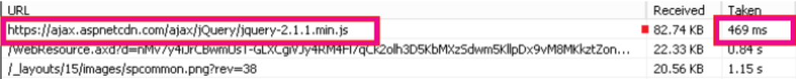

# <a name="content-delivery-networks-cdns"></a><span data-ttu-id="dc9ed-103">Redes de distribuição de conteúdo</span><span class="sxs-lookup"><span data-stu-id="dc9ed-103">Content Delivery Networks (CDNs)</span></span>

<span data-ttu-id="dc9ed-104">*Esse artigo se aplica ao Microsoft 365 Enterprise e ao Office 365 Enterprise.*</span><span class="sxs-lookup"><span data-stu-id="dc9ed-104">*This article applies to both Microsoft 365 Enterprise and Office 365 Enterprise.*</span></span>

<span data-ttu-id="dc9ed-105">As CDNs ajudam a manter Office 365 rápidas e confiáveis para usuários finais.</span><span class="sxs-lookup"><span data-stu-id="dc9ed-105">CDNs help keep Office 365 fast and reliable for end users.</span></span> <span data-ttu-id="dc9ed-106">Serviços de nuvem como Office 365 usam CDNs para armazenar em cache ativos estáticos mais próximos dos navegadores que os solicitam para acelerar os downloads e reduzir a latência do usuário final percebido.</span><span class="sxs-lookup"><span data-stu-id="dc9ed-106">Cloud services like Office 365 use CDNs to cache static assets closer to the browsers requesting them to speed up downloads and reduce perceived end user latency.</span></span> <span data-ttu-id="dc9ed-107">As informações neste tópico ajudarão você a aprender sobre CDNs (Redes de Entrega de Conteúdo) e como elas são usadas por Office 365.</span><span class="sxs-lookup"><span data-stu-id="dc9ed-107">The information in this topic will help you learn about Content Delivery Networks (CDNs) and how they are used by Office 365.</span></span>

## <a name="what-exactly-is-a-cdn"></a><span data-ttu-id="dc9ed-108">O que é exatamente um CDN?</span><span class="sxs-lookup"><span data-stu-id="dc9ed-108">What exactly is a CDN?</span></span>

<span data-ttu-id="dc9ed-109">Um CDN é uma rede geograficamente distribuída que consiste em servidores de proxy e arquivos em datacenters conectados por redes de backbone de alta velocidade.</span><span class="sxs-lookup"><span data-stu-id="dc9ed-109">A CDN is a geographically distributed network consisting of proxy and file servers in datacenters connected by high-speed backbone networks.</span></span> <span data-ttu-id="dc9ed-110">As CDNs são usadas para reduzir o tempo de latência e de carga para um conjunto especificado de arquivos e objetos em um site ou serviço.</span><span class="sxs-lookup"><span data-stu-id="dc9ed-110">CDNs are used to reduce latency and load times for a specified set of files and objects in a web site or service.</span></span> <span data-ttu-id="dc9ed-111">Um CDN pode ter muitos milhares de pontos de extremidade para a manutenção ideal de solicitações de entrada de qualquer local.</span><span class="sxs-lookup"><span data-stu-id="dc9ed-111">A CDN may have many thousands of endpoints for optimal servicing of incoming requests from any location.</span></span>

<span data-ttu-id="dc9ed-112">As CDNs são comumente usadas para fornecer downloads mais rápidos de conteúdo genérico para um site ou serviço, como arquivos javascript, ícones e imagens, e também podem fornecer acesso privado ao conteúdo do usuário, como arquivos em bibliotecas de documentos do SharePoint Online, arquivos de mídia de streaming e código personalizado.</span><span class="sxs-lookup"><span data-stu-id="dc9ed-112">CDNs are commonly used to provide faster downloads of generic content for a web site or service such as javascript files, icons and images, and can also provide private access to user content such as files in SharePoint Online document libraries, streaming media files, and custom code.</span></span>

<span data-ttu-id="dc9ed-113">As CDNs são usadas pela maioria dos serviços de nuvem empresariais.</span><span class="sxs-lookup"><span data-stu-id="dc9ed-113">CDNs are used by most enterprise cloud services.</span></span> <span data-ttu-id="dc9ed-114">Serviços de nuvem, como Office 365, têm milhões de clientes baixando uma mistura de conteúdo proprietário (como emails) e conteúdo genérico (como ícones) ao mesmo tempo.</span><span class="sxs-lookup"><span data-stu-id="dc9ed-114">Cloud services like Office 365 have millions of customers downloading a mix of proprietary content (such as emails) and generic content (such as icons) at one time.</span></span> <span data-ttu-id="dc9ed-115">É mais eficiente colocar imagens que todos usam, como ícones, o mais próximo possível do computador do usuário.</span><span class="sxs-lookup"><span data-stu-id="dc9ed-115">It's more efficient to put images everyone uses, like icons, as close to the user's computer as possible.</span></span> <span data-ttu-id="dc9ed-116">Não é prático para cada serviço de nuvem criar CDN datacenters que armazenam esse conteúdo genérico em todas as áreas metropolitanas ou mesmo em todos os principais hubs de Internet em todo o mundo, portanto, algumas dessas CDNs são compartilhadas.</span><span class="sxs-lookup"><span data-stu-id="dc9ed-116">It isn't practical for every cloud service to build CDN datacenters that store this generic content in every metropolitan area, or even in every major Internet hub around the world, so some of these CDNs are shared.</span></span>

## <a name="how-do-cdns-make-services-work-faster"></a><span data-ttu-id="dc9ed-117">Como as CDNs fazem com que os serviços funcionem mais rapidamente?</span><span class="sxs-lookup"><span data-stu-id="dc9ed-117">How do CDNs make services work faster?</span></span>

<span data-ttu-id="dc9ed-118">Baixar objetos comuns, como imagens de site e ícones, uma e outra vez pode assumir a largura de banda da rede que pode ser melhor usada para baixar conteúdo pessoal importante, como emails ou documentos.</span><span class="sxs-lookup"><span data-stu-id="dc9ed-118">Downloading common objects like site images and icons over and over again can take up network bandwidth that can be better used for downloading important personal content, like email or documents.</span></span> <span data-ttu-id="dc9ed-119">Como Office 365 usa uma arquitetura que inclui CDNs, os ícones, scripts e outros conteúdos genéricos podem ser baixados de servidores mais próximos de computadores cliente, tornando os downloads mais rápidos.</span><span class="sxs-lookup"><span data-stu-id="dc9ed-119">Because Office 365 uses an architecture that includes CDNs, the icons, scripts, and other generic content can be downloaded from servers closer to client computers, making the downloads faster.</span></span> <span data-ttu-id="dc9ed-120">Isso significa acesso mais rápido ao seu conteúdo pessoal, que é armazenado com segurança Office 365 datacenters.</span><span class="sxs-lookup"><span data-stu-id="dc9ed-120">This means faster access to your personal content, which is securely stored in Office 365 datacenters.</span></span>

<span data-ttu-id="dc9ed-121">As CDNs ajudam a melhorar o desempenho do serviço na nuvem de várias maneiras:</span><span class="sxs-lookup"><span data-stu-id="dc9ed-121">CDNs help to improve cloud service performance in several ways:</span></span>

- <span data-ttu-id="dc9ed-122">As CDNs deslocam parte da carga de download de rede e arquivo do serviço de nuvem, liberando recursos de serviço de nuvem para atender ao conteúdo do usuário e outros serviços, reduzindo a necessidade de atender solicitações de ativos estáticos.</span><span class="sxs-lookup"><span data-stu-id="dc9ed-122">CDNs shift part of the network and file download burden away from the cloud service, freeing up cloud service resources for serving user content and other services by reducing the need to serve requests for static assets.</span></span>
- <span data-ttu-id="dc9ed-123">As CDNs são criadas para fornecer acesso a arquivos de baixa latência implementando redes de alto desempenho e servidores de arquivos e aproveitando protocolos de rede atualizados, como [HTTP/2,](https://en.wikipedia.org/wiki/HTTP/2) com compactação altamente eficiente e solicitação de multiplexação.</span><span class="sxs-lookup"><span data-stu-id="dc9ed-123">CDNs are purpose built to provide low-latency file access by implementing high performance networks and file servers, and by leveraging updated network protocols such as [HTTP/2](https://en.wikipedia.org/wiki/HTTP/2) with highly efficient compression and request multiplexing.</span></span>
- <span data-ttu-id="dc9ed-124">CDN redes usam muitos pontos de extremidade distribuídos globalmente para disponibilizar o conteúdo o mais próximo possível dos usuários.</span><span class="sxs-lookup"><span data-stu-id="dc9ed-124">CDN networks use many globally distributed endpoints to make content available as close as possible to users.</span></span>

## <a name="the-office-365-cdn"></a><span data-ttu-id="dc9ed-125">O Office 365 CDN</span><span class="sxs-lookup"><span data-stu-id="dc9ed-125">The Office 365 CDN</span></span>

<span data-ttu-id="dc9ed-126">O Office 365 Rede de Distribuição de Conteúdo (CDN) integrado permite que os administradores Office 365 forneçam melhor desempenho para as páginas do SharePoint Online da organização, armazenando em cache ativos estáticos mais próximos dos navegadores que os solicitam, o que ajuda a acelerar os downloads e reduzir a latência.</span><span class="sxs-lookup"><span data-stu-id="dc9ed-126">The built-in Office 365 Content Delivery Network (CDN) allows Office 365 administrators to provide better performance for their organization's SharePoint Online pages by caching static assets closer to the browsers requesting them, which helps to speed up downloads and reduce latency.</span></span> <span data-ttu-id="dc9ed-127">O Office 365 CDN usa o [protocolo HTTP/2 para](https://en.wikipedia.org/wiki/HTTP/2) velocidades de compactação e download aprimoradas.</span><span class="sxs-lookup"><span data-stu-id="dc9ed-127">The Office 365 CDN uses the [HTTP/2 protocol](https://en.wikipedia.org/wiki/HTTP/2) for improved compression and download speeds.</span></span>

> [!NOTE]
> <span data-ttu-id="dc9ed-128">O Office 365 CDN está disponível apenas para locatários na nuvem **produção** (em todo o mundo).</span><span class="sxs-lookup"><span data-stu-id="dc9ed-128">The Office 365 CDN is only available to tenants in the **Production** (worldwide) cloud.</span></span> <span data-ttu-id="dc9ed-129">Os locatários nas nuvens do Governo dos EUA, China e Alemanha atualmente não suportam o Office 365 CDN.</span><span class="sxs-lookup"><span data-stu-id="dc9ed-129">Tenants in the US Government, China and Germany clouds do not currently support the Office 365 CDN.</span></span>

<span data-ttu-id="dc9ed-130">A CDN do Office 365 é composta por várias CDNs que permitem que você hospede ativos estáticos em vários locais ou _origens_ e sirva-os de redes globais de alta velocidade.</span><span class="sxs-lookup"><span data-stu-id="dc9ed-130">The Office 365 CDN is composed of multiple CDNs that allow you to host static assets in multiple locations, or _origins_, and serve them from global high-speed networks.</span></span> <span data-ttu-id="dc9ed-131">Dependendo do tipo de conteúdo você quiser hospedar na CDN do Office 365, você pode adicionar origens **públicas**, origens **privadas** ou ambas.</span><span class="sxs-lookup"><span data-stu-id="dc9ed-131">Depending on the kind of content you want to host in the Office 365 CDN, you can add **public** origins, **private** origins or both.</span></span>

<span data-ttu-id="dc9ed-132"></span><span class="sxs-lookup"><span data-stu-id="dc9ed-132"></span></span>

<span data-ttu-id="dc9ed-133">O conteúdo de origens **públicas** dentro da CDN do Office 365 é anonimamente acessível e pode ser acessado por qualquer um que tenha as URLs dos ativos hospedados.</span><span class="sxs-lookup"><span data-stu-id="dc9ed-133">Content in **public** origins within the Office 365 CDN is accessible anonymously, and can be accessed by anyone who has URLs to hosted assets.</span></span> <span data-ttu-id="dc9ed-134">Como o acesso ao conteúdo de origens públicas é anônimo, você só deve usá-lo para o armazenamento em cache de conteúdo genérico e não sensível como arquivos javascript, scripts, ícones e imagens.</span><span class="sxs-lookup"><span data-stu-id="dc9ed-134">Because access to content in public origins is anonymous, you should only use them to cache non-sensitive generic content such as javascript files, scripts, icons and images.</span></span> <span data-ttu-id="dc9ed-135">A CDN do Office 365 é usada por padrão para baixar os ativos de recurso genérico, como aplicativos de cliente do Office 365 de uma origem pública.</span><span class="sxs-lookup"><span data-stu-id="dc9ed-135">The Office 365 CDN is used by default for downloading generic resource assets like the Office 365 client applications from a public origin.</span></span>

<span data-ttu-id="dc9ed-136">**As** origens privadas no Office 365 CDN fornecem acesso privado ao conteúdo do usuário, SharePoint como bibliotecas de documentos online, sites e imagens proprietárias.</span><span class="sxs-lookup"><span data-stu-id="dc9ed-136">**Private** origins within the Office 365 CDN provide private access to user content such as SharePoint Online document libraries, sites and proprietary images.</span></span> <span data-ttu-id="dc9ed-137">O acesso ao conteúdo com origens privadas é protegido com tokens gerados dinamicamente, portanto só podem ser acessados por usuários com permissões para a biblioteca ou local armazenamento do documento original.</span><span class="sxs-lookup"><span data-stu-id="dc9ed-137">Access to content in private origins is secured with dynamically generated tokens so it can only be accessed by users with permissions to the original document library or storage location.</span></span> <span data-ttu-id="dc9ed-138">Origens privadas na CDN do Office 365 só podem ser usadas para o conteúdo do SharePoint Online e você só poderá acessar ativos por meio do redirecionamento do seu locatário do SharePoint Online.</span><span class="sxs-lookup"><span data-stu-id="dc9ed-138">Private origins in the Office 365 CDN can only be used for SharePoint Online content, and you can only access assets through redirection from your SharePoint Online tenant.</span></span>

<span data-ttu-id="dc9ed-139">O serviço de CDN do Office 365 faz parte da assinatura do SharePoint Online.</span><span class="sxs-lookup"><span data-stu-id="dc9ed-139">The Office 365 CDN service is included as part of your SharePoint Online subscription.</span></span>

<span data-ttu-id="dc9ed-140">Para obter mais informações sobre como usar o Office 365 CDN, consulte [Use the Office 365 content delivery network with SharePoint Online](use-microsoft-365-cdn-with-spo.md).</span><span class="sxs-lookup"><span data-stu-id="dc9ed-140">For more information about how to use the Office 365 CDN, see [Use the Office 365 content delivery network with SharePoint Online](use-microsoft-365-cdn-with-spo.md).</span></span>

<span data-ttu-id="dc9ed-141">Para assistir a uma série de vídeos curtos que fornecem informações conceituais e HOWTO sobre como usar o Office 365 CDN, visite o canal SharePoint Padrões e Práticas de [Desenvolvedores do YouTube](https://aka.ms/sppnp-videos).</span><span class="sxs-lookup"><span data-stu-id="dc9ed-141">To watch a series of short videos that provide conceptual and HOWTO information about using the Office 365 CDN, visit the [SharePoint Developer Patterns and Practices YouTube channel](https://aka.ms/sppnp-videos).</span></span>

## <a name="other-microsoft-cdns"></a><span data-ttu-id="dc9ed-142">Outras CDNs da Microsoft</span><span class="sxs-lookup"><span data-stu-id="dc9ed-142">Other Microsoft CDNs</span></span>

<span data-ttu-id="dc9ed-143">Embora não seja parte do Office 365 CDN, você pode usar essas CDNs em seu locatário Office 365 para acessar bibliotecas de desenvolvimento do SharePoint, código personalizado e outras finalidades que se enquadram fora do escopo do Office 365 CDN.</span><span class="sxs-lookup"><span data-stu-id="dc9ed-143">Although not a part of the Office 365 CDN, you can use these CDNs in your Office 365 tenant for access to SharePoint development libraries, custom code and other purposes that fall outside the scope of the Office 365 CDN.</span></span>

### <a name="azure-cdn"></a><span data-ttu-id="dc9ed-144">CDN do Azure</span><span class="sxs-lookup"><span data-stu-id="dc9ed-144">Azure CDN</span></span>

>[!NOTE]
><span data-ttu-id="dc9ed-145">A partir do 3º trimestre de 2020, o SharePoint Online começará a gravar vídeos em cache no CDN do Azure para dar suporte à reprodução de vídeo e confiabilidade aprimoradas.</span><span class="sxs-lookup"><span data-stu-id="dc9ed-145">Beginning in Q3 2020, SharePoint Online will begin caching videos on the Azure CDN to support improved video playback and reliability.</span></span> <span data-ttu-id="dc9ed-146">Os vídeos populares serão transmitidos do ponto CDN ponto de extremidade mais próximo do usuário.</span><span class="sxs-lookup"><span data-stu-id="dc9ed-146">Popular videos will be streamed from the CDN endpoint closest to the user.</span></span> <span data-ttu-id="dc9ed-147">Esses dados permanecerão dentro do limite Microsoft 365 conformidade.</span><span class="sxs-lookup"><span data-stu-id="dc9ed-147">This data will remain within the Microsoft 365 compliance boundary.</span></span> <span data-ttu-id="dc9ed-148">Esse é um serviço gratuito para todos os locatários e não exige que qualquer ação do cliente seja configurada.</span><span class="sxs-lookup"><span data-stu-id="dc9ed-148">This is a free service for all tenants and it does not require any customer action to configure.</span></span>

<span data-ttu-id="dc9ed-149">Você pode usar o **CDN do Azure** para implantar sua própria instância de CDN para hospedar web parts, bibliotecas e outros ativos de recursos personalizados, o que permite aplicar chaves de acesso ao armazenamento CDN e exercer maior controle sobre sua configuração CDN.</span><span class="sxs-lookup"><span data-stu-id="dc9ed-149">You can use the **Azure CDN** to deploy your own CDN instance for hosting custom web parts, libraries and other resource assets, which allows you to apply access keys to your CDN storage and exert greater control over your CDN configuration.</span></span> <span data-ttu-id="dc9ed-150">O uso da CDN do Azure não é gratuito e requer uma assinatura do Azure.</span><span class="sxs-lookup"><span data-stu-id="dc9ed-150">Use of the Azure CDN is not free, and requires an Azure subscription.</span></span>

<span data-ttu-id="dc9ed-151">Para obter mais informações sobre como configurar uma instância CDN do Azure, consulte Início rápido: Integrar uma conta de armazenamento do [Azure](/azure/cdn/cdn-create-a-storage-account-with-cdn)com CDN do Azure .</span><span class="sxs-lookup"><span data-stu-id="dc9ed-151">For more information on how to configure an Azure CDN instance, see [Quickstart: Integrate an Azure storage account with Azure CDN](/azure/cdn/cdn-create-a-storage-account-with-cdn).</span></span>

<span data-ttu-id="dc9ed-152">Para um exemplo de como o CDN do Azure pode ser usado para hospedar web parts SharePoint, consulte [Deploy your SharePoint client-side web part to CDN do Azure](/sharepoint/dev/spfx/web-parts/get-started/deploy-web-part-to-cdn).</span><span class="sxs-lookup"><span data-stu-id="dc9ed-152">For an example of how the Azure CDN can be used to host SharePoint web parts, see [Deploy your SharePoint client-side web part to Azure CDN](/sharepoint/dev/spfx/web-parts/get-started/deploy-web-part-to-cdn).</span></span>

<span data-ttu-id="dc9ed-153">Para obter informações sobre o CDN do Azure do PowerShell, consulte [Manage CDN do Azure with PowerShell](/azure/cdn/cdn-manage-powershell).</span><span class="sxs-lookup"><span data-stu-id="dc9ed-153">For information about the Azure CDN PowerShell module, see [Manage Azure CDN with PowerShell](/azure/cdn/cdn-manage-powershell).</span></span>

### <a name="microsoft-ajax-cdn"></a><span data-ttu-id="dc9ed-154">Microsoft Ajax CDN</span><span class="sxs-lookup"><span data-stu-id="dc9ed-154">Microsoft Ajax CDN</span></span>

<span data-ttu-id="dc9ed-155">O **Ajax CDN** da Microsoft é um CDN somente leitura que oferece muitas bibliotecas de desenvolvimento populares, incluindo jQuery (e todas as outras bibliotecas), ASP.NET Ajax, Bootstrap, Knockout.js e outras.</span><span class="sxs-lookup"><span data-stu-id="dc9ed-155">Microsoft's **Ajax CDN** is a read-only CDN that offers many popular development libraries including jQuery (and all of its other libraries), ASP.NET Ajax, Bootstrap, Knockout.js, and others.</span></span>
  
<span data-ttu-id="dc9ed-156">Para incluir esses scripts em seu projeto, basta substituir quaisquer referências a essas bibliotecas disponíveis publicamente por referências ao endereço CDN em vez de incluí-los no próprio projeto.</span><span class="sxs-lookup"><span data-stu-id="dc9ed-156">To include these scripts in your project, simply replace any references to these publicly available libraries with references to the CDN address instead of including it in your project itself.</span></span> <span data-ttu-id="dc9ed-157">Por exemplo, use o seguinte código para vincular ao jQuery:</span><span class="sxs-lookup"><span data-stu-id="dc9ed-157">For example, use the following code to link to jQuery:</span></span>

``` html
<script src=https://ajax.aspnetcdn.com/ajax/jquery-2.1.1.js> </script>
```

<span data-ttu-id="dc9ed-158">Para obter mais informações sobre como usar o microsoft ajax CDN, consulte [Microsoft Ajax CDN](/aspnet/ajax/cdn/overview).</span><span class="sxs-lookup"><span data-stu-id="dc9ed-158">For more information about how to use the Microsoft Ajax CDN, see [Microsoft Ajax CDN](/aspnet/ajax/cdn/overview).</span></span>

## <a name="how-does-office-365-use-content-from-a-cdn"></a><span data-ttu-id="dc9ed-159">Como Office 365 o conteúdo de um CDN?</span><span class="sxs-lookup"><span data-stu-id="dc9ed-159">How does Office 365 use content from a CDN?</span></span>

<span data-ttu-id="dc9ed-160">Independentemente do CDN você configurar para seu locatário Office 365, o processo básico de recuperação de dados é o mesmo.</span><span class="sxs-lookup"><span data-stu-id="dc9ed-160">Regardless of what CDN you configure for your Office 365 tenant, the basic data retrieval process is the same.</span></span>

1. <span data-ttu-id="dc9ed-161">Seu cliente (um navegador ou um aplicativo cliente Office) solicita dados de Office 365.</span><span class="sxs-lookup"><span data-stu-id="dc9ed-161">Your client (a browser or Office client application) requests data from Office 365.</span></span>

2. <span data-ttu-id="dc9ed-162">Office 365 retorna os dados diretamente para seu cliente ou, se os dados fazem parte de um conjunto de conteúdo hospedado pelo CDN, redireciona seu cliente para a URL CDN.</span><span class="sxs-lookup"><span data-stu-id="dc9ed-162">Office 365 either returns the data directly to your client or, if the data is part of a set of content hosted by the CDN, redirects your client to the CDN URL.</span></span>

    <span data-ttu-id="dc9ed-163">a.</span><span class="sxs-lookup"><span data-stu-id="dc9ed-163">a.</span></span> <span data-ttu-id="dc9ed-164">Se os dados já estão  armazenados em cache em uma origem pública, seu cliente baixa os dados diretamente do local CDN local mais próximo para seu cliente.</span><span class="sxs-lookup"><span data-stu-id="dc9ed-164">If the data is already cached in a _public_ origin, your client downloads the data directly from the nearest CDN location to your client.</span></span>

    <span data-ttu-id="dc9ed-165">b.</span><span class="sxs-lookup"><span data-stu-id="dc9ed-165">b.</span></span> <span data-ttu-id="dc9ed-166">Se os dados já estão  armazenados em cache em uma origem privada, o serviço CDN verifica as permissões da sua conta de usuário Office 365 na origem.</span><span class="sxs-lookup"><span data-stu-id="dc9ed-166">If the data is already cached in a _private_ origin, the CDN service checks your Office 365 user account's permissions on the origin.</span></span> <span data-ttu-id="dc9ed-167">Se você tiver permissões, o SharePoint Online gerará dinamicamente uma URL personalizada composta do caminho para o ativo no CDN e dois tokens de acesso e retornará a URL personalizada para seu cliente.</span><span class="sxs-lookup"><span data-stu-id="dc9ed-167">If you have permissions, SharePoint Online dynamically generates a custom URL composed of the path to the asset in the CDN and two access tokens, and returns the custom URL to your client.</span></span> <span data-ttu-id="dc9ed-168">Em seguida, seu cliente baixa os dados diretamente do local de CDN mais próximo para seu cliente usando a URL personalizada.</span><span class="sxs-lookup"><span data-stu-id="dc9ed-168">Your client then downloads the data directly from the nearest CDN location to your client using the custom URL.</span></span>

3. <span data-ttu-id="dc9ed-169">Se os dados não são armazenados em cache no CDN, o nó CDN solicita os dados do Office 365 e, em seguida, armazena em cache os dados por um período de tempo após o cliente baixar os dados.</span><span class="sxs-lookup"><span data-stu-id="dc9ed-169">If the data isn't cached at the CDN, the CDN node requests the data from Office 365 and then caches the data for a period of time after your client downloads the data.</span></span>

<span data-ttu-id="dc9ed-170">O CDN descobre o datacenter mais próximo do navegador do usuário e, usando o redirecionamento, baixa os dados solicitados de lá.</span><span class="sxs-lookup"><span data-stu-id="dc9ed-170">The CDN figures out the closest datacenter to the user's browser and, using redirection, downloads the requested data from there.</span></span> <span data-ttu-id="dc9ed-171">CDN redirecionamento é rápido e pode economizar muito tempo de download para os usuários.</span><span class="sxs-lookup"><span data-stu-id="dc9ed-171">CDN redirection is quick, and can save users a lot of download time.</span></span>

## <a name="how-should-i-set-up-my-network-so-that-cdns-work-best-with-office-365"></a><span data-ttu-id="dc9ed-172">Como configurar minha rede para que as CDNs funcionem melhor com Office 365?</span><span class="sxs-lookup"><span data-stu-id="dc9ed-172">How should I set up my network so that CDNs work best with Office 365?</span></span>

<span data-ttu-id="dc9ed-173">Minimizar a latência entre clientes em sua rede e CDN pontos de extremidade é a principal consideração para garantir o desempenho ideal.</span><span class="sxs-lookup"><span data-stu-id="dc9ed-173">Minimizing latency between clients on your network and CDN endpoints is the key consideration for ensuring optimal performance.</span></span> <span data-ttu-id="dc9ed-174">Você pode usar as práticas recomendadas descritas em Managing [Office 365 endpoints](managing-office-365-endpoints.md) para garantir que sua configuração de rede permita que os navegadores clientes acessem o CDN diretamente em vez de rotear o tráfego CDN por meio de proxies centrais para evitar a introdução de latência desnecessária.</span><span class="sxs-lookup"><span data-stu-id="dc9ed-174">You can use the best practices outlined in [Managing Office 365 endpoints](managing-office-365-endpoints.md) to ensure that your network configuration permits client browsers to access the CDN directly rather than routing CDN traffic through central proxies to avoid introducing unnecessary latency.</span></span>

<span data-ttu-id="dc9ed-175">Você também pode ler [Office 365 Princípios](./microsoft-365-network-connectivity-principles.md) de Conectividade de Rede para entender os conceitos por trás da otimização Office 365 de rede.</span><span class="sxs-lookup"><span data-stu-id="dc9ed-175">You can also read [Office 365 Network Connectivity Principles](./microsoft-365-network-connectivity-principles.md) to understand the concepts behind optimizing Office 365 network performance.</span></span>

## <a name="is-there-a-list-of-all-the-cdns-that-office-365-uses"></a><span data-ttu-id="dc9ed-176">Há uma lista de todas as CDNs que Office 365 usa?</span><span class="sxs-lookup"><span data-stu-id="dc9ed-176">Is there a list of all the CDNs that Office 365 uses?</span></span>

<span data-ttu-id="dc9ed-177">As CDNs em uso por Office 365 estão sempre sujeitas a alterações e, em muitos casos, há vários parceiros CDN configurados no caso de um não estar disponível.</span><span class="sxs-lookup"><span data-stu-id="dc9ed-177">The CDNs in use by Office 365 are always subject to change and in many cases there are multiple CDN partners configured in the event one is unavailable.</span></span> <span data-ttu-id="dc9ed-178">As CDNs principais usadas por Office 365 são:</span><span class="sxs-lookup"><span data-stu-id="dc9ed-178">The primary CDNs used by Office 365 are:</span></span>

|<span data-ttu-id="dc9ed-179">CDN</span><span class="sxs-lookup"><span data-stu-id="dc9ed-179">CDN</span></span>  |<span data-ttu-id="dc9ed-180">Empresa</span><span class="sxs-lookup"><span data-stu-id="dc9ed-180">Company</span></span>  |<span data-ttu-id="dc9ed-181">Uso</span><span class="sxs-lookup"><span data-stu-id="dc9ed-181">Usage</span></span>  |<span data-ttu-id="dc9ed-182">Link</span><span class="sxs-lookup"><span data-stu-id="dc9ed-182">Link</span></span>  |
|---------|---------|---------|---------|
|<span data-ttu-id="dc9ed-183">Office 365 CDN</span><span class="sxs-lookup"><span data-stu-id="dc9ed-183">Office 365 CDN</span></span>     |<span data-ttu-id="dc9ed-184">Akamai</span><span class="sxs-lookup"><span data-stu-id="dc9ed-184">Akamai</span></span>         |<span data-ttu-id="dc9ed-185">Ativos genéricos em origens públicas, SharePoint conteúdo do usuário em origens privadas</span><span class="sxs-lookup"><span data-stu-id="dc9ed-185">Generic assets in public origins, SharePoint user content in private origins</span></span>         |[<span data-ttu-id="dc9ed-186">Usar a rede de distribuição de conteúdo do Office 365 com o SharePoint Online</span><span class="sxs-lookup"><span data-stu-id="dc9ed-186">Use the Office 365 content delivery network with SharePoint Online</span></span>](use-microsoft-365-cdn-with-spo.md)         |
|<span data-ttu-id="dc9ed-187">CDN do Azure</span><span class="sxs-lookup"><span data-stu-id="dc9ed-187">Azure CDN</span></span>     |<span data-ttu-id="dc9ed-188">Microsoft</span><span class="sxs-lookup"><span data-stu-id="dc9ed-188">Microsoft</span></span>         |<span data-ttu-id="dc9ed-189">Código personalizado, Estrutura do SharePoint soluções</span><span class="sxs-lookup"><span data-stu-id="dc9ed-189">Custom code, SharePoint Framework solutions</span></span>         |[<span data-ttu-id="dc9ed-190">Microsoft Azure CDN</span><span class="sxs-lookup"><span data-stu-id="dc9ed-190">Microsoft Azure CDN</span></span>](https://azure.microsoft.com/documentation/services/cdn/)         |
|<span data-ttu-id="dc9ed-191">Microsoft Ajax CDN (somente leitura)</span><span class="sxs-lookup"><span data-stu-id="dc9ed-191">Microsoft Ajax CDN (read only)</span></span>     |<span data-ttu-id="dc9ed-192">Microsoft</span><span class="sxs-lookup"><span data-stu-id="dc9ed-192">Microsoft</span></span>         |<span data-ttu-id="dc9ed-193">Bibliotecas comuns para Ajax, jQuery, ASP.NET, Bootstrap, Knockout.js etc.</span><span class="sxs-lookup"><span data-stu-id="dc9ed-193">Common libraries for Ajax, jQuery, ASP.NET, Bootstrap, Knockout.js etc.</span></span>         |[<span data-ttu-id="dc9ed-194">Microsoft Ajax CDN</span><span class="sxs-lookup"><span data-stu-id="dc9ed-194">Microsoft Ajax CDN</span></span>](/aspnet/ajax/cdn/overview)         |

## <a name="what-performance-gains-does-a-cdn-provide"></a><span data-ttu-id="dc9ed-195">Quais ganhos de desempenho um CDN fornece?</span><span class="sxs-lookup"><span data-stu-id="dc9ed-195">What performance gains does a CDN provide?</span></span>

<span data-ttu-id="dc9ed-196">Há muitos fatores envolvidos na medição de diferenças específicas no desempenho entre os dados baixados diretamente do Office 365 e os dados baixados de um CDN específico, como sua localização em relação ao locatário e ao ponto de extremidade mais próximo do CDN, o número de ativos em uma página que são atendidos pelo CDN e alterações transitórias na latência e largura de banda da rede.</span><span class="sxs-lookup"><span data-stu-id="dc9ed-196">There are many factors involved in measuring specific differences in performance between data downloaded directly from Office 365 and data downloaded from a specific CDN, such as your location relative to your tenant and to the nearest CDN endpoint, the number of assets on a page that are served by the CDN, and transient changes in network latency and bandwidth.</span></span> <span data-ttu-id="dc9ed-197">No entanto, um teste A/B simples pode ajudar a mostrar a diferença no tempo de download de um arquivo específico.</span><span class="sxs-lookup"><span data-stu-id="dc9ed-197">However, a simple A/B test can help to show the difference in download time for a specific file.</span></span>

<span data-ttu-id="dc9ed-198">As capturas de tela a seguir ilustram a diferença na velocidade de download entre o local do arquivo nativo no Office 365 e o mesmo arquivo hospedado no [Microsoft Ajax Rede de Distribuição de Conteúdo](/aspnet/ajax/cdn/overview).</span><span class="sxs-lookup"><span data-stu-id="dc9ed-198">The following screen shots illustrate the difference in download speed between the native file location in Office 365 and the same file hosted on the [Microsoft Ajax Content Delivery Network](/aspnet/ajax/cdn/overview).</span></span> <span data-ttu-id="dc9ed-199">Essas capturas de tela são da guia **Rede** nas ferramentas de desenvolvedor do Internet Explorer 11.</span><span class="sxs-lookup"><span data-stu-id="dc9ed-199">These screen shots are from the **Network** tab in the Internet Explorer 11 developer tools.</span></span> <span data-ttu-id="dc9ed-200">Essas capturas de tela mostram a latência no jQuery da biblioteca popular.</span><span class="sxs-lookup"><span data-stu-id="dc9ed-200">These screen shots show the latency on the popular library jQuery.</span></span> <span data-ttu-id="dc9ed-201">Para abrir essa tela, no Internet Explorer, pressione  **F12** e selecione a guia Rede que é símbolo com um ícone Wi-Fi.</span><span class="sxs-lookup"><span data-stu-id="dc9ed-201">To bring up this screen, in Internet Explorer, press **F12** and select the **Network** tab which is symbolized with a Wi-Fi icon.</span></span>
  

  
<span data-ttu-id="dc9ed-203">Esta captura de tela mostra a biblioteca carregada na galeria de páginas mestras no próprio site SharePoint Online.</span><span class="sxs-lookup"><span data-stu-id="dc9ed-203">This screen shot shows the library uploaded to the master page gallery on the SharePoint Online site itself.</span></span> <span data-ttu-id="dc9ed-204">O tempo necessário para carregar a biblioteca é de 1,51 segundos.</span><span class="sxs-lookup"><span data-stu-id="dc9ed-204">The time it took to upload the library is 1.51 seconds.</span></span>
  

  
<span data-ttu-id="dc9ed-206">A segunda captura de tela mostra o mesmo arquivo entregue pelo CDN da Microsoft.</span><span class="sxs-lookup"><span data-stu-id="dc9ed-206">The second screen shot shows the same file delivered by Microsoft's CDN.</span></span> <span data-ttu-id="dc9ed-207">Desta vez, a latência é de cerca de 496 milissegundos.</span><span class="sxs-lookup"><span data-stu-id="dc9ed-207">This time the latency is around 496 milliseconds.</span></span> <span data-ttu-id="dc9ed-208">Isso é uma grande melhoria e mostra que um segundo inteiro é cortado do tempo total para baixar o objeto.</span><span class="sxs-lookup"><span data-stu-id="dc9ed-208">This is a large improvement and shows that a whole second is shaved off the total time to download the object.</span></span>
  


## <a name="is-my-data-safe"></a><span data-ttu-id="dc9ed-210">Meus dados são seguros?</span><span class="sxs-lookup"><span data-stu-id="dc9ed-210">Is my data safe?</span></span>

<span data-ttu-id="dc9ed-211">Cuidamos muito para proteger os dados que executam sua empresa.</span><span class="sxs-lookup"><span data-stu-id="dc9ed-211">We take great care to protect the data that runs your business.</span></span> <span data-ttu-id="dc9ed-212">Os dados armazenados no Office 365 CDN são criptografados em trânsito e em repouso, e o acesso aos dados no Office 365 SharePoint CDN é protegido por permissões de usuário Office 365 e autorização de token.</span><span class="sxs-lookup"><span data-stu-id="dc9ed-212">Data stored in the Office 365 CDN is encrypted both in transit and at rest, and access to data in the Office 365 SharePoint CDN is secured by Office 365 user permissions and token authorization.</span></span> <span data-ttu-id="dc9ed-213">Solicitações de dados no Office 365 SharePoint CDN devem ser referenciadas (redirecionadas) do locatário Office 365 ou um token de autorização não será gerado.</span><span class="sxs-lookup"><span data-stu-id="dc9ed-213">Requests for data in the Office 365 SharePoint CDN must be referred (redirected) from your Office 365 tenant or an authorization token will not be generated.</span></span>

<span data-ttu-id="dc9ed-214">Para garantir que seus dados permaneçam seguros, recomendamos que você nunca armazene conteúdo do usuário ou outros dados confidenciais em uma CDN.</span><span class="sxs-lookup"><span data-stu-id="dc9ed-214">To ensure that your data remains secure, we recommend that you never store user content or other sensitive data in a public CDN.</span></span> <span data-ttu-id="dc9ed-215">Como o acesso aos dados em um site público CDN anônimo, as CDNs públicas só devem ser usadas para hospedar conteúdo genérico, como arquivos de script da Web, ícones, imagens e outros ativos não confidenciais.</span><span class="sxs-lookup"><span data-stu-id="dc9ed-215">Because access to data in a public CDN is anonymous, public CDNs should only be used to host generic content such as web script files, icons, images and other non-sensitive assets.</span></span>

> [!NOTE]
> <span data-ttu-id="dc9ed-216">Os provedores de CDN de terceiros podem ter padrões de privacidade e conformidade diferentes dos compromissos descritos pela Central de Confiação Office 365.</span><span class="sxs-lookup"><span data-stu-id="dc9ed-216">3rd party CDN providers may have privacy and compliance standards that differ from the commitments outlined by the Office 365 Trust Center.</span></span> <span data-ttu-id="dc9ed-217">Os dados armazenados em cache por meio do serviço CDN podem não estar em conformidade com os Termos de Processamento de Dados da Microsoft (DPT) e podem estar fora dos limites de conformidade Office 365 Central de Confiações.</span><span class="sxs-lookup"><span data-stu-id="dc9ed-217">Data cached through the CDN service may not conform to the Microsoft Data Processing Terms (DPT), and may be outside of the Office 365 Trust Center compliance boundaries.</span></span>

<span data-ttu-id="dc9ed-218">Para obter informações detalhadas sobre privacidade e proteção de dados para Office 365 CDN provedores, visite o seguinte:</span><span class="sxs-lookup"><span data-stu-id="dc9ed-218">For in-depth information about privacy and data protection for Office 365 CDN providers, visit the following:</span></span>  

- <span data-ttu-id="dc9ed-219">Saiba mais sobre Office 365 privacidade e proteção de dados no [Centro de Confiança da Microsoft](https://www.microsoft.com/trustcenter)</span><span class="sxs-lookup"><span data-stu-id="dc9ed-219">Learn more about Office 365 privacy and data protection at the [Microsoft Trust Center](https://www.microsoft.com/trustcenter)</span></span>
- <span data-ttu-id="dc9ed-220">Saiba mais sobre a privacidade e a proteção de dados de Akamai no Centro de Confiança de [Privacidade Akamai](https://www.akamai.com/us/en/about/compliance/data-protection-at-akamai.jsp)</span><span class="sxs-lookup"><span data-stu-id="dc9ed-220">Learn more about Akamai’s privacy and data protection at the [Akamai Privacy Trust Center](https://www.akamai.com/us/en/about/compliance/data-protection-at-akamai.jsp)</span></span>
- <span data-ttu-id="dc9ed-221">Saiba mais sobre a privacidade e a proteção de dados do Azure no [Centro de Confiança do Azure](https://azure.microsoft.com/overview/trusted-cloud/)</span><span class="sxs-lookup"><span data-stu-id="dc9ed-221">Learn more about Azure privacy and data protection at the [Azure Trust Center](https://azure.microsoft.com/overview/trusted-cloud/)</span></span>

## <a name="how-can-i-secure-my-network-with-all-these-3rd-party-services"></a><span data-ttu-id="dc9ed-222">Como posso proteger minha rede com todos esses serviços de terceiros?</span><span class="sxs-lookup"><span data-stu-id="dc9ed-222">How can I secure my network with all these 3rd party services?</span></span>

<span data-ttu-id="dc9ed-223">Aproveitar um amplo conjunto de serviços de parceiros permite Office 365 dimensionar e atender aos requisitos de disponibilidade, bem como aprimorar a experiência do usuário ao usar Office 365.</span><span class="sxs-lookup"><span data-stu-id="dc9ed-223">Leveraging an extensive set of partner services allows Office 365 to scale and meet availability requirements as well as enhance the user experience when using Office 365.</span></span> <span data-ttu-id="dc9ed-224">Os serviços de terceiros Office 365 de uso incluem ambas as listas de revogação de certificados; como crl.microsoft.com ou sa.symcb.com e CDNs; como r3.res.outlook.com.</span><span class="sxs-lookup"><span data-stu-id="dc9ed-224">The 3rd party services Office 365 leverages include both certificate revocation lists; such as crl.microsoft.com or sa.symcb.com, and CDNs; such as r3.res.outlook.com.</span></span> <span data-ttu-id="dc9ed-225">Cada CDN FQDN gerado pelo Office 365 é um FQDN personalizado para Office 365.</span><span class="sxs-lookup"><span data-stu-id="dc9ed-225">Every CDN FQDN generated by Office 365 is a custom FQDN for Office 365.</span></span> <span data-ttu-id="dc9ed-226">Se você for enviado a um FQDN a pedido do Office 365, poderá ter certeza de que o provedor CDN controla o FQDN e o conteúdo subjacente nesse local.</span><span class="sxs-lookup"><span data-stu-id="dc9ed-226">If you're sent to a FQDN at the request of Office 365 you can be assured that the CDN provider controls the FQDN and the underlying content at that location.</span></span>
  
<span data-ttu-id="dc9ed-227">Para clientes que querem segregar solicitações destinadas a um datacenter microsoft ou Office 365 de solicitações [destinadas a](https://support.office.com/article/99cab9d4-ef59-4207-9f2b-3728eb46bf9a)terceiros, escrevemos orientações sobre Como gerenciar pontos de extremidade Office 365 .</span><span class="sxs-lookup"><span data-stu-id="dc9ed-227">For customers that want to segregate requests destined for a Microsoft or Office 365 datacenter from requests that are destined for a 3rd party, we've written up guidance on [Managing Office 365 endpoints](https://support.office.com/article/99cab9d4-ef59-4207-9f2b-3728eb46bf9a).</span></span>

## <a name="is-there-a-list-of-all-the-fqdns-that-leverage-cdns"></a><span data-ttu-id="dc9ed-228">Há uma lista de todos os FQDNs que aproveitam CDNs?</span><span class="sxs-lookup"><span data-stu-id="dc9ed-228">Is there a list of all the FQDNs that leverage CDNs?</span></span>

<span data-ttu-id="dc9ed-229">A lista de FQDNs e como eles aproveitam as CDNs mudam ao longo do tempo.</span><span class="sxs-lookup"><span data-stu-id="dc9ed-229">The list of FQDNs and how they leverage CDNs change over time.</span></span> <span data-ttu-id="dc9ed-230">Consulte nossa página de Office 365 URLs e intervalos de [endereços IP publicados](./urls-and-ip-address-ranges.md) para obter atualizados os FQDNs mais recentes que aproveitam CDNs.</span><span class="sxs-lookup"><span data-stu-id="dc9ed-230">Refer to our published [Office 365 URLs and IP address ranges](./urls-and-ip-address-ranges.md) page to get up to date on the latest FQDNs that leverage CDNs.</span></span>

<span data-ttu-id="dc9ed-231">Você também pode usar o Office 365 ip e o serviço [Web de URL](microsoft-365-ip-web-service.md) para solicitar as URLs de Office 365 atuais e intervalos de endereços IP formatados como CSV ou JSON.</span><span class="sxs-lookup"><span data-stu-id="dc9ed-231">You can also use the [Office 365 IP Address and URL Web service](microsoft-365-ip-web-service.md) to request the current Office 365 URLs and IP address ranges formatted as CSV or JSON.</span></span>

## <a name="can-i-use-my-own-cdn-and-cache-content-on-my-local-network"></a><span data-ttu-id="dc9ed-232">Posso usar meu próprio conteúdo de CDN cache na minha rede local?</span><span class="sxs-lookup"><span data-stu-id="dc9ed-232">Can I use my own CDN and cache content on my local network?</span></span>

<span data-ttu-id="dc9ed-233">Estamos continuamente procurando novas maneiras de dar suporte às necessidades de nossos clientes e, no momento, estamos explorando o uso de soluções de proxy de cache e outras soluções de CDN locais.</span><span class="sxs-lookup"><span data-stu-id="dc9ed-233">We're continually looking for new ways to support our customers needs and are currently exploring the use of caching proxy solutions and other on-premises CDN solutions.</span></span>

<span data-ttu-id="dc9ed-234">Embora não faça parte do Office 365 CDN, você também pode usar o **CDN do Azure** para hospedar web parts, bibliotecas e outros ativos de recursos personalizados, o que permite aplicar chaves de acesso ao armazenamento CDN e exercer maior controle sobre sua configuração do CDN.</span><span class="sxs-lookup"><span data-stu-id="dc9ed-234">Although it is not a part of the Office 365 CDN, you can also use the **Azure CDN** for hosting custom web parts, libraries and other resource assets, which allows you to apply access keys to your CDN storage and exert greater control over your CDN configuration.</span></span> <span data-ttu-id="dc9ed-235">O uso da CDN do Azure não é gratuito e requer uma assinatura do Azure.</span><span class="sxs-lookup"><span data-stu-id="dc9ed-235">Use of the Azure CDN is not free, and requires an Azure subscription.</span></span> <span data-ttu-id="dc9ed-236">Para obter mais informações sobre como configurar uma instância CDN do Azure, consulte Início rápido: Integrar uma conta de armazenamento do [Azure](/azure/cdn/cdn-create-a-storage-account-with-cdn)com CDN do Azure .</span><span class="sxs-lookup"><span data-stu-id="dc9ed-236">For more information on how to configure an Azure CDN instance, see [Quickstart: Integrate an Azure storage account with Azure CDN](/azure/cdn/cdn-create-a-storage-account-with-cdn).</span></span>

## <a name="im-using-azure-expressroute-for-office-365-does-that-change-things"></a><span data-ttu-id="dc9ed-237">Estou usando o Azure ExpressRoute para Office 365, isso altera as coisas?</span><span class="sxs-lookup"><span data-stu-id="dc9ed-237">I'm using Azure ExpressRoute for Office 365, does that change things?</span></span>

<span data-ttu-id="dc9ed-238">[O Azure ExpressRoute para Office 365](azure-expressroute.md) fornece uma conexão dedicada Office 365 infraestrutura segregada da internet pública.</span><span class="sxs-lookup"><span data-stu-id="dc9ed-238">[Azure ExpressRoute for Office 365](azure-expressroute.md) provides a dedicated connection to Office 365 infrastructure that is segregated from the public internet.</span></span> <span data-ttu-id="dc9ed-239">Isso significa que os clientes ainda precisarão se conectar em conexões não ExpressaRoute para se conectar a CDNs e outras infraestruturas da Microsoft que não estão explicitamente incluídas na lista de serviços suportados pelo ExpressRoute.</span><span class="sxs-lookup"><span data-stu-id="dc9ed-239">This means that clients will still need to connect over non-ExpressRoute connections to connect to CDNs and other Microsoft infrastructure that is not explicitly included in the list of services supported by ExpressRoute.</span></span> <span data-ttu-id="dc9ed-240">Para obter mais informações sobre como rotear tráfego específico, como solicitações destinadas a CDNs, consulte Office 365 [gerenciamento de tráfego de rede.](routing-with-expressroute.md)</span><span class="sxs-lookup"><span data-stu-id="dc9ed-240">For more information about how to route specific traffic such as requests destined for CDNs, refer to [Office 365 network traffic management](routing-with-expressroute.md).</span></span>

## <a name="can-i-use-cdns-with-sharepoint-server-on-premises"></a><span data-ttu-id="dc9ed-241">Posso usar CDNs com SharePoint Servidor local?</span><span class="sxs-lookup"><span data-stu-id="dc9ed-241">Can I use CDNs with SharePoint Server on-premises?</span></span>

<span data-ttu-id="dc9ed-242">Usar CDNs só faz sentido em um contexto SharePoint Online e deve ser evitado com SharePoint Server.</span><span class="sxs-lookup"><span data-stu-id="dc9ed-242">Using CDNs only makes sense in a SharePoint Online context and should be avoided with SharePoint Server.</span></span> <span data-ttu-id="dc9ed-243">Isso acontece porque todas as vantagens em relação à localização geográfica não são verdadeiras se o servidor estiver localizado no local ou geograficamente próximo de qualquer maneira.</span><span class="sxs-lookup"><span data-stu-id="dc9ed-243">This is because all of the advantages around geographic location do not hold true if the server is located on-premises or geographically close anyway.</span></span> <span data-ttu-id="dc9ed-244">Além disso, se houver uma conexão de rede com os servidores onde ele está hospedado, o site poderá ser usado sem uma conexão com a Internet e, portanto, não poderá recuperar os arquivos CDN.</span><span class="sxs-lookup"><span data-stu-id="dc9ed-244">Additionally, if there is a network connection to the servers where it's hosted, then the site may be used without an Internet connection and therefore cannot retrieve the CDN files.</span></span> <span data-ttu-id="dc9ed-245">Caso contrário, você deve usar uma CDN se houver uma disponível e estável para a biblioteca e os arquivos necessários para seu site.</span><span class="sxs-lookup"><span data-stu-id="dc9ed-245">Otherwise, you should use a CDN if there is one available and stable for the library and files you need for your site.</span></span>
  
<span data-ttu-id="dc9ed-246">Aqui está um link curto que você pode usar para voltar: [https://aka.ms/o365cdns]()</span><span class="sxs-lookup"><span data-stu-id="dc9ed-246">Here's a short link you can use to come back: [https://aka.ms/o365cdns]()</span></span>
  
## <a name="see-also"></a><span data-ttu-id="dc9ed-247">Confira também</span><span class="sxs-lookup"><span data-stu-id="dc9ed-247">See also</span></span>

[<span data-ttu-id="dc9ed-248">Princípios de conectividade de rede do Office 365</span><span class="sxs-lookup"><span data-stu-id="dc9ed-248">Office 365 Network Connectivity Principles</span></span>](./microsoft-365-network-connectivity-principles.md)

[<span data-ttu-id="dc9ed-249">Avaliando a conectividade de rede do Office 365</span><span class="sxs-lookup"><span data-stu-id="dc9ed-249">Assessing Office 365 network connectivity</span></span>](assessing-network-connectivity.md)

[<span data-ttu-id="dc9ed-250">Gerenciar pontos de extremidade do Office 365</span><span class="sxs-lookup"><span data-stu-id="dc9ed-250">Managing Office 365 endpoints</span></span>](managing-office-365-endpoints.md)

[<span data-ttu-id="dc9ed-251">URLs e intervalos de endereços IP do Office 365</span><span class="sxs-lookup"><span data-stu-id="dc9ed-251">Office 365 URLs and IP address ranges</span></span>](./urls-and-ip-address-ranges.md)

[<span data-ttu-id="dc9ed-252">Usar a rede de distribuição de conteúdo do Office 365 com o SharePoint Online</span><span class="sxs-lookup"><span data-stu-id="dc9ed-252">Use the Office 365 content delivery network with SharePoint Online</span></span>](use-microsoft-365-cdn-with-spo.md)

[<span data-ttu-id="dc9ed-253">Central de Confiabilidade da Microsoft</span><span class="sxs-lookup"><span data-stu-id="dc9ed-253">Microsoft Trust Center</span></span>](https://www.microsoft.com/trustcenter)

[<span data-ttu-id="dc9ed-254">Ajustar o desempenho do Office 365</span><span class="sxs-lookup"><span data-stu-id="dc9ed-254">Tune Office 365 performance</span></span>](tune-microsoft-365-performance.md)