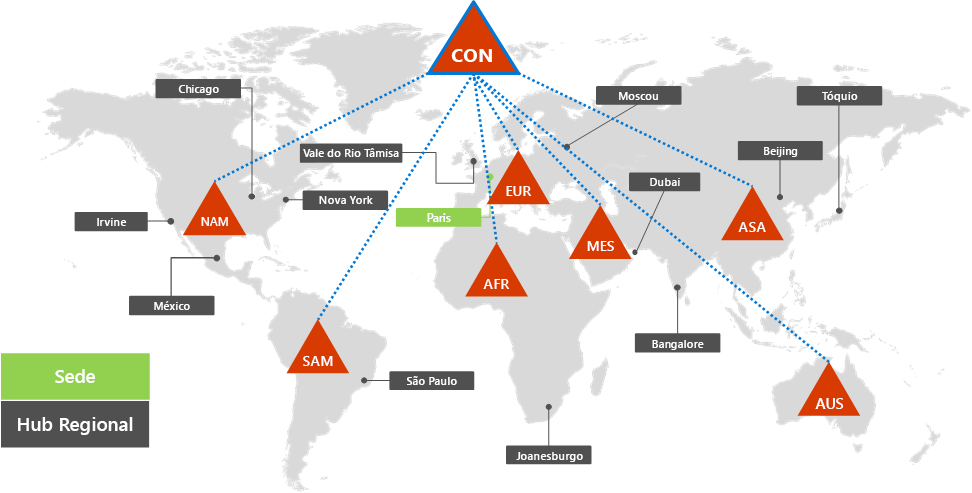
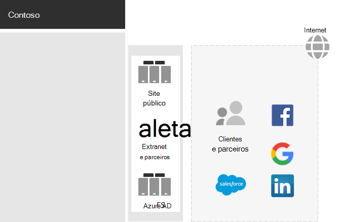
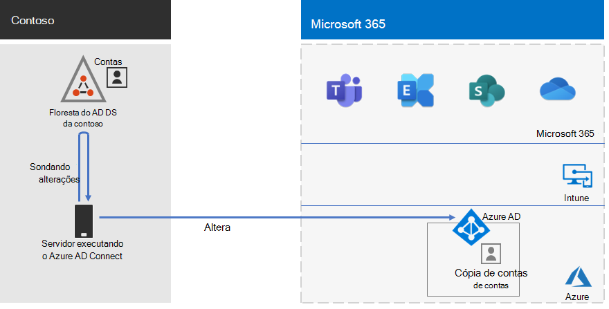
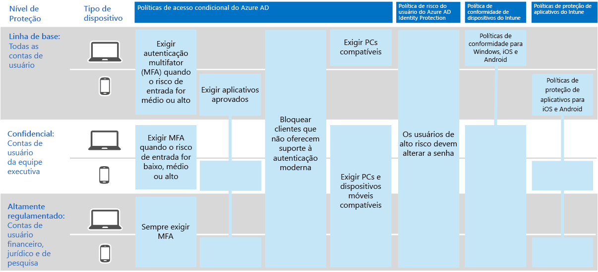

# Identidade para a Contoso CorporationIdentity for the Contoso Corporation

A Microsoft fornece identidade como um serviço (IDaaS) em todas as suas ofertas de nuvem com o Azure Active Directory (Azure AD).Microsoft provides an Identity as a Service (IDaaS) across its cloud offerings with Azure Active Directory (Azure AD). Para adotar o Microsoft 365 Enterprise, a solução IDaaS da Contoso teve que aproveitar seu provedor de identidade local e ainda assim incluir autenticação federada com seus atuais provedores de identidade confiáveis de terceiros.To adopt Microsoft 365 Enterprise, Contoso's IDaaS solution had to leverage their on-premises identity provider and still include federated authentication with their existing trusted, third-party identity providers.

## Floresta dos Serviços de Domínio do Active Directory da ContosoContoso's Active Directory Domain Services forest

A Contoso usa uma única floresta dos Serviços de Domínio do Active Directory (AD DS) para contoso.com com sete subdomínios, uma para cada região do mundo.Contoso uses a single Active Directory Domain Services (AD DS) forest for contoso.com with seven sub-domains, one for each region of the world. A sede, escritórios de hub regionais e escritórios satélite contêm controladores de domínio para autenticação e autorização local.The headquarters, regional hub offices, and satellite offices contain domain controllers for local authentication and authorization.

Esta é a floresta da Contoso com domínios regionais para diferentes partes do mundo que possuem hubs regionais.Here is the Contoso forest with regional domains for the different parts of the world that contain regional hubs.

 
A Contoso queria usar as contas e grupos na floresta de contoso.com para autenticação e autorização de suas cargas de trabalho e serviços do Microsoft 365.Contoso wanted to use the accounts and groups in the contoso.com forest for authentication and authorization for its Microsoft 365 workloads and services.

## Infraestrutura de autenticação federada da ContosoContoso's federated authentication infrastructure

A Contoso permite que:Contoso allows:

- Clientes usem as contas da Microsoft, Facebook ou Google Mail para entrar no site público.Customers to use their Microsoft, Facebook, or Google Mail accounts to sign in to their public web site.
- Fornecedores e parceiros usam as contas do LinkedIn, Salesforce ou Google Mail para entrar na extranet do parceiro.Vendors and partners to use their LinkedIn, Salesforce, or Google Mail accounts to sign in to the partner extranet.

Este é o DMZ da Contoso, que contém um site público, uma extranet parceira e um conjunto de servidores de Serviços de Federação do Active Directory (AD FS).Here is the Contoso DMZ containing a public web site, a partner extranet, and a set of Active Directory Federation Services (AD FS) servers. O DMZ está conectado à Internet que contém clientes, parceiros e serviços de Internet.The DMZ is connected to the Internet that contains customers, partners, and Internet services.

 
Os servidores AD FS na DMZ facilitam a autenticação de credenciais do cliente por seus provedores de identidade para acessar o site público e as credenciais de parceiro para acessar a extranet do parceiro.AD FS servers in the DMZ facilitate the authentication of customer credentials by their identity providers for access to the public web site and partner credentials for access to the partner extranet.

A Contoso decidiu manter essa infraestrutura e dedicar-se a autenticações de clientes e parceiros.Contoso decided to keep this infrastructure and dedicate it to customer and partner authentications. Os arquitetos de identidade da Contoso estão investigando a conversão desta infraestrutura para as soluções do Azure AD [B2B](https://docs.microsoft.com/azure/active-directory/b2b/hybrid-organizations) e [B2C](https://docs.microsoft.com/azure/active-directory-b2c/solution-articles).Contoso identity architects are investigating the conversion of this infrastructure to Azure AD [B2B](https://docs.microsoft.com/azure/active-directory/b2b/hybrid-organizations) and [B2C](https://docs.microsoft.com/azure/active-directory-b2c/solution-articles) solutions.

## Identidade híbrida com sincronização de hash de senha para autenticação baseada na nuvemHybrid identity with password hash synchronization for cloud-based authentication

A Contoso queria aproveitar sua floresta do AD DS local para autenticação para os recursos de nuvem do Microsoft 365.Contoso wanted to leverage its on-premises AD DS forest for authentication to Microsoft 365 cloud resources. Ela escolheu sincronização de hash de senha (PHS).It decided on password hash synchronization (PHS).

A PHS sincroniza a floresta do AD DS local com o locatário do Azure AD de sua assinatura do Microsoft 365 Enterprise, copiando contas de usuários e de grupo e uma versão especificada como hash de senhas de contas de usuários.PHS synchronizes the on-premises AD DS forest with the Azure AD tenant of their Microsoft 365 Enterprise subscription, copying user and group accounts and a hashed version of user account passwords. 

Para realizar a sincronização de diretórios em andamento, a Contoso implantou a ferramenta Azure AD Connect em um servidor no seu datacenter em Paris.To perform the ongoing directory synchronization, Contoso has deployed the Azure AD Connect tool on a server in its Paris datacenter. 

Este é o servidor executando o Azure AD Connect sondando mudanças na floresta do AD DS da Contoso e sincronizando essas mudanças com o locatário do Azure AD.Here is the server running Azure AD Connect polling the Contoso AD DS forest for changes and then synchronizing those changes with the Azure AD tenant.

 
## Políticas de Acesso Condicional para acesso de identidades e dispositivosConditional Access policies for identity and device access

A Contoso criou um conjunto de [políticas de Acesso Condicional](identity-access-policies.md) do Azure AD e Intune para três níveis de proteção:Contoso created a set of Azure AD and Intune [Conditional Access policies](identity-access-policies.md) for three protection levels:

- Proteções de **linha de base** aplicam-se a todas as contas de usuários**Baseline** protections apply to all user accounts
- Proteções **confidenciais** aplicam-se à liderança sênior e equipe executiva**Sensitive** protections apply to senior leadership and executive staff
- Proteções **altamente controladas** aplicam-se a usuários específicos nos departamentos de finanças, jurídico e de pesquisa que têm acesso a dados altamente controlados.**Highly Regulated** protections apply to specific users in the finance, legal, and research departments that have access to highly regulated data

Este é o conjunto resultante de políticas de Acesso Condicional de identidades e dispositivos da Contoso.Here is Contoso's resulting set of identity and device Conditional Access policies.

 
## Próxima etapaNext step

[Saiba](contoso-win10.md) mais sobre como a Contoso utiliza a infraestrutura do Microsoft Endpoint Configuration Manager para implantar e manter o Windows 10 Enterprise atualizado em toda a organização.[Learn](contoso-win10.md) how Contoso is leveraging its Microsoft Endpoint Configuration Manager infrastructure to deploy and keep current Windows 10 Enterprise across its organization.

## Confira tambémSee also

[Identidade para Microsoft 365 EnterpriseIdentity for Microsoft 365 Enterprise](identity-infrastructure.md)

[Guia de implantaçãoDeployment guide](deploy-microsoft-365-enterprise.md)

[Guias de laboratório de testeTest lab guides](m365-enterprise-test-lab-guides.md)
