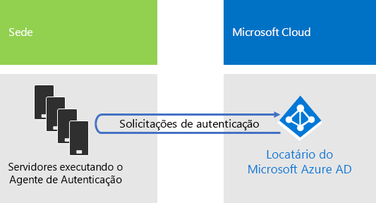

# Identidade para a Contoso Corporation

**Resumo:** como a Contoso tira proveito da Identidade como um Serviço (IDaaS) e fornece autenticação baseada em nuvem para seus funcionários e autenticação federada para seus clientes e parceiros.

A Microsoft fornece IDaaS (Identidade como um Serviço) em suas ofertas de nuvem com o Azure Active Directory (AD). Para adotar o Microsoft 365 Enterprise, a solução de IDaaS da Contoso teve que aproveitar seu provedor de identidade local e ainda assim incluir autenticação federada com seus atuais provedores de identidade confiáveis de terceiros.

## Floresta do AD do Windows Server da Contoso

A Contoso usa uma única floresta do AD (Active Directory) do Windows Server para contoso.com com sete subdomínios, um para cada região do mundo. A sede, os escritórios de hubs regionais e filiais contêm controladores de domínio para autenticação e autorização locais.

A Figura 1 mostra a floresta da Contoso com domínios regionais para diferentes partes do mundo que possuem hubs regionais.

 
**Figura 1: floresta e domínios da Contoso em todo o mundo**

A Contoso deseja usar as contas e os grupos na floresta contoso.com para autenticação e autorização dos respectivos aplicativos e cargas de trabalho baseados em nuvem.

## Infraestrutura de autenticação federada da Contoso

A Contoso permite que:

- Clientes usem as contas da Microsoft, Facebook ou Google Mail para entrar no site público.
- Fornecedores e parceiros usam as contas do LinkedIn, Salesforce ou Google Mail para entrar na extranet do parceiro.

A Figura 2 mostra a DMZ da Contoso, contendo um site público, uma extranet de parceiro e um conjunto de servidores dos Serviços de Federação do Active Directory (AD FS). A DMZ está conectada à Internet, onde estão os clientes, parceiros e serviços de Internet.

**Figura 2: suporte da Contoso para autenticação federada para clientes e parceiros**
 
Os servidores AD FS (Serviços de Federação do Active Directory) na DMZ autenticam as credenciais do cliente para acesso ao site público e as credenciais de parceiro para acesso à extranet do parceiro.

A Contoso decidiu manter esta infraestrutura e dedicá-la a autenticações de parceiros e clientes. Os engenheiros de identidade da Contoso estão investigando a conversão desta infraestrutura para as soluções de [B2B](https://docs.microsoft.com/azure/active-directory/b2b/hybrid-organizations) e [B2C](https://docs.microsoft.com/azure/active-directory-b2c/solution-articles) do Azure AD.

## Identidade híbrida com autenticação de passagem para autenticação baseada em nuvem

A Contoso queria aproveitar a floresta local do AD do Windows Server para autenticação nos recursos de nuvem do Microsoft 365. Ela decidiu usar autenticação de passagem (PTA) com sincronização de hash de senha (PHS).

### Autenticação PTA

Para autenticação de credenciais de usuário, a Contoso está usando PTA. Quando um usuário da Contoso acessa recursos de nuvem, as credenciais que ele envia são passadas pelo Azure AD para um servidor que executa um Agente de Autenticação no datacenter sede da Contoso. Um desses servidores de Agente de Autenticação valida as credenciais de usuário em nome do Azure AD.

A Figura 3 mostra um conjunto de servidores na sede da Contoso executando o Agente de Autenticação, que processa solicitações de autenticação passadas para ele do Azure AD. 

 
**Figura 3: infraestrutura de autenticação de passagem da Contoso**

A Contoso escolheu a autenticação de passagem para atender ao requisito de segurança no qual todas as tentativas de autenticação são avaliadas para alteração imediata a estados de conta de usuário, políticas de senha e horas de entrada na floresta local do AD do Windows Server.

### PHS

A PHS sincroniza a floresta do AD do Windows Server local com o locatário do Azure AD da assinatura do Microsoft 365 Enterprise, copiando contas de usuário e grupo e uma versão de hash de senhas da conta. A Contoso decidiu usar a PHS para oferecer um método alternativo de autenticação diretamente com o locatário do Azure AD, caso esse PTA não esteja disponível.

Para executar a sincronização de diretório contínua, a Contoso implantou a ferramenta Azure AD Connect em um servidor no seu datacenter em Paris. A Figura 4 mostra o servidor que executa o Azure AD Connect sondando a floresta do AD do Windows Server da Contoso para procurar alterações e sincronizá-las com o locatário do Azure AD.

 
**Figura 4: infraestrutura PHS de sincronização de diretórios da Contoso**

## Políticas de acesso condicional para identidade

A Contoso criou um conjunto de [políticas de acesso condicional](identity-access-policies.md) do Azure AD para garantir que a autenticação multifator e as alterações de senha sejam impostas quando o Azure AD determinar que há risco de entrada para uma solicitação de autenticação.

A Figura 5 mostra o conjunto de políticas de acesso condicional para identidade resultante.

 
**Figura 5: políticas de acesso condicional baseado em identidade da Contoso**

## Próxima etapa

[Saiba](contoso-win10.md) mais sobre como a Contoso utiliza a infraestrutura do System Center Configuration Manager para implantar e manter o Windows 10 Enterprise atualizado em toda a organização.

## Confira também

[Identidade para Microsoft 365 Enterprise](identity-infrastructure.md)

[Guia de implantação](deploy-microsoft-365-enterprise.md)

[Guias de laboratório de teste](m365-enterprise-test-lab-guides.md)
