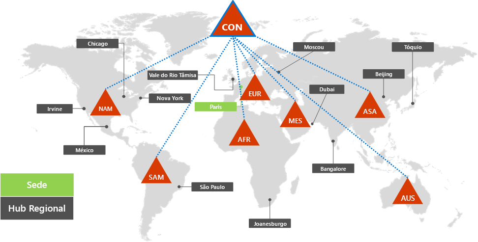
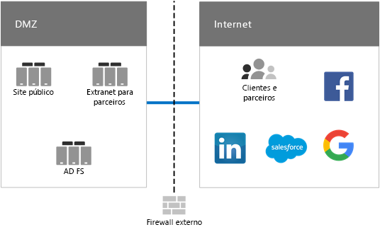
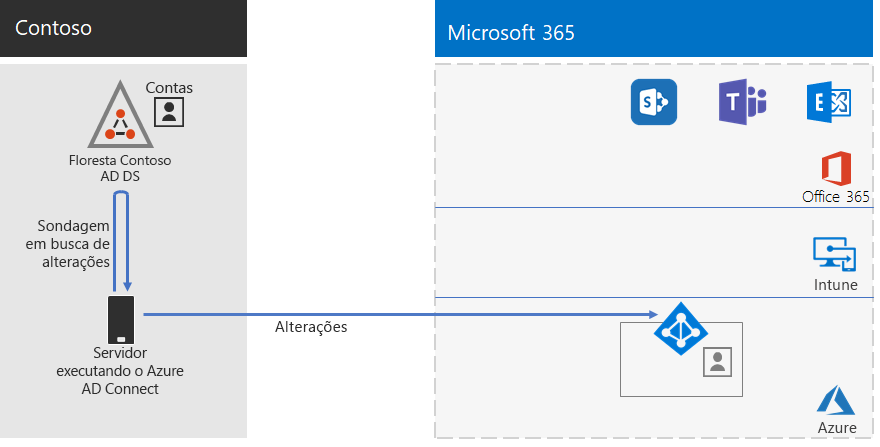
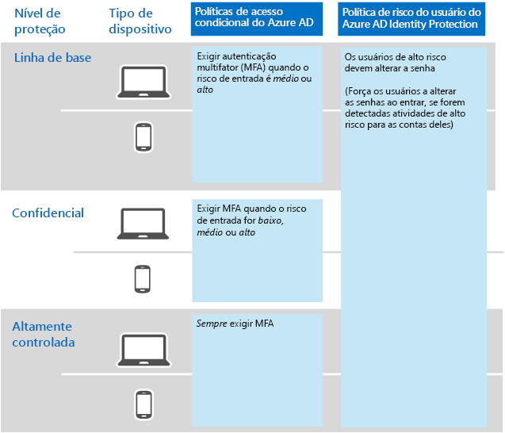

# Identidade para a Contoso Corporation

**Resumo:** como a Contoso tira proveito da Identidade como um Serviço (IDaaS) e fornece autenticação baseada em nuvem para seus funcionários e autenticação federada para seus clientes e parceiros.

A Microsoft fornece identidade como um serviço (IDaaS) em todas as suas ofertas de nuvem com o Azure Active Directory (Azure AD). Para adotar o Microsoft 365 Enterprise, a solução IDaaS da Contoso teve que aproveitar seu provedor de identidade local e ainda assim incluir autenticação federada com seus atuais provedores de identidade confiáveis de terceiros.

## Floresta dos Serviços de Domínio do Active Directory da Contoso

A Contoso usa uma única floresta dos Serviços de Domínio do Active Directory (AD DS) para contoso.com com sete subdomínios, uma para cada região do mundo. A sede, escritórios de hub regionais e escritórios satélite contêm controladores de domínio para autenticação e autorização local.

Esta é a floresta da Contoso com domínios regionais para diferentes partes do mundo que possuem hubs regionais.

 
A Contoso queria usar as contas e grupos na floresta de contoso.com para autenticação e autorização de suas cargas de trabalho e serviços do Microsoft 365.

## Infraestrutura de autenticação federada da Contoso

A Contoso permite que:

- Clientes usem as contas da Microsoft, Facebook ou Google Mail para entrar no site público.
- Fornecedores e parceiros usam as contas do LinkedIn, Salesforce ou Google Mail para entrar na extranet do parceiro.

Este é o DMZ da Contoso, que contém um site público, uma extranet parceira e um conjunto de servidores de Serviços de Federação do Active Directory (AD FS). O DMZ está conectado à Internet que contém clientes, parceiros e serviços de Internet.

 
Os servidores AD FS na DMZ facilitam a autenticação de credenciais do cliente por seus provedores de identidade para acessar o site público e as credenciais de parceiro para acessar a extranet do parceiro.

A Contoso decidiu manter essa infraestrutura e dedicar-se a autenticações de clientes e parceiros. Os arquitetos de identidade da Contoso estão investigando a conversão desta infraestrutura para as soluções do Azure AD [B2B](https://docs.microsoft.com/azure/active-directory/b2b/hybrid-organizations) e [B2C](https://docs.microsoft.com/azure/active-directory-b2c/solution-articles).

## Identidade híbrida com sincronização de hash de senha para autenticação baseada na nuvem

A Contoso queria aproveitar sua floresta do AD DS local para autenticação para os recursos de nuvem do Microsoft 365. Ela escolheu sincronização de hash de senha (PHS).

A PHS sincroniza a floresta do AD DS local com o locatário do Azure AD de sua assinatura do Microsoft 365 Enterprise, copiando contas de usuários e de grupo e uma versão especificada como hash de senhas de contas de usuários. 

Para realizar a sincronização de diretórios em andamento, a Contoso implantou a ferramenta Azure AD Connect em um servidor no seu datacenter em Paris. 

Este é o servidor executando o Azure AD Connect sondando mudanças na floresta do AD DS da Contoso e sincronizando essas mudanças com o locatário do Azure AD.

 
## Políticas de Acesso Condicional para acesso de identidades e dispositivos

A Contoso criou um conjunto de [políticas de Acesso Condicional](identity-access-policies.md) do Azure AD e Intune para três níveis de proteção:

- Proteções de **linha de base** aplicam-se a todas as contas de usuários
- Proteções **confidenciais** aplicam-se à liderança sênior e equipe executiva
- Proteções **altamente controladas** aplicam-se a usuários específicos nos departamentos de finanças, jurídico e de pesquisa que têm acesso a dados altamente controlados.

Este é o conjunto resultante de políticas de Acesso Condicional de identidades e dispositivos da Contoso.

 
## Próxima etapa

[Saiba](contoso-win10.md) mais sobre como a Contoso utiliza a infraestrutura do System Center Configuration Manager para implantar e manter o Windows 10 Enterprise atualizado em toda a organização.

## Confira também

[Identidade para Microsoft 365 Enterprise](identity-infrastructure.md)

[Guia de implantação](deploy-microsoft-365-enterprise.md)

[Guias de laboratório de teste](m365-enterprise-test-lab-guides.md)
