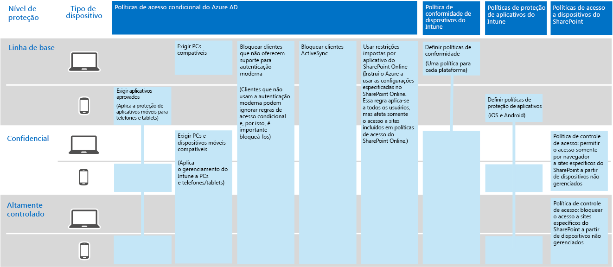
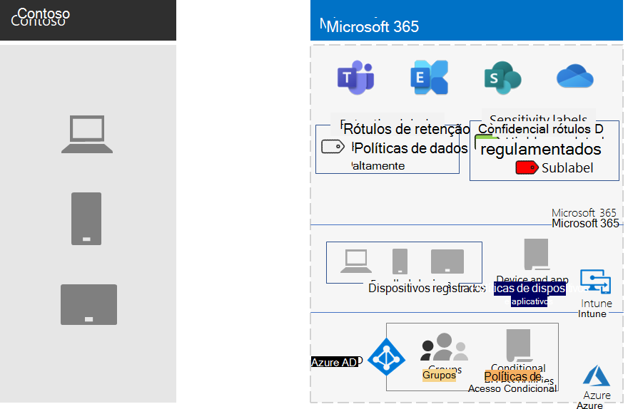

# Proteção de Informações da Contoso Corporation

A Contoso se preocupa com sua segurança e proteção de informações. Por exemplo, o vazamento ou a destruição de sua propriedade intelectual que descreve projetos de produtos e técnicas patenteadas de fabricação, colocaria você em desvantagem competitiva.

Antes de migrar seus ativos digitais mais importantes e confidenciais para a nuvem, eles verificaram se seus requisitos de classificação e proteção de informações no local eram compatíveis e implementados nos serviços baseados em nuvem do Microsoft 365 Enterprise.

## Classificação de segurança de dados da Contoso

A Contoso realizou uma análise de seus dados e determinou os níveis a seguir.

||||
|:-------|:-----|:-----|
| **Nível 1: linha de base** | **Nível 2: confidencial** | **Nível 3: altamente controlado** |
| Os dados são criptografados e estão disponíveis somente para usuários autenticados.     Fornecido para todos os dados armazenados localmente e em armazenamento e cargas de trabalho baseados em nuvem, como o Office 365. Os dados são criptografados enquanto estão no serviço e em trânsito entre o serviço e os dispositivos do cliente.    Exemplos de dados de Nível 1 são comunicações de negócios normais (email) e arquivos para trabalhadores administrativos, de vendas e de suporte. | Nível 1 mais autenticação forte e proteção contra perda de dados.     A autenticação forte inclui a Autenticação Multifator do Microsoft Azure (MFA) com a validação de SMS. A prevenção de perdas de dados garante que informações confidenciais ou críticas não trafeguem fora da nuvem da Microsoft.    Exemplos de dados de Nível 2 são informações financeiras e legais e dados de pesquisa e desenvolvimento para novos produtos. | Nível 2 mais os níveis mais altos de criptografia, autenticação e auditoria.      Os níveis mais altos de criptografia de dados em repouso e na nuvem, em conformidade com os regulamentos regionais, combinados a MFA com cartões inteligentes, auditoria e alerta granulares.     Exemplos de dados de Nível 3 são informações de identificação pessoal do cliente e do parceiro, especificações de engenharia de produto e técnicas de fabricação proprietárias.  |
||||

## Políticas de informações da Contoso
As tabela a seguir lista as políticas de informações da Contoso.

|||||
|:-------|:-----|:-----|:-----|
|  | **Acesso** | **Retenção de dados** | **Proteção de informações** |
| Baixo valor de negócios (Nível 1: Linha de base) | Permitir acesso a todos  | 6 meses | Usar criptografia. |
| Valor médio de negócios (Nível 2: Confidencial) | Permitir acesso a funcionários, fornecedores e parceiros da Contoso     Usar a MFA, o Protocolo TLS e o Gerenciamento de Aplicativos Móveis (MAM) | 2 anos  | Usar valores de hash para integridade de dados.  |
| Alto valor de negócios (Nível 3: altamente controlado) | Permitir acesso aos executivos e clientes potenciais em engenharia e fabricação.     Rights Management System (RMS) somente com dispositivos de rede gerenciados.  | 7 anos  | Usar assinaturas digitais para não repúdio.  |
|||||

## Caminho da Contoso para a proteção de informações com o Microsoft 365 Enterprise

A Contoso usou as seguintes etapas para preparar o Microsoft 365 Enterprise para os requisitos de proteção de informações:

1. Identificou quais informações deveria proteger

   A Contoso realizou uma extensa revisão de seus ativos digitais existentes localizados em sites e compartilhamentos de arquivos locais do SharePoint e classificou cada um deles.

2. Determinou políticas de acesso, de retenção e de proteção de informações para níveis de dados

   Com base nos níveis de dados, a Contoso determinou requisitos de política detalhados, que foram usados para proteger ativos digitais existentes quando eles foram movidos para a nuvem.

3. Criou rótulos de confidencialidade e suas configurações para os diferentes níveis de informações

   A Contoso criou rótulos de confidencialidade para seus níveis de dados, com rótulos altamente regulamentados incluindo criptografia, permissões e marcas d'água.

4.  Moveu dados de sites do SharePoint e compartilhamentos de arquivos locais para seus novos sites do SharePoint

    Os arquivos migrados para os novos sites do SharePoint herdaram os rótulos de retenção padrão atribuídos ao site.

5.  Treinou funcionários para usar os rótulos de confidencialidade para novos documentos, como interagir com a TI da Contoso ao criar novos sites do SharePoint e sempre armazenar ativos digitais em sites do SharePoint.

    Considerou a parte mais difícil da transição da proteção de informações para a nuvem. Era necessário que a TI e o gerenciamento da Contoso mudassem os maus hábitos de armazenamento de informações dos funcionários da organização para sempre rotular e armazenar seus ativos digitais na nuvem, evitando usar compartilhamentos de arquivos locais e nunca usar serviços de armazenamento em nuvem de terceiros ou unidades USB.

## Políticas de Acesso Condicional para proteção de informações

Juntamente com sua infraestrutura de gerenciamento de identidade e dispositivo móvel e como parte de sua implementação do Exchange Online e do SharePoint, a Contoso configurou o seguinte conjunto de políticas de Acesso Condicional e as aplicou aos grupos apropriados:

- [Acesso de aplicativo gerenciados e não gerenciado e políticas de dispositivos](identity-access-policies.md)
- [Políticas de acesso do Exchange Online](secure-email-recommended-policies.md)
- [Políticas de acesso do SharePoint](sharepoint-file-access-policies.md)

Este é o conjunto de políticas resultantes da proteção de informações da Contoso.

>[!Note]
>A Contoso também configurou políticas de Acesso condicional adicionais para identidade e entrada.  Confira, [Identidade da Contoso Corporation](contoso-identity.md#conditional-access-policies-for-identity-and-device-access).
>

Essas políticas garantem que:

- Os aplicativos sejam permitidos e as ações que eles podem realizar sejam definidas por políticas de proteção de aplicativo.
- PCs e dispositivos móveis devem estar compatíveis.
- O Exchange Online utilize a criptografia de mensagem do Office 365 para o Exchange Online.
- O SharePoint usa restrições impostas pelo aplicativo.
- O SharePoint usa políticas de controle de acesso para acesso somente por navegador e para bloquear o acesso de dispositivos não gerenciados.

## Mapear recursos do Microsoft 365 Enterprise para os níveis de dados da Contoso

A tabela a seguir mapeia os níveis de dados da Contoso para os recursos de proteção de informações no Microsoft 365 Enterprise.

|||||
|:-------|:-----|:-----|:-----|
| | **Office 365** | **Aplicativos do Windows 10 e do Microsoft 365 para empresas** | **EMS** |
| Nível 1: linha de base  | Políticas de Acesso Condicional do SharePoint e do Exchange Online   Permissões em sites do SharePoint  | Rótulos de confidencialidade   BitLocker   Proteção de Informações do Windows | Políticas de Acesso Condicional de Dispositivos e políticas de Gerenciamento de Aplicativos Móveis |
| Nível 2: Confidencial | Nível 1 mais:     Rótulos de confidencialidade   Rótulos de retenção do Microsoft 365 em sites do SharePoint   Prevenção contra perda de dados do SharePoint Online e do Exchange Online   Sites isolados do SharePoint   | Nível 1 mais:     Rótulos de confidencialidade em ativos digitais  | Nível 1 |
| Nível 3: altamente controlado | Nível 2 mais:    Criptografia BYOK (Traga sua própria chave) e proteção de informações de segredos comerciais   Azure Key Vault para aplicativos de linha de negócios que interagem com os serviços do Microsoft 365 | Nível 2 | Nível 1 |
|||||

Estas são as configurações resultantes da proteção de informações da Contoso.

## Próxima etapa

[Veja](contoso-security-summary.md) como a Contoso usa os recursos de segurança do Microsoft 365 Enterprise para identidade e gerenciamento de acesso, proteção contra ameaças, proteção de informações e gerenciamento de segurança.

## Confira também

[Proteção de Informações para o Microsoft 365 Enterprise](infoprotect-infrastructure.md)

[Guia de implantação](deploy-microsoft-365-enterprise.md)

[Guias de laboratório de teste](m365-enterprise-test-lab-guides.md)

