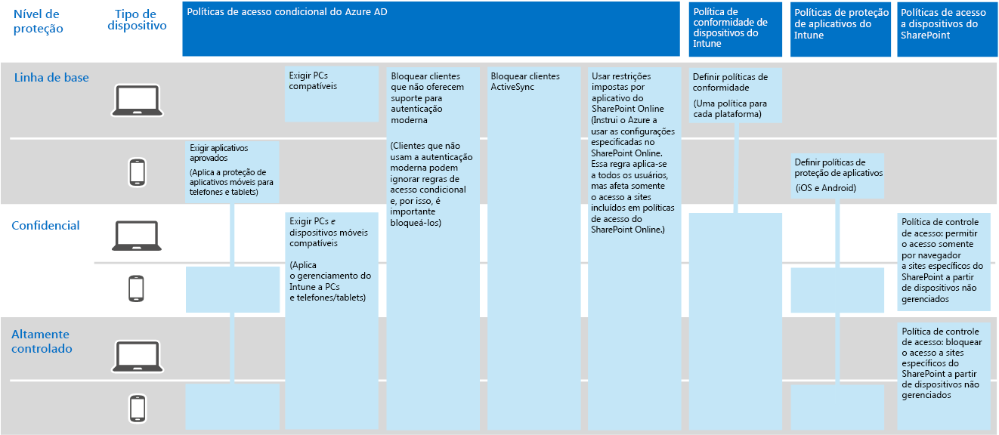

# Proteção de Informações da Contoso CorporationInformation protection for the Contoso Corporation

**Resumo:** entenda como a Contoso usa recursos de proteção de informações no Microsoft 365 Enterprise para proteger seus ativos digitais na nuvem.**Summary:** Understand how Contoso uses information protection features in Microsoft 365 Enterprise to secure their digital assets in the cloud.

A Contoso se preocupa com sua segurança e proteção de informações. Por exemplo, o vazamento ou a destruição de sua propriedade intelectual que descreve projetos de produtos e técnicas patenteadas de fabricação, colocaria você em desvantagem competitiva.Contoso is serious about their information security and protection. For example, leakage or destruction of their intellectual property describing product designs and proprietary manufacturing techniques would place them at a competitive disadvantage.

Antes de migrar seus ativos digitais mais importantes e confidenciais para a nuvem, eles verificaram se seus requisitos de classificação e proteção de informações no local eram compatíveis e implementados nos serviços baseados em nuvem do Microsoft 365 Enterprise.Before moving their sensitive and most valuable digital assets to the cloud, they made sure that their on-premises information classification and protection requirements were supported and implemented in the cloud-based services of Microsoft 365 Enterprise.

## Classificação de segurança de dados da ContosoContoso's data security classification

A Contoso realizou uma análise de seus dados e determinou os níveis a seguir.Contoso performed an analysis of their data and determined the following levels.

||||
|:-------|:-----|:-----|
| **Nível 1: linha de base****Level 1: Baseline** | **Nível 2: confidencial****Level 2: Sensitive** | **Nível 3: altamente controlado****Level 3: Highly regulated** |
| Os dados são criptografados e estão disponíveis somente para usuários autenticadosData is encrypted and available only to authenticated users     Fornecido para todos os dados armazenados localmente e em armazenamento e cargas de trabalho baseados em nuvem, como o Office 365. Os dados são criptografados enquanto estão no serviço e em trânsito entre o serviço e os dispositivos do cliente.Provided for all data stored on premises and in cloud-based storage and workloads, such as Office 365. Data is encrypted while it resides in the service and in transit between the service and client devices.    Exemplos de dados de Nível 1 são comunicações de negócios normais (email) e arquivos para trabalhadores administrativos, de vendas e de suporte.Examples of Level 1 data are normal business communications (email) and files for administrative, sales, and support workers. | Nível 1 mais autenticação forte e proteção contra perda de dados:Level 1 plus strong authentication and data loss protection:     A autenticação forte inclui autenticação multifator com validação de SMS. A prevenção de perda de dados garante que informações confidenciais ou críticas não trafeguem fora da rede local.Strong authentication includes multi-factor authentication with SMS validation. Data loss prevention ensures that sensitive or critical information does not travel outside the on-premises network.    Exemplos de dados de Nível 2 são informações financeiras e legais e dados de pesquisa e desenvolvimento para novos produtos.Examples of Level 2 data are financial and legal information and research and development data for new products. | Nível 2 mais os níveis mais altos de criptografia, autenticação e auditoria.Level 2 plus the highest levels of encryption, authentication, and auditing.      Os níveis mais altos de criptografia de dados em repouso e na nuvem, de modo compatível com os regulamentos regionais, combinados com autenticação multifator com cartões inteligentes e auditoria e alertas granulares.The highest levels of encryption for data at rest and in the cloud, compliant with regional regulations, combined with multi-factor authentication with smart cards and granular auditing and alerting.     Exemplos de dados de Nível 3 são informações de identificação pessoal do cliente e do parceiro, especificações de engenharia de produto e técnicas de fabricação proprietárias.Examples of Level 3 data are customer and partner personally identifiable information, product engineering specifications, and proprietary manufacturing techniques.  |
||||

## Políticas de informações da ContosoContoso's information policies
As tabela a seguir lista as políticas de informações da Contoso.The following table lists Contoso's information policies.

|||||
|:-------|:-----|:-----|:-----|
|  | **Acesso****Access** | **Retenção de dados****Data retention** | **Proteção de Informações****Information protection** |
| Nível 1: baixo valor de negócios (linha de base)Level 1: Low business value (Baseline) | Permitir acesso a todosAllow access to all  | Seis meses6 months | Usar criptografiaUse encryption |
| Nível 2: valor médio de negócios (confidencial)Level 2: Medium business value (Sensitive) | Permitir acesso a funcionários, fornecedores e parceiros da ContosoAllow access to Contoso employees, subcontractors, and partners     Usar a MFA (autenticação multifator), protocolo TLS e o Gerenciamento de Aplicativos Móveis (MAM)Use multi-factor authentication (MFA), Transport Layer Security (TLS), and Mobile Application Management (MAM) | Dois anos2 years  | Usar valores de hash para integridade de dadosUse hash values for data integrity  |
| Nível 3: alto valor de negócios (altamente controlado)Level 3: High business value (Highly regulated) | Permitir acesso aos executivos e clientes potenciais em engenharia e fabricaçãoAllow access to executives and leads in engineering and manufacturing     Rights Management System (RMS) com dispositivos de rede gerenciados somenteRights Management System (RMS) with managed network devices only  | Sete anos7 years  | Usar assinaturas digitais para não repúdioUse digital signatures for non-repudiation  |
|||||

## Caminho da Contoso para a proteção de informações com o Microsoft 365 EnterpriseContoso’s path to information protection with Microsoft 365 Enterprise

A Contoso usou as seguintes etapas para preparar o Microsoft 365 Enterprise para os requisitos de proteção de informações:Contoso used the following steps to prepare Microsoft 365 Enterprise for their information protection requirements:

1. Identificou quais informações deveria protegerIdentified what information to protect

   A Contoso realizou uma extensa revisão de seus ativos digitais existentes localizados em sites e compartilhamentos de arquivos locais do SharePoint e classificou cada um deles.Contoso did an extensive review of their existing digital assets located on on-premises SharePoint sites and file shares and classified each one.

2. Determinou políticas de acesso, de retenção e de proteção de informações para níveis de dadosDetermined access, retention, and information protection policies for data levels

   Com base nos níveis de dados, a Contoso determinou requisitos de política detalhados, que foram usados para proteger ativos digitais existentes quando eles foram movidos para a nuvem.Based on the data levels, Contoso determined detailed policy requirements, which were used to protect existing digital assets as they were moved to the cloud.

3. Criou rótulos da Proteção de Informações do Azure e suas configurações para os diferentes níveis de informaçõesCreated Azure Information Protection labels and their settings for the different levels of information

   A Contoso modificou os rótulos padrão da Proteção de Informações do Azure com os títulos que correspondem aos níveis de dados e configurou os rótulos Confidencial e Altamente controlado para criptografar com a chave de nuvem do Azure. Eles criaram sub-rótulos do rótulo Altamente controlado para tipos específicos de dados de segredos comerciais e limitaram seu acesso a grupos específicos de pesquisa e desenvolvimento. A Contoso também implantou o cliente da Proteção de Informações do Microsoft Azure em todos os dispositivos e computadores Windows.Contoso modified the default Azure Information Protection labels with the titles that match their data levels and configured the Sensitive and Highly regulated labels to encrypt with Azure cloud key. They created sub-labels of the Highly regulated label for specific types of trade secret data and confined their access to specific research and development groups. Contoso also deployed the Azure Information Protection client to all Windows PCs and devices.

4. Criou sites protegidos do SharePoint Online para dados confidenciais e altamente controlados com permissões que bloqueiam o acessoCreated protected SharePoint Online sites for sensitive and highly regulated data with permissions that lock down access

   Os sites confidenciais e altamente controlados foram configurados como [sites isolados](https://docs.microsoft.com/office365/enterprise/isolated-sharepoint-online-team-sites), nos quais as permissões de site de equipe padrão do SharePoint Online foram personalizadas para grupos do Azure AD. Os sites confidenciais e altamente controlados do SharePoint Online também foram configurados com um rótulo padrão do Office 365. Os arquivos armazenados em sites altamente controlados do SharePoint Online são protegidos com um sub-rótulo de AIP (Proteção de Informações do Azure) de uma política com escopo. Para saber mais, confira o cenário [Sites do Microsoft Teams e do SharePoint Online para dados altamente controlados](teams-sharepoint-online-sites-highly-regulated-data.md).Both sensitive and highly regulated sites were configured as [isolated sites](https://docs.microsoft.com/office365/enterprise/isolated-sharepoint-online-team-sites), in which the default SharePoint Online team site permissions were customized to Azure AD groups. Sensitive and highly regulated SharePoint Online sites were also configured with a default Office 365 label. Files stored in highly regulated SharePoint Online sites are protected with an Azure Information Protection (AIP) sub-label of a scoped policy. For more information, see the [Microsoft Teams and SharePoint Online sites for highly regulated data](teams-sharepoint-online-sites-highly-regulated-data.md) scenario.

5.  Moveu dados de sites do SharePoint e compartilhamentos de arquivos locais para seus novos sites do SharePoint OnlineMoved data from on-premises SharePoint sites and file shares to their new SharePoint Online sites

    Os arquivos migrados para os novos sites do SharePoint Online herdaram os rótulos padrão do Office 365 atribuídos ao site.The files migrated to the new SharePoint Online sites inherited the default Office 365 labels assigned to the site.

6.  Treinou funcionários para usar os rótulos da Proteção de Informações do Azure para novos documentos, para interagir com a TI da Contoso ao criar novos sites do SharePoint Online e sempre armazenar ativos digitais em sites do SharePoint OnlineTrained employees on how to use Azure Information Protection labels for new documents, how to interact with Contoso IT when creating new SharePoint Online sites, and to always store digital assets on SharePoint Online sites

    Considerou a parte mais difícil da transição da proteção de informações para a nuvem. Era necessário que a TI e o gerenciamento da Contoso mudasse maus hábitos de armazenamento de informações dos funcionários da organização para sempre rotular seus ativos digitais e nunca usar compartilhamentos de arquivos locais.Considered the hardest part of the information protection transition for the cloud, Contoso IT and management needed to change the bad information storage habits of the organization’s employees to always label their digital assets and never use on-premises file shares.

## Políticas de acesso condicional para proteção de informaçõesConditional access policies for information protection

Juntamente com sua infraestrutura de gerenciamento de identidade e dispositivo móvel e como parte de sua implementação do Exchange Online e do SharePoint Online, a Contoso configurou o seguinte conjunto de políticas de acesso condicional e as aplicou aos grupos apropriados do Azure AD:In conjunction with their identity and mobile device management infrastructure and as part of their rollout of Exchange Online and SharePoint Online, Contoso configured the following set of conditional access policies and applied them to the appropriate Azure AD groups:

- [Acesso de aplicativo gerenciados e não gerenciado e políticas de dispositivosManaged and unmanaged application access on devices policies](identity-access-policies.md)
- [Políticas de acesso do Exchange OnlineExchange Online access policies](secure-email-recommended-policies.md)
- [Políticas de acesso do SharePoint OnlineSharePoint Online access policies](sharepoint-file-access-policies.md)

A Figura 1 mostra um conjunto de políticas resultantes da proteção de informações da Contoso.Figure 1 shows Contoso's resulting set of policies for information protection.

**Figura 1: Políticas de acesso condicional do dispositivo, Exchange Online e SharePoint Online****Figure 1: Device, Exchange Online, and SharePoint Online conditional access policies**
 
>[!Note]
>A Contoso também configurou políticas de acesso condicional adicionais para identidade e entrada. Confira [Identidade para a Contoso Corporation](contoso-identity.md).Contoso also configured additional conditional access policies for identity and sign-in. See [Identity for the Contoso Corporation](contoso-identity.md).
>

Essas políticas garantem que:These policies ensure that:

- As políticas de proteção de aplicativos definam quais aplicativos são permitidos e as ações que eles podem realizar com os dados da organização.App protection policies define which apps are allowed and the actions they can take with your organization data.
- PCs e dispositivos móveis devem estar compatíveis.PCs and mobile devices must be compliant.
- O Exchange Online utilize a criptografia de mensagem do Office 365 para o Exchange Online.Exchange Online uses Office 365 message encryption for Exchange Online.
- O SharePoint Online use restrições impostas pelo aplicativo.SharePoint Online uses app enforced restrictions.
- O SharePoint Online use políticas de controle de acesso para acesso somente por navegador e para bloquear o acesso de dispositivos não gerenciados.SharePoint Online uses access control policies for browser-only access and to block access for unmanaged devices.

## Mapear recursos do Microsoft 365 Enterprise para os níveis de dados da ContosoMapping Microsoft 365 Enterprise features to Contoso's data levels

A tabela a seguir mostra o mapeamento dos níveis de dados da Contoso para os recursos de proteção de informações no Microsoft 365 Enterprise.The following table shows the mapping the Contoso's data levels to information protection features in Microsoft 365 Enterprise.

|||||
|:-------|:-----|:-----|:-----|
| | **Office 365****Office 365** | **Windows 10 e Office 365 ProPlus****Windows 10 and Office 365 ProPlus** | **EMS****EMS** |
| Nível 1: linha de baseLevel 1: Baseline  | Políticas de acesso condicional do SharePoint Online e Exchange OnlineSharePoint Online and Exchange Online conditional access policies   Permissões em sites do SharePoint OnlinePermissions on SharePoint Online sites | Cliente da Proteção de Informações do AzureAzure Information Protection client   BitLockerBitLocker   Proteção de Informações do WindowsWindows Information Protection | Políticas de acesso condicional de dispositivos e políticas de Gerenciamento de Aplicativos MóveisDevice conditional access policies and Mobile Application Management policies |
| Nível 2: altamente confidencialLevel 2: Highly sensitive | Nível 1: linha de base mais:Level 1: Baseline plus:     Rótulos da Proteção de Informações do AzureAzure Information Protection labels   Rótulos do Office 365 em sites do SharePoint OnlineOffice 365 labels on SharePoint Online sites   Prevenção contra perda de dados do Office 365 para for SharePoint Online e Exchange OnlineOffice 365 Data Loss Prevention for SharePoint Online and Exchange Online   Sites isolados do SharePoint OnlineIsolated SharePoint Online sites  | Nível 1: linha de base mais:Level 1: Baseline plus:     Rótulos da Proteção de Informações do Azure em ativos digitaisAzure Information Protection labels on digital assets   Gestão de Dados Avançada do Office 365Office 365 Advanced Data Governance | Nível 1: linha de baseLevel 1: Baseline |
| Nível 3: altamente controladoLevel 3: Highly regulated | Nível 2: altamente confidencial mais:Level 2: Highly sensitive plus:    Criptografia BYOK (Traga sua própria chave) e proteção de informações de segredos comerciaisBring Your Own Key (BYOK) encryption and protection for trade secret information   Azure Key Vault para aplicativos de linha de negócios que interagem com os serviços do Office 365Azure Key Vault for line of business applications that interact with Office 365 services | Nível 2: altamente confidencialLevel 2: Highly sensitive | Nível 1: linha de baseLevel 1: Baseline |
|||||

## Próxima etapaNext step

[Veja](contoso-security-summary.md) como a Contoso usa os recursos de segurança do Microsoft 365 Enterprise para identidade e gerenciamento de acesso, proteção contra ameaças, proteção de informações e gerenciamento de segurança.[See](contoso-security-summary.md) how Contoso has used the security features across Microsoft 365 Enterprise for identity and access management, threat protection, information protection, and security management.

## Confira tambémSee also

[Proteção de Informações para o Microsoft 365 EnterpriseInformation protection for Microsoft 365 Enterprise](infoprotect-infrastructure.md)

[Guia de implantaçãoDeployment guide](deploy-microsoft-365-enterprise.md)

[Guias de laboratório de testeTest lab guides](m365-enterprise-test-lab-guides.md)

