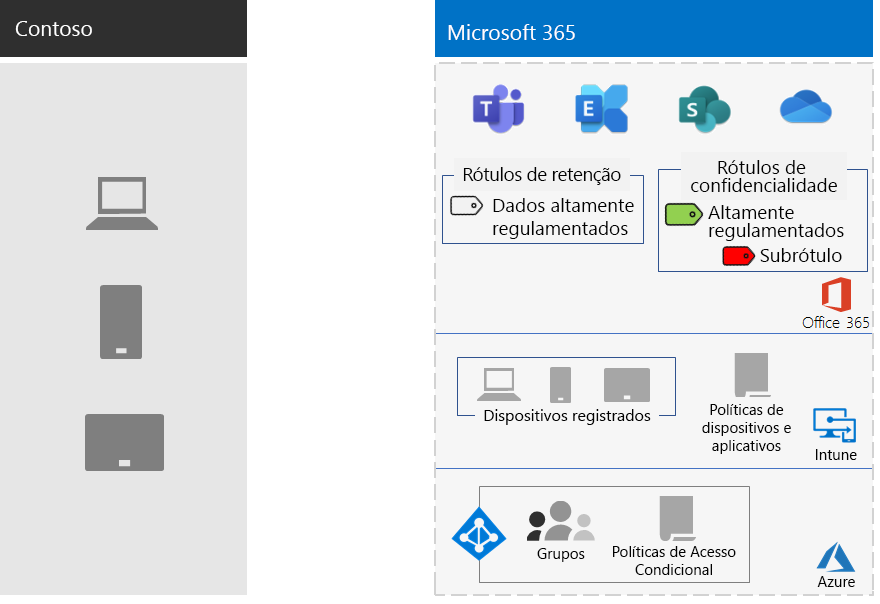

# Proteção de Informações da Contoso CorporationInformation protection for the Contoso Corporation

A Contoso se preocupa com sua segurança e proteção de informações. Por exemplo, o vazamento ou a destruição de sua propriedade intelectual que descreve projetos de produtos e técnicas patenteadas de fabricação, colocaria você em desvantagem competitiva.Contoso is serious about their information security and protection. For example, leakage or destruction of their intellectual property describing product designs and proprietary manufacturing techniques would place them at a competitive disadvantage.

Antes de migrar seus ativos digitais mais importantes e confidenciais para a nuvem, eles verificaram se seus requisitos de classificação e proteção de informações no local eram compatíveis e implementados nos serviços baseados em nuvem do Microsoft 365 Enterprise.Before moving their sensitive and most valuable digital assets to the cloud, they made sure that their on-premises information classification and protection requirements were supported and implemented in the cloud-based services of Microsoft 365 Enterprise.

## Classificação de segurança de dados da ContosoContoso's data security classification

A Contoso realizou uma análise de seus dados e determinou os níveis a seguir.Contoso performed an analysis of their data and determined the following levels.

||||
|:-------|:-----|:-----|
| **Nível 1: linha de base****Level 1: Baseline** | **Nível 2: confidencial****Level 2: Sensitive** | **Nível 3: altamente controlado****Level 3: Highly regulated** |
| Os dados são criptografados e estão disponíveis somente para usuários autenticados.Data is encrypted and available only to authenticated users     Fornecido para todos os dados armazenados localmente e em armazenamento e cargas de trabalho baseados em nuvem, como o Office 365. Os dados são criptografados enquanto estão no serviço e em trânsito entre o serviço e os dispositivos do cliente.Provided for all data stored on premises and in cloud-based storage and workloads, such as Office 365. Data is encrypted while it resides in the service and in transit between the service and client devices.    Exemplos de dados de Nível 1 são comunicações de negócios normais (email) e arquivos para trabalhadores administrativos, de vendas e de suporte.Examples of Level 1 data are normal business communications (email) and files for administrative, sales, and support workers. | Nível 1 mais autenticação forte e proteção contra perda de dados.Level 1 plus strong authentication and data loss protection:     A autenticação forte inclui a Autenticação Multifator do Microsoft Azure (MFA) com a validação de SMS.Strong authentication includes Azure Multi-Factor Authentication (MFA) with SMS validation. A prevenção de perdas de dados garante que informações confidenciais ou críticas não trafeguem fora da nuvem da Microsoft.Strong authentication includes multi-factor authentication with SMS validation. Data loss prevention ensures that sensitive or critical information does not travel outside the on-premises network.    Exemplos de dados de Nível 2 são informações financeiras e legais e dados de pesquisa e desenvolvimento para novos produtos.Examples of Level 2 data are financial and legal information and research and development data for new products. | Nível 2 mais os níveis mais altos de criptografia, autenticação e auditoria.Level 2 plus the highest levels of encryption, authentication, and auditing.      Os níveis mais altos de criptografia de dados em repouso e na nuvem, em conformidade com os regulamentos regionais, combinados a MFA com cartões inteligentes, auditoria e alerta granulares.The highest levels of encryption for data at rest and in the cloud, compliant with regional regulations, combined with multi-factor authentication with smart cards and granular auditing and alerting.     Exemplos de dados de Nível 3 são informações de identificação pessoal do cliente e do parceiro, especificações de engenharia de produto e técnicas de fabricação proprietárias.Examples of Level 3 data are customer and partner personally identifiable information, product engineering specifications, and proprietary manufacturing techniques.  |
||||

## Políticas de informações da ContosoContoso's information policies
As tabela a seguir lista as políticas de informações da Contoso.The following table lists Contoso's information policies.

|||||
|:-------|:-----|:-----|:-----|
|  | **Acesso****Access** | **Retenção de dados****Data retention** | **Proteção de informações****Information protection** |
| Baixo valor de negócios (Nível 1: Linha de base)Low business value (Level 1: Baseline) | Permitir acesso a todosAllow access to all  | 6 meses6 months | Usar criptografia.Use encryption |
| Valor médio de negócios (Nível 2: Confidencial)Medium business value (Level 2: Sensitive) | Permitir acesso a funcionários, fornecedores e parceiros da ContosoAllow access to Contoso employees, subcontractors, and partners     Usar a MFA, o Protocolo TLS e o Gerenciamento de Aplicativos Móveis (MAM)Use multi-factor authentication (MFA), Transport Layer Security (TLS), and Mobile Application Management (MAM) | 2 anos2 years  | Usar valores de hash para integridade de dados.Use hash values for data integrity  |
| Alto valor de negócios (Nível 3: altamente controlado)High business value (Level 3: Highly regulated) | Permitir acesso aos executivos e clientes potenciais em engenharia e fabricação.Allow access to executives and leads in engineering and manufacturing     Rights Management System (RMS) somente com dispositivos de rede gerenciados.Rights Management System (RMS) with managed network devices only  | 7 anos7 years  | Usar assinaturas digitais para não repúdio.Use digital signatures for non-repudiation  |
|||||

## Caminho da Contoso para a proteção de informações com o Microsoft 365 EnterpriseContoso’s path to information protection with Microsoft 365 Enterprise

A Contoso usou as seguintes etapas para preparar o Microsoft 365 Enterprise para os requisitos de proteção de informações:Contoso used the following steps to prepare Microsoft 365 Enterprise for their information protection requirements:

1. Identificou quais informações deveria protegerIdentified what information to protect

   A Contoso realizou uma extensa revisão de seus ativos digitais existentes localizados em sites e compartilhamentos de arquivos locais do SharePoint e classificou cada um deles.Contoso did an extensive review of their existing digital assets located on on-premises SharePoint sites and file shares and classified each one.

2. Determinou políticas de acesso, de retenção e de proteção de informações para níveis de dadosDetermined access, retention, and information protection policies for data levels

   Com base nos níveis de dados, a Contoso determinou requisitos de política detalhados, que foram usados para proteger ativos digitais existentes quando eles foram movidos para a nuvem.Based on the data levels, Contoso determined detailed policy requirements, which were used to protect existing digital assets as they were moved to the cloud.

3. Criou rótulos de confidencialidade e suas configurações para os diferentes níveis de informaçõesCreated sensitivity labels and their settings for the different levels of information

   A Contoso criou rótulos de confidencialidade para seus níveis de dados, com rótulos altamente regulamentados incluindo criptografia, permissões e marcas d'água.Contoso created sensitivity labels for their data levels, with sensitive and highly regulated label including encryption, permissions, and watermarks.

4. Criou sites protegidos do SharePoint para dados confidenciais e altamente regulamentados com permissões que bloqueiam o acessoCreated protected SharePoint Online sites for sensitive and highly regulated data with permissions that lock down access

   Os sites confidenciais e altamente regulamentados foram configurados como [sites isolados](https://docs.microsoft.com/office365/enterprise/isolated-sharepoint-online-team-sites), nos quais as permissões padrão do site de equipe do SharePoint Online foram personalizadas. Both sensitive and highly regulated sites were configured as [isolated sites](https://docs.microsoft.com/office365/enterprise/isolated-sharepoint-online-team-sites), in which the default SharePoint Online team site permissions were customized to Azure Active Directory (Azure AD) groups. Os sites confidenciais e altamente regulamentados do SharePoint também foram configurados com um rótulo de retenção correspondente.Sensitive and highly regulated SharePoint Online sites were also configured with a corrresponding retention label. Os arquivos armazenados em sites altamente regulamentados do SharePoint são protegidos com o rótulo de confidencialidade Altamente Regulamentado.Files stored in highly regulated SharePoint Online sites are protected with the Highly Regulated sensitivity label. Para obter mais informações, confira ao cenário [Sites do SharePoint para dados altamente regulamentados](teams-sharepoint-online-sites-highly-regulated-data.md).For more information, see the [Microsoft Teams and SharePoint Online sites for highly regulated data](teams-sharepoint-online-sites-highly-regulated-data.md) scenario.

5.  Moveu dados de sites do SharePoint e compartilhamentos de arquivos locais para seus novos sites do SharePointMoved data from on-premises SharePoint sites and file shares to their new SharePoint Online sites

    Os arquivos migrados para os novos sites do SharePoint herdaram os rótulos de retenção padrão atribuídos ao site.The files migrated to the new SharePoint Online sites inherited the default retention labels assigned to the site.

6.  Treinou funcionários para usar os rótulos de confidencialidade para novos documentos, como interagir com a TI da Contoso ao criar novos sites do SharePoint e sempre armazenar ativos digitais em sites do SharePoint.Trained employees on how to use sensitivity labels for new documents, how to interact with Contoso IT when creating new SharePoint Online sites, and to always store digital assets on SharePoint Online sites

    Considerou a parte mais difícil da transição da proteção de informações para a nuvem. Era necessário que a TI e o gerenciamento da Contoso mudassem os maus hábitos de armazenamento de informações dos funcionários da organização para sempre rotular e armazenar seus ativos digitais na nuvem, evitando usar compartilhamentos de arquivos locais e nunca usar serviços de armazenamento em nuvem de terceiros ou unidades USB.Considered the hardest part of the information protection transition for the cloud, Contoso IT and management needed to change the bad information storage habits of the organization’s employees to always store and label their digital assets in the cloud, refrain from using on-premises file shares, and never use third-party cloud storage services or USB drives.

## Políticas de Acesso Condicional para proteção de informaçõesConditional access policies for information protection

Juntamente com sua infraestrutura de gerenciamento de identidade e dispositivo móvel e como parte de sua implementação do Exchange Online e do SharePoint, a Contoso configurou o seguinte conjunto de políticas de Acesso Condicional e as aplicou aos grupos apropriados:In conjunction with their identity and mobile device management infrastructure and as part of their rollout of Exchange Online and SharePoint Online, Contoso configured the following set of conditional access policies and applied them to the appropriate Azure AD groups:

- [Acesso de aplicativo gerenciados e não gerenciado e políticas de dispositivosManaged and unmanaged application access on devices policies](identity-access-policies.md)
- [Políticas de acesso do Exchange OnlineExchange Online access policies](secure-email-recommended-policies.md)
- [Políticas de acesso do SharePointSharePoint Online access policies](sharepoint-file-access-policies.md)

Este é o conjunto de políticas resultantes da proteção de informações da Contoso.Figure 1 shows Contoso's resulting set of policies for information protection.

>[!Note]
>A Contoso também configurou políticas de Acesso condicional adicionais para identidade e entrada. Contoso also configured additional Conditional Access policies for identity and sign-in. Confira, [Identidade da Contoso Corporation](contoso-identity.md#conditional-access-policies-for-identity-and-device-access).Identity for the Contoso Corporation
>

Essas políticas garantem que:These policies ensure that:

- Os aplicativos sejam permitidos e as ações que eles podem realizar sejam definidas por políticas de proteção de aplicativo.Apps are allowed and the actions they can take with your organization data are defined by app protection policies.
- PCs e dispositivos móveis devem estar compatíveis.PCs and mobile devices must be compliant.
- O Exchange Online utilize a criptografia de mensagem do Office 365 para o Exchange Online.Exchange Online uses Office 365 message encryption for Exchange Online.
- O SharePoint usa restrições impostas pelo aplicativo.SharePoint Online uses app enforced restrictions.
- O SharePoint usa políticas de controle de acesso para acesso somente por navegador e para bloquear o acesso de dispositivos não gerenciados.SharePoint Online uses access control policies for browser-only access and to block access for unmanaged devices.

## Mapear recursos do Microsoft 365 Enterprise para os níveis de dados da ContosoMapping Microsoft 365 Enterprise features to Contoso's data levels

A tabela a seguir mapeia os níveis de dados da Contoso para os recursos de proteção de informações no Microsoft 365 Enterprise.The following table shows the mapping the Contoso's data levels to information protection features in Microsoft 365 Enterprise.

|||||
|:-------|:-----|:-----|:-----|
| | **Office 365****Office 365** | **Windows 10 e Office 365 ProPlus****Windows 10 and Office 365 ProPlus** | **EMS****EMS** |
| Nível 1: linha de baseLevel 1: Baseline  | Políticas de Acesso Condicional do SharePoint e do Exchange OnlineSharePoint and Exchange Online Conditional Access policies   Permissões em sites do SharePoint Permissions on SharePoint Online sites | Rótulos de confidencialidadeSensitivity labels   BitLockerBitLocker   Proteção de Informações do WindowsWindows Information Protection | Políticas de Acesso Condicional de Dispositivos e políticas de Gerenciamento de Aplicativos MóveisDevice conditional access policies and Mobile Application Management policies |
| Nível 2: ConfidencialLevel 2: Sensitive | Nível 1 mais:Level 1 plus:     Rótulos de confidencialidadeSensitivity labels   Rótulos de retenção do Office 365 em sites do SharePointOffice 365 labels on SharePoint Online sites   Prevenção Contra Perda de Dados do Office 365 para o SharePoint Online e o Exchange OnlineOffice 365 Data Loss Prevention for SharePoint Online and Exchange Online   Sites isolados do SharePoint Isolated SharePoint Online sites  | Nível 1 mais:Level 1 plus:     Rótulos de confidencialidade em ativos digitaisSensitivity labels on digital assets  | Nível 1Level 1 |
| Nível 3: altamente controladoLevel 3: Highly regulated | Nível 2 mais:Level 2 plus:    Criptografia BYOK (Traga sua própria chave) e proteção de informações de segredos comerciaisBring Your Own Key (BYOK) encryption and protection for trade secret information   Azure Key Vault para aplicativos de linha de negócios que interagem com os serviços do Office 365Azure Key Vault for line of business applications that interact with Office 365 services | Nível 2Level 2 | Nível 1Level 1 |
|||||

Estas são as configurações resultantes da proteção de informações da Contoso.Here is Contoso's resulting information protection configuration.

## Próxima etapaNext step

[Veja](contoso-security-summary.md) como a Contoso usa os recursos de segurança do Microsoft 365 Enterprise para identidade e gerenciamento de acesso, proteção contra ameaças, proteção de informações e gerenciamento de segurança.[See](contoso-security-summary.md) how Contoso has used the security features across Microsoft 365 Enterprise for identity and access management, threat protection, information protection, and security management.

## Confira tambémSee also

[Proteção de Informações para o Microsoft 365 EnterpriseInformation protection for Microsoft 365 Enterprise](infoprotect-infrastructure.md)

[Guia de implantaçãoDeployment guide](deploy-microsoft-365-enterprise.md)

[Guias de laboratório de testeTest lab guides](m365-enterprise-test-lab-guides.md)

