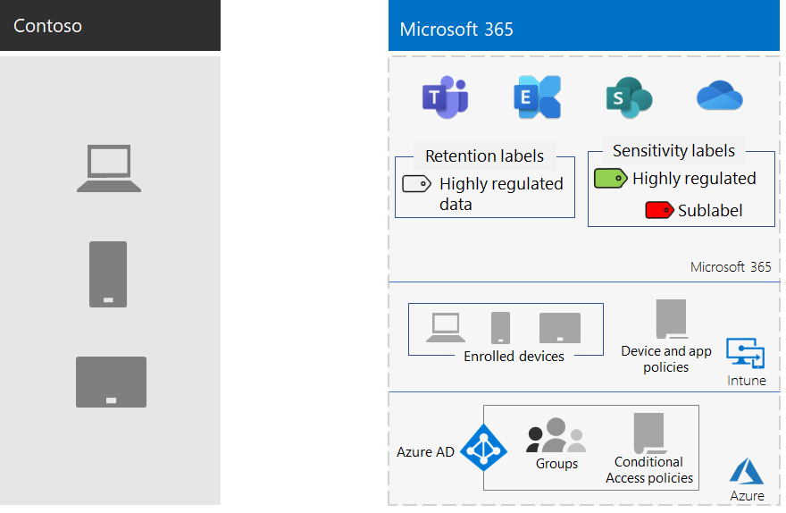

# Proteção de Informações da Contoso CorporationInformation protection for the Contoso Corporation

A Contoso está falando sério sobre a segurança das informações.Contoso is serious about their information security. Vazamento ou destruição de propriedade intelectual que descreve seus designs de produtos e técnicas de fabricação proprietárias os colocaria em desvantagem competitiva.Leakage or destruction of intellectual property that describes their product designs and proprietary manufacturing techniques would place them at a competitive disadvantage.

Antes de mover seus ativos digitais confidenciais para a nuvem, a Contoso se certificava de que seus requisitos de classificação e proteção de informações locais eram suportados pelos serviços baseados na nuvem do Microsoft 365 para empresas.Before moving their sensitive digital assets to the cloud, Contoso made sure that their on-premises information classification and protection requirements were supported by the cloud-based services of Microsoft 365 for enterprise.

## Classificação de segurança de dados da ContosoContoso data security classification

A Contoso realizou uma análise de seus dados e determinou os seguintes níveis de classificação.Contoso performed an analysis of their data and determined the following classification levels.

| Nível 1: linha de baseLevel 1: Baseline | Nível 2: ConfidencialLevel 2: Sensitive | Nível 3: altamente controladoLevel 3: Highly regulated |
|:-------|:-----|:-----|
| Os dados são criptografados e estão disponíveis somente para usuários autenticados.Data is encrypted and available only to authenticated users.    Fornecido para todos os dados armazenados no local e em cargas de trabalho e armazenamento baseados em nuvem.Provided for all data stored on-premises and in cloud-based storage and workloads. Os dados são criptografados enquanto residem no serviço e em trânsito entre o serviço e os dispositivos cliente.Data is encrypted while it resides in the service and in transit between the service and client devices.   Exemplos de dados de Nível 1 são comunicações de negócios normais (email) e arquivos para trabalhadores administrativos, de vendas e de suporte.Examples of Level 1 data are normal business communications (email) and files for administrative, sales, and support workers. | Nível 1 mais autenticação forte e proteção contra perda de dados.Level 1 plus strong authentication and data loss protection.    A autenticação forte inclui Azure AD Multi-Factor Authentication (MFA) com SMS validação.Strong authentication includes Azure AD Multi-Factor Authentication (MFA) with SMS validation. A prevenção contra perda de dados garante que informações confidenciais ou críticas não estejam fora da nuvem da Microsoft.Data loss prevention ensures that sensitive or critical information doesn't travel outside the Microsoft cloud.  Exemplos de dados de Nível 2 são informações financeiras e legais e dados de pesquisa e desenvolvimento para novos produtos.Examples of Level 2 data are financial and legal information and research and development data for new products. | Nível 2 mais os níveis mais altos de criptografia, autenticação e auditoria.Level 2 plus the highest levels of encryption, authentication, and auditing.  Os níveis mais altos de criptografia de dados em repouso e na nuvem, em conformidade com os regulamentos regionais, combinados a MFA com cartões inteligentes, auditoria e alerta granulares.The highest levels of encryption for data at rest and in the cloud, compliant with regional regulations, combined with MFA with smart cards and granular auditing and alerting.   Exemplos de dados de Nível 3 são informações pessoais do cliente e do parceiro, especificações de engenharia de produto e técnicas de manufatura proprietárias.Examples of Level 3 data are customer and partner personal information, product engineering specifications, and proprietary manufacturing techniques.  |
||||

## Políticas de informações da ContosoContoso information policies
A tabela a seguir lista as políticas de informações da Contoso.The following table lists the Contoso information policies.

| ValorValue | AccessAccess | Retenção de dadosData retention | Proteção de informaçõesInformation protection |
|:-------|:-----|:-----|:-----|
| Baixo valor de negócios (Nível 1: Linha de base)Low business value (Level 1: Baseline) | Permitir acesso a todos.Allow access to all.  | 6 meses6 months | Usar criptografia.Use encryption. |
| Valor médio de negócios (Nível 2: Confidencial)Medium business value (Level 2: Sensitive) | Permitir acesso a funcionários, subcontratados e parceiros da Contoso.Allow access to Contoso employees, subcontractors, and partners.    Usar a MFA, o Protocolo TLS e o Gerenciamento de Aplicativos Móveis (MAM)Use MFA, Transport Layer Security (TLS), and Mobile Application Management (MAM). | 2 anos2 years  | Usar valores de hash para integridade de dados.Use hash values for data integrity.  |
| Alto valor de negócios (Nível 3: altamente controlado)High business value (Level 3: Highly regulated) | Permitir acesso aos executivos e clientes potenciais em engenharia e fabricação.Allow access to executives and leads in engineering and manufacturing.     Rights Management System (RMS) somente com dispositivos de rede gerenciados.Rights Management System (RMS) with managed network devices only.  | 7 anos7 years  | Usar assinaturas digitais para não repúdio.Use digital signatures for non-repudiation.  |
|||||

## O caminho da Contoso para a proteção de informações com Microsoft 365 para empresasThe Contoso path to information protection with Microsoft 365 for enterprise

A Contoso seguiu estas etapas para preparar Microsoft 365 para a empresa para seus requisitos de proteção de informações:Contoso followed these steps to prepare Microsoft 365 for enterprise for their information-protection requirements:

1. Identificar quais informações protegerIdentify what information to protect

   A Contoso fez uma revisão extensiva de seus ativos digitais existentes localizados em sites SharePoint sites e compartilhamentos de arquivos e classificou cada ativo.Contoso did an extensive review of their existing digital assets located on on-premises SharePoint sites and file shares and classified each asset.

2. Determinar políticas de acesso, retenção e proteção de informações para níveis de dadosDetermine access, retention, and information protection policies for data levels

   Com base nos níveis de dados, a Contoso determinou requisitos de política detalhados, que foram usados para proteger ativos digitais existentes quando eles foram movidos para a nuvem.Based on the data levels, Contoso determined detailed policy requirements, which were used to protect existing digital assets as they were moved to the cloud.

3. Criar rótulos de sensibilidade e suas configurações para os diferentes níveis de informaçõesCreate sensitivity labels and their settings for the different levels of information

   A Contoso criou rótulos de confidencialidade para seus níveis de dados, com rótulos altamente regulamentados incluindo criptografia, permissões e marcas d'água.Contoso created sensitivity labels for their data levels, with their highly regulated label that includes encryption, permissions, and watermarks.

4.  Mover dados de sites SharePoint locais e compartilhamentos de arquivos para seus novos SharePoint sitesMove data from on-premises SharePoint sites and file shares to their new SharePoint sites

    Os arquivos migrados para os novos sites do SharePoint herdaram os rótulos de retenção padrão atribuídos ao site.The files migrated to the new SharePoint sites inherited the default retention labels assigned to the site.

5.  Treinar os funcionários como usar rótulos de sensibilidade para novos documentos, como interagir com a IT da Contoso ao criar novos sites SharePoint e sempre armazenar ativos digitais em sites SharePoint sitesTrain employees how to use sensitivity labels for new documents, how to interact with Contoso IT when creating new SharePoint sites, and to always store digital assets on SharePoint sites

    A alteração de hábitos de armazenamento de informações de funcionários ruins geralmente é considerada a parte mais difícil da transição de proteção de informações para a nuvem.Changing bad worker information-storage habits is often considered the hardest part of the information protection transition for the cloud. A CONTOSO IT e o gerenciamento necessários para fazer com que os funcionários rotulem e armazenem sempre seus ativos digitais na nuvem, evitem usar compartilhamentos de arquivos locais e não usem serviços de armazenamento em nuvem de terceiros ou unidades USB.Contoso IT and management needed to get employees to always label and store their digital assets in the cloud, refrain from using on-premises file shares, and not use third-party cloud storage services or USB drives.

## Políticas de Acesso Condicional para proteção de informaçõesConditional Access policies for information protection

Como parte de sua Exchange Online e SharePoint, a Contoso configurou o seguinte conjunto de políticas de Acesso Condicional e as aplicou aos grupos apropriados:As part of their rollout of Exchange Online and SharePoint, Contoso configured the following set of Conditional Access policies and applied them to the appropriate groups:

- [Acesso de aplicativo gerenciados e não gerenciado e políticas de dispositivosManaged and unmanaged application access on devices policies](../security/defender-365-security/identity-access-policies.md)
- [Políticas de acesso do Exchange OnlineExchange Online access policies](../security/defender-365-security/secure-email-recommended-policies.md)
- [Políticas de acesso do SharePointSharePoint access policies](../security/defender-365-security/sharepoint-file-access-policies.md)

Aqui está o conjunto resultante de políticas da Contoso para proteção de informações.Here's resulting set of Contoso policies for information protection.

>[!Note]
>A Contoso também configurou políticas de Acesso condicional adicionais para identidade e entrada. Contoso also configured additional Conditional Access policies for identity and sign-in. Confira, [Identidade da Contoso Corporation](contoso-identity.md#conditional-access-policies-for-identity-and-device-access).See [Identity for the Contoso Corporation](contoso-identity.md#conditional-access-policies-for-identity-and-device-access).
>

Essas políticas garantem que:These policies ensure that:

- Os aplicativos permitidos e as ações que podem ser tomadas com os dados da organização são definidas por políticas de proteção de aplicativos.Apps that are allowed and the actions they can take with the organization's data are defined by app protection policies.
- PCs e dispositivos móveis devem estar compatíveis.PCs and mobile devices must be compliant.
- Exchange Online usa Office 365 criptografia de mensagem (OME) para Exchange Online.Exchange Online uses Office 365 message encryption (OME) for Exchange Online.
- SharePoint usa restrições impostas pelo aplicativo.SharePoint uses app-enforced restrictions.
- O SharePoint usa políticas de controle de acesso para acesso somente por navegador e para bloquear o acesso de dispositivos não gerenciados.SharePoint uses access control policies for browser-only access and to block access for unmanaged devices.

## Mapeamento Microsoft 365 para recursos corporativos para níveis de dados da ContosoMapping Microsoft 365 for enterprise features to Contoso data levels

A tabela a seguir mapeia os níveis de dados da Contoso para recursos de proteção de informações Microsoft 365 para empresas.The following table maps Contoso data levels to information protection features in Microsoft 365 for enterprise.

| NívelLevel | Microsoft 365 de nuvemMicrosoft 365 cloud services | Aplicativos do Windows 10 e do Microsoft 365 para empresasWindows 10 and Microsoft 365 Apps for enterprise | Segurança e conformidadeSecurity and compliance |
|:-------|:-----|:-----|:-----|
| Nível 1: linha de baseLevel 1: Baseline  | Políticas de Acesso Condicional do SharePoint e do Exchange OnlineSharePoint and Exchange Online Conditional Access policies   Permissões em sites do SharePoint Permissions on SharePoint sites | Rótulos de confidencialidadeSensitivity labels   BitLockerBitLocker   Proteção de Informações do WindowsWindows Information Protection | Políticas de Acesso Condicional de Dispositivos e políticas de Gerenciamento de Aplicativos MóveisDevice Conditional Access policies and Mobile Application Management policies |
| Nível 2: ConfidencialLevel 2: Sensitive | Nível 1 mais:Level 1 plus:     Rótulos de confidencialidadeSensitivity labels   Rótulos de retenção do Microsoft 365 em sites do SharePointMicrosoft 365 retention labels on SharePoint sites   Prevenção contra perda de dados do SharePoint Online e do Exchange OnlineData Loss Prevention for SharePoint and Exchange Online   Sites isolados do SharePoint Isolated SharePoint sites  | Nível 1 mais:Level 1 plus:     Rótulos de confidencialidade em ativos digitaisSensitivity labels on digital assets  | Nível 1Level 1 |
| Nível 3: altamente controladoLevel 3: Highly regulated | Nível 2 mais:Level 2 plus:    Traga sua própria criptografia BYOK (chave) e proteção para informações de segredo comercialBring your own key (BYOK) encryption and protection for trade secret information   Azure Key Vault para aplicativos de linha de negócios que interagem com Microsoft 365 serviçosAzure Key Vault for line-of-business applications that interact with Microsoft 365 services | Nível 2Level 2 | Nível 1Level 1 |
|||||

Aqui está a configuração de proteção de informações da Contoso resultante.Here's the resulting Contoso information-protection configuration.

## Próxima etapaNext step

Saiba como a  Contoso usa os recursos de segurança Microsoft 365 para empresas para gerenciamento de identidade e acesso, proteção contra ameaças, proteção de informações e gerenciamento de segurança.Learn how Contoso uses the [security features across Microsoft 365 for enterprise](contoso-security-summary.md) for identity and access management, threat protection, information protection, and security management.

## Confira tambémSee also

[Roteiro de segurançaSecurity roadmap](../security/defender-365-security/security-roadmap.md)

[Visão geral do Microsoft 365 para empresasMicrosoft 365 for enterprise overview](microsoft-365-overview.md)

[Guias de laboratório de testeTest lab guides](m365-enterprise-test-lab-guides.md)