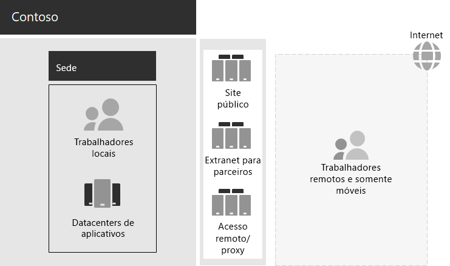

# Infraestrutura de TI e necessidades comerciais da ContosoContoso IT infrastructure and business needs

A Contoso está transitando de uma infraestrutura de TI local e centralizada para uma instalação inclusiva na nuvem que incorpora cargas de trabalho e aplicativos de produtividade pessoal baseados em nuvem.Contoso is transitioning from an on-premises, centralized IT infrastructure to a cloud-inclusive setup that incorporates cloud-based personal productivity workloads and applications.

## Infraestrutura de TI da Contoso existenteExisting Contoso IT infrastructure

A Contoso usa principalmente a infraestrutura de TI local centralizada, com datacenters de aplicativo na sede de Paris.Contoso uses a mostly centralized on-premises IT infrastructure, with application datacenters in the Paris headquarters.

Aqui está o escritório da matriz com datacenters de aplicativos, um DMZ e a Internet.Here is the headquarters office with application datacenters, a DMZ, and the internet.

Os datacenters de aplicativo locais hospedam:The on-premises application datacenters host: 

- Aplicativos de linha de negócios personalizados que usam SQL Server e outros bancos de dados Linux.Custom line-of-business applications that use SQL Server and other Linux databases.
- Um conjunto de servidores herdados do SharePoint.A set of legacy SharePoint servers.
- Servidores de organização e nível de equipe para armazenamento de arquivos.Organization and team-level servers for file storage.

Além disso, cada escritório central regional tem suporte para um conjunto de servidores com um conjunto semelhante de aplicativos.Additionally, each regional hub office supports a set of servers with a similar set of applications. Esses servidores estão sob o controle dos departamentos regionais de TI.These servers are under the control of regional IT departments.

A capacidade de pesquisa entre os aplicativos e dados desses datacenters multigeográficos continua sendo um desafio.Searchability across the applications and data of these separate multi-geographical datacenters continues to be a challenge.

No DMZ da sede da Contoso, diferentes conjuntos de servidores fornecem:In the Contoso headquarters DMZ, different sets of servers provide:

- Hospedagem para o site público da Contoso, do qual os clientes podem solicitar produtos, partes, suprimentos e serviço.Hosting for the Contoso public web site, from which customers can order products, parts, supplies, and service.
- Hospedagem para a extranet do parceiro da Contoso para comunicação e colaboração do parceiro.Hosting for the Contoso partner extranet for partner communication and collaboration.
- Acesso remoto baseado em rede privada virtual (VPN) à intranet da Contoso e proxy da Web para funcionários na sede de Paris.Virtual private network (VPN)-based remote access to the Contoso intranet and web proxying for workers in the Paris headquarters.

## Necessidades comerciais da ContosoContoso business needs

As necessidades de negócios da Contoso se enquadram em cinco categorias principais:Contoso business needs fall into five main categories:

**Produtividade****Productivity**

- Facilitar a colaboraçãoMake collaboration easier

  Substitua a colaboração baseada em email e compartilhamento de arquivos por um modelo online que permite alterações em tempo real em documentos, reuniões online mais fáceis e threads de conversa capturados.Replace email and file share-based collaboration with an online model that allows real-time changes on documents, easier online meetings, and captured conversation threads.
- Aumentar a produtividade de trabalhadores remotos e móveisImprove productivity for remote and mobile workers

  Com muitos funcionários trabalhando em casa ou no campo, substitua a solução VPN arrobada pelo acesso de desempenho aos dados e recursos da Contoso na nuvem.With many employees working from home or in the field, replace the bottlenecked VPN solution with performant access to Contoso data and resources in the cloud.
- Aumentar a criatividade e a inovaçãoIncrease creativity and innovation

  Aproveite os métodos mais recentes de aprendizado visual e desenvolvimento de ideias, incluindo tinta e visualização 3D.Take advantage of the latest visual learning and idea development methods, including inking and 3D visualization.

**Segurança****Security**

- Gerenciamento de identidades e acessoIdentity and access management

  Impor vários fatores e outras formas de autenticação e proteger credenciais de conta de usuário e administrador.Enforce multifactor and other forms of authentication and protect user and administrator account credentials.

- Proteção contra AmeaçasThreat protection

  Proteção contra ameaças externas, incluindo emails e malware com base no sistema operacional.Protect against external security threats, including email and operating system-based malware.

- Proteção de informaçõesInformation protection

  Bloqueie o acesso e criptografe ativos digitais de alto valor, como dados de clientes, especificações de design e fabricação e informações de funcionários.Lock down access to and encrypt high-value digital assets, such as customer data, design and manufacturing specifications, and employee information.

- Gerenciamento de segurançaSecurity management

  Monitore a postura de segurança e detecte e responda a ameaças em tempo real.Monitor security posture and detect and respond to threats in real time.

**Acesso remoto e móvel e parceiros de negócios****Remote and mobile access and business partners**

- Melhorar a segurança para funcionários remotos e móveisImprove security for remote and mobile workers

  Implemente trazer seu próprio dispositivo (BYOD) e gerenciamento de dispositivos de propriedade da empresa para garantir o acesso seguro, o comportamento correto do aplicativo e a proteção de dados da empresa.Implement bring your own device (BYOD) and company-owned device management to ensure secured access, correct application behavior, and company data protection.

- Reduzir a infraestrutura de acesso remoto para os trabalhadoresReduce remote access infrastructure for employees

  Reduza os custos de manutenção e suporte e melhore o desempenho da solução de acesso remoto movendo os recursos comumente acessados para a nuvem.Reduce maintenance and support costs and improve performance for remote access solution by moving commonly accessed resources to the cloud.

- Fornecer melhor conectividade e menor sobrecarga para transações de negócios para susiness (B2B)Provide better connectivity and lower overhead for business-to-susiness (B2B) transactions

  Substitua uma extranet de parceiro caro e de envelhecimento por uma solução baseada em nuvem que usa autenticação federada.Replace an aging and expensive partner extranet with a cloud-based solution that uses federated authentication.

**Conformidade****Compliance**

- Cumprir os requisitos regulamentares regionaisAdhere to regional regulatory requirements

  Garantir a conformidade com os regulamentos regionais e do setor para armazenamento de dados, criptografia, privacidade de dados e regulamentos de dados pessoais, como o RGPD (Regulamento Geral de Proteção de Dados) para a União Europeia.Ensure compliance with industry and regional regulations for data storage, encryption, data privacy, and personal data regulations, such as the General Data Protection Regulation (GDPR) for the Europe Union.

**Gerenciamento****Management**

- Menor sobrecarga de IT para gerenciar software em execução em PCs e dispositivos clienteLower IT overhead for managing software running on client PCs and devices

  Automatize a instalação de atualizações no sistema operacional Windows e Microsoft 365 Apps para Grandes Empresas em toda a organização.Automate installation of updates to the Windows operating system and Microsoft 365 Apps for enterprise across the organization.

## Mapeamento que os negócios da Contoso precisam Microsoft 365 para empresasMapping Contoso business needs to Microsoft 365 for enterprise

O departamento de IT da Contoso determinou o seguinte mapeamento de necessidades de negócios para Microsoft 365 E5 recursos antes da implantação:The Contoso IT department determined the following mapping of business needs to Microsoft 365 E5 features prior to deployment:

| CategoriaCategory | Necessidade comercialBusiness need | Microsoft 365 para produtos ou recursos corporativosMicrosoft 365 for enterprise products or features |
|:-------|:-----|:-----|
| ProdutividadeProductivity |  |  |
|  | Facilitar a colaboraçãoMake collaboration easier | Microsoft Teams, SharePoint, OneDriveMicrosoft Teams, SharePoint, OneDrive |
|  | Aumentar a produtividade de trabalhadores remotos e móveisImprove productivity for remote and mobile workers | Cargas de trabalho do Microsoft 365 e dados baseados em nuvemMicrosoft 365 workloads and cloud-based data |
|  | Aumentar a criatividade e a inovaçãoIncrease creativity and innovation | Windows Ink, Cortana at Work, PowerPointWindows Ink, Cortana at Work, PowerPoint |
| SegurançaSecurity |  |  |
|  | Gerenciamento de identidades e acessoIdentity & access management | Contas de administrador global dedicadas com Azure AD Multifa factor Authentication (MFA) e Azure AD Privileged Identity Management (PIM)Dedicated global administrator accounts with Azure AD Multi-Factor Authentication (MFA) and Azure AD Privileged Identity Management (PIM)   Autenticação Multifator para todas as contas de usuárioMFA for all user accounts   Acesso CondicionalConditional Access   Windows HelloWindows Hello   Windows Credential GuardWindows Credential Guard |
|  | Proteção contra AmeaçasThreat protection | Advanced Threat AnalyticsAdvanced Threat Analytics   Windows DefenderWindows Defender   O que é o Defender para Office 365?Defender for Office 365   Microsoft Defender para Office 365Microsoft Defender for Office 365   Microsoft 365 e resposta a ameaçasMicrosoft 365 threat investigation and response   |
|  | Proteção de informaçõesInformation protection | Proteção de Informações do AzureAzure Information Protection   Prevenção de Perda de Dados (DLP)Data Loss Prevention (DLP)   Proteção de Informações do Windows (WIP)Windows Information Protection (WIP)   Microsoft Cloud App SecurityMicrosoft Cloud App Security   Microsoft IntuneMicrosoft Intune |
|  | Gerenciamento de segurançaSecurity management | Azure DefenderAzure Defender    Central de Segurança do Windows DefenderWindows Defender Security Center |
| Acesso remoto e móvel e parceiros de negóciosRemote and mobile access and business partners |  |  |
|  | Aumentar a segurança de trabalhadores remotos e móveisBetter security for remote and mobile workers | Microsoft IntuneMicrosoft Intune |
|  | Reduzir a infraestrutura de acesso remoto para os trabalhadoresReduce remote access infrastructure for employees | Cargas de trabalho do Microsoft 365 e dados baseados em nuvemMicrosoft 365 workloads and cloud-based data |
|  | Melhorar a conectividade e a sobrecarga inferior para transações B2BImprove connectivity and lower overhead for B2B transactions | Autenticação federada e recursos baseados em nuvemFederated authentication and cloud-based resources |
| ConformidadeCompliance |  |  |
|  | Cumprir os requisitos regulamentares regionaisAdhere to regional regulatory requirements | Recursos RGPD no Microsoft 365GDPR features in Microsoft 365 |
| GerenciamentoManagement |  |  |
|  | Menor sobrecarga de IT para instalar atualizações do clienteLower IT overhead for installing client updates | Atualizações do Windows 10 EnterpriseWindows 10 Enterprise updates   Atualizações de Aplicativos do Microsoft 365 Apps para empresasMicrosoft 365 Apps for enterprise updates |
||||

## Próxima etapaNext step

Saiba mais sobre a rede local da Contoso Corporation e como ela foi otimizada para acesso e latência para Microsoft 365 recursos [baseados](contoso-networking.md) na nuvem.Learn about the Contoso Corporation [on-premises network](contoso-networking.md) and how it was optimized for access and latency to Microsoft 365 cloud-based resources.

## Confira tambémSee also

[Visão geral do Microsoft 365 para empresasMicrosoft 365 for enterprise overview](microsoft-365-overview.md)

[Guias de laboratório de testeTest lab guides](m365-enterprise-test-lab-guides.md)
