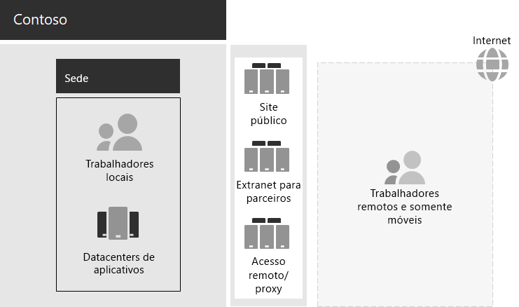

# Infraestrutura de TI e necessidades comerciais da Contoso

**Resumo:** entenda a infraestrutura básica da infraestrutura de TI local da Contoso e de que forma suas necessidades comerciais podem ser atendidas pelo Microsoft 365 Enterprise.

A Contoso vem fazendo a transição de uma infraestrutura de TI centralizada local para uma infraestrutura incluindo nuvem que incorpora cargas de trabalho e aplicativos de produtividade pessoal baseados em nuvem.

## Infraestrutura de TI da Contoso

A Contoso usa principalmente a infraestrutura de TI local centralizada, com datacenters de aplicativo na sede de Paris.

A Figura 1 mostra um escritório da sede com datacenters de aplicativo, uma DMZ e a Internet.

**Figura 1: Atual infraestrutura de TI da Contoso**
 
Os datacenters de aplicativo locais hospedam: 

- Linha personalizada de aplicativos de negócios que usam o SQL Server e outros bancos de dados do Linux.
- Um conjunto de servidores herdados do SharePoint.
- Servidores de organização e nível de equipe para armazenamento de arquivos.

Além disso, cada escritório de hub regional dá suporte a um conjunto de servidores com um conjunto semelhante de aplicativos. Esses servidores estão sob o controle dos departamentos de TI regionais.

A capacidade de pesquisa entre os aplicativos e dados desses datacenters multigeográficos continua sendo um desafio.

Na DMZ da sede da Contoso, diferentes conjuntos de servidores oferecem:

- Acesso remoto baseado em VPN à intranet da Contoso e proxy Web para os funcionários na sede de Paris.
- Hospedagem para o site público da Contoso, do qual os clientes podem solicitar produtos, peças, suprimentos ou serviço.
- Hospedagem para a extranet do parceiro da Contoso para comunicação e colaboração do parceiro.

## Necessidades comerciais da Contoso

As necessidades comerciais da Contoso são classificadas em cinco categorias principais.

Produtividade:

- Facilitar a colaboração

  Substitua a colaboração baseada em compartilhamento de emails e arquivos por um modelo online que permita alterações em tempo real em documentos, reuniões online simplificadas e threads de conversa capturados.
- Aumentar a produtividade de trabalhadores remotos e móveis

  Com muitos funcionários trabalhando em casa ou em campo, substitua a solução de VPN com gargalo pelo acesso de alto desempenho aos dados e recursos da Contoso na nuvem.
- Aumentar a criatividade e a inovação

  Aproveite os métodos mais recentes de aprendizado visual e desenvolvimento de ideias, incluindo tinta e visualização 3D.

Segurança:

- Gerenciamento de identidades e acesso

  Implemente a autenticação multifator e outras formas de autenticação e proteja as credenciais das contas de usuário e administrador.

- Proteção contra Ameaças

  Proteção contra ameaças externas, incluindo emails e malware com base no sistema operacional.

- Proteção de Informações

  Bloqueie o acesso e criptografe ativos digitais de alto valor, como dados de clientes, especificações de design e informações sobre funcionários.

- Gerenciamento de segurança

  Monitore a postura de segurança e detecte e responda a ameaças em tempo real.

Acesso remoto e móvel e parceiros de negócios:

- Aumentar a segurança de trabalhadores remotos e móveis

  Estabeleça o BYOD (Traga seu próprio dispositivo) e o gerenciamento de dispositivos da empresa para garantir o acesso seguro, o comportamento correto do aplicativo e a proteção de dados da empresa.

- Reduzir a infraestrutura de acesso remoto para os trabalhadores

  Reduza os custos de manutenção e suporte e melhore o desempenho da solução de acesso remoto, movendo recursos comumente acessados para a nuvem.

- Fornecer conectividade aprimorada e sobrecarga mais baixa para transações B2B (entre empresas)

  Substitua a extranet antiga e dispendiosa do parceiro por uma solução baseada em nuvem que use autenticação federada.

Conformidade:

- Cumprir os requisitos regulamentares regionais

  Entre e permaneça em conformidade com os regulamentos regionais e do setor de armazenamento de dados, criptografia, privacidade de dados e regulamentos de dados pessoais, como o Regulamento Geral sobre a Proteção de Dados (RGPD) da União Europeia.

Gerenciamento:

- Reduzir a sobrecarga de TI para gerenciar software executado em PCs e dispositivos de clientes

  Automatize a instalação de atualizações no sistema operacional Windows e no Microsoft Office em toda a organização.

## Mapear as necessidades comerciais da Contoso para o Microsoft 365 Enterprise

O departamento de TI da Contoso determinou o seguinte mapeamento das necessidades comerciais para os recursos do Microsoft 365 Enterprise E5 antes da implantação:

||||
|:-------|:-----|:-----|
| **Categoria** | **Necessidade comercial** | **Recursos e produtos do Microsoft 365 Enterprise** |
| Produtividade |  |  |
|  | Facilitar a colaboração | Teams, SharePoint Online, Skype for Business Online |
|  | Aumentar a produtividade de trabalhadores remotos e móveis | Dados baseados em nuvem e cargas de trabalho do Office 365 |
|  | Aumentar a criatividade e a inovação | Windows Ink, Cortana at Work, PowerPoint |
| Segurança |  |  |
|  | Gerenciamento de identidades e acesso | Contas de administrador globais dedicadas com autenticação multifator e Azure AD Privileged Identity Management (PIM)   Autenticação multifator para todas as contas de usuários   Acesso condicional   Windows Hello   Windows Credential Guard |
|  | Proteção contra Ameaças | Advanced Threat Analytics   Windows Defender   Proteção Avançada contra Ameaças   Proteção Avançada contra Ameaças do Office 365   Investigação e resposta a ameaças do Office 365   |
|  | Proteção de informações | Proteção de Informações do Azure   Prevenção contra Perda de Dados do Office 365   Proteção de Informações do Windows   Microsoft Cloud App Security   Office 365 Cloud App Security (CAS)   Microsoft Intune |
|  | Gerenciamento de segurança | Central de Segurança do Azure    Central de Segurança do Windows Defender |
| Acesso remoto e móvel e parceiros de negócios |  |  |
|  | Aumentar a segurança de trabalhadores remotos e móveis | Microsoft Intune |
|  | Reduzir a infraestrutura de acesso remoto para os trabalhadores | Dados baseados em nuvem e cargas de trabalho do Office 365 |
|  | Fornecer conectividade aprimorada e sobrecarga mais baixa para transações B2B | Autenticação federada e recursos baseados em nuvem |
| Conformidade |  |  |
|  | Cumprir os requisitos regulamentares regionais | Recursos de RGPD no Office 365 |
| Gerenciamento |  |  |
|  | Reduzir a sobrecarga da TI para instalar as atualizações do cliente | Anéis de implantação   Atualização local do Windows 10 e Autopilot   Office 365 ProPlus |
||||

## Próxima etapa

[Saiba mais](contoso-networking.md) sobre a rede local da Contoso Corporation e como ela foi otimizada para latência e acesso aos recursos baseados em nuvem do Microsoft 365 em toda a organização.

## Confira também

[Guia de implantação](deploy-microsoft-365-enterprise.md)

[Guias de laboratório de teste](m365-enterprise-test-lab-guides.md)
