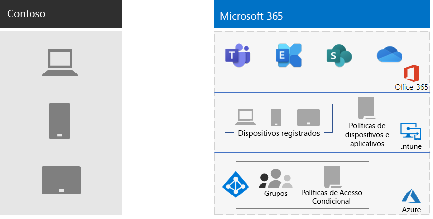

# Gerenciamento de dispositivo móvel para a ContosoMobile device management for Contoso

O Microsoft 365 Enterprise inclui o Microsoft Intune e um conjunto de serviços do Azure que dão suporte a segurança, ao gerenciamento de aplicativos e dispositivos móveis.Microsoft 365 Enterprise includes Intune and a set of Azure services to support mobile device and application management and security.

A Contoso tem vários funcionários com dispositivos móveis, alguns em escritórios da Contoso e alguns dos quais não têm escritórios. A Contoso precisa de uma maneira de habilitar a produtividade mas manter a proteção nos dispositivos, nos dados da Contoso armazenados nesses dispositivos e no comportamento dos aplicativos.Contoso has many mobile-enabled employees, some of which have offices in Contoso locations and some of which have no offices. Contoso needed a way to enable employee productivity but keep the devices, the Contoso data stored on those devices, and application behavior secure.

## PlanejarPlan

No início da análise de gerenciamento de dispositivo móvel para o Microsoft 365 Enterprise, a Contoso identificou os seguintes casos de uso do Intune:Early in the analysis of mobile device management for Microsoft 365 Enterprise, Contoso identified the following Intune use cases:

- Proteger os dados e emails do Exchange Online para que possam ser acessados com segurança em dispositivos móveisProtect Exchange Online email and data so it can be safely accessed by mobile devices
- Implementar um programa "traga seu próprio dispositivo" (BYOD) para funcionários da ContosoImplement a bring your own device (BYOD) program for Contoso employees
- Emitir telefones e tablets pertencentes à organização e tablets compartilhados de uso limitado para funcionários da ContosoIssue organization-owned phones and limited-use shared tablets to Contoso employees

A Contoso não está usando o Intune para:Contoso is not using Intune to:

- Permitir aos funcionários acessar com segurança o Office 365 de um kiosk público não gerenciadoAllow employees to securely access Office 365 from an unmanaged public kiosk
- Proteger dados e emails locais para que possam ser acessados com segurança em dispositivos móveis, já que não há mais servidores locais do Microsoft Exchange.Protect on-premises email and data so it can be safely accessed by mobile devices, because there are no longer on-premises Microsoft Exchange servers.

## ImplantarDeploy

A Contoso configurou sua infraestrutura de gerenciamento de dispositivo móvel da seguinte forma:This is how Contoso set up their mobile device management infrastructure:

- Configurou o Intune como a autoridade de Gerenciamento de Dispositivo Móvel (MDM) e está usando o Intune no Azure para administrar o conteúdo e gerenciar os dispositivosSet Intune as the Mobile Device Management (MDM) authority and are using Intune on Azure to administer content and manage the devices
- Criou grupos do Azure AD para dispositivos para registro e configurações do Intune, além de políticas de acesso condicional baseadas no dispositivo.Created Azure AD groups for devices for enrollment and Intune settings and device-based Conditional Access policies

  Confira [políticas de acesso condicional da Contoso](contoso-identity.md#conditional-access-policies-for-identity-and-device-access) para saber mais.See [Contoso's Conditional Access policies](contoso-identity.md#conditional-access-policies-for-identity-and-device-access) for more information.

- Habilitou a plataforma de dispositivos Apple para dar suporte a funcionários com iPads, iPhones e iMacs e celulares de propriedade corporativa com base no iPhoneEnabled the Apple device platform to support employees with iPads, iMacs, iPhones, and for iPhone-based corporate-owned phones
- Criou políticas de termos e condições específicas da Contoso, que são apresentadas durante a instalação do Portal da Empresa da Contoso em dispositivos móveisCreated Contoso-specific terms and conditions policies, which are seen during the installation of the Company Portal for Contoso on mobile devices
- Para dispositivos que não estão registrados, um conjunto de políticas de Gerenciamento de Aplicativo Móvel (MAM) para exigir autenticação para acesso aos serviços do Office 365For devices that are not enrolled, a set of Mobile Application Management (MAM) policies to require authentication for access to Office 365 services
- Políticas criadas do Intune que imponham:Created Intune policies that enforce:
  - Aplicativos permitidosAllowed apps
  - Criptografia de dispositivos para ajudar a impedir o acesso não autorizadoDevice encryption to help prevent unauthorized access
  - Um PIN de seis dígitos ou senhaA six-digit PIN or password
  - Um tempo limite de inatividadeAn inactivity timeout period
  - Proteção antivírus e contra malware, e atualizações de assinaturas com o Windows Defender em dispositivos Windows 10Antivirus and malware protection, and signature updates with Windows Defender on Windows 10 devices
  - Atualizações automáticas em dispositivos Windows 10 que incluem as atualizações de segurança mais recentesAutomatic updates on Windows 10 devices that include the latest security updates
  - Enviar certificados para dispositivos gerenciadosPushing certificates to managed devices
  - Clara separação de dados pessoais e comerciais. Os administradores ou usuários podem apagar seletivamente dados corporativos do dispositivo, mantendo inalterados dados pessoais, como imagens, contas de email e arquivos pessoais.A clear separation of business and personal data. Users or admins can selectively wipe corporate data from the device, while leaving personal data such as pictures, personal email accounts, and personal files untouched.

Depois de implantar, a Contoso registrou os PCs, smartphones e tablets de propriedade da empresa adicionando-os aos grupos de dispositivos apropriados do Intune, e gradualmente implementou um programa BYOD para os funcionários poderem registrar seus dispositivos pessoais. Os dispositivos registrados receberam políticas do Intune, resultando em dispositivos e aplicativos gerenciados e seguros. Dispositivos não registrados têm políticas de gerenciamento de aplicativo móvel (MAM) que especificam aplicativos permitidos.Once deployed, Contoso enrolled PCs and company-owned smartphones and tablets by adding them to the appropriate Intune device groups and rolled out a BYOD program for employees to enroll their personal devices. Enrolled devices received Intune policies, resulting in managed and secured devices and their applications. Devices that are not enrolled have Mobile Application Management (MAM) policies that specify allowed applications.

Esta é a arquitetura de implantação de gerenciamento de dispositivo móvel da Contoso.Here is Contoso's mobile device management deployment architecture.

## Próxima etapaNext step

[Saiba](contoso-info-protect.md) como a Contoso usa os recursos de proteção de informações do Microsoft 365 Enterprise para classificar, identificar e proteger ativos digitais fundamentais em sua organização.[Learn](contoso-info-protect.md) how Contoso uses the information protection capabilities of Microsoft 365 Enterprise to classify, identify, and protect crucial digital assets across its organization.

## Confira tambémSee also

[Gerenciamento de dispositivo móvel para o Microsoft 365 EnterpriseMobile device management for Microsoft 365 Enterprise](mobility-infrastructure.md)

[Guia de implantaçãoDeployment guide](deploy-microsoft-365-enterprise.md)

[Guias de laboratório de testeTest lab guides](m365-enterprise-test-lab-guides.md)

