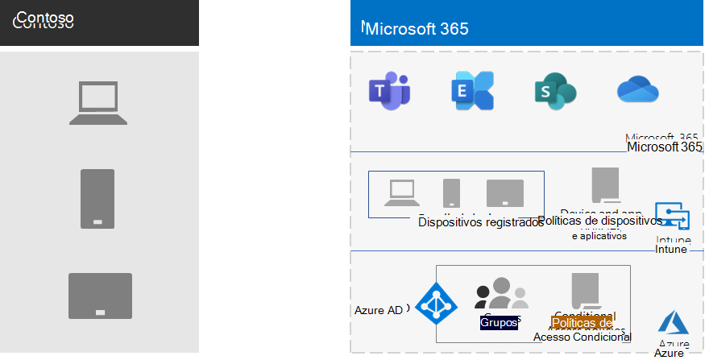

# Gerenciamento de dispositivo móvel para a Contoso

O Microsoft 365 for Enterprise inclui o Intune e um conjunto de serviços do Azure que oferecem suporte a gerenciamento e segurança de dispositivos móveis e aplicativos.

A contoso tem vários funcionários habilitados para dispositivos móveis. Alguns têm escritórios nos locais da Contoso e alguns não têm escritórios. A contoso precisava de uma maneira de habilitar a produtividade dos funcionários, mas manter os dispositivos, os dados da Contoso armazenados nesses dispositivos e o comportamento do aplicativo seguro.

## Planejar

A contoso identificou os seguintes casos de uso do Intune de gerenciamento de dispositivos móveis para o Microsoft 365 para empresas:

- Proteger os dados e emails do Exchange Online para que eles possam ser acessados com segurança por dispositivos móveis.
- Implementar um programa do BYOD (Traga seu próprio dispositivo) para funcionários da contoso.
- Emitir telefones de propriedade da organização e usar tablets compartilhados para funcionários da contoso.

A contoso não usa o Intune para:

- Permitir que os funcionários acessem com segurança o Microsoft 365 de um quiosque público não gerenciado.
- Proteger os dados e emails locais para que eles possam ser acessados com segurança por dispositivos móveis, porque não há servidores do Microsoft Exchange locais.

## Implantar

A Contoso configurou sua infraestrutura de gerenciamento de dispositivo móvel da seguinte forma:

- Definir o Intune como a autoridade de gerenciamento de dispositivo móvel (MDM) e usar o Intune no Azure para administrar o conteúdo e gerenciar os dispositivos
- Criou grupos do Azure Active Directory (Azure AD) para dispositivos para registro e configurações do Intune e políticas de acesso condicional baseadas em dispositivos

  Para obter mais informações, consulte [contoso Conditional Access Policies](contoso-identity.md#conditional-access-policies-for-identity-and-device-access).

- Habilitada a plataforma de dispositivo Apple para dar suporte a funcionários com o iPads, iMacs e iPhones, e iPhones corporativos
- Criou políticas de termos e condições específicas da Contoso, que são apresentadas durante a instalação do Portal da Empresa da Contoso em dispositivos móveis
- Para dispositivos que não estão registrados, implementou um conjunto de políticas de gerenciamento de aplicativo móvel (MAM) para exigir autenticação para acesso aos serviços do Microsoft 365
- Políticas criadas do Intune que imponham:
  - Aplicativos permitidos.
  - Criptografia de dispositivo para ajudar a impedir o acesso não autorizado.
  - Um PIN de seis dígitos ou senha.
  - Um período de tempo limite de inatividade.
  - Proteção antivírus e de malware e atualizações de assinatura com o Windows Defender em dispositivos Windows 10.
  - Atualizações automáticas em dispositivos Windows 10 que incluem as atualizações de segurança mais recentes.
  - Envio de certificados para dispositivos gerenciados.
  - Clara separação de dados pessoais e comerciais. Os administradores ou usuários podem apagar seletivamente dados corporativos do dispositivo, mantendo inalterados dados pessoais, como imagens, contas de email e arquivos pessoais.

A contoso registrou computadores implantados e smartphones e tablets de propriedade da empresa adicionando-os aos grupos de dispositivos do Intune apropriados. Eles também estabeleceram um programa do BYOD para que os funcionários registrem seus dispositivos pessoais. Os dispositivos registrados recebem políticas do Intune, o que resulta em dispositivos gerenciados e protegidos e seus aplicativos. Os dispositivos que não estão registrados têm políticas de MAM (gerenciamento de aplicativo móvel) que especificam aplicativos permitidos.

Veja a arquitetura de implantação de gerenciamento de dispositivo móvel da contoso.

## Próxima etapa

[Saiba](contoso-info-protect.md) como a contoso usa os recursos de proteção de informações do Microsoft 365 para empresas para classificar, identificar e proteger ativos digitais essenciais em toda a organização.

## Confira também

[Gerenciamento de dispositivos do Microsoft 365](device-management-roadmap-microsoft-365.md)

[Visão geral do Microsoft 365 para empresas](microsoft-365-overview.md)

[Guias de laboratório de teste](m365-enterprise-test-lab-guides.md)

