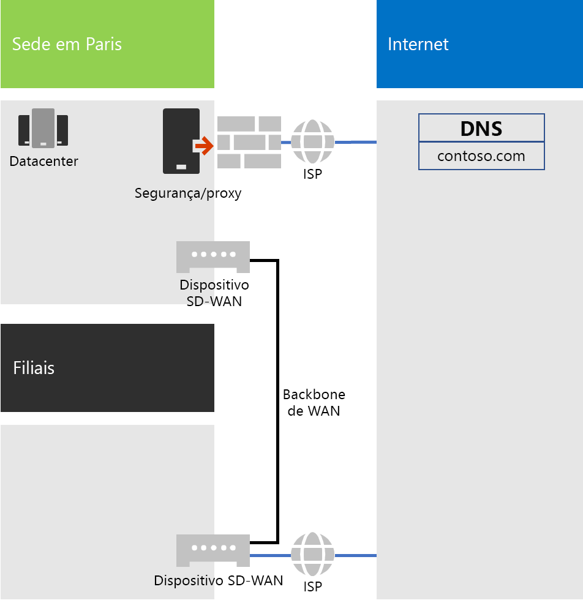
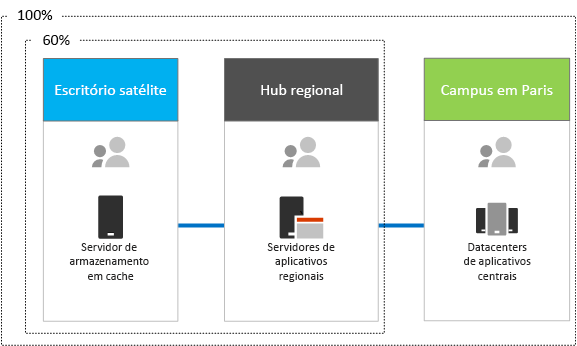

# Sistema de rede para a Contoso CorporationNetworking for the Contoso Corporation

**Resumo:** compreenda a infraestrutura de rede da Contoso e como ela usa a tecnologia SD-WAN para ter a conectividade de rede de desempenho ideal para serviços baseados na nuvem do Microsoft 365 Enterprise.**Summary:** Understand the Contoso networking infrastructure and how it uses its SD WAN technology for optimal performance network connectivity to Microsoft 365 Enterprise cloud based services.

Para adotar uma infraestrutura que inclua a nuvem, os engenheiros de rede da Contoso perceberam a mudança fundamental na maneira como funciona o tráfego de rede para serviços baseados na nuvem. Em vez de um modelo hub-spoke que concentra a conectividade de rede na matriz, eles trabalharam para mapear locais de usuários para saída de Internet local e conexões locais para os locais de rede da Microsoft na Internet.To adopt a cloud-inclusive infrastructure, Contoso's network engineers realized the fundamental shift in the way that network traffic to cloud-based services travels. Instead of a hub and spoke model that focusses network connectivity on the head office, they worked to map user locations to local Internet egress and local connections to Microsoft network locations on the Internet.

## Infraestrutura de rede da ContosoContoso's networking infrastructure

Os elementos de rede da Contoso que vinculam seus escritórios em todo o mundo são os seguintes:The elements of Contoso's network that links their offices across the globe are the following:

- Rede MPLS WANMPLS WAN network

  Uma rede MPLS WAN conecta a sede de Paris aos escritórios regionais e esses a filiais em uma configuração hub-spoke. Isso é para os usuários acessarem os servidores locais que compõem os aplicativos da linha de negócios no escritório de Paris. Ele também roteará qualquer tráfego genérico da Internet para o escritório de Paris, onde os dispositivos de segurança de rede verificam as solicitações. Em cada escritório, os roteadores oferecem tráfego para hosts ou pontos de acesso sem fio em sub-redes que usam o espaço privado de endereço IP.An MPLS WAN network connects the Paris headquarters to regional offices and regional offices to satellite offices in a spoke and hub configuration. This is for users to access on-premises servers that make up line of business applications in the Paris office. It also routes any generic Internet traffic to the Paris office where network security devices scrub the requests. Within each office, routers deliver traffic to hosts or wireless access points on subnets, which use the private IP address space.

- Acesso direto local à Internet para tráfego do Office 365Local direct Internet access for Office 365 traffic

  Cada escritório tem um dispositivo SD-WAN com um dos circuitos de rede Internet ISP mais locais, com sua própria conectividade com a Internet por meio de um servidor proxy. Isso normalmente é implementado como um link de WAN em um ISP local que também fornece endereços IP públicos e endereços IP do servidor DNS local para o servidor proxy.Each office has an SD WAN device with one of more local Internet ISP network circuits, with its own Internet connectivity through a proxy server. This is typically implemented as a WAN link to a local ISP that also provides public IP addresses and local DNS server IP addresses for the proxy server.

- Presença na InternetInternet presence

  A Contoso possui o nome de domínio público contoso.com. O site público da Contoso para fazer o pedido de produtos é um conjunto de servidores em um datacenter conectado à Internet no campus de Paris. A Contoso usa um intervalo de endereço IP público /24 na Internet.Contoso owns the contoso.com public domain name. The Contoso public web site for ordering products is a set of servers in an Internet-connected datacenter in the Paris campus. Contoso uses a /24 public IP address range on the Internet.

A figura 1 mostra a infraestrutura de rede da Contoso e suas conexões com a Internet.Figure 1 shows Contoso's networking infrastructure and its connections to the Internet.

 
**Figura 1: Rede da Contoso****Figure 1: Contoso's network**

## Uso de SD-WAN para conectividade de rede ideal para a MicrosoftUse of SD WAN for optimal network connectivity to Microsoft

A Contoso seguiu os [Princípios de conectividade de rede do Office 365](https://docs.microsoft.com/office365/enterprise/office-365-network-connectivity-principles):Contoso followed [Office 365 network connectivity principles](https://docs.microsoft.com/office365/enterprise/office-365-network-connectivity-principles):

1. Identificar e diferenciar tráfego de rede do Office 365Identify and differentiate Office 365 network traffic
2. Enviar conexões de rede de saída localmenteEgress network connections locally
3. Evitar hairpins de redeAvoid network hairpins
4. Ignorar dispositivos de segurança de rede duplicadosBypass duplicate network security devices

Há três categorias de tráfego de rede do Office 365: Otimizar, Permitir e Padrão. Otimizar e Permitir tráfego é o tráfego de rede confiável que é criptografado e protegido nos pontos de extremidade e destinado a data centers da Microsoft.There are three categories of network traffic for Office 365: Optimize, Allow, and Default. Optimize and Allow traffic is trusted network traffic that is encrypted and secured at the endpoints and is destined for Microsoft datacenters.

A Contoso decidiu usar saída direta de Internet para o tráfego de categoria Otimizar e Permitir e para encaminhar todo o tráfego de categoria Padrão para a conexão de Internet central com base em Paris.Contoso decided to use direct Internet egress for Optimize and Allow category traffic and to forward all Default category traffic to the Paris-based central Internet connection.

A empresa optou por implantar os dispositivos SD-WAN em cada escritório como uma maneira simples de seguir estes princípios e atingir um desempenho ideal de rede para os serviços baseados em nuvem do Microsoft 365.They decided to deploy SD WAN devices at each of their office locations as a simple way to follow these principles and achieve optimal network performance for Microsoft 365 cloud-based services.

Os dispositivos SD-WAN têm uma porta LAN para a rede local e várias portas WAN. Uma porta WAN conecta-se à sua rede MPLS e outras portas WAN se conectam aos circuitos ISP locais. O dispositivo SD-WAN direciona o tráfego de rede de categoria Otimizar e Permitir para os links do ISP.The SD WAN devices have a LAN port for the local office network and multiple WAN ports. One WAN port connects to their MPLS network and other WAN ports connect to local ISP circuits. The SD WAN device routes Optimize and Allow category network traffic to the ISP links.

## Infraestrutura do aplicativo de linha de negócios da ContosoContoso's line of business app infrastructure

A Contoso projetou sua infraestrutura de aplicativo e servidor de linha de negócios para o seguinte:Contoso has architected its line of business application and server infrastructure for the following:

- As filiais usam servidores de cache locais para armazenar documentos acessados com frequência e sites internos.Satellite offices use local caching servers to store frequently accessed documents and internal web sites.
- Os hubs regionais usam servidores de aplicativo regionais para os escritórios regionais e as filiais. Esses servidores sincronizam-se com os servidores da matriz de Paris.Regional hubs use regional application servers for the regional and satellite offices. These servers synchronize with servers in the Paris headquarters.
- O campus de Paris tem os datacenters que contêm os servidores de aplicativo centralizados que atendem toda a organização.The Paris campus has the datacenters that contain the centralized application servers that serve the entire organization.

A Figura 2 mostra a porcentagem do tráfego de rede ao acessar os servidores na intranet da Contoso.Figure 1 shows the percentage of network traffic when accessing servers across Contoso’s intranet.

 
**Figura 2: Infraestrutura da Contoso para aplicativos internos****Figure 1: Contoso's infrastructure for internal applications**

Para usuários nas filiais ou hubs regionais, 60% dos recursos de que os funcionários precisam podem ser atendidos por servidores de filiais e hubs regionais. Os outros 40% das solicitações de recursos devem ir pelo link de WAN para o campus de Paris.For users in satellite or regional hub offices, 60% of the resources needed by employees can be served by satellite and regional hub office servers. The additional 40% of resource requests must go over the WAN link to the Paris campus.

## A preparação e a análise de rede da Contoso para o Microsoft 365 EnterpriseContoso's network analysis and preparation of their network for Microsoft 365 Enterprise

A adoção bem-sucedida dos serviços do Microsoft 365 Enterprise por usuários da Contoso dependem da conectividade de alta disponibilidade e eficaz com a Internet ou diretamente com os serviços em nuvem da Microsoft. A Contoso realizou estas etapas para planejar e implementar a conectividade otimizada com serviços de nuvem do Microsoft 365 Enterprise:Successful adoption of Microsoft 365 Enterprise services by Contoso’s users depend on highly available and performant connectivity to the Internet, or directly to Microsoft cloud services. Contoso took these steps to plan for and implement optimized connectivity to Microsoft 365 Enterprise cloud services:

1. Criou um diagrama de rede WAN da empresa para ajudar a planejarCreated a company WAN network diagram to aid with planning

   A Contoso iniciou seu planejamento de rede criando um diagrama que mostra seus locais, a conectividade de rede existente, os dispositivos de perímetro de rede existentes e as classes de serviço que são gerenciadas na rede. Eles usaram este diagrama para cada etapa subsequente no planejamento e na implementação da conectividade de rede.Contoso started their network planning by creating a diagram showing their locations, the existing network connectivity, their existing network perimeter devices and classes of service that are managed on the network. They used this diagram for each subsequent step in the planning and implementation of networking connectivity.

2. Criou um plano para conectividade de rede do Microsoft 365 EnterpriseCreated a plan for Microsoft 365 Enterprise network connectivity

   A Contoso usou os [princípios de conectividade de rede do Office 365](https://docs.microsoft.com/office365/enterprise/office-365-network-connectivity-principles) e forneceu arquiteturas de rede de referência para determinar o SD-WAN como a topologia preferencial para a conectividade do Office 365.Contoso used the [Office 365 network connectivity principles](https://docs.microsoft.com/office365/enterprise/office-365-network-connectivity-principles) and provided reference network architectures to determine SD WAN as their preferred topology for Office 365 connectivity.

3. Analisou a utilização da conexão de Internet e a largura de banda MPLS WAN em cada escritório e aumentou a largura de banda conforme o necessárioAnalyzed Internet connection utilization and MPLS WAN bandwidth at each office and increased bandwidth as needed

   Cada escritório foi analisado em relação ao uso atual e os circuitos foram aumentados para que o tráfego com base em nuvem previsto do Microsoft 365 funcionasse com uma média de 20% da capacidade não utilizada.Each office was analyzed for the current usage and circuits were increased so that predicted Microsoft 365 cloud-based traffic would be operating with an average of 20% of unused capacity.

4. Otimizou o desempenho para os serviços de rede da MicrosoftOptimized performance to Microsoft network services

   A Contoso determinou o conjunto de pontos de extremidade do Office 365, do Intune e do Azure e firewalls configurados, dispositivos de segurança e outros sistemas no caminho da Internet para obter um desempenho ideal. Os pontos de extremidade para o tráfego de categoria Otimizar e Permitir do Office 365 foram configurados para os dispositivos SD-WAN que receberam acesso direto à Internet.Contoso determined the set of Office 365, Intune, and Azure endpoints and configured firewalls, security devices, and other systems in the Internet path for optimal performance. Endpoints for Office 365 Optimize and Allow category traffic was configured into the SD WAN devices that provided direct Internet access.

5. Configurou DNS internoConfigured internal DNS

   O DNS precisa ser funcional e ser pesquisado localmente para o tráfego do Office 365.DNS is required to be functional and to be looked up locally for Office 365 traffic.

6. Validou o ponto de extremidade de rede e a conectividade da portaValidated network endpoint and port connectivity

   A Contoso executou ferramentas de teste de conectividade de rede fornecidas pela Microsoft para validar a conectividade de serviços de nuvem do Microsoft 365 Enterprise.Contoso ran network connectivity test tools provided by Microsoft to validate connectivity for Microsoft 365 Enterprise cloud services.

7. Otimizou computadores de funcionários para a conectividade de redeOptimized employee computers for network connectivity

   Os computadores individuais foram verificados para garantir que as atualizações mais recentes do sistema operacional foram instaladas e o monitoramento de segurança do ponto de extremidade estava ativo em todos os clientes.Individual computers were checked to ensure that the latest operating system updates were installed and that endpoint security monitoring is active on all clients.

## Próxima etapaNext step

[Saiba](contoso-identity.md) como a Contoso está aproveitando o seu provedor de identidade local na nuvem para os funcionários e realizando a federação de autenticação para clientes e parceiros de negócios.[Learn](contoso-identity.md) how Contoso is leveraging its on-premises identity provider in the cloud for employees and federating authentication for customers and business partners.

## Confira tambémSee also

[Sistema de rede para o Microsoft 365 EnterpriseNetworking for Microsoft 365 Enterprise](networking-infrastructure.md)

[Guia de implantaçãoDeployment guide](deploy-microsoft-365-enterprise.md)

[Guias de laboratório de testeTest lab guides](m365-enterprise-test-lab-guides.md)
