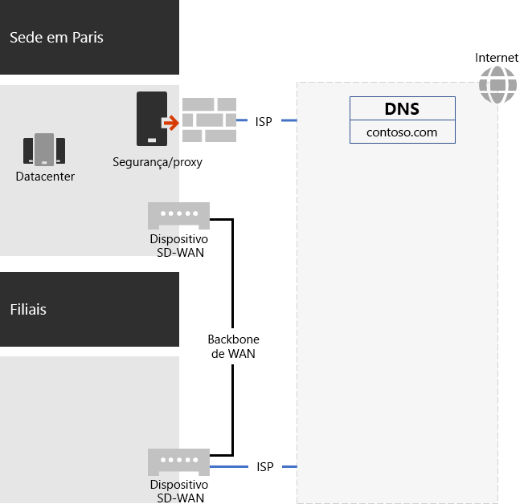
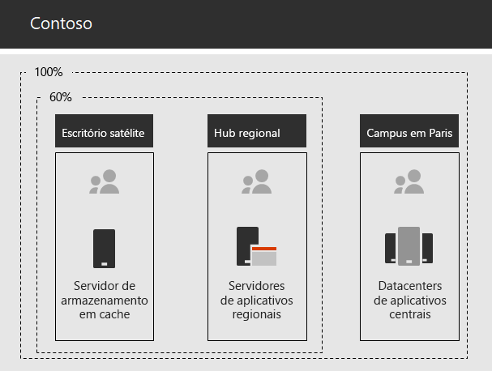

# Sistema de rede para a Contoso Corporation

Para adotar uma infraestrutura inclusiva na nuvem, os engenheiros de rede da Contoso perceberam a mudança fundamental na maneira como o tráfego de rede nos serviços em nuvem viaja. Em vez de um modelo interno de hub e spoke que concentra a conectividade e o tráfego de rede no próximo nível da hierarquia de escritórios da Contoso, eles trabalharam para mapear os locais dos usuários para a saída local da Internet e as conexões locais para o local de rede mais próximo do Microsoft 365 na Internet.

## Infraestrutura de rede da Contoso

Os elementos de rede da Contoso que vinculam seus escritórios em todo o mundo são os seguintes:

- Rede WAN de Comutação de Rótulos Multiprotocolo (MPLS)

  Uma rede MPLS WAN conecta a sede de Paris aos escritórios regionais e esses a filiais em uma configuração hub-spoke. Isso é para os usuários acessarem os servidores locais que compõem os aplicativos da linha de negócios no escritório de Paris. Ele também roteará qualquer tráfego genérico da Internet para o escritório de Paris, onde os dispositivos de segurança de rede verificam as solicitações. Em cada escritório, os roteadores oferecem tráfego para hosts ou pontos de acesso sem fio em sub-redes que usam o espaço privado de endereço IP.

- Acesso local direto à Internet para o tráfego do Microsoft 365

  Cada escritório possui um dispositivo WAN Definido por Software (SD-WAN) com mais um dos circuitos de rede ISP da Internet locais, com conectividade própria à Internet através de um servidor proxy. Isso geralmente é implementado como um link WAN para um ISP local que também fornece endereços IP públicos e um servidor DNS local.

- Presença na Internet

  A Contoso possui o nome de domínio público contoso.com. O site público da Contoso para fazer o pedido de produtos é um conjunto de servidores em um datacenter conectado à Internet no campus de Paris. A Contoso usa um intervalo de endereço IP público /24 na Internet.

A figura 1 mostra a infraestrutura de rede da Contoso e suas conexões com a Internet.

 
**Figura 1: Rede da Contoso**

## Uso de SD-WAN para conectividade de rede ideal para a Microsoft

A Contoso seguiu os [Princípios de conectividade de rede do Microsoft 365](https://docs.microsoft.com/office365/enterprise/office-365-network-connectivity-principles) para:

1. Identificar e diferenciar o tráfego de rede do Microsoft 365
2. Enviar conexões de rede de saída localmente
3. Evitar hairpins de rede
4. Ignorar dispositivos de segurança de rede duplicados

Há três categorias de tráfego de rede do Microsoft 365: otimizar, permitir e padrão. Otimize e permita que tráfego seja um tráfego de rede confiável, criptografado e protegido nos pontos de extremidade e destinado à rede do Microsoft 365.

A Contoso decidiu:

- Usar saída direta de Internet para o tráfego de categoria Otimizar e Permitir e para encaminhar todo o tráfego de categoria Padrão para a conexão de Internet central com base em Paris.

- Implantar os dispositivos SD-WAN em cada escritório como uma maneira simples de seguir estes princípios e atingir um desempenho ideal de rede para os serviços baseados em nuvem do Microsoft 365.

  Os dispositivos SD-WAN possuem uma porta LAN para a rede do escritório local e várias portas WAN. Uma porta WAN se conecta à sua rede MPLS e outra porta WAN se conecta a um circuito ISP local. O dispositivo SD-WAN roteia o tráfego de rede da categoria Otimizar e Permitir através do link ISP.

## Infraestrutura do aplicativo de linha de negócios da Contoso

A Contoso projetou sua infraestrutura de aplicativos de negócios e intranet de servidores para o seguinte:

- As filiais usam servidores de cache locais para armazenar documentos acessados com frequência e sites internos.
- Os hubs regionais usam servidores de aplicativo regionais para os escritórios regionais e as filiais. Esses servidores sincronizam-se com os servidores da matriz de Paris.
- O campus de Paris tem os datacenters que contêm os servidores de aplicativo centralizados que atendem toda a organização.

A Figura 2 mostra a porcentagem do tráfego de rede ao acessar os servidores na intranet da Contoso.

 
**Figura 2: Infraestrutura da Contoso para aplicativos internos**

Para usuários nas filiais ou hubs regionais, 60% dos recursos de que os funcionários precisam podem ser atendidos por servidores de filiais e hubs regionais. Os outros 40% das solicitações de recursos devem ir pelo link de WAN para o campus de Paris.

## A preparação e a análise de rede da Contoso para o Microsoft 365 Enterprise

A adoção bem-sucedida dos serviços do Microsoft 365 Enterprise por usuários da Contoso dependem da conectividade de alta disponibilidade e eficaz com a Internet ou diretamente com os serviços em nuvem da Microsoft. A Contoso realizou estas etapas para planejar e implementar a conectividade otimizada com serviços de nuvem do Microsoft 365 Enterprise:

1. Criou um diagrama de rede WAN da empresa para ajudar a planejar

   A Contoso iniciou seu planejamento de rede criando um diagrama que mostra seus locais, a conectividade de rede existente, os dispositivos de perímetro de rede existentes e as classes de serviço que são gerenciadas na rede.  Ela usou este diagrama para cada etapa subsequente no planejamento e na implementação da conectividade de rede.

2. Criou um plano para conectividade de rede do Microsoft 365 Enterprise

   A Contoso usou os [Princípios de conectividade de rede do Microsoft 365](https://docs.microsoft.com/office365/enterprise/office-365-network-connectivity-principles) e forneceu arquiteturas de rede de referência para determinar o SD-WAN como a topologia preferencial da conectividade do Microsoft 365.

3. Analisou a utilização da conexão de Internet e a largura de banda MPLS WAN em cada escritório e aumentou a largura de banda conforme o necessário

   Cada escritório foi analisado em relação ao uso atual e os circuitos foram aumentados para que o tráfego com base em nuvem previsto do Microsoft 365 funcionasse com uma média de 20% da capacidade não utilizada.

4. Otimizou o desempenho para os serviços de rede da Microsoft

   A Contoso determinou o conjunto de pontos de extremidade do Office 365, Intune e Azure e configurou firewalls, dispositivos de segurança e outros sistemas no caminho da Internet para desempenho otimizado. Os pontos de extremidade do tráfego de categoria Otimizar e Permitir do Office 365 foram configurados nos dispositivos SD-WAN para roteamento pelo circuito ISP.

5. DNS interno configurado

   O DNS precisa ser funcional e ser pesquisado localmente para o tráfego do Microsoft 365.

6. Validou o ponto de extremidade de rede e a conectividade da porta

   A Contoso executou ferramentas de teste de conectividade de rede fornecidas pela Microsoft para validar a conectividade de serviços de nuvem do Microsoft 365 Enterprise.

7. Otimizou computadores de funcionários para a conectividade de rede

   Os computadores individuais foram verificados para garantir que as atualizações mais recentes do sistema operacional foram instaladas e o monitoramento de segurança do ponto de extremidade estava ativo em todos os clientes.

## Próxima etapa

[Saiba](contoso-identity.md) como a Contoso está aproveitando seus Serviços de Domínio Active Directory (AD DS) na nuvem para funcionários e autenticação de federação para clientes e parceiros de negócios.

## Confira também

[Sistema de rede para o Microsoft 365 Enterprise](networking-infrastructure.md)

[Guia de implantação](deploy-microsoft-365-enterprise.md)

[Guias de laboratório de teste](m365-enterprise-test-lab-guides.md)
