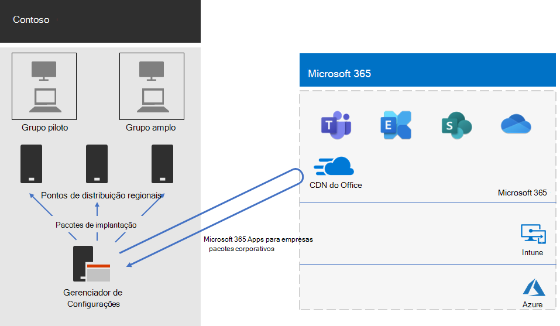

# Implantação do Microsoft 365 Apps for enterprise para Contoso

A Contoso atualizou seus PCs para o Windows 10 Enterprise e o Microsoft 365 Apps for enterprise a fim de permitir a colaboração mais eficiente, melhor segurança e uma experiência de área de trabalho mais moderna. Depois de avaliar suas necessidades comerciais e de infraestrutura, a Contoso identificou esses principais requisitos para a implantação:

- Todos os PCs devem executar o Microsoft 365 Apps para Grandes Empresas
- A implantação deve usar ferramentas de gerenciamento e infraestrutura existentes sempre que possível
- A implantação deve ser compatível com vários idiomas e arquiteturas existentes em dispositivos de usuário final
- Os PCs devem estar atualizados e protegidos com custos administrativos mínimos de TI e com impacto mínimo para os usuários finais

## Ferramentas de implantação

Com base nos requisitos, a Contoso escolheu implantar o Windows 10 Enterprise e o Microsoft 365 Apps for enterprise com o Configuration Manager (Branch Atual). O Configuration Manager é dimensionado para ambientes grandes e fornece controle extensivo sobre instalações, atualizações e configurações. Ele também possui recursos internos para facilitar e efetivar a implantação e o gerenciamento do Office, incluindo:

- Cache par, que pode ajudar com capacidade limitada de rede durante a implantação de dispositivos em locais remotos
- O painel de Gerenciamento de Clientes do Office, que facilita a implantação do Office e a monitoração das atualizações e oferece aos administradores acesso aos recursos mais recentes de implantação e gerenciamento
- Implantação inteligente do pacote de idiomas, incluindo implantação automática do mesmo idioma do sistema operacional
- Método com suporte total e fácil de usar de remover versões existentes do Office de um cliente durante a implantação

Além do Gerenciador de Configurações, a Contoso usou o [Readiness Toolkit](https://docs.microsoft.com/deployoffice/readiness-toolkit-application-compatibility-microsoft-365-apps), uma ferramenta gratuita da Microsoft para avaliar problemas de compatibilidade com seus suplementos e macros do Office.

## Gerenciar a implantação e as atualizações

O Microsoft 365 Apps for enterprise tem um novo modelo de lançamento: o Office como serviço. O modelo de serviço tem novos recursos que facilitam a atualização, mas geralmente exigem uma mudança de abordagem para departamentos de TI no modo como as novas versões são implantadas e testadas. Para minimizar os problemas de compatibilidade e garantir que seus computadores estejam atualizados, a Contoso implantou o Windows e o Office em duas etapas: 

- Para a primeira etapa, eles implantaram o Microsoft 365 Apps for enterprise para um pequeno conjunto de dispositivos representativos em toda a organização. Esse grupo piloto foi usado para testar os aplicativos, os suplementos e o hardware com o Office 365 ProPlus
- Quatro meses depois disso, após resolver todos os problemas graves com aplicativos, suplementos e hardware no grupo piloto, a Contoso implantou o Microsoft 365 Apps for enterprise no restante dos dispositivos da organização (o grupo amplo). 

Em vez de gerenciar as atualizações do Office com o Gerenciador de Configurações, a Contoso habilitou as atualizações automáticas da nuvem. As atualizações baseadas na nuvem reduziram a sobrecarga administrativa além de garantir que os dispositivos estivessem sempre atualizados. 

A Contoso seguiu a mesma abordagem de duas etapas para as atualizações de recursos que eles usavam para implantar o Office: os dispositivos no grupo piloto recebiam as atualizações de recursos quatro meses antes do que os dispositivos no restante da organização (o grupo amplo). Para habilitar isso no Office, a Contoso usou dois [canais de atualização](https://docs.microsoft.com/DeployOffice/overview-update-channels) recomendados: 

- Canal Empresarial Semestral (Visualização) para atualizações do grupo piloto 
- Canal Empresarial Semestral para atualizações para o grupo amplo. 

Como o Canal Empresarial Semestral (Visualização) lança uma versão do Microsoft 365 Apps para Grandes Empresas quatro meses antes do Canal Empresarial Semestral, a Contoso tem tempo para validar as atualizações sem precisar gerenciá-las. 

## Processo de implantação

Para concluir a implantação do Office, a Contoso implementou o seguinte processo, que inclui as práticas recomendadas da Microsoft:

1. Antes de implantar, eles usavam o Readiness Toolkit para testar seus aplicativos e suplementos do Office para avaliar a compatibilidade com o Microsoft 365 Apps for enterprise.
2. No Gerenciador de Configurações, a Contoso habilitou cache par nos dispositivos clientes, o que ajudou com a capacidade limitada de rede durante a implantação para dispositivos clientes em locais remotos. 
3. Eles definiram dois grupos de implantação como conjuntos de dispositivos no Gerenciador de Configurações: um grupo piloto e um grupo amplo. O grupo piloto, que incluía um pequeno conjunto de dispositivos representativos em toda a organização, foi usado para fazer outros testes de aplicativos, suplementos e hardware com o Windows 10 Enterprise e o Microsoft 365 Apps for enterprise. 
4. Eles criaram pacotes de implantação do Office usando o painel de gerenciamento de cliente do Office e o assistente de instalação do Office 365, que fazem parte do console do Gerenciador de Configurações. Eles criaram dois aplicativos para Microsoft 365 Apps para pacotes empresariais, um para o grupo piloto no Canal Empresarial Semestral (Visualização) e um para o grupo amplo no Canal Empresarial Semestral. 
5. Como parte da cada pacote do Office, eles incluíram pacotes de idiomas de inglês, francês e alemão. Se um dispositivo exigia um idioma que não estava incluído no pacote do Office, ele era automaticamente baixado da Rede de Distribuição de Conteúdo (CDN) do Office.
6. Eles usaram o recurso interno no pacote do Office para remover automaticamente todas as versões existentes do MSI do Office antes de instalar o Microsoft 365 Apps for enterprise.
7. No Gerenciador de Configurações, eles implantaram os pacotes do Windows e do Office em pontos de distribuição em toda a rede e executaram as sequências de tarefas de implantação do Gerenciador de Configurações para implantar o pacote piloto do Microsoft 365 Apps for enterprise no grupo piloto.
8. Depois de abordar problemas de compatibilidade com o grupo piloto, a Contoso executou as sequências de tarefas para implantar o pacote amplo do Microsoft 365 Apps for enterprise no grupo amplo.

Como a Contoso decidiu atualizar os dispositivos automaticamente a partir da nuvem, não havia necessidade de gerenciar o processo no Gerenciador de Configurações.  Seus dispositivos são automaticamente atualizados diretamente a partir da nuvem com base no canal de atualização que foi definido como parte da implantação inicial. 

Estes são os aplicativos do Microsoft 365 Apps for enterprise da Contoso para a instalação empresarial e atualizações contínuas da arquitetura de implantação do.

 
## Próxima etapa

[Saiba](contoso-mdm.md) como a Contoso está usando o Microsoft Intune no Microsoft 365 Enterprise para gerenciar seus dispositivos e os aplicativos que são executados neles em toda a organização.

## Confira também

[Microsoft 365 Apps para Grandes Empresas para o Microsoft 365 Enterprise](office365proplus-infrastructure.md)

[Guia de implantação](deploy-microsoft-365-enterprise.md)

[Guias de laboratório de teste](m365-enterprise-test-lab-guides.md)
