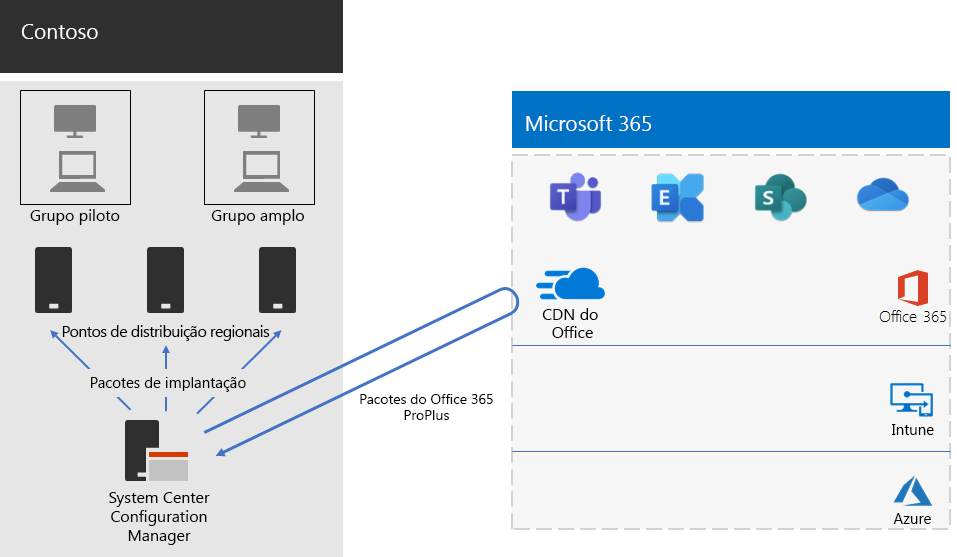

# Implantação do Office 365 ProPlus para a ContosoOffice 365 ProPlus deployment for Contoso

A Contoso atualizou seus PCs para o Windows 10 Enterprise e o Office 365 ProPlus a fim de permitir a colaboração mais eficiente, melhor segurança e uma experiência de área de trabalho mais moderna. Depois de avaliar suas necessidades comerciais e de infraestrutura, a Contoso identificou esses principais requisitos para a implantação:Contoso upgraded their PCs to Windows 10 Enterprise and Office 365 ProPlus to enable more effective collaboration, better security, and a more modern desktop experience. After assessing their infrastructure and business needs, Contoso identified these key requirements for the deployment:

- Todos os computadores devem executar o Office 365 ProPlusAll PCs should run Office 365 ProPlus
- A implantação deve usar ferramentas de gerenciamento e infraestrutura existentes sempre que possívelDeployment should use existing management tools and infrastructure when possible
- A implantação deve ser compatível com vários idiomas e arquiteturas existentes em dispositivos de usuário finalDeployment must support multiple languages and existing architectures on end-user devices
- Os PCs devem estar atualizados e protegidos com custos administrativos mínimos de TI e com impacto mínimo para os usuários finaisPCs should stay up-to-date and secure with minimal IT administrative costs and with minimal impact to end-users

## Ferramentas de implantaçãoDeployment tools

Com base em seus requisitos, a Contoso optou por implantar o Windows 10 Enterprise e o Office 365 ProPlus com o Gerenciador de Configurações (Branch Atual).Based on their requirements, Contoso chose to deploy Windows 10 Enterprise and Office 365 ProPlus with Configuration Manager (Current Branch). O Configuration Manager é dimensionado para ambientes grandes e fornece controle extensivo sobre instalação, atualizações e configurações.Configuration Manager scales for large environments and provides extensive control over installation, updates, and settings. Ele também possui recursos internos para tornar mais fácil e eficiente a implantação e o gerenciamento do Office, incluindo:It also has built-in features to make it easier and more efficient to deploy and manage Office, including:

- Cache par, que pode ajudar com capacidade limitada de rede durante a implantação de dispositivos em locais remotosPeer cache, which can help with limited network capacity when deploying to devices in remote locations
- O painel de Gerenciamento de Clientes do Office, que facilita a implantação do Office e a monitoração das atualizações e oferece aos administradores acesso aos recursos mais recentes de implantação e gerenciamentoThe Office Client Management dashboard, which makes it easy to deploy Office and monitor updates and gives administrators access to the latest deployment and management features
- Implantação inteligente do pacote de idiomas, incluindo implantação automática do mesmo idioma do sistema operacionalIntelligent language pack deployment, including automatically deploying the same language as the operating system
- Método com suporte total e fácil de usar de remover versões existentes do Office de um cliente durante a implantaçãoFully supported and easy-to-use method of removing existing versions of Office from a client during deployment

Além do Gerenciador de Configurações, a Contoso usou o [Readiness Toolkit](https://docs.microsoft.com/deployoffice/use-the-readiness-toolkit-to-assess-application-compatibility-for-office-365-pro), uma ferramenta gratuita da Microsoft para avaliar problemas de compatibilidade com seus suplementos e macros do Office.In addition to Configuration Manager, Contoso used the [Readiness Toolkit](https://docs.microsoft.com/deployoffice/use-the-readiness-toolkit-to-assess-application-compatibility-for-office-365-pro), a free tool from Microsoft, to assess compatibility issues with their Office macros and add-ins.

## Gerenciar a implantação e as atualizaçõesManaging the deployment and updates

O Office 365 ProPlus tem um novo modelo de lançamento: o Office como serviço. O modelo de serviço tem novos recursos que facilitam a atualização, mas geralmente exigem uma mudança de abordagem para departamentos de TI no modo como as novas versões são implantadas e testadas. Para minimizar os problemas de compatibilidade e garantir que seus computadores estejam atualizados, a Contoso implantou o Windows e o Office em duas etapas:Office 365 ProPlus has a new release model: Office as a service. The service model makes it easy to stay up to date with new features, but often requires a change in approach for IT departments in how new releases are deployed and tested. To minimize any compatibility issues and to ensure their computers stayed up to date, Contoso deployed Windows and Office in two stages: 

- Para a primeira etapa, eles implantaram o Office 365 ProPlus para um pequeno conjunto de dispositivos representativos em toda a organização. Esse grupo piloto foi usado para testar os aplicativos, os suplementos e o hardware com o Office 365 ProPlusFor the first stage, they deployed Office 365 ProPlus to a small set of representative devices across the organization. This pilot group was used to test apps, add-ins, and hardware with Office 365 ProPlus
- Quatro meses depois disso, após resolver todos os problemas graves com aplicativos, suplementos e hardware no grupo piloto, a Contoso implantou o Office 365 ProPlus no restante dos dispositivos da organização (o grupo amplo).Four months later, after addressing all critical issues with apps, add-ins, and hardware in the pilot group, Contoso deployed Office 365 ProPlus to the rest of the devices in the organization (the broad group). 

Em vez de gerenciar as atualizações do Office com o Gerenciador de Configurações, a Contoso habilitou as atualizações automáticas da nuvem. As atualizações baseadas na nuvem reduziram a sobrecarga administrativa além de garantir que os dispositivos estivessem sempre atualizados.Instead of managing updates to Office with Configuration Manager, Contoso enabled automatic updates from the cloud. Cloud-based updates reduced their administrative overhead while ensuring the devices stayed up to date. 

A Contoso seguiu a mesma abordagem de dois estágios para atualizações de recursos que ela usava para implantar o Office: os dispositivos no grupo piloto receberam atualizações de recursos quatro meses antes dos dispositivos no restante da organização (o grupo amplo).Contoso followed the same two-stage approach for feature updates+ that they used for deploying Office: devices in the pilot group received feature updates four months earlier than devices in the rest of the organization (the broad group). To enable this for Office, Contoso used two recommended update channels: Para habilitar isso no Office, a Contoso usou dois [canais de atualização](https://docs.microsoft.com/DeployOffice/overview-of-update-channels-for-office-365-proplus) recomendados:To enable this for Office, Contoso used two recommended [update channels](https://docs.microsoft.com/DeployOffice/overview-of-update-channels-for-office-365-proplus): 

- Canal semestral (direcionado) para atualizações para o grupo pilotoSemi-Annual Channel (Targeted) for updates to the pilot group 
- Canal semestral para atualizações para o grupo amplo.Semi-Annual Channel for updates to the broad group. 

Como o canal semestral (direcionado) lança uma versão do Office 365 ProPlus quatro meses antes do canal semestral, a Contoso tem tempo para validar as atualizações sem precisar gerenciá-las.Because the Semi-Annual (Targeted) Channel releases a version of Office 365 ProPlus four months earlier than the Semi-Annual Channel, Contoso has time to validate the updates without having to manage them. 

## Processo de implantaçãoDeployment process

Para concluir a implantação do Office, a Contoso implementou o seguinte processo, que inclui as práticas recomendadas da Microsoft:To complete the deployment of Office, Contoso implemented the following process, which includes best practice recommendations from Microsoft:

1. Antes de implantar, eles usavam o Readiness Toolkit para testar seus aplicativos e suplementos do Office para avaliar a compatibilidade com o Office 365 ProPlus.Before deploying, they used the Readiness Toolkit to test their apps and Office add-ins to assess their compatibility with Office 365 ProPlus.
2. No Gerenciador de Configurações, a Contoso habilitou cache par nos dispositivos clientes, o que ajudou com a capacidade limitada de rede durante a implantação para dispositivos clientes em locais remotos.In Configuration Manager, Contoso enabled peer cache on their client devices, which helped with limited network capacity when deploying to client devices in remote locations. 
3. Eles definiram dois grupos de implantação como conjuntos de dispositivos no Gerenciador de Configurações: um grupo piloto e um grupo amplo. O grupo piloto, que incluía um pequeno conjunto de dispositivos representativos em toda a organização, foi usado para fazer outros testes de aplicativos, suplementos e hardware com o Windows 10 Enterprise e o Office 365 ProPlus.They defined two deployment groups as device collections in Configuration Manager: a pilot group and a broad group. The pilot group, which included a small set of representative devices across the organization, was used to do additional testing of apps, add-ins, and hardware with Windows 10 Enterprise and Office 365 ProPlus. 
4. Eles criaram pacotes de implantação para o Office usando o painel de gerenciamento de clientes do Office e o Assistente de instalação do Office 365, que fazem parte do console do Gerenciador de Configurações. Eles criaram dois pacotes do Office 365 ProPlus, um para o grupo piloto no canal semestral (direcionado) e outro para o grupo amplo no canal semestral.They created deployment packages for Office using the Office Client Management dashboard and the Office 365 Installer wizard, both of which are part of the Configuration Manager console. They built two Office 365 ProPlus packages, one for the pilot group on the Semi-Annual Channel (Targeted) and one for the broad group on the Semi-Annual Channel. 
5. Como parte da cada pacote do Office, eles incluíram pacotes de idiomas de inglês, francês e alemão. Se um dispositivo exigia um idioma que não estava incluído no pacote do Office, ele era automaticamente baixado da Rede de Distribuição de Conteúdo (CDN) do Office.As part of each Office package, they included English, French, and German Language packs. If a device required a language not included in the Office package, it was automatically downloaded from the Office Content Delivery Network (CDN).
6. Eles usaram o recurso interno no pacote do Office para remover automaticamente todas as versões existentes do MSI do Office antes de instalar o Office 365 ProPlus.They used the built-in feature in the Office package to automatically remove all existing MSI versions of Office before installing Office 365 ProPlus.
7. No Gerenciador de Configurações, eles implantaram os pacotes do Windows e do Office em pontos de distribuição em toda a rede e executaram as sequências de tarefas de implantação do Gerenciador de Configurações para implantar o pacote piloto do Office 365 ProPlus no grupo piloto.In Configuration Manager, they deployed the Windows and Office packages to distribution points across their network, and then ran the Configuration Manager deployment task sequences to deploy the pilot Office 365 ProPlus package to the pilot group.
8. Depois de abordar problemas de compatibilidade com o grupo piloto, a Contoso executou as sequências de tarefas para implantar o pacote amplo do Office 365 ProPlus no grupo amplo.After addressing any compatibility issues with the pilot group, Contoso ran the task sequences to deploy the broad Office 365 ProPlus package to the broad group.

Como a Contoso decidiu atualizar os dispositivos automaticamente a partir da nuvem, não havia necessidade de gerenciar o processo no Gerenciador de Configurações. Because Contoso chose to automatically update devices from the cloud, there was no need to manage the process in Configuration Manager. Seus dispositivos são automaticamente atualizados diretamente a partir da nuvem com base no canal de atualização que foi definido como parte da implantação inicial.Their devices are automatically updated directly from the cloud based on the update channel that was defined as part of the initial deployment. 

Veja a arquitetura de implantação de atualizações contínuas e instalação do Office 365 ProPlus da Contoso.Here is Contoso’s Office 365 ProPlus installation and ongoing updates deployment architecture.

 
## Próxima etapaNext step

[Saiba](contoso-mdm.md) como a Contoso está usando o Microsoft Intune no Microsoft 365 Enterprise para gerenciar seus dispositivos e os aplicativos que são executados neles em toda a organização.[Learn](contoso-mdm.md) how Contoso is using Enterprise Mobility + Security (EMS) in Microsoft 365 Enterprise to manage its devices and the apps that run on them across its organization.

## Confira tambémSee also

[Office 365 ProPlus para Microsoft 365 EnterpriseOffice 365 ProPlus for Microsoft 365 Enterprise](office365proplus-infrastructure.md)

[Guia de implantaçãoDeployment guide](deploy-microsoft-365-enterprise.md)

[Guias de laboratório de testeTest lab guides](m365-enterprise-test-lab-guides.md)
