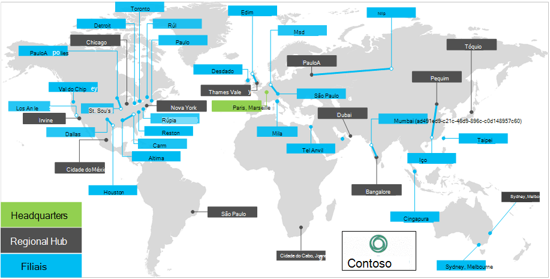

# Visão geral da Contoso Corporation

A Contoso Corporation é uma empresa multinacionala em Paris. A empresa é uma organização de manufatura, vendas e suporte com mais de 100.000 produtos.

## Contoso em todo o mundo

A Figura 1 mostra o escritório da sede em Paris e o Hub regional e escritórios satélites em vários continentes.

**Figura 1: escritórios da Contoso em todo o mundo**
 
A contoso tem três camadas de escritórios:

- Sede

  A matriz da Contoso é um campus corporativo no outskirts de Paris com dezenas de edifícios para instalações administrativas, de engenharia e de manufatura. Todos os datacenters da Contoso e sua presença na Internet estão hospedados na sede de Paris.

  A matriz tem 25 mil trabalhadores.

- Hubs regionais

  Os escritórios do Hub atendem a uma região específica do mundo com a equipe de suporte e vendas do 60-%. Cada Hub regional é conectado à sede de Paris por meio de um link WAN de alta largura de banda.

  Os hubs regionais têm uma média de 2.000 funcionários.

- Filiais

  Os escritórios satélites contêm a equipe de suporte e vendas de 80%. Eles fornecem uma presença local para clientes da Contoso em cidades ou subregiãos importantes. Cada escritório de satélite está conectado a um hub regional por meio de um link WAN de alta largura de banda.

  Os escritórios satélites têm uma média de 250 funcionários.

Cerca de 25% da força de funcionários da Contoso é somente móvel. Os hubs regionais e os escritórios de satélite têm uma porcentagem maior desses operadores. Fornecer suporte melhor para trabalhadores somente móveis é uma importante meta de negócios da Contoso.

## Considerações de design para o Microsoft 365 para empresas

Os arquitetos de ti da Contoso identificaram os seguintes fatores de requisitos de design para a implantação do Microsoft 365 for Enterprise:

- Vários locais geográficos com normas locais e requisitos de conformidade
- Um datacenter de intranet central nos servidores de aplicativos regionais e de linha da matriz que hospedam aplicativos de linha de negócios internos
- Uma infraestrutura existente do Microsoft Endpoint Configuration Manager
- Uma mistura de dispositivos de computação cliente que executam Windows, Mac e Linux
- Uma mistura de dispositivos móveis de propriedade da empresa e pessoais, incluindo tablets e smartphones Android e iOS (iPhone e iPad)
- Muitos trabalhadores remotos e móveis
- Vários parceiros de negócios
- Uma grande quantidade de clientes e outras informações pessoais confidenciais para gerenciar e proteger
- Uma grande quantidade de propriedade intelectual importante na forma de especificações de design de produtos e segredos comerciais de manufatura

## Próxima etapa

[Saiba mais](contoso-infra-needs.md) sobre a infraestrutura de ti local da Contoso Corporation e como as necessidades de negócios da empresa são abordadas com o Microsoft 365 para empresas.

## Confira também

[Visão geral do Microsoft 365 para empresas](microsoft-365-overview.md)

[Guias de laboratório de teste](m365-enterprise-test-lab-guides.md)
