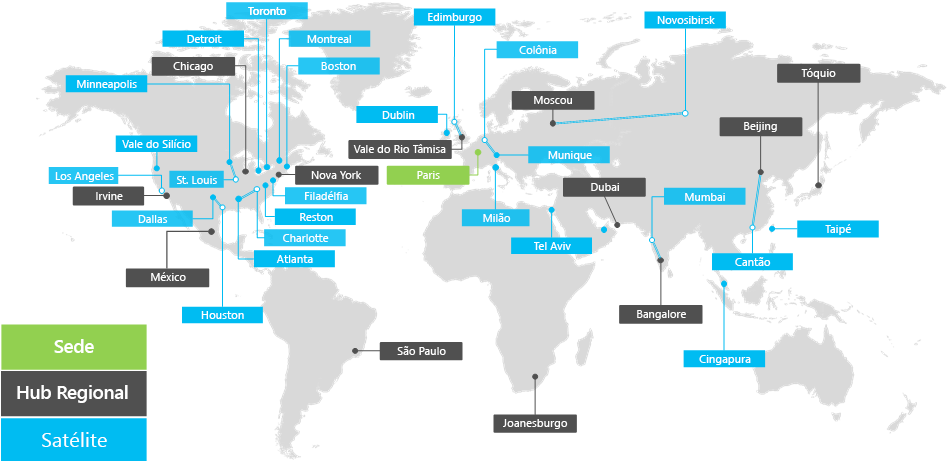

# Visão geral da Contoso CorporationOverview of the Contoso Corporation

**Resumo:** entender a Contoso Corporation como uma empresa e a estrutura hierárquica de seus escritórios em todo o mundo.**Summary:** Understand the Contoso Corporation as a business and the tiered structure of its worldwide offices.

A Contoso Corporation é uma empresa multinacional sediada em Paris, França. É uma organização de conglomerado de fabricação, vendas e suporte com mais de 100 mil produtos.The Contoso Corporation is a multi-national business with headquarters in Paris, France. It is a conglomerate manufacturing, sales, and support organization with over 100,000 products.

## Contoso em todo o mundoThe offices of the Contoso Corporation around the world

A Figura 1 mostra a matriz em Paris e hubs regionais e filiais em vários continentes.Figure 1 shows the headquarters office in Paris and regional hub and satellite offices in various continents.

**Figura 1: escritórios da Contoso em todo o mundo****Figure 1: Contoso's offices around the world**
 
Os escritórios da Contoso no mundo todo seguem um design de três camadas.Contoso's offices around the world follow a three-tier design.

- SedeHeadquarters

  A sede da Contoso Corporation é um grande campus corporativo nos arredores de Paris com dezenas de prédios com instalações administrativas, de fabricação e de engenharia. Todos os datacenters da Contoso e sua presença na Internet estão hospedados na sede de Paris.The Contoso Corporation headquarters is a large corporate campus on the outskirts of Paris with dozens of buildings for administrative, engineering, and manufacturing facilities. All of Contoso's datacenters and its Internet presence are housed in the Paris headquarters.

  A matriz tem 25 mil trabalhadores.The headquarters has 25,000 workers.

- Hubs regionaisRegional hubs

  Os escritórios do hub regional escritórios atendem a uma região específica do mundo com 60% de equipe de vendas e suporte. Cada hub regional está conectado à sede Paris por um link WAN de ampla largura de banda.Regional hub offices serve a specific region of the world with 60% sales and support staff. Each regional hub is connected to the Paris headquarters with a high-bandwidth WAN link.

  Cada hub regional tem uma média de 2 mil trabalhadores.Each regional hub has an average of 2,000 workers.

- FiliaisSatellite offices

  As filiais têm 80% de equipe de vendas e suporte e oferecem uma presença e local para os clientes da Contoso nas principais cidades ou sub-regiões. Cada filial está conectada a um hub regional por um link WAN ampla largura de banda.Satellite offices contain 80% sales and support staff and provide an on-site presence for Contoso customers in key cities or sub-regions. Each satellite office is connected to a regional hub with a high-bandwidth WAN link.

  Cada filial tem uma média de 250 funcionários.Each satellite office has an average of 250 workers.

25% de força de trabalho da Contoso trabalha somente fora do escritório, com uma porcentagem mais alta desses funcionários nos hubs regionais e filiais. Fornecer suporte aprimorado para esses funcionários é uma meta de negócios importante para a Contoso.25% of Contoso's workforce is mobile-only, with a higher percentage of mobile-only workers in the regional hubs and satellite offices. Providing better support for mobile-only workers is an important business goal for Contoso.

## Considerações de design para o Microsoft 365 EnterpriseDesign considerations for Microsoft 365 Enterprise

Os arquitetos de TI da Contoso identificaram as seguintes considerações de design durante a implantação do Microsoft 365 Enterprise:Contoso's IT architects identified the following design considerations when deploying Microsoft 365 Enterprise: 

- Vários locais geográficos com normas locais e requisitos de conformidadeMultiple geographic locations with local regulations and compliance requirements
- Um data center central de intranet na matriz e servidores de aplicativos regionais que hospedam uma linha interna de aplicativos de negóciosA central intranet datacenter in the headquarters office and regional application servers that host internal line of business applications
- Uma infraestrutura existente do System Center Configuration ManagerAn existing System Center Configuration Manager infrastructure
- Uma mistura de dispositivos de computação cliente, incluindo Windows, Mac e LinuxA mix of client computing devices, including Windows, Mac, and Linux
- Uma mistura de dispositivos móveis de propriedade da empresa e pessoais, incluindo tablets e smartphones Android e iOS (iPhone e iPad)A mix of personal and company-owned mobile devices, including iOS (iPhone and iPad) and Android smart phones and tablets
- Muitos trabalhadores remotos e móveisMany remote and mobile workers
- Vários parceiros de negóciosMany business partners
- Uma grande quantidade de dados do cliente e de identificação pessoalA large amount of customer and personally identifiable data
- Uma grande quantidade de propriedade intelectual importante na forma de especificações de design de produtos e segredos comerciais de manufaturaA large amount of high-value intellectual property in the form of design specifications for products and manufacturing trade secrets

## Próxima etapaNext step

[Saiba](contoso-infra-needs.md) mais sobre a infraestrutura de TI local da Contoso Corporation e de que forma as necessidades comerciais podem ser corrigidas com o Microsoft 365 Enterprise.[Learn](contoso-infra-needs.md) about the Contoso Corporation’s on-premises IT infrastructure and how their business needs can be addressed with Microsoft 365 Enterprise.

## Confira tambémSee also

[Guia de implantaçãoDeployment guide](deploy-microsoft-365-enterprise.md)

[Guias de laboratório de testeTest lab guides](m365-enterprise-test-lab-guides.md)

