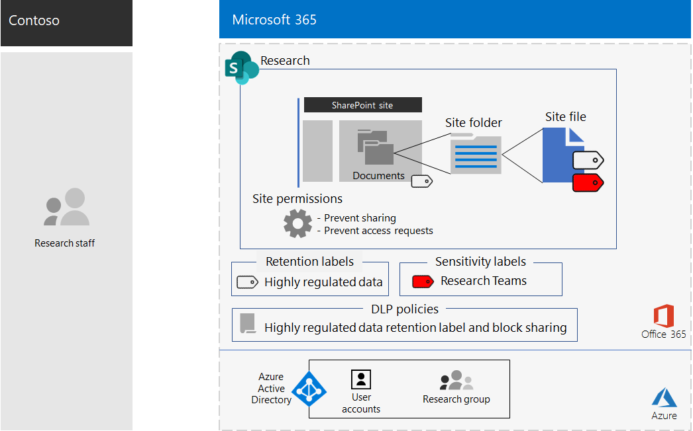

# Site do SharePoint para ativos digitais altamente confidenciais da Contoso Corporation

 **Resumo:** Como a contoso implementou um site do SharePoint para dados altamente regulamentados para facilitar a colaboração entre suas equipes de pesquisa.
  
Os ativos mais valiosos da Contoso são sua propriedade intelectual na forma de segredos comerciais, como técnicas de fabricação proprietárias e especificações de design para produtos que estão em desenvolvimento. Esses ativos estavam em formato digital, originalmente armazenados como arquivos em um site do SharePoint Server 2016. Quando a contoso implantou o Microsoft 365 Enterprise, eles queriam migrar seus ativos digitais locais para a nuvem para facilitar o acesso e mais colaboração aberta entre as equipes de pesquisa em Paris, Moscow, Nova York, Pequim e Bangalore. 
  
No entanto, devido à natureza confidencial, o acesso a esses arquivos deve ser:

- Restrito ao conjunto de pessoas que têm permissão para acessá-las. 
- Protegido por uma política de prevenção contra perda de dados (DLP) para impedir que os usuários os distribuam fora do site.
- Criptografado e protegido com permissões para impedir que usuários não autorizados acessem seus conteúdos, mesmo que eles sejam distribuídos fora do site.

Administradores de segurança e do SharePoint no departamento de ti da Contoso decidiram usar um [site do SharePoint para dados altamente regulamentados](teams-sharepoint-online-sites-highly-regulated-data.md).
  
A contoso usou estas etapas para criar e proteger sites de equipe do SharePoint para suas equipes de pesquisa.

## Etapa 1: criou um site de equipe do SharePoint privado

Para proteger o acesso ao site do SharePoint, a contoso configurou as [políticas de acesso recomendadas do SharePoint](sharepoint-file-access-policies.md).

Em seguida, os administradores de ti da Contoso compilaram uma lista das contas de usuário dos pesquisadores em seus escritórios Paris, Moscou, New York, Pequim e Bangalore. 

Em seguida, um administrador de ti da Contoso criou um novo site de equipe privado chamado **pesquisa** e adicionou todas as contas de usuário para seus pesquisadores.

Em seguida, eles definiram configurações de permissão adicionais para o site a fim de evitar que pesquisadores compartilhem o acesso ao site e impedir que não pesquisadores solicitem acesso ao site.

## Etapa 2: configurar o site para uma política de DLP restritiva

Primeiro, os administradores da Contoso aplicaram o rótulo de retenção do Office 365 **altamente confidencial** existente à pasta documentos do site de **pesquisa** .

Em seguida, criamos uma nova política de DLP do Office 365 chamada **pesquisa** que:

- Usa o rótulo de retenção **altamente confidencial** do Office 365. 
- Bloqueia os usuários quando eles tentam compartilhar um ativo digital no site de **pesquisa** fora da contoso.

Para obter os detalhes de configuração, consulte [proteger arquivos do SharePoint com rótulos de retenção e DLP](https://docs.microsoft.com/office365/enterprise/protect-sharepoint-online-files-with-office-365-labels-and-dlp).

## Etapa 4: criar um subrótulo de sensibilidade do Office 365 para o site

Os administradores da Contoso criaram um novo subrótulo de confidencialidade do Office 365 chamado **Teams de pesquisa** do rótulo **altamente confidencial** que:

- Requer criptografia.
- Permite permissões de coautoria para o grupo de **pesquisa** do Office 365
- Aplica-se ao grupo de **pesquisa** do Office 365

Aqui está a configuração resultante do site de equipe de **pesquisa** para ativos altamente confidenciais.

Arquivos em pastas do site de **pesquisa** são protegidos por:

- As permissões de site, que permitem acesso somente aos membros do grupo **Research** Office 365.
- A política de DLP de **pesquisa** , que usa o rótulo de retenção **altamente confidencial** e as configurações que impedem o arquivo de ser compartilhado com usuários externos.
- O subrótulo de confidencialidade das **equipes de pesquisa** , com criptografia e permissões que trafegam com o arquivo se ele for movido ou copiado do site de **pesquisa** .

Aqui está um exemplo de um arquivo armazenado no site de **pesquisa** com o subrótulo de confidencialidade das **equipes de pesquisa** atribuído.

## Etapa 5: migrar os dados de pesquisa do SharePoint local

Os administradores da Contoso moveram todos os arquivos de pesquisa local no site do SharePoint Server 2016 local para pastas no novo site do SharePoint de **pesquisa** .

## Etapa 6: treinado seus pesquisadores

A equipe de segurança da Contoso treinou os membros do grupo **Research** Office 365 em um curso obrigatório que os apresentou por meio de:

- Como acessar o novo site de **pesquisa** e seus arquivos existentes.
- Como criar novos arquivos no site e carregar novos arquivos armazenados localmente.
- Uma demonstração de como a política de DLP de **pesquisa** impede que os arquivos sejam compartilhados externamente.
- Como rotular arquivos com o subrótulo de confidencialidade das **equipes de pesquisa** .
- Uma demonstração de como o subrótulo das **equipes de pesquisa** protege um arquivo, mesmo quando ele é vazado do site.

O resultado final é um ambiente seguro no qual os pesquisadores podem colaborar através da Contoso em um ambiente seguro em arquivos que contenham informações de pesquisa. 

Se um documento de pesquisa com o subrótulo **Teams de pesquisa** deixa o site de **pesquisa** , ele é criptografado e acessível somente para os membros dos grupos do Office 365 de **pesquisa** com credenciais de conta de usuário válidas.

## Próxima etapa

[Implantar](deploy-microsoft-365-enterprise.md) Microsoft 365 Enterprise em sua organização.

## Confira também

[Biblioteca de produtividade da Microsoft 365](https://aka.ms/productivitylibrary) (https://aka.ms/productivitylibrary)
