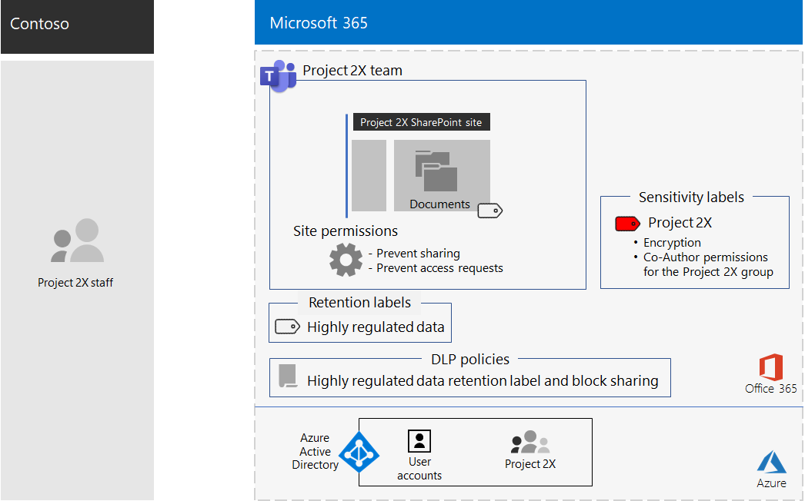
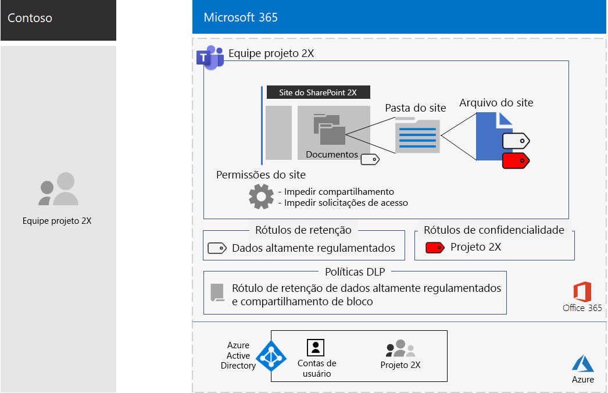

# Equipe para um projeto confidencial da Contoso CorporationTeam for a top-secret project of the Contoso Corporation

Após um executivo externo, o CEO da Contoso pediu o desenvolvimento de um novo pacote de produtos e serviços que poderia dobrar os lucros da Contoso nos próximos cinco anos.After an executive offsite, Contoso’s CEO ordered the development of a new suite of products and services that could double Contoso’s profits in the next five years. O projeto de segredo superior para desenvolver o plano de negócios, de engenharia e de mercado foi chamado de **projeto 2x** e o principal pessoal na empresa foi recrutado.The top-secret project to develop the business, engineering, and market plan was named **Project 2X** and key staff across the company were recruited. 

Os cronogramas para pesquisa e desenvolvimento estavam apertados, o que significava que a colaboração era eficiente e forneceva reuniões seguras, conversas em andamento e armazenamento de arquivos.The timelines for research and development were tight, which meant that collaboration had to be efficient and provide for secure meetings, ongoing conversations, and file storage.

Os resultados finais do projeto 2X foram planos de negócios, especificações de produtos e de engenharia e materiais de marketing e agendamentos no formato de arquivos do Word, Excel e PowerPoint.The resulting deliverables for Project 2X were business plans, product and engineering specifications, and marketing materials and schedules in the form of Word, Excel, and PowerPoint files. 

Devido à sua natureza confidencial, o acesso a esses arquivos era:Due to their sensitive nature, access to these files were:

- Restrito aos membros da equipe do projeto 2.Restricted to Project 2X team members.
- Protegido por uma política de prevenção contra perda de dados (DLP) para impedir que os membros da equipe do projeto 2 o compartilhem fora da equipe.Protected with a Data Loss Prevention (DLP) policy to prevent Project 2X team members from sharing them outside the team.
- Criptografado e protegido com permissões para permitir acesso somente aos membros da equipe do Project 2X, mesmo que os arquivos tenham sido distribuídos fora da contoso.Encrypted and protected with permissions to allow access only to Project 2X team members, even if the files were distributed outside of Contoso.

A equipe de ti da Contoso usou uma [equipe para dados altamente regulamentados](secure-teams-highly-regulated-data-scenario.md) para o projeto 2x e estas etapas.Contoso IT staff used a [team for highly-regulated data](secure-teams-highly-regulated-data-scenario.md) for Project 2X and these steps.

## Etapa 1: criar uma equipe privada e bloquear o site do SharePoint subjacenteStep 1: Created a private team and locked down the underlying SharePoint site

Para proteger o acesso ao site do SharePoint subjacente para a equipe, os administradores de ti da Contoso configuraram as [políticas de acesso recomendadas do SharePoint](sharepoint-file-access-policies.md).To protect access to the underlying SharePoint site for the team, Contoso IT administrators configured the [recommended SharePoint access policies](sharepoint-file-access-policies.md).

Em seguida, um administrador de ti da Contoso criou uma nova equipe privada chamada projeto 2X e adicionou as contas de usuário do projeto 2X como membros.Next, a Contoso IT administrator created a new private team named Project 2X and added the user accounts of Project 2X staff as members.

Em seguida, eles definiram configurações de permissão adicionais para o site a fim de evitar que o projeto seja compartilhado de compartilhar o acesso ao site e impedir outros de solicitar acesso ao site.Next, they configured additional permission settings for the site to prevent Project 2X from sharing access to the site and to prevent other from requesting access to the site.

Para obter detalhes sobre a configuração, consulte [configurações do SharePoint para uma equipe altamente regulamentada](https://docs.microsoft.com/microsoft-365/security/office-365-security/deploy-teams-three-tiers#highly-confidential-teams).For the configuration details, see [SharePoint settings for a highly regulated team](https://docs.microsoft.com/microsoft-365/security/office-365-security/deploy-teams-three-tiers#highly-confidential-teams).

## Etapa 2: configurou uma política de DLP e o site subjacente para um rótulo de retençãoStep 2: Configured a DLP policy and the underlying site for a retention label 

Primeiro, os administradores da Contoso aplicaram o rótulo de retenção do Office 365 **altamente confidencial** existente à seção **documentos** do site do SharePoint subjacente da equipe do projeto 2.First, Contoso admins applied the existing **Highly Confidential** Office 365 retention label to the **Documents** section of the underlying SharePoint site of the Project 2X team.

Em seguida, criamos uma nova política de DLP do Office 365 chamada **Project 2x** que:Next, they created a new Office 365 DLP policy named **Project 2X** that:

- Usa o rótulo de retenção altamente confidencial do Office 365.Uses the Highly Confidential Office 365 retention label.
- Bloqueia os usuários quando eles tentam compartilhar um arquivo na equipe do projeto 2X fora da contoso.Blocks users when they attempt to share a file in the Project 2X team outside of Contoso.

Para obter os detalhes de configuração, consulte [proteger arquivos no Microsoft Teams com rótulos de retenção e DLP](https://docs.microsoft.com/microsoft-365/security/office-365-security/deploy-teams-retention-dlp).For the configuration details, see [Protect files in teams with retention labels and DLP](https://docs.microsoft.com/microsoft-365/security/office-365-security/deploy-teams-retention-dlp).

## Etapa 3: criou um rótulo de confidencialidade do Office 365 para o projeto 2X TeamStep 3: Created an Office 365 sensitivity label for the Project 2X team

Os administradores da Contoso criaram um novo rótulo de sensibilidade do Office 365 chamado **projeto 2x** que:Contoso admins created a new Office 365 sensitivity label named **Project 2X** that:

- Requer criptografia.Requires encryption.
- Permite permissões de coautoria para o grupo do projeto 2X Office 365.Allows Co-Author permissions for the Project 2X Office 365 group.

Veja a seguir a configuração resultante da equipe do projeto 2X.Here is the resulting configuration of the Project 2X team.

 
Arquivos na seção Documents do projeto subjacente o site do SharePoint é protegido por:Files in the Documents section of the underlying Project 2X SharePoint site were protected by:

- As permissões de site, que permitem apenas o acesso aos membros do grupo do projeto 2X do Office 365.The site permissions, which only allow access to members of the Project 2X Office 365 group.
- O rótulo de retenção altamente confidencial, que é atribuído automaticamente a novos arquivos.The  Highly Confidential retention label, which is automatically assigned to new files.
- Uma política de DLP que usa o rótulo e as configurações de retenção altamente confidenciais que impedirão o arquivo de ser compartilhado com usuários externos.A DLP policy that uses the Highly Confidential retention label and settings that block the file from being shared with external users.
- O rótulo de sensibilidade do projeto 2X, com criptografia e permissões que trafegam com o arquivo se ele for movido ou copiado do site.The Project 2X sensitivity label, with encryption and permissions that travel with the file if it is moved or copied from the site.

Aqui está um exemplo de um arquivo armazenado no site subjacente do projeto 2 com o rótulo de retenção altamente regulamentado e o rótulo de sensibilidade do projeto 2X atribuído.Here is an example of a file stored in the underlying Project 2X site with the Highly Regulated retention label and the Project 2X sensitivity label assigned.

 
## Etapa 4: projeto treinado 2 membros da equipeStep 4: Trained Project 2X team members

A equipe de segurança da Contoso treinou o projeto 2 membros da equipe em um curso obrigatório que os apresentou:Contoso security staff trained the Project 2X team members in a mandatory course that stepped them through:

- Como acessar a nova equipe do projeto 2, use reuniões e chats e como colaborar em arquivos da equipe.How to access the new Project 2X team, use meetings and chats, and how to collaborate on team files.
- Como criar novos arquivos na equipe e carregar novos arquivos criados localmente.How to create new files in the team and upload new files created locally.
- Uma demonstração de como a política de DLP impede que os arquivos sejam compartilhados externamente.A demonstration of how the DLP policy blocks files from being shared externally.
- Como rotular arquivos com o rótulo de sensibilidade do projeto 2X.How to label files with the Project 2X sensitivity label.
- Uma demonstração de como o rótulo projeto 2X protege um arquivo, mesmo quando ele sai da equipe.A demonstration of how the Project 2X  label protects a file even when it leaves the team.

O resultado final era um ambiente seguro no qual o projeto 2X membros da equipe colaboraram em um ambiente seguro para chats, reuniões e arquivos.The end result was a secure environment in which Project 2X team members collaborated in a secure environment for chats, meetings, and files.

Em alguns casos, o Project 2X os membros da equipe baixaram arquivos protegidos pelo rótulo Project 2X para uma unidade local para trabalho offline.In a couple of instances, Project 2X team members downloaded files protected by the Project 2X label to a local drive for offline work. No entanto, após serem solicitadas as credenciais ao serem abertas, elas perceberam o erro e as excluíram.However, after being prompted for credentials when opening them, they realized their mistake and deleted them.

Por causa do ambiente de colaboração do Teams e dos recursos de segurança do Microsoft 365, os detalhes do projeto 2X foram mantidos secretos para a duração do projeto.Because of the collaboration environment of Teams and the security features of Microsoft 365, the details of Project 2X were kept secret for the duration of the project. A contoso anunciou seus planos e está no processo de distribuir os novos produtos e serviços para a encantarão de seus clientes e investidores e para o Chagrin de seus concorrentes.Contoso announced its plans and is in the process of rolling out the new products and services to the delight of its customers and investors and the chagrin of its competitors.

## Próxima etapaNext step

[Implantar](deploy-microsoft-365-enterprise.md) Microsoft 365 Enterprise em sua organização.[Deploy](deploy-microsoft-365-enterprise.md) Microsoft 365 Enterprise in your organization.

## Confira tambémSee also

[Biblioteca de produtividade do Microsoft 365](https://aka.ms/productivitylibrary) (https://aka.ms/productivitylibrary)[Microsoft 365 Productivity Library](https://aka.ms/productivitylibrary) (https://aka.ms/productivitylibrary)
