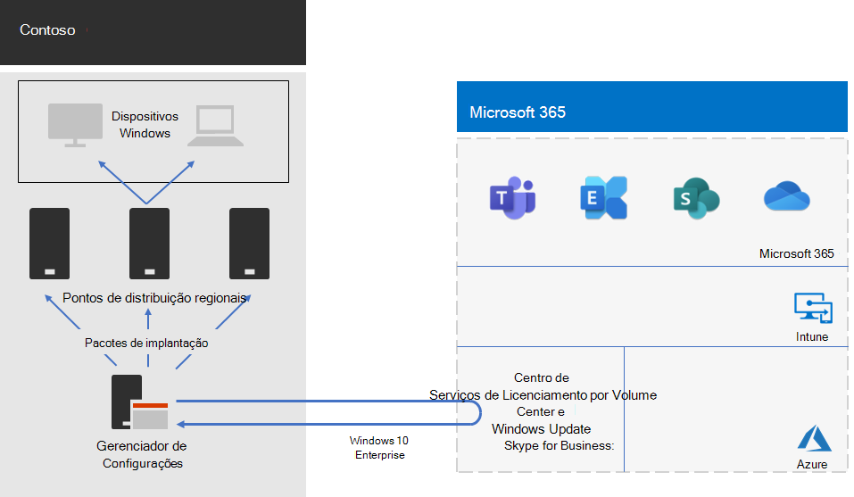

# Implantação do Windows 10 Enterprise para a Contoso

Antes da ampla lançamento do Microsoft 365 para empresas, a Contoso tinha computadores e dispositivos compatíveis com o Windows executando uma mistura de Windows 7 (10%), Windows 8.1 (65%) e Windows 10 (25%). A Contoso queria atualizar seus computadores para o Windows 10 Enterprise tirar proveito da segurança avançada e reduzir a sobrecarga de IT de implantações automatizadas de atualizações. 

Depois de avaliar suas necessidades de infraestrutura e comerciais, a Contoso identificou esses principais requisitos para a implantação:

- O maior número possível de PCs e dispositivos que devem executar o Windows 10 Enterprise
- A distribuição das atualizações in-loco aproveita a infraestrutura existente do Configuration Manager
- O controle de quais versões do Windows 10 Enterprise implantar e atualizar são feitas por meio de anéis
- Os PCs e dispositivos devem estar atualizados com custos administrativos mínimos de TI e com impacto mínimo para os usuários finais

A data atual é definida como a versão suportada do Windows 10 Enterprise que atende às necessidades comerciais da Contoso, o que pode ser diferente de ter todos os PCs compatíveis com o Windows que executa a versão mais recente do Windows 10 Enterprise.

## Ferramentas de implantação

Antes e durante as atualizações in-loco do Windows 10 Enterprise, a Contoso usou as seguintes soluções do Windows Analytics:

- Upgrade Readiness  

  Coleta dados do sistema, aplicativo e driver para análise e, em seguida, identifica problemas de compatibilidade que podem bloquear uma atualização e correções sugeridas de problemas conhecidos da Microsoft.

- Conformidade de atualização  

  Mostra o estado dos dispositivos com relação às atualizações do Windows para que você possa garantir que eles estejam nas atualizações mais recentes conforme apropriado.

- Integridade do dispositivo  

  Identifica os dispositivos que falham com frequência e, portanto, talvez precisem ser recriados ou substituídos, e os drivers de dispositivo que estejam falhando, com sugestões de versões alternativas desses drivers, podem reduzir o número de falhas. Fornece notificação de configurações incorretas de proteção de informações do Windows que enviam avisos para os usuários finais.
 
A Contoso possui uma infraestrutura existente do Configuration Manager (Branch Atual). O Configuration Manager é dimensionado para ambientes grandes e fornece controle extensivo sobre instalações, atualizações e configurações. Ele também possui recursos internos para facilitar e efetivar a implantação e o gerenciamento do Windows 10 Enterprise.

## Processo de planejamento

A Contoso usou o Upgrade Readiness no Windows Analytics para determinar o conjunto de aplicativos instalados e sua compatibilidade com o Windows 10 Enterprise.

## Processo de implantação

Para concluir a implantação da atualização in-loco do Windows 10 Enterprise, a Contoso implementou o seguinte processo, que inclui recomendações de práticas recomendadas da Microsoft:

1. Habilitou o cache par para o Configuration Manager.
2. Criou pacotes personalizados do Windows com base em imagens do Centro de Atendimento de Licenciamento por Volume.
3. Usou o Gerenciador de Configurações para implantar os pacotes do Windows em pontos de distribuição em sua rede e implantou builds nos três grupos de preparação de validação e implantação.
4. Realizou uma avaliação de sucesso para PCs e dispositivos nos três anéis de teste de validação e implantação usando as soluções de Integridade do dispositivos e Conformidade de atualização do Windows Analytics.
5. Com base nas informações do Windows Analytics, a Contoso determinou que a versão do Windows 10 Enterprise seja implantada no grupo de implantação amplo.
6. As sequências de tarefas de implantação do Configuration Manager foram implantadas para implantar o pacote do Windows selecionado para o grupo de implantação amplo.
7. Os PCs e dispositivos monitorados no amplo grupo de implantação usando as soluções de Conformidade de Atualização e Saúde do Dispositivo para resolver problemas.

Veja a atualização in-loco e a arquitetura de implantação de atualizações contínuas.

Esta infraestrutura é formada pelo:

- Configuration Manager, que:
  - Obtém imagens para pacotes do Windows 10 Enterprise a partir do Centro de Licenciamento por Volume da Microsoft na Rede da Microsoft.
  - É o ponto de administração central para pacotes de implantação.
- Pontos de distribuição regionais que normalmente estão localizados nos escritórios secundários da Contoso.
- Computadores e dispositivos Windows em vários locais que recebem e instalam os pacotes de implantação para a atualização local ou atualizações contínuas com base na associação ao grupo.

## Próxima etapa

Saiba como a Contoso está aproveitando sua infraestrutura do Configuration Manager para implantar e manter os aplicativos atuais do [Microsoft 365 para](contoso-o365pp.md) empresas em toda sua organização. 

## Confira também

[Windows 10 Enterprise](/windows/deployment/)

[Visão geral do Microsoft 365 para empresas](microsoft-365-overview.md)

[Guias de laboratório de teste](m365-enterprise-test-lab-guides.md)