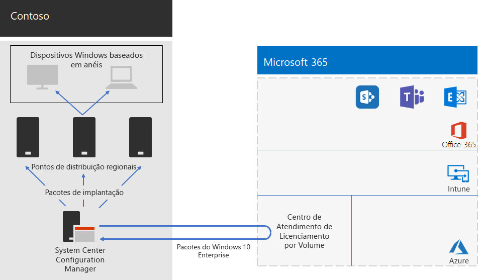

# Implantação do Windows 10 Enterprise para a Contoso

**Resumo:** entenda como a Contoso usou o System Center Configuration Manager para implantar atualizações in-loco para o Windows 10 Enterprise.

Antes da ampla implantação do Microsoft 365 Enterprise, a Contoso tinha PCs e dispositivos compatíveis com o Windows que executavam uma combinação de Windows 7 (10%), Windows 8.1 (65%) e Windows 10 (25%). A Contoso queria atualizar seus PCs para o Windows 10 Enterprise para aproveitar a segurança aprimorada e reduzir a sobrecarga da TI em implantações automatizadas de atualizações. 

Depois de avaliar suas necessidades de infraestrutura e comerciais, a Contoso identificou esses principais requisitos para a implantação:

- O maior número possível de PCs e dispositivos que devem executar o Windows 10 Enterprise
- A implantação das atualizações in-loco aproveita a infraestrutura existente do System Center Configuration Manager
- O controle de quais versões do Windows 10 Enterprise implantar e atualizar são feitas por meio de anéis
- Os PCs e dispositivos devem estar atualizados com custos administrativos mínimos de TI e com impacto mínimo para os usuários finais

A data atual é definida como a versão suportada do Windows 10 Enterprise que atende às necessidades comerciais da Contoso, o que pode ser diferente de ter todos os PCs compatíveis com o Windows que executa a versão mais recente do Windows 10 Enterprise.

## Ferramentas de implantação

Antes e durante as atualizações in-loco do Windows 10 Enterprise, a Contoso usou as seguintes soluções do Windows Analytics:

- Upgrade Readiness  

  Coleta dados do sistema, aplicativo e driver para análise e, em seguida, identifica problemas de compatibilidade que podem bloquear uma atualização e correções sugeridas de problemas conhecidos da Microsoft.

- Conformidade de atualização  

  Coleta dados do sistema e de diagnóstico, incluindo o progresso da instalação da atualização, dados de configuração do Windows Update para Empresas (WUfB), dados do Windows Defender Antivírus e outras informações específicas da atualização, e armazena esses dados na análise e uso da nuvem.

- Integridade do dispositivo  

  Coleta dados do sistema e de diagnóstico do Windows 10, incluindo o progresso da instalação da atualização, dados de configuração do Windows Update para Empresas (WUfB), dados do Windows Defender Antivírus e outras informações específicas da atualização, e armazena esses dados na análise e uso da nuvem.
 
A Contoso possui uma infraestrutura existente do System Center Configuration Manager (Branch Atual). O Configuration Manager é dimensionado para ambientes grandes e fornece controle extensivo sobre instalações, atualizações e configurações. Ele também possui recursos internos para facilitar e efetivar a implantação e o gerenciamento do Windows 10 Enterprise.

## Processo de planejamento

Antes da implantação, a Contoso definiu os seguintes anéis:

- Três anéis para validação e preparação da implantação 
  - Um para compilações de visualização 
  - Um para compilações da nova versão
  - Um para compilações anteriores 
- Um anel para a implantação geral do Windows 10 Enterprise com base nos dados dos anéis de validação

A Contoso também usou a solução Upgrade Readiness do Windows Analytics para determinar o conjunto de aplicativos instalados e sua compatibilidade com o Windows 10 Enterprise.

## Processo de implantação

Para concluir a implantação da atualização in-loco do Windows 10 Enterprise, a Contoso implementou o seguinte processo, que inclui recomendações de práticas recomendadas da Microsoft:

1. Habilitou o cache par para o Configuration Manager.
2. Criou pacotes personalizados do Windows com base em imagens do Centro de Atendimento de Licenciamento por Volume.
3. Utilizou o Configuration Manager para implantar os pacotes do Windows em pontos de distribuição em toda a rede e em compilações implantadas para os três anéis de armazenamento temporário de validação e implantação.
4. Realizou uma avaliação de sucesso para PCs e dispositivos nos três anéis de teste de validação e implantação usando as soluções de Integridade do dispositivos e Conformidade de atualização do Windows Analytics.
5. Com base nas informações do Windows Analytics, a Contoso determinou qual versão do Windows 10 Enterprise será implantada no anel de implantação geral.
6. Executou as sequências das tarefas de implantação do Configuration Manager para implantar o pacote do Windows escolhido no anel de implantação geral.
7. Os computadores e dispositivos monitorados na implantação geral usam as soluções de Integridade do dispositivos e Conformidade de atualização fornecidas pelo Windows Analytics para solucionar problemas.

A Figura 1 mostra a atualização in-loco e a arquitetura de implantação de atualizações contínuas.

 
**Figura 1: infraestrutura de implantação do Windows 10 Enterprise da Contoso**

Esta infraestrutura é formada pelo:

- System Center Configuration Manager que:
  - Obtém imagens para pacotes do Windows 10 Enterprise a partir do Centro de Licenciamento por Volume da Microsoft na Rede da Microsoft.
  - É o ponto de administração central para pacotes de implantação.
- Pontos de distribuição regionais que normalmente estão localizados nos escritórios secundários da Contoso.
- Os dispositivos e computadores Windows em vários locais que recebem e instalam os pacotes de implantação para atualizações in-loco ou atualizações contínuas com base na associação do anel.

## Próxima etapa

[Saiba](contoso-o365pp.md) mais sobre como a Contoso utiliza a infraestrutura do System Center Configuration Manager para implantar e manter o Office 365 ProPlus atualizado em toda a organização. 

## Confira também

[Windows 10 Enterprise para Microsoft 365 Enterprise](windows10-infrastructure.md)

[Guia de implantação](deploy-microsoft-365-enterprise.md)

[Guias de laboratório de teste](m365-enterprise-test-lab-guides.md)
