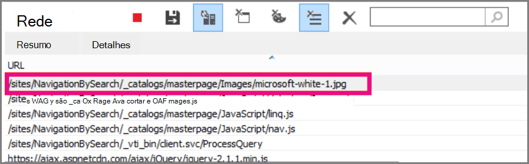
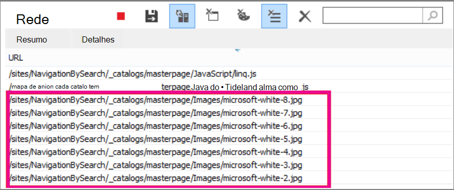

# <a name="delay-loading-images-and-javascript-in-sharepoint-online"></a>Atraso no carregamento de imagens e JavaScript no SharePoint Online

Este artigo descreve como você pode diminuir o tempo de carregamento das páginas do SharePoint online usando o JavaScript para atrasar o carregamento de imagens e aguardando o carregamento de JavaScript não essencial até que a página seja carregada.
  
As imagens podem afetar negativamente as velocidades de carga de página no SharePoint Online. Por padrão, a maioria dos navegadores da Internet modernos buscam imagens ao carregar uma página HTML. Isso pode fazer com que a página seja desnecessariamente lenta para carregar se as imagens não estiverem visíveis na tela até que o usuário Role para baixo. As imagens podem impedir que o navegador carregue a parte visível da página. Para contornar esse problema, você pode usar o JavaScript para ignorar primeiro o carregamento das imagens. Além disso, carregar JavaScript não essencial pode reduzir o tempo de download em suas páginas do SharePoint. Este tópico descreve alguns métodos que você pode usar para melhorar o tempo de carregamento de página com JavaScript no SharePoint Online.
  
## <a name="improve-page-load-times-by-delaying-image-loading-in-sharepoint-online-pages-by-using-javascript"></a>Melhorar o tempo de carregamento da página atrasando o carregamento de imagens nas páginas do SharePoint online usando o JavaScript

Você pode usar o JavaScript para impedir que um navegador da Web busque imagens. Isso aumenta a renderização geral do documento. Para fazer isso, remova o valor do atributo src da \ marca e substitua-o pelo caminho de um arquivo em um atributo de dados, como: data-src. Por exemplo:
  
```html

```

Usando esse método, o navegador não baixa as imagens imediatamente. Se a imagem já estiver na viewport, o JavaScript instrui o navegador a recuperar a URL do atributo de dados e a inseri-la como o valor para o atributo src. A imagem só é carregada à medida que o usuário rola e é exibido.
  
Para fazer isso, você precisará usar o JavaScript.
  
Em um arquivo de texto, defina a função **isElementInViewport ()** para verificar se um elemento está ou não na parte do navegador que é visível para o usuário.
  
```javascript
function isElementInViewport(el) {
  if (!el)
    return false;
  var rect = el.getBoundingClientRect();
  return (
    rect.top >= 0 &amp;&amp;
    rect.left >= 0 &amp;&amp;
    rect.bottom <= (window.innerHeight || document.documentElement.clientHeight) &amp;&amp;
    rect.right <= (window.innerWidth || document.documentElement.clientWidth)
  );
}
```

Em seguida, use **isElementInViewport ()** na função **loadItemsInView ()** . A função **loadItemsInView ()** carregará todas as imagens que têm um valor para o atributo Data-src, se elas estiverem na parte do navegador que estiver visível para o usuário. Adicione a seguinte função ao arquivo de texto:
  
```javascript
function loadItemsInView() {
  //Select elements by the row id.
  $("#row [data-src]").each(function () {
      var isVisible = isElementInViewport(this);
      if (isVisible) {
          if ($(this).attr("src") == undefined) {
              $(this).attr("src", $(this).data("src"));
          }
      }
  });
}
```

Por fim, chame **loadItemsInView ()** de dentro de **Window. OnScroll ()** , conforme mostrado no exemplo a seguir. Isso garante que qualquer imagem que esteja na viewport seja carregada conforme o usuário precisa delas, mas não antes. Adicione o seguinte ao arquivo de texto:
  
```javascript
//Example of calling loadItemsInView() from within window.onscroll()
$(window).on("scroll", function () {
    loadItemsInView();
});

```

Para o SharePoint Online, você precisa anexar a função a seguir ao evento Scroll na marca #s4-Workspace \<div\> . Isso ocorre porque os eventos Window são substituídos a fim de garantir que a faixa de opções permaneça anexada à parte superior da página.
  
```javascript
//Keep the ribbon at the top of the page
$('#s4-workspace').on("scroll", function () {
    loadItemsInView();
});
```

Salve o arquivo de texto como um arquivo JavaScript com a extensão. js, por exemplo delayLoadImages.js.
  
Após concluir a gravação delayLoadImages.js, você pode adicionar o conteúdo do arquivo a uma página mestra no SharePoint Online. Para fazer isso, adicione um link de script ao cabeçalho na página mestra. Assim que estiver em uma página mestra, o JavaScript será aplicado a todas as páginas em seu site do SharePoint Online que usam esse layout de página mestra. Como alternativa, se você pretende usá-la somente em uma página do seu site, use a Web Part do editor de scripts para incorporar o JavaScript à página. Confira estes tópicos para obter mais informações:
  
- [Como: aplicar uma página mestra a um site no SharePoint 2013](https://go.microsoft.com/fwlink/p/?LinkId=525627)

- [Tutorial: criar um layout de página no SharePoint 2013](https://go.microsoft.com/fwlink/p/?LinkId=525628)

### <a name="example-referencing-the-javascript-delayloadimagesjs-file-from-a-master-page-in-sharepoint-online"></a>Exemplo: fazendo referência ao arquivo JavaScript delayLoadImages.js a partir de uma página mestra no SharePoint Online
  
Para que isso funcione, você também precisa fazer referência ao jQuery na página mestra. No exemplo a seguir, você pode ver na carga inicial da página que há apenas uma imagem carregada, mas há vários outros na página.
  

  
A captura de tela a seguir mostra o restante das imagens baixadas após a rolagem para o modo de exibição.
  

  
Atrasar o carregamento de imagens usando JavaScript pode ser uma técnica efetiva para aumentar o desempenho; no entanto, se a técnica for aplicada a um site público, os mecanismos de pesquisa não poderão rastrear as imagens da mesma forma que rastreariam uma imagem formada regularmente. Isso pode afetar as classificações em mecanismos de pesquisa porque os metadados na própria imagem não estão lá, até que a página seja carregada. Os rastreadores do mecanismo de pesquisa lêem somente o HTML e, portanto, não verão as imagens como conteúdo na página. As imagens são um dos fatores usados para classificar páginas nos resultados da pesquisa. Uma maneira de contornar isso é usar texto introdutório para suas imagens.
  
## <a name="github-code-sample-injecting-javascript-to-improve-performance"></a>Exemplo de código do GitHub: injetando JavaScript para melhorar o desempenho

Não perca o artigo e o exemplo de código sobre a [injeção de JavaScript](https://go.microsoft.com/fwlink/p/?LinkId=524759) fornecida no github.
  
## <a name="see-also"></a>Confira também

[Navegadores com suporte no Office 2013 e aplicativos da Microsoft 365 para empresas](https://support.office.com/article/57342811-0dc4-4316-b773-20082ced8a82)
  
[Como: aplicar uma página mestra a um site no SharePoint 2013](https://go.microsoft.com/fwlink/p/?LinkId=525627)
  
[Tutorial: criar um layout de página no SharePoint 2013](https://go.microsoft.com/fwlink/p/?LinkId=525628)
