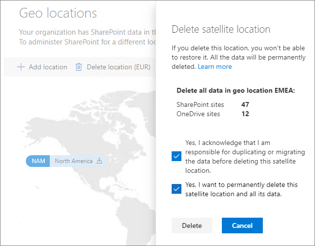

# Exclua uma localização por satélite no Microsoft 365 Multi-Geo.Delete a satellite location in Microsoft 365 Multi-Geo

Se você não precisa mais de uma localização de satélite, exclua-a do seu locatário no centro de administração do SharePoint.If you no longer need a satellite location, you can delete it from your tenant from the SharePoint admin center.

> [!WARNING]
> Todos os dados de usuário na localização de satélite serão excluídos permanentemente.All user data in the satellite location will be permanently deleted. Isso inclui todo o conteúdo do OneDrive para negócios, sites do SharePoint e caixas de correio do Exchange incluindo caixas de correio do grupo do Microsoft 365.This includes all OneDrive for Business content, SharePoint sites and Exchange mailboxes including Microsoft 365 Group mailboxes. Você deve migrar todos os dados para outra localização de satélite ou para a localização central antes de excluir a localização de satélite.You must migrate any data to another satellite location or the central location before you delete the satellite location. Não é possível desfazer a ação.This action cannot be undone.

Somente os administradores globais podem excluir localizações de satélites.Only global administrators can delete satellite locations.

Para excluir uma localização de satéliteTo delete a satellite location

1. Abra o Centro de Administração do SharePoint.Open the SharePoint admin center

2. Navegue até a guia **Localizações geográficas**.Navigate to the **Geo locations** tab.

3. No mapa, clique na localização geográfica que você deseja excluir.On the map, click the geo location that you want to delete.

4. Clique em **Excluir localização**.Click **Delete location**.

5. Confirme a exclusão marcando as caixas de seleção de confirmação.Confirm the deletion by selecting the confirmation check boxes.

6. Clique em **Excluir**.Click **Delete**.
