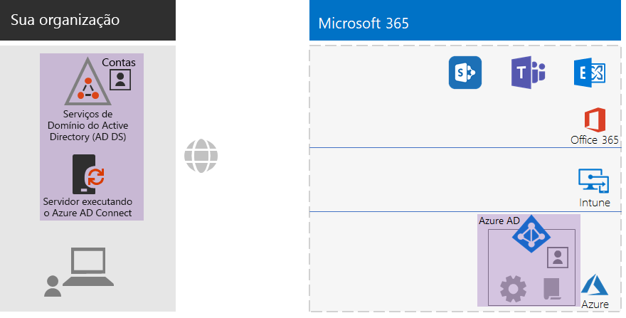
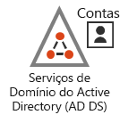
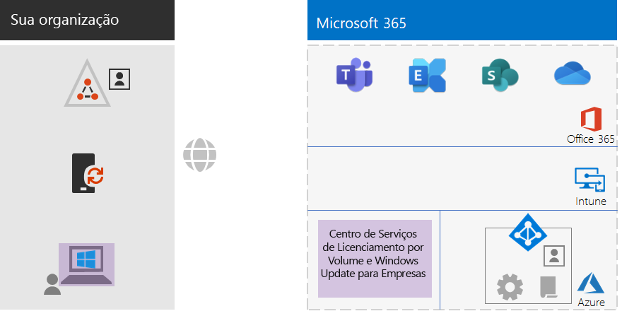
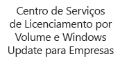
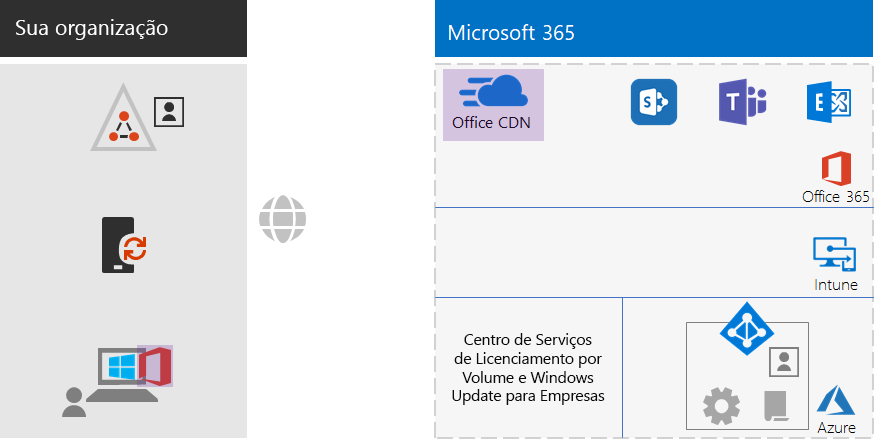
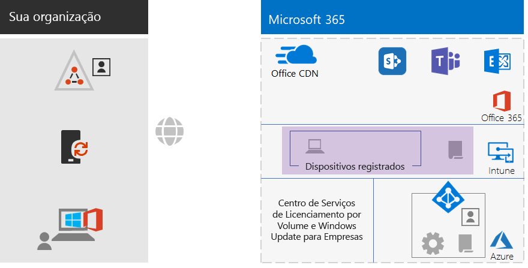
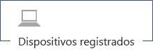
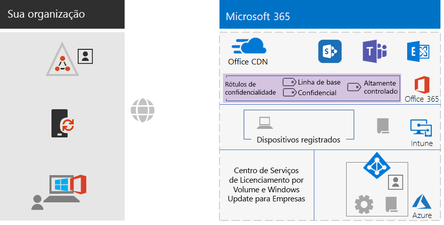
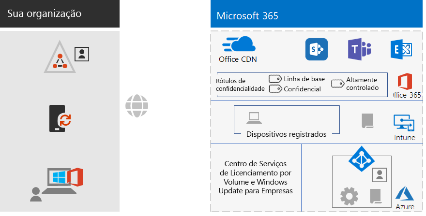

# Infraestrutura do Microsoft 365 Enterprise Foundation não empresarialMicrosoft 365 Enterprise foundation infrastructure

Organizações não empresariais também podem implantar o Microsoft 365 Enterprise e perceber o valor comercial de uma infraestrutura integrada e segura, que permite o trabalho em equipe e desbloqueia a criatividade.Non-enterprise organizations can also deploy Microsoft 365 Enterprise and realize the business value of an integrated and secure infrastructure that enables teamwork and unlocks creativity. Uma organização não empresarial tipicamente possui:A non-enterprise typically has:

- Uma pequena quantidade de infraestrutura de TI local, como servidores de email e de arquivos e um domínio dos Serviços de Domínio do Active Directory (AD DS), ou nada.A small amount of on-premises IT infrastructure, such as email and file servers and an Active Directory Domain Services (AD DS) domain, or none at all.
- Uma pequena equipe de TI, composta em sua maioria por generalistas de TI, em vez de especialistas em uma tecnologia ou carga de trabalho específica, como rede ou email.A small IT staff, most of whom are IT generalists, rather than specialists in a specific technology or workload such as networking or email.

Para sua organização menor e não empresarial, a Microsoft oferece o [Microsoft 365 Business](https://www.microsoft.com/microsoft-365/business).For your smaller, non-enterprise organization, Microsoft offers [Microsoft 365 Business](https://www.microsoft.com/microsoft-365/business). No entanto, existem razões pelas quais você pode precisar do Microsoft 365 Enterprise, como por exemplo:However, there are reasons why you might need Microsoft 365 Enterprise, such as:

- Sua organização precisa de mais ou precisará de mais de 300 licenças do Microsoft 365, que é o máximo para o Microsoft 365 Business.Your organization needs more or will need more than 300 Microsoft 365 licenses, which is the maximum for Microsoft 365 Business.
- Sua organização precisa das análises, segurança, voz e produtividade avançadas não disponíveis no Microsoft 365 Business.Your organization needs the advanced productivity, voice, security, and analytics that are not available with Microsoft 365 Business.

Este artigo orienta você para a realização de uma implantação simplificada da infraestrutura básica do Microsoft 365 Enterprise adequada para a sua organização não empresarial.This article steps you through a simplified deployment of the foundation infrastructure of Microsoft 365 Enterprise suitable for your non-enterprise.

## Primeiro, configure sua assinaturaFirst, set up your subscription

Você deve configurar os domínios do Sistema de Nomes de Domínio (DNS) para sua assinatura.You must set up the Domain Name System (DNS) domains for your subscription. Se você já tiver uma assinatura do Office 365, isso já deve ter sido feito.If you already have an Office 365 subscription, this should have been done. Caso contrário, siga as instruções em [Adicionar um domínio ao Office 365](https://docs.microsoft.com/office365/admin/setup/add-domain?view=o365-worldwide).If not, follow the instructions in [Add a domain to Office 365](https://docs.microsoft.com/office365/admin/setup/add-domain?view=o365-worldwide).

Em seguida, você precisará configurar segurança adicional para o Microsoft 365.Next, you need to configure additional security for Microsoft 365. Siga as instruções em [Configurar segurança aumentada](https://docs.microsoft.com/office365/securitycompliance/tenant-wide-setup-for-increased-security).Follow the instructions in [Configure increased security](https://docs.microsoft.com/office365/securitycompliance/tenant-wide-setup-for-increased-security).

## Fase 1: RedePhase 1: Networking

Organizações não empresariais geralmente têm conexões locais com a Internet em cada escritório e não usam servidores proxy, firewalls ou dispositivos de inspeção de pacotes.Non-enterprise organizations typically have local Internet connections in each office and do not use proxy servers, firewalls, or packet inspection devices. O provedor de serviços de Internet (ISP) em cada escritório tem um servidor DNS regionalmente local para que o tráfego seja direcionado para os servidores em nuvem do Microsoft 365 mais próximos de seus escritórios e usuários locais.The Internet service provider (ISP) at each office has a regionally local DNS server so that traffic is directed to the Microsoft 365 cloud servers that are closest to your offices and their on-premises users.

Portanto, você precisa apenas verificar com seu ISP que a conexão em cada um dos locais de seu escritório:Therefore, you only need to verify with your ISP that the connection at each of your office locations:

- Usa um servidor DNS regionalmente local.Uses a regionally local DNS server.
- É adequada para as suas necessidades atuais e futuras à medida que seus usuários comecem a usar mais serviços de nuvem do Microsoft 365.Is adequate for current and future needs as your users begin using more Microsoft 365 cloud services.

### Sua configuração até agoraYour configuration so far

Aqui está um resumo visual com o elemento da Fase 1 em destaque.Here is a visual summary with the Phase 1 element highlighted. **Sua organização** pode ter vários escritórios, cada um com uma conexão de Internet local com um ISP (provedor de serviços de Internet) que usa um servidor DNS regionalmente local.**Your organization** can be multiple offices, each of which has a local Internet connection with an ISP that uses a regionally local DNS server. Por meio do ISP, os usuários em cada escritório podem acessar o local de rede da Microsoft mais próximo e os recursos da sua assinatura do Microsoft 365.Through the ISP, users in each office can reach the nearest Microsoft network location and the resources of your Microsoft 365 subscription.

## Fase 2: identidadePhase 2: Identity

Cada um dos funcionários da sua organização deve ser capaz de fazer logon, o que requer uma conta de usuário no locatário do Azure Active Directory (Azure AD) da sua assinatura do Microsoft 365 Enterprise.Each of the employees of your organization must be able to sign in, which requires a user account in the Azure Active Directory (Azure AD) tenant of your Microsoft 365 Enterprise subscription. Os grupos são então usados para conter contas de usuário e outros grupos para se comunicar ou obter acesso a recursos autorizados, como um site ou uma equipe do SharePoint Online.Groups are then used to contain user accounts and other groups to communicate or gain access to permissioned resources, such as a SharePoint Online site or a team. 

### Contas de administradorAdministrator accounts

Proteja suas contas de usuário globais de administrador, exigindo senhas muito fortes e autenticação de vários fatores (MFA).Protect your global administrator user accounts by requiring very strong passwords and multi-factor authentication (MFA). Confira [Proteger contas globais de administrador](identity-designate-protect-admin-accounts.md#protect-global-administrator-accounts) para obter mais informações.See [Protect your Office 365 global administrator accounts](identity-designate-protect-admin-accounts.md#protect-global-administrator-accounts) for more information about configuration.

Se a sua organização exigir alta segurança e você tiver o Microsoft 365 Enterprise E5, use o Azure AD Privileged Identity Management para habilitar o acesso just-in-time de administrador.If your organization requires high security and you have Microsoft 365 Enterprise E5, use Azure AD Privileged Identity Management to enable just-in-time administrator access. Confira [Configurar administradores globais sob demanda](identity-designate-protect-admin-accounts.md#set-up-on-demand-global-administrators) para obter mais informações.See [Set up on-demand global administrators](identity-designate-protect-admin-accounts.md#set-up-on-demand-global-administrators) for more information.

### Recomendações para gruposRecommendations for groups

Se você tiver um domínio do AD DS no local, continue usando esses grupos no Microsoft 365 Enterprise como grupos no Azure AD.If you have an on-premises AD DS domain, continue to use those groups in Microsoft 365 Enterprise as groups in Azure AD.

Se você não tiver um domínio do AD DS no local, crie grupos de segurança no Azure AD usando esses níveis de segurança.If you don’t have an on-premises AD DS domain, create security groups in Azure AD using these levels of security.

| Nível de segurançaSecurity level | DescriçãoDescription | ExemplosExamples |
|:-------|:-----|:-----|
| Linha de baseBaseline | Este é um padrão mínimo para proteger dados e as identidades e dispositivos que acessam seus dados.This is a minimum and default  standard for protecting data and the identities and devices that access your data.    Normalmente, estes são os dados da sua organização gerenciados pela maioria dos seus usuários.This is typically most of your organization’s data managed by most of your users. | Grupos para trabalhadores de primeira linha, como de vendas, marketing, suporte, administração e manufatura.Groups for first line workers, such as sales, marketing, support, administration, and manufacturing. |
| ConfidencialSensitive | Esta é uma proteção adicional para um subconjunto de dados que deve ser protegido além do nível da linha de base.This is additional protection for a subset of your data that must be protected beyond the baseline level. Esses grupos contêm usuários que usam e criam dados confidenciais específicos de departamentos e projetos que não devem estar disponíveis para todos.These groups contain users that use and create sensitive data that is specific to departments and projects that are not meant to be available to everyone. | Equipes de produtos ou marketing que estão desenvolvendo produtos futurosProduct or marketing teams that are developing future products |
| Altamente controladoHighly regulated | Este é o nível mais alto de proteção para uma quantidade normalmente pequena de dados altamente confidenciais, considerados propriedade intelectual ou segredo comercial, ou dados que devem obedecer a regulamentações de segurança.Highly regulated: This is the highest level of protection for organizations that typically have a very small amount of data that is highly classified, considered intellectual property or trade secrets, or data that must adhere to strict security regulations. Microsoft 365 Enterprise has capabilities to help organizations meet these high security requirements, including equivalent protection for identities and devices. |  Equipes de pesquisa e jurídicas e financeiras.Research, legal, and financial teams.    Equipes que armazenam ou usam dados de clientes ou parceiros.Teams storing or using customer or partner data. |

### Identidade híbridaHybrid identity

Se você tiver um domínio do AD DS no local, configure o Azure AD Connect em um servidor com PHS (sincronização de hash de senha).If you have an on-premises AD DS domain, configure Azure AD Connect on a server with password hash synchronization (PHS). Confira [Sincronizar identidades](identity-azure-ad-connect.md) para obter mais informações.See [Synchronize identities](identity-azure-ad-connect.md) for more information.

### Acesso de usuário mais seguro com políticas de acesso condicionalMore secure user access with conditional access policies

O Azure AD avalia as condições de logons de usuários e pode usar políticas de acesso condicional para conceder ou negar o acesso, bem como impor outras ações que devem ser tomadas para concluir o logon.Azure AD evaluates the conditions of user sign-ins and can use conditional access policies to grant or deny access and impose further actions that must be taken to complete the sign-in. Por exemplo, se o Azure AD determinar que o logon está acontecendo sob condições de médio ou alto risco, ele pode exigir que o usuário execute o MFA para concluir o logon.For example, if Azure AD determines that the sign-in is happening under medium or high-risk conditions, it can require the user to perform MFA to complete the sign-in.

As políticas de acesso condicional são aplicadas por você a contas ou grupos de usuários.You apply conditional access policies to user accounts or groups. Para facilitar uma atribuição mais fácil de políticas de acesso condicional, crie esses grupos de segurança do Azure AD em sua organização:To facilitate an easier assignment of conditional access policies, create these Azure AD security groups in your organization:

- LINHA DE BASEBaseline

  Contém os grupos ou contas de usuários para usuários com acesso a dados de linha de base.Contains the groups or user accounts for users with access to baseline data.

- CONFIDENCIALSensitive

  Contém os grupos ou contas de usuários para usuários com acesso a dados confidenciais.Contains the groups or user accounts for users with access to sensitive data.

- ALTAMENTE REGULAMENTADOHIGHLY-REGULATED

  Contém os grupos ou contas de usuários para usuários com acesso a dados altamente regulamentados.Contains the groups or user accounts for users with access to highly regulated data.

- ACESSO-COND-EXCLUIRCOND-ACCESS-EXCLUDE

  Um grupo vazio que você pode usar para excluir temporariamente um usuário de políticas de acesso condicional.An empty group that you can use to temporarily exclude a user from conditional access policies.

Esta é a lista de políticas de acesso condicional do Azure AD para ativar ou criar.Here is the list of Azure AD conditional access policies to enable or create.

| Política de acesso condicional do Azure ADAzure AD conditional access policy | Grupos aos quais se aplicaGroups to which it applies |
|:------|:-----|
| Política de linha de base: exigir MFA para administradoresBaseline policy: Require MFA for admins | Esta política se aplica a funções administrativas, portanto, nenhum grupo precisa ser especificado.This policy applies to admin roles, so no groups need to be specified. Esta política precisa ser ativada.This policy just needs to be enabled. Todas as políticas subsequentes precisam ser criadas e ativadas.All subsequent policies need to be created and enabled. |
| Bloquear clientes que não oferecem suporte à autenticação modernaBlock clients that don't support modern authentication | Selecione "Todos os usuários" nas configurações de política.Select “All users” in the policy settings. |
| Exigir MFA quando o risco de logon é médio ou alto (requer o Microsoft 365 Enterprise E5)Require MFA when sign-in risk is medium or high (requires Microsoft 365 Enterprise E5) | LINHA DE BASEBaseline |
| Exigir MFA quando o risco de logon é baixo, médio ou alto (requer o Microsoft 365 Enterprise E5)Require MFA when sign-in risk is low, medium, or high (requires Microsoft 365 Enterprise E5) | CONFIDENCIALSensitive |
| Sempre exigir MFAAlways require MFA | ALTAMENTE REGULAMENTADOHIGHLY-REGULATED |
| Exigir aplicativos aprovados em dispositivos iOS e AndroidRequire approved apps on iOS and Android devices | LINHA DE BASE, CONFIDENCIAL, ALTAMENTE REGULAMENTADOBASELINE, SENSITIVE, HIGHLY-REGULATED |
| Exigir PCs compatíveisRequire compliant PCs | LINHA DE BASEBaseline |
| Exigir PCs compatíveis e dispositivos iOS e AndroidRequire compliant PCs and iOS and Android devices | CONFIDENCIAL, ALTAMENTE REGULAMENTADOSENSITIVE, HIGHLY-REGULATED |
|||

Aqui está a política de risco do usuário do Azure AD Identity Protection (requer o Microsoft 365 Enterprise E5) para criar e ativar.Here is the Azure AD Identity Protection (requires Microsoft 365 Enterprise E5) user risk policy to create and enable.

| Política de risco do usuário do Azure AD Identity ProtectionAzure AD Identity Protection user risk policy | Grupos aos quais se aplicaGroups to which it applies |
|:------|:-----|
| Usuários de alto risco devem alterar suas senhasHigh risk users must change passwords | Selecione "Todos os usuários" nas configurações de política.Select “All users” in the policy settings. |
|||

Confira [Políticas comuns de acesso a identidades e dispositivos](identity-access-policies.md) para obter instruções.See [Common identity and device access policies](identity-access-policies.md) for the instructions.

### Grupos para um gerenciamento mais fácilGroups for easier management

Aqui estão alguns recursos que podem tornar o gerenciamento de grupos e licenças mais fácil para você.Here are some features that can make group and licensing management easier for you.

| RecursoFeature | UsarUse |
|:------|:-----|
| Gerenciamento de grupo de autoatendimentoSelf-service group management | Permitir o gerenciamento de grupos do Azure AD por proprietários de grupos em vez da equipe de TI.Allow management of Azure AD groups by group owners instead of IT staff. Confira [Gerenciamento de grupo de autoatendimento](identity-self-service-group-management.md#allow-users-to-create-and-manage-their-own-groups) para obter mais informações.See [Self-service group management](identity-self-service-group-management.md#allow-users-to-create-and-manage-their-own-groups) for more information. |
| Associação de grupos dinâmicosDynamic group membership | Configurar adição ou remoção automática de contas de usuários de grupos do Azure AD com base nos atributos da conta do usuário, como Departamento ou País.Configure automatic addition or removal of user accounts from Azure AD groups based on user account attributes, such as Department or Country. Confira [Associação de grupos dinâmicos](identity-self-service-group-management.md#set-up-dynamic-group-membership) para obter mais informações.See [Dynamic group membership](identity-self-service-group-management.md#set-up-dynamic-group-membership) for more information. |
| Licenciamento com base em grupoGroup-based licensing | Use a associação a grupos para atribuir ou cancelar a atribuição de licenças a contas de usuários automaticamente.Use group membership to automatically assign or unassign licenses to user accounts. Confira [Licenciamento baseado em grupo](identity-self-service-group-management.md#set-up-automatic-licensing) para obter mais informações.See [Group-based licensing](identity-self-service-group-management.md#set-up-automatic-licensing) for more information. |
|  |  |

Se você estiver usando licenciamento baseado em grupo, crie um grupo denominado LICENCIADO para conter nomes de contas de usuários que possuem atribuída uma licença do Microsoft 365 Enterprise.If you are using group-based licensing, create a group named LICENSED to contain user account names that are assigned a Microsoft 365 Enterprise license.

### Monitorar o acesso a usuáriosMonitor user access

Se você tiver o Microsoft 365 Enterprise E5, poderá usar o Azure AD Identity Protection para monitorar e analisar logons de usuário para detectar comprometimento de credenciais.If you have Microsoft 365 Enterprise E5, you can use Azure AD Identity Protection to monitor and analyze user sign-ins for credential compromise. Confira [Proteger contra comprometimento de credenciais](identity-multi-factor-authentication.md#protect-against-credential-compromise) para obter mais informações.See [Protect against credential compromise](identity-multi-factor-authentication.md#protect-against-credential-compromise) for more information.

### Sua configuração até agoraYour configuration so far

Aqui está um resumo visual da fase Identidade para identidade híbrida, com os novos elementos destacados.Here is a visual summary of the Identity phase for hybrid identity, with the new elements highlighted.

 
Os novos elementos de identidade destacados incluem:The new and highlighted identity elements include:
 
|||
|:------:|:-----|
|  | Um domínio do AD DS no local com contas e grupos de usuários.An on-premises AD DS domain with user accounts and groups. |
|  | Um servidor baseado no Windows executando o Azure AD Connect.A Windows-based server running Azure AD Connect. |
|  | O conjunto sincronizado de contas e grupos do AD DS no Azure AD.The synchronized set of AD DS accounts and groups in Azure AD. |
|  | Configurações do Azure AD para autenticação, proteção de contas globais e simplificação do gerenciamento de grupos e licenças.Azure AD settings for authentication, securing global accounts, and making it easier to manage groups and licenses. |
|  | Políticas de acesso condicional do Azure AD.Azure AD conditional access policies. |
|||

## Fase 3: Windows 10 EnterprisePhase 3: Windows 10 Enterprise

Para garantir que seus dispositivos do Windows 10 Enterprise sejam integrados à infraestrutura de identidade e segurança do Microsoft 365, veja as opções:To ensure that your Windows 10 Enterprise devices are integrated into the identity and security infrastructure of Microsoft 365, here are your options:

- Somente nuvem (você não possui um domínio do AD DS no local)Cloud-only (you do not have on-premises AD DS domain)

  Associe cada dispositivo do Windows 10 Enterprise ao locatário do Azure AD da sua assinatura.Join each Windows 10 Enterprise device to the Azure AD tenant of your subscription.

  Confira [Adicione seu dispositivo de trabalho à rede da sua organização](https://docs.microsoft.com/pt-BR/azure/active-directory/user-help/user-help-join-device-on-network) para obter mais informações.See [Join your work device to your organization's network](https://docs.microsoft.com/en-us/azure/active-directory/user-help/user-help-join-device-on-network) for more information.

- Híbrido (você possui um domínio do AD DS no local)Hybrid (you have on-premises AD DS domain)

  Associe ao locatário do Azure AD cada dispositivo Windows 10 Enterprise existente já associado ao seu domínio do AD DS.For each existing Windows 10 Enterprise device already joined to your AD DS domain, join them to the Azure AD tenant. Confira [Como configurar dispositivos associados híbridos do Active Directory do Azure](https://go.microsoft.com/fwlink/p/?linkid=872870) para obter instruções.See [How to configure hybrid Azure Active Directory joined devices](https://go.microsoft.com/fwlink/p/?linkid=872870) for the instructions.

  Para cada novo dispositivo do Windows 10 Enterprise, associe-o ao seu domínio do AD DS e, em seguida, associe-o ao locatário do Azure AD.For each new Windows 10 Enterprise device, join them to your AD DS domain, and then join them to the Azure AD tenant.

  Inscreva cada dispositivo do Windows 10 Enterprise para o gerenciamento de dispositivos móveis.For each Windows 10 Enterprise device, enroll them for mobile device management. Confira [Inscrever um dispositivo do Windows 10 no Intune usando uma Política de Grupo](https://go.microsoft.com/fwlink/p/?linkid=872871) para obter instruções.See [Enroll a Windows 10 device with Intune by using a Group Policy](https://go.microsoft.com/fwlink/p/?linkid=872871) for the instructions.

Depois de instalados e associados, cada dispositivo do Windows 10 Enterprise instala automaticamente as atualizações do serviço em nuvem do Windows Update for Business.Once installed and joined, each Windows 10 Enterprise device automatically installs updates from the Windows Update for Business cloud service. Em uma organização não empresarial, normalmente não há necessidade de configurar uma infraestrutura para distribuir e instalar atualizações.There is typically no need in a non-enterprise organization to set up an infrastructure to distribute and install updates.

### Sua configuração até agoraYour configuration so far

Aqui está um resumo visual da fase do Windows 10 Enterprise com os novos elementos destacados.Here is a visual summary of the Windows 10 Enterprise phase with the new elements highlighted.

 
Os novos elementos do Windows 10 Enterprise destacados incluem:The new and highlighted Windows 10 Enterprise elements include:

|||
|:------:|:-----|
|  | Windows 10 Enterprise instalado em dispositivos Windows, com o laptop local como um exemplo.Windows 10 Enterprise installed on Windows devices, with the on-premises laptop as an example. |
|  | O Centro de Serviços de Licenciamento por Volume, que fornece imagens para novas instalações do Windows 10 Enterprise, e o serviço Windows Update for Business, que fornece as atualizações mais recentes.The Volume Licensing Service Center, which provides images for new installations of Windows 10 Enterprise, and the Windows Update for Business service, which provides the latest updates. |
|||

## Fase 4: Office 365 ProPlusPhase 4: Office 365 ProPlus

O Microsoft 365 Enterprise inclui o Office 365 ProPlus, a versão de assinatura do Microsoft Office.Microsoft 365 Enterprise includes Office 365 ProPlus, the subscription version of Microsoft Office. Como o Office 2016 ou Office 2019, o Office 365 ProPlus é instalado diretamente em seus dispositivos clientes.Like Office 2016 or Office 2019, Office 365 ProPlus is installed directly on your client devices. No entanto, o Office 365 ProPlus recebe novos recursos regularmente.However, Office 365 ProPlus receives new features on a regular basis. Confira [Sobre o Office 365 ProPlus na empresa](https://docs.microsoft.com/deployoffice/about-office-365-proplus-in-the-enterprise) para obter mais informações.See [About Office 365 ProPlus in the enterprise](https://docs.microsoft.com/deployoffice/about-office-365-proplus-in-the-enterprise) for more information.

Para sua organização não empresarial, instale manualmente o Office 365 ProPlus em seus dispositivos.For your non-enterprise organization, manually install Office 365 ProPlus on devices. Isso pode ser feito como parte da preparação de um novo dispositivo para uso ou pode ser feito pelo usuário como parte de seu processo de integração.This can be done as part of preparing a new device for use, or it can be done by the user as part of their onboarding process.

Em ambos os casos, o administrador ou o usuário entra no portal do Office 365 em https://portal.office.com.In either case, the administrator or the user signs in to the Office 365 portal at https://portal.office.com. Na guia **Página inicial do Microsoft Office**, clique em **Instalar o Office** e percorra o processo de instalação.On the **Microsoft Office Home** tab, click **Install Office** and step through the installation process.

Atualizações de recursos para o Office 365 ProPlus são baixadas mensalmente por cada computador em que ele está instalado.Feature updates to Office 365 ProPlus are downloaded monthly by each computer on which it is installed. Em uma organização não empresarial, normalmente não há necessidade de configurar uma infraestrutura para distribuir atualizações do Office 365 ProPlus.There is typically no need in a non-enterprise organization to set up an infrastructure to distribute Office 365 ProPlus updates. 

### Sua configuração até agoraYour configuration so far

Aqui está um resumo visual da fase do Office 365 ProPlus com os novos elementos destacados.Here is a visual summary of the Office 365 ProPlus phase with the new elements highlighted.

 
Os novos elementos do Office 365 ProPlus destacados incluem:The new and highlighted Office 365 ProPlus elements include:
 
|||
|:------:|:-----|
|  | Office 365 ProPlus instalado em dispositivos, com o laptop local como um exemplo.Office 365 ProPlus installed on devices, with the on-premises laptop as an example. |
|  | A Rede de Distribuição de Conteúdo (CDN) do Office para o Office 365 ProPlus, a qual os dispositivos acessam para atualizações do Office 365 ProPlus.The Office Content Delivery Network (CDN) for Office 365 ProPlus, which devices access for Office 365 ProPlus updates. |
|||

## Fase 5: gerenciamento de dispositivos móveisPhase 5: Mobile device management

O Microsoft 365 Enterprise inclui o Microsoft Intune para gerenciamento de dispositivos móveis.Microsoft 365 Enterprise includes Microsoft Intune for mobile device management. Com o Intune, você pode gerenciar dispositivos iOS, Android, macOS e Windows para proteger o acesso aos recursos da sua organização, incluindo seus dados.With Intune, you can manage iOS, Android, macOS, and Windows devices to protect access to your organization's resources, including your data. O Intune se integra aos usuários, grupos e contas de computador do Azure AD.Intune integrates with the users, groups, and computer accounts of Azure AD.

O Intune fornece dois tipos de gerenciamento de dispositivos móveis:Intune provides two types of mobile device management:

- O gerenciamento de dispositivos móveis (MDM) é quando os dispositivos são inscritos no Intune.Mobile device management (MDM) is when devices get enrolled in Intune. Uma vez inscritos, eles se tornam dispositivos gerenciados e podem receber as políticas, regras e configurações usadas por sua organização.Once enrolled, they are managed devices and can receive the policies, rules, and settings used by your organization. Esses tipos de dispositivos são normalmente de propriedade da sua organização e emitidos para seus funcionários.These types of devices are typically owned by your organization and issued to your employees.

- Os usuários com seus próprios dispositivos pessoais podem não querer inscrever seus dispositivos ou serem gerenciados pelo Intune com suas políticas e configurações.Users with their own personal devices may not want to enroll their devices or be managed by Intune with your policies and settings. No entanto, você ainda precisa proteger os recursos e dados de sua organização.However, you still need to protect your organization's resources and data. Para este cenário, você pode proteger seus aplicativos usando o gerenciamento de aplicativos móveis (MAM).For this scenario, you can protect your apps using mobile application management (MAM). Esses tipos de dispositivos são chamados de BYOD (traga seus próprios dispositivos) e são normalmente de propriedade de seus funcionários.These types of devices are referred to as bring your own devices (BYOD) and are typically owned by your employees. 

As políticas do Intune podem impor a conformidade do dispositivo e a proteção do aplicativo.Intune policies can enforce device compliance and app protection. Aqui está a lista de políticas do Intune para criar.Here is the list of Intune policies to create.

| Políticas do IntuneIntune policies | Grupos aos quais se aplicaGroups to which it applies |
|:------|:-----|
| Política de conformidade de dispositivos para o WindowsDevice compliance policy for Windows | LINHA DE BASE, CONFIDENCIAL, ALTAMENTE REGULAMENTADOBASELINE, SENSITIVE, HIGHLY-REGULATED |
| Política de conformidade de dispositivos para iOSDevice compliance policy for iOS | CONFIDENCIAL, ALTAMENTE REGULAMENTADOSENSITIVE, HIGHLY-REGULATED |
| Conformidade de dispositivos para macOSDevice compliance for macOS | CONFIDENCIAL, ALTAMENTE REGULAMENTADOSENSITIVE, HIGHLY-REGULATED |
| Política de conformidade de dispositivos para Android e Android EnterpriseDevice compliance policy for Android and Android Enterprise | CONFIDENCIAL, ALTAMENTE REGULAMENTADOSENSITIVE, HIGHLY-REGULATED |
| Política de proteção de aplicativos para iOSApp protection policy for iOS | LINHA DE BASE, CONFIDENCIAL, ALTAMENTE REGULAMENTADOBASELINE, SENSITIVE, HIGHLY-REGULATED |
| Política de proteção de aplicativos para macOSApp protection policy for macOS | LINHA DE BASE, CONFIDENCIAL, ALTAMENTE REGULAMENTADOBASELINE, SENSITIVE, HIGHLY-REGULATED |
| Política de proteção de aplicativos para Android e Android EnterpriseApp protection policy for Android and Android Enterprise | LINHA DE BASE, CONFIDENCIAL, ALTAMENTE REGULAMENTADOBASELINE, SENSITIVE, HIGHLY-REGULATED |
|||
    
Confira [Políticas comuns de acesso a identidades e dispositivos](identity-access-policies.md) para obter instruções.See [Common identity and device access policies](identity-access-policies.md) for the instructions.

### Sua configuração até agoraYour configuration so far

Aqui está um resumo visual da fase de Gerenciamento de Dispositivos Móveis com os novos elementos destacados.Here is a visual summary of the Mobile Device Management phase with the new elements highlighted.

 
Os novos elementos de gerenciamento de dispositivos móveis destacados incluem:The new and highlighted mobile device management elements include:

|||
|:------:|:-----|
|  | Dispositivos inscritos no Intune, mostrando o laptop local executando o Windows 10 Enterprise como exemplo.Devices that are enrolled in Intune, showing the on-premises laptop running Windows 10 Enterprise as an example. |
|  | Políticas do Intune para conformidade de dispositivos e proteção de aplicativos.Intune policies for device compliance and app protection. |
|||

## Fase 6: proteção de informaçõesPhase 6: Information protection

O Microsoft 365 Enterprise tem um host de recursos de proteção de informações que permitem tratar classificações de dados de maneira diferente, aplicando níveis diferentes de governança, segurança e proteção.Microsoft 365 Enterprise has a host of information protection features that allow you treat classifications of data differently by applying different levels of governance, security, and protection. 

Por exemplo, as correspondências normais entre a maioria dos funcionários e os documentos com os quais eles trabalham precisam de um certo nível de linha de base de proteção.For example, normal correspondence between most employees and the documents that they work on need a certain baseline level of protection. Registros financeiros, dados do cliente e sua propriedade intelectual precisam de um nível mais alto de proteção.Financial records, customer data, and your intellectual property need a higher level of protection.

O primeiro passo para uma estratégia de proteção da informação é determinar os níveis de proteção.The first step to an information protection strategy is to determine the levels of protection. Muitas organizações usam esses níveis, que já estão sendo usados para políticas de acesso condicional:Many organizations use these levels, which are already being used for conditional access policies:

- Linha de baseBaseline

  Os exemplos incluem comunicações comerciais normais (email) e arquivos para funcionários administrativos, de vendas e de suporte.Examples of Level 1 data are normal business communications (email) and files for administrative, sales, and support workers.

- ConfidencialSensitive

  Os exemplos incluem informações financeiras e jurídicas e dados de pesquisa e desenvolvimento para novos produtos ou serviços.Examples of Level 2 data are financial and legal information and research and development data for new products.

- Altamente controladoHighly regulated

  Exemplos incluem informações de identificação pessoal de clientes e parceiros e a propriedade intelectual da sua organização.Examples include customer and partner personally identifiable information and your organization’s intellectual property.

Com base nesses níveis de segurança de dados, o próximo passo é identificar e implementar:Based on these levels of data security, the next step is to identify and implement:

- Tipos de informações confidenciais personalizadasCustom sensitive information types

  O Microsoft 365 fornece uma ampla seleção de tipos de informações confidenciais, como serviços de saúde e números de cartão de crédito.Microsoft 365 supplies a wide selection of sensitive information types, such as health service and credit card numbers. Se você não encontrar o que precisa na lista fornecida do Microsoft 365, poderá criar o seu próprio.If you do not find one that you need in the Microsoft 365-supplied list, you can create your own.

- Rótulos de retençãoRetention labels

  Para cumprir as políticas da organização e os regulamentos regionais, talvez seja necessário especificar por quanto tempo os tipos específicos de documentos ou documentos com conteúdo específico devem ser mantidos.To comply with organization policies and regional regulations, you might have to specify how long specific types of documents or documents with specific contents should be retained. Você pode implementar isto para emails e documentos usando rótulos de retenção.You can implement this for email and document using retention labels.

- Rótulos de confidencialidadeSensitivity labels

  Você pode rotular emails ou documentos com um rótulo de confidencialidade nomeado para que os níveis adicionais de segurança possam ser aplicados.You can label email or documents with a named sensitivity label so that the additional levels of security can be applied. Exemplos são marcas d'água, criptografia e permissões, que especificam quem tem permissão para acessar o email ou documento e o que eles podem fazer.Examples are watermarks, encryption, and permissions, which specify who is allowed to access the email or document and what they are allowed to do.

Confira os [tipos de classificação do Microsoft 365](infoprotect-configure-classification.md#microsoft-365-classification-types) para obter mais informações.See [Microsoft 365 classification types](infoprotect-configure-classification.md#microsoft-365-classification-types) for more information.

Se você usar rótulos de confidencialidade com permissões, poderá ser necessário criar grupos de segurança adicionais do Azure AD para definir quem tem permissão para fazer o quê com emails e documentos.If you use sensitivity labels with permissions, you might have to create additional Azure AD security groups to define who is allowed to do what with email and documents. 

Por exemplo, você precisa criar um rótulo de confidencialidade PESQUISA para proteger os emails e documentos da sua equipe de pesquisa.For example, you need to create a RESEARCH sensitivity label to protect the email and documents of your research team. Você determina que alguns pesquisadores devem ter a capacidade de alterar documentos marcados com o rótulo de confidencialidade PESQUISA e que outros funcionários que não são da pesquisa precisam ter a capacidade de somente visualizar documentos marcados com o rótulo de confidencialidade de PESQUISA.You determine that some researchers must have the ability to change documents marked with the RESEARCH sensitivity label and other non-research employees need have the ability to only view documents marked with the RESEARCH sensitivity label. Isso significa que você precisa criar e gerenciar dois grupos adicionais:This means you need to create and manage two additional groups:

- PESQUISA-TODOSRESEARCH-ALL
- PESQUISA-VISUALIZARRESEARCH-VIEW

Esses grupos e suas permissões se tornam parte da configuração do rótulo de confidencialidade PESQUISA.These groups and their permissions become part of the RESEARCH sensitivity label's configuration.

Para rótulos de confidencialidade configurados com permissões baseadas em grupo, você deve gerenciar a associação desses grupos.For sensitivity labels configured with group-based permissions, you must manage the membership of these groups.

### Sua configuração até agoraYour configuration so far

Aqui está um resumo visual da fase de Proteção de Informações com os novos elementos destacados.Here is a visual summary of the Information Protection phase with the new elements highlighted.

 
Os novos elementos de proteção de informações destacados incluem:The new and highlighted information protection elements include:
 
|||
|:------:|:-----|
|  | Rótulos de confidencialidade para os três níveis de segurança que os usuários podem aplicar aos documentos.Sensitivity labels for the three levels of security that users can apply to documents. |
|||

Rótulos de retenção e tipos de informações personalizadas não são mostrados.Retention labels and custom information types are not shown.

## IntegraçãoOnboarding

Com essa infraestrutura, você pode integrar um funcionário do Microsoft 365 Enterprise a esses processos.With this infrastructure, you can onboard an employee for Microsoft 365 Enterprise with these processes.

### Um novo dispositivo do Windows 10 EnterpriseA new Windows 10 Enterprise device

Antes de fornecer ao funcionário um novo dispositivo do Windows 10 Enterprise:Before giving an employee a new Windows 10 Enterprise device:

- Para identidade somente na nuvemFor cloud-only identity

  Associe o dispositivo ao locatário do Azure AD da sua assinatura do Microsoft 365 Enterprise.Next, join the WIN10 computer to the Azure AD tenant of your Microsoft 365 E5 subscription.

- Para identidade híbridaFor hybrid identity

  Associe o dispositivo ao seu AD DS, associe o dispositivo ao seu locatário do Azure AD e, em seguida, inscreva o dispositivo no Intune.Join the device to your AD DS, join the device to your Azure AD tenant, and then enroll the device in Intune.

### Funcionário existente com uma conta de usuário do AD DSExisting employee with an AD DS user account

Como parte da integração inicial da sua organização ao usar a identidade híbrida, adicione a conta de usuário do AD DS a estes grupos do Azure AD:As part of the initial onboarding for your organization when using hybrid identity, add the AD DS user account to these Azure AD groups:

- LICENCIADOLicensed
- Os grupos de segurança apropriados do AD DS ou do Azure AD que são membros dos grupos LINHA DE BASE, CONFIDENCIAL e ALTAMENTE REGULADO do Azure AD.The appropriate AD DS or Azure AD security groups that are members of the BASELINE, SENSITIVE, and HIGHLY-REGULATED Azure AD groups
- Grupos de rótulos de confidencialidade (conforme necessário)Sensitivity label groups (as needed)

O funcionário existente já deve ser adicionado aos grupos de grupo de trabalho e grupos departamentais e regionais do AD DS.The existing employee should already be added to the appropriate workgroup, departmental, and regional AD DS groups.

### Novo funcionário com conta de usuário somente na nuvemNew employee with cloud-only user account

Como parte da integração inicial da sua organização ao usar a identidade somente na nuvem, adicione a nova conta de usuário a estes grupos:As part of the initial onboarding for your organization when using cloud-only identity, add the new user account to these groups:

- LICENCIADOLicensed
- Os grupos de segurança apropriados do Azure AD que são membros dos grupos LINHA DE BASE, CONFIDENCIAL e ALTAMENTE REGULAMENTADO do Azure ADThe appropriate Azure AD security groups that are members of the BASELINE, SENSITIVE, and HIGHLY-REGULATED Azure AD groups
- Grupo de trabalho, departamental, e grupos regionaisWorkgroup, departmental, and regional groups
- Grupos de rótulos de confidencialidade (conforme necessário)Sensitivity label groups (as needed)

### Logon inicial no Microsoft 365Initial sign-in to Microsoft 365

Na primeira vez que novos funcionários ou funcionários existentes com uma conta de usuário do AD DS fizerem logon no Microsoft 365, instrua-os a:For the first time new employees or existing employees with an AD DS user account sign in to Microsoft 365, instruct them to:

1. Fazerem logon em seus dispositivos com suas credenciais de conta de usuário.Sign into their devices with their user account credentials.
2. Usando um navegador, entre no portal do Office 365, em https://portal.office.com.Using a browser on your local computer, sign in to the https://portal.office.com using your global administrator account.
3. Na guia **Página Inicial do Office 365**, clique em **Instalar o Office** para instalar o Office 365 ProPlus em seus dispositivos.From the **Office 365 Home** tab, click **Install Office** to install Office 365 ProPlus on their device.

## Resultados finaisEnd results

Aqui estão os resultados da configuração da infraestrutura de base do Microsoft 365 Enterprise para sua organização não empresarial.Here are the results of configuring the Microsoft 365 Enterprise foundation infrastructure for your non-enterprise organization.

### Resultados de infraestruturaInfrastructure results

Após o desenvolvimento e a configuração da infraestrutura do Microsoft 365 Enterprise, você deve ter:After the build-out and configuration of your Microsoft 365 Enterprise infrastructure, you should have:

- Uma conexão de Internet local para cada um de seus escritórios com largura de banda suficiente fornecida por um ISP (provedor de serviços de Internet) que usa um servidor DNS regionalmente local.A local Internet connection for each of your offices with sufficient bandwidth supplied by an ISP that uses a regionally local DNS server.
- Para identidade híbrida, o Azure AD Connect é executado em um servidor que sincroniza seu domínio do AD DS local com o seu locatário do Azure AD.For hybrid identity, Azure AD Connect running on a server that synchronizes your on-premises AD DS domain with your Azure AD tenant.
- Esses grupos:These universal groups include:
  - LICENCIADOLicensed
  - ACESSO-COND-EXCLUIRCOND-ACCESS-EXCLUDE
  - Os grupos de segurança apropriados do AD DS ou do Azure AD que também são membros dos grupos LINHA DE BASE, CONFIDENCIAL e ALTAMENTE REGULADO do Azure ADThe appropriate AD DS or Azure AD security groups that are also members of the BASELINE, SENSITIVE, and HIGHLY-REGULATED Azure AD groups 
  - Grupo de trabalho, departamental, e grupos regionaisWorkgroup, departmental, and regional groups
  - Grupos de rótulos de confidencialidade (conforme necessário)Sensitivity label groups (as needed)
- Políticas de acesso condicional de logon do Azure AD que usam os grupos LINHA DE BASE, CONFIDENCIAL, ALTAMENTE REGULADO, ACESSO-COND-EXCLUIR do Azure AD.Azure AD sign-in conditional access policies that use the BASELINE, SENSITIVE, and HIGHLY-REGULATED, and COND-ACCESS-EXCLUDE Azure AD groups.
- Políticas de conformidade de aplicativos e dispositivos do Intune.Intune application and device compliance policies.
- Tipos de informações confidenciais personalizadas (conforme necessário).Custom sensitive information types (as needed).
- Rótulos de retenção (conforme necessário).Retention labels (as needed).
- Rótulos de confidencialidade (conforme necessário).Sensitivity labels (as needed).

Este é um resumo visual da infraestrutura se sua organização usa identidade híbrida, a qual inclui seu domínio do AD DS, um servidor do Azure AD Connect e grupos e usuários do AD DS sincronizados.Here is a visual summary of the infrastructure if your organization uses hybrid identity, which includes your AD DS domain, an Azure AD Connect server, and synchronized AD DS users and groups.

 
Aqui está um resumo visual da infraestrutura se a sua organização usa a identidade somente na nuvem.Here is a visual summary of the infrastructure if your organization uses cloud-only identity.
 

### Resultados dos funcionáriosEmployee results

Após a integração, cada funcionário deve ter:After their onboarding, each employee should have:

- Um caminho de rede local de alto desempenho conectando os dispositivos deles aos serviços de nuvem da Microsoft 365 na região deles.A performant, on-premises network path from their device to the Microsoft 365 cloud services in their region.
- Uma conta de usuário com estas associações de grupo:A user account with these group memberships:
   - LICENCIADOLicensed
   - Os grupos de segurança apropriados do AD DS ou do Azure AD, que também são membros dos grupos LINHA DE BASE, CONFIDENCIAL e ALTAMENTE REGULADO do Azure AD para políticas de acesso condicionalThe appropriate AD DS or Azure AD security groups, which are also members of the BASELINE, SENSITIVE, and HIGHLY-REGULATED Azure AD groups for conditional access policies 
   - Os grupos apropriados de grupos de trabalho e grupos departamentais e regionaisThe appropriate workgroup, departmental, and regional groups
   - Grupos de rótulos de confidencialidade (conforme necessário)Sensitivity label groups (as needed)
- Um dispositivo do Windows 10 Enterprise que:A Windows 10 Enterprise device that:
   - É associado ao locatário do Azure AD (somente nuvem) ou ao locatário do Azure AD e ao seu domínio do AD DS (híbrido).Is joined to the Azure AD tenant (cloud-only) or to both the Azure AD tenant and your AD DS domain (hybrid).
   - Atualiza automaticamente com as melhorias e aprimoramentos de segurança mais recentes do produto Windows 10 Enterprise.Automatically updates itself with the latest Windows 10 Enterprise product improvements and security enhancements.
   - Tem o Office 365 ProPlus instalado, o qual atualiza automaticamente com os aprimoramentos de segurança e aprimoramentos de produtos do Office mais recentes.Has Office 365 ProPlus installed, which automatically updates itself with the latest Office product improvements and security enhancements.
   - Está inscrito no Intune e sujeito às políticas de conformidade de dispositivos e políticas de proteção de aplicativos do Intune.Is enrolled in Intune and subject to Intune device compliance policies and app protection policies.

## Próxima etapaNext step

Implante suas [cargas de trabalho e cenários](deploy-workloads.md) e aproveite os recursos e a configuração da infraestrutura de fundação.If you're following the end-to-end deployment of Microsoft 365 Enterprise, you're now ready to have your [workloads and scenarios](deploy-workloads.md) take advantage of all the features and configuration of your foundation infrastructure.
