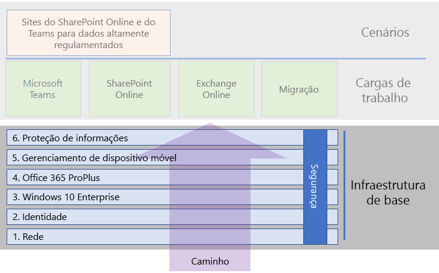

# Infraestrutura de base do Microsoft 365 Enterprise

Se você vai realizar a implantação de ponta a ponta do Microsoft 365 Enterprise sozinho, primeiro você deve criar uma base firme sobre a qual aplicativos e serviços possam desbloquear a criatividade e o trabalho em equipe em um ambiente seguro. Essa base é às vezes referida como uma *implantação principal*.

Para um caminho definido de ponta a ponta para implantação, você pode usar essas fases para planejar e implantar a infraestrutura de base do Microsoft 365 Enterprise:

| | Fase | Resultados |
|:-------|:-----|:-----|
||[Fase 1: Rede](networking-infrastructure.md)| A rede é otimizada para o acesso aos serviços baseados na nuvem do Microsoft 365. |
||[Fase 2: Identidade](identity-infrastructure.md)| As contas de administrador estão protegidas, seus usuários e grupos estão sincronizados e a autenticação de usuário é forte. |
||[Fase 3: Windows 10 Enterprise](windows10-infrastructure.md)| Os computadores baseados no Windows podem ser atualizados para o Windows 10 Enterprise e novos dispositivos são instalados com o Windows 10 Enterprise. |
||[Fase 4: Office 365 ProPlus](office365proplus-infrastructure.md)| Os usuários existentes do Microsoft Office podem ser atualizados para o Office 365 ProPlus. |
||[Fase 5: Gerenciamento de dispositivo móvel](mobility-infrastructure.md)| Os dispositivos podem ser registrados e gerenciados. |
||[Fase 6: Proteção de informações](infoprotect-infrastructure.md)| Suas etiquetas estão prontas para proteger documentos e os recursos de segurança do Office 365 estão habilitados. |

As fases começam com o mais fundamental (rede e identidade) e depois criam camadas de configurações e grupos de infraestrutura para:

- Instalar a versão mais atual e segura do Windows nos seus dispositivos e mantê-la atualizada.
- Instalar a versão mais atual do Microsoft Office em seus dispositivos e mantê-la atualizada.
- Gerencie os dispositivos da sua organização e seu acesso aos aplicativos.
- Proteger as informações nesses dispositivos e na nuvem.

Entretanto, você tem a flexibilidade de configurar e implantar as fases ou etapas dentro de fases para atender às suas necessidades de negócios e de recursos de TI.

- **Se você é uma organização menor ou mais recente**, siga as fases conforme necessário para criar sua infraestrutura de forma metódica. Para uma implantação não empresarial simplificada, clique [aqui](deploy-foundation-infrastructure-non-enterprises.md).

-  **Se você é uma organização corporativa**, veja as fases como camadas de infraestrutura de TI em vez de um caminho definido e determine qual é a melhor maneira de chegar à adesão eventual às exigências para cada camada em toda a sua organização.

No final de cada fase, você deve examinar seu critério de saída, que inclui condições obrigatórias que você deve cumprir e condições opcionais a se considerar. O critério de saída para cada fase garante que sua infraestrutura local e de nuvem e configuração resultante de ponta a ponta cumpram as exigências para uma implantação do Microsoft 365 Enterprise.

Para ver como o conteúdo é estruturado, assista a este breve vídeo.

> [!VIDEO https://www.microsoft.com/videoplayer/embed/RE23VRG]

Esta é a infraestrutura de base no guia geral de implantação do Microsoft 365 Enterprise:

## Visão geral

O [pôster de infraestrutura de base do Microsoft 365 Enterprise](http://aka.ms/m365efoundinfraposter) é um local central para exibição, para cada fase:

- Os objetivos gerais da fase para administradores e usuários
- Os serviços, recursos e ferramentas
- As principais decisões de design para planejamento
- Os resultados da configuração
- O processo de integração de um novo usuário
- Como monitorar e atualizar

Para baixar uma cópia do pôster, clique [aqui](https://github.com/MicrosoftDocs/microsoft-365-docs/raw/public/microsoft-365/enterprise/media/deploy-foundation-infrastructure/Microsoft365EnterpriseFoundInfra.pdf).

## Configuração de infraestrutura vs. implantação para usuários

A infraestrutura de base é um conjunto de software e serviços configurados que, quando combinados para um usuário, permite que ele aproveite todo o espectro de recursos e proteções que o Microsoft 365 Enterprise oferece. O destino final de sua jornada de implantação de ponta a ponta é fazer com que essa infraestrutura se aplique a todos os seus usuários e seus dispositivos baseados no Windows. 

Entretanto, é importante notar que a infraestrutura de base do Microsoft 365 Enterprise é independente da implantação de software e serviços para os seus usuários. ***Você pode configurar as camadas da infraestrutura de base sem precisar implantar essas camadas para todos os seus usuários.***

É possível configurar, testar e definir elementos piloto da infraestrutura de base bem antes da implantação desses elementos para a grande quantidade de usuários nos escritórios, regiões ou divisões da sua organização.

Por exemplo, você cria as configurações para:

| Fase | Resultados |
|:-------|:-----|
| Identidade | Sincronização de conta e grupos para políticas de acesso condicional baseadas na identidade. |
| Windows 10 Enterprise | Grupos para atualizar automaticamente os computadores executando o Windows 7 ou Windows 8.1 para o Windows 10 Enterprise em vigor. |
| Office 365 ProPlus | Grupos para implantar automaticamente o Office 365 ProPlus para os usuários com o Office 2010, Office 2013 ou Office 2016. |
| Gerenciamento de dispositivo móvel | Grupos para registro de dispositivo e políticas de acesso condicional baseadas em dispositivos. |
| Proteção de informações | Rótulos de confidencialidade e grupos do Office 365 e Proteção de Informações do Azure. |

Quando você estiver pronto para implantar elementos dessa infraestrutura aos usuários, você:

| Fase | Ação de implantação |
|:-------|:-----|
| Identidade | Adicionar contas de usuário aos grupos para políticas de acesso condicional baseadas na identidade. |
| Windows 10 Enterprise | Adicionar contas aos grupos para implantar automaticamente o Windows 10 Enterprise em vigor para os usuários com o Windows 7 ou o Windows 8.1. |
| Office 365 ProPlus | Adicionar contas de usuário aos grupos para implantar automaticamente o Office 365 ProPlus para os usuários com o Office 2010, Office 2013 ou Office 2016. |
| Gerenciamento de dispositivo móvel | Adicionar contas aos grupos para registro de dispositivo e políticas de acesso condicional baseadas em dispositivos. |
| Proteção de informações | Adicionar contas de usuário aos grupos para etiquetas de Proteção de Informações. |

Uma vez que as fases ou elementos da infraestrutura de base sejam concluídos, testados e tiverem o piloto definido, você pode implantar o software instalado, como o Windows 10 Enterprise e o Office 365 ProPlus e serviços e proteções baseados em nuvem, registro de dispositivo e políticas de acesso condicional para os seus usuários da maneira que melhor se adapte aos seus objetivos de negócios e recursos de TI.

## Implantação e estratégias de gerenciamento de projetos

Para lhe dar algumas ideias de como abordar o gerenciamento de projeto das diferentes fases da infraestrutura de base para usuários piloto e para o restante de sua organização, confira [estratégias de implantação](deployment-strategies-microsoft-365-enterprise.md).

## Implantação não empresarial

Se a sua organização for menor e o Microsoft 365 Business não for adequado para você, confira a [implantação não empresarial](deploy-foundation-infrastructure-non-enterprises.md).

## Próxima etapa

| Onde estou | Onde preciso ir |
|:-------|:-----|
| Tenho infraestrutura existente para o Office 365, Enterprise Mobility + Security (EMS) ou Windows 10 Enterprise: | Comece com [Implantar com infraestrutura existente](deploy-with-existing-infrastructure.md), que o orienta pelos critérios de saída para cada fase. |
| Estou começando do zero como uma empresa | Comece sua jornada de implantação de ponta a ponta com [Fase 1: Rede](networking-infrastructure.md). |
| Estou começando do zero como uma organização não empresarial | Comece sua jornada de implantação com [Implantação não empresarial](deploy-foundation-infrastructure-non-enterprises.md). |
