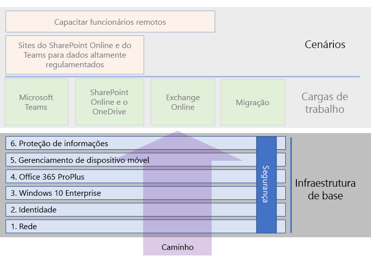
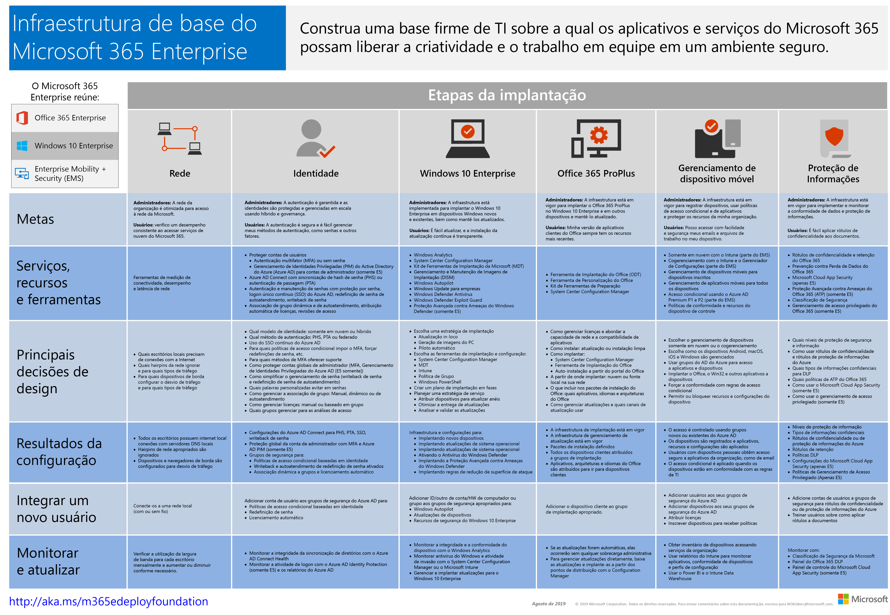

# Infraestrutura de base do Microsoft 365 para empresasMicrosoft 365 for enterprise foundation infrastructure

Se você vai realizar a implantação de ponta a ponta do Microsoft 365 para empresas sozinho, primeiro você deve criar uma base firme sobre a qual aplicativos e serviços possam desbloquear a criatividade e o trabalho em equipe em um ambiente seguro.If you're doing the end-to-end deployment of Microsoft 365 for enterprise yourself, you should first build a firm foundation upon which applications and services can unlock creativity and teamwork in a secure environment. Essa base é às vezes referida como uma *implantação principal*.This foundation is sometimes referred to as a *core deployment*.

Para um caminho definido de ponta a ponta para implantação, você pode usar essas fases para planejar e implantar a infraestrutura de base do Microsoft 365 para empresas:For a defined end-to-end path for deployment, you can use these phases to plan for and deploy the foundation infrastructure of Microsoft 365 for enterprise:

| | FasePhase | ResultadosResults |
|:-------|:-----|:-----|
||[Fase 1: RedePhase 1: Networking](networking-infrastructure.md)| A rede é otimizada para o acesso aos serviços baseados na nuvem do Microsoft 365.Your network is optimized for access to Microsoft 365's cloud-based services. |
||[Fase 2: identidadePhase 2: Identity](identity-infrastructure.md)| As contas de administrador estão protegidas, seus usuários e grupos estão sincronizados e a autenticação de usuário é forte.Your admin accounts are protected, your users and groups are synchronized, and your user authentication is strong. |
||[Fase 3: Windows 10 EnterprisePhase 3: Windows 10 Enterprise](windows10-infrastructure.md)| Os computadores baseados no Windows podem ser atualizados para o Windows 10 Enterprise e novos dispositivos são instalados com o Windows 10 Enterprise.Your existing Windows-based computers can upgrade to Windows 10 Enterprise and new devices are installed with Windows 10 Enterprise. |
||[Fase 4: Office 365 ProPlusPhase 4: Office 365 ProPlus](office365proplus-infrastructure.md)| Os usuários existentes do Microsoft Office podem ser atualizados para o Office 365 ProPlus.Your existing users of Microsoft Office can upgrade to Office 365 ProPlus. |
||[Fase 5: Gerenciamento de dispositivo móvelPhase 5: Mobile device management](mobility-infrastructure.md)| Os dispositivos podem ser registrados e gerenciados.Your devices can be enrolled and managed. |
||[Fase 6: Proteção de informaçõesPhase 6: Information protection](infoprotect-infrastructure.md)| Os recursos de segurança do Office 365 estão habilitados e suas etiquetas e políticas estão prontas para proteger documentos e emails.Office 365 security features are enabled and your labels and policies are ready to protect documents and email. |

As fases começam com o mais fundamental (rede e identidade) e depois criam camadas de configurações e grupos de infraestrutura para:The phases start with the most foundational (networking and identity), and then create layers of infrastructure settings and groups to:

- Instalar a versão mais atual e segura do Windows nos seus dispositivos e mantê-la atualizada.Install the most current and secure version of Windows on your devices and keep it current.
- Instalar a versão mais atual do Microsoft Office em seus dispositivos e mantê-la atualizada.Install the most current version of Microsoft Office on your devices and keep it current.
- Gerencie os dispositivos da sua organização e seu acesso aos aplicativos.Manage your organization's devices and their access to apps.
- Proteger as informações nesses dispositivos e na nuvem.Protect the information on those devices and in the cloud.

Entretanto, você tem a flexibilidade de configurar e implantar as fases ou etapas dentro de fases para atender às suas necessidades de negócios e de recursos de TI.However, you have the flexibility of configuring and rolling out the phases or steps within phases to fit your IT resources and business needs.

- **Se você é uma organização menor ou mais recente**, siga as fases conforme necessário para criar sua infraestrutura de forma metódica.**If you are a smaller or newer organization**, follow the phases as needed to methodically build out your infrastructure. Para uma implantação não empresarial simplificada, clique [aqui](deploy-foundation-infrastructure-non-enterprises.md).For a simplified deployment for non-enterprises, click [here](deploy-foundation-infrastructure-non-enterprises.md).

-  **Se você é uma organização corporativa**, veja as fases como camadas de infraestrutura de TI em vez de um caminho definido e determine qual é a melhor maneira de chegar à adesão eventual às exigências para cada camada em toda a sua organização.**If you are an enterprise organization**, view the phases as layers of IT infrastructure, rather than a defined path, and determine how to best work toward eventual adherence to the requirements for each layer across your organization.

No final de cada fase, você deve examinar seu *critério de saída*, que inclui condições obrigatórias que devem ser cumpridas e condições opcionais a se considerar.At the end of each phase, you should examine its *exit criteria*, which include required conditions that you must meet and optional conditions to consider. O critério de saída para cada fase garante que sua infraestrutura local e de nuvem e configuração resultante de ponta a ponta cumpram as exigências para uma implantação do Microsoft 365 para empresas.Exit criteria for each phase ensures that your on-premises and cloud infrastructure and resulting end-to-end configuration meet the requirements for a Microsoft 365 for enterprise deployment.

Para ver como o conteúdo é estruturado, assista a este breve vídeo.To see how the content is structured, watch this short video.

> [!VIDEO https://www.microsoft.com/videoplayer/embed/RE23VRG]

Aqui está a infraestrutura de base no guia geral de implantação do Microsoft 365 para empresas:Here's the foundation infrastructure in the overall Microsoft 365 for enterprise deployment guide:

## Visão geralAt-a-glance

O [pôster de infraestrutura de base do Microsoft 365 para empresas](../media/deploy-foundation-infrastructure/Microsoft365EnterpriseFoundInfra.pdf) é um local central para exibição, para cada fase:The [Microsoft 365 for enterprise foundation infrastructure poster](../media/deploy-foundation-infrastructure/Microsoft365EnterpriseFoundInfra.pdf) is a central location for you to view, for each phase:

- Os objetivos gerais da fase para administradores e usuáriosThe overall goals of the phase for administrators and users
- Os serviços, recursos e ferramentasThe services, features, and tools
- As principais decisões de design para planejamentoThe key design decisions for planning
- Os resultados da configuraçãoThe configuration results
- O processo de integração de um novo usuárioThe process for onboarding a new user
- Como monitorar e atualizarHow to monitor and update

Para baixar uma cópia do pôster, clique [aqui](https://github.com/MicrosoftDocs/microsoft-365-docs/raw/public/microsoft-365/enterprise/media/deploy-foundation-infrastructure/Microsoft365EnterpriseFoundInfra.pdf).To download a copy of the poster, click [here](https://github.com/MicrosoftDocs/microsoft-365-docs/raw/public/microsoft-365/enterprise/media/deploy-foundation-infrastructure/Microsoft365EnterpriseFoundInfra.pdf).

## Configuração de infraestrutura vs. implantação para usuáriosInfrastructure configuration vs. user rollout

A infraestrutura de base é um conjunto de software e serviços configurados que, quando combinados para um usuário, permite que ele aproveite todo o espectro de recursos e proteções que o Microsoft 365 para empresas oferece.The foundation infrastructure is a set of configured software and services that, when combined together for a user, allow them to take advantage of the entire spectrum of capabilities and protections that Microsoft 365 for enterprise offers. O destino final de sua jornada de implantação de ponta a ponta é fazer com que essa infraestrutura se aplique a todos os seus usuários e seus dispositivos baseados no Windows.The ultimate destination of your end-to-end deployment journey is to have this infrastructure apply to all of your users and their Windows-based devices. 

Entretanto, é importante notar que a infraestrutura de base do Microsoft 365 para empresas é independente da distribuição de software e serviços para os seus usuários.However, it is important to note that the Microsoft 365 for enterprise foundation infrastructure is independent of the rollout of software and services to your users. ***Você pode configurar as camadas da infraestrutura de base sem precisar implantar essas camadas para todos os seus usuários.******You can configure the layers of the foundation infrastructure without having to roll out those layers to all of your users.***

É possível configurar, testar e definir elementos piloto da infraestrutura de base bem antes da implantação desses elementos para a grande quantidade de usuários nos escritórios, regiões ou divisões da sua organização.It is possible to configure, test, and pilot elements of the foundation infrastructure well ahead of the rollout of those elements to the multitude of your users in the offices, regions, or divisions of your organization.

Por exemplo, você cria as configurações para:For example, you create the settings for:

| FasePhase | ResultadosResults |
|:-------|:-----|
| IdentidadeIdentity | Sincronização de conta e grupos para políticas de acesso condicional baseadas na identidade.Account synchronization and groups for identity-based conditional access policies. |
| Windows 10 EnterpriseWindows 10 Enterprise | Grupos para atualizar automaticamente os computadores executando o Windows 7 ou Windows 8.1 para o Windows 10 Enterprise em vigor.Groups to automatically upgrade computers running Windows 7 or Windows 8.1 to Windows 10 Enterprise in place. |
| Office 365 ProPlusOffice 365 ProPlus | Grupos para implantar automaticamente o Office 365 ProPlus para os usuários com o Office 2010, Office 2013 ou Office 2016.Groups to automatically deploy Office 365 ProPlus for users with Office 2010, Office 2013, or Office 2016. |
| Gerenciamento de dispositivo móvelMobile device management | Grupos para registro de dispositivo e políticas de acesso condicional baseadas em dispositivos.Groups for device enrollment and device-based conditional access policies. |
| Proteção de informaçõesInformation protection | Grupos de rótulos de confidencialidade do Office 365.Groups for Office 365 sensitivity labels. |

Quando você estiver pronto para implantar elementos dessa infraestrutura aos usuários, você:When you are ready to rollout elements of this infrastructure to users, you:

| FasePhase | Ação de implantaçãoRollout action |
|:-------|:-----|
| IdentidadeIdentity | Adicionar contas de usuário aos grupos para políticas de acesso condicional baseadas na identidade.Add user accounts to the groups for identity-based conditional access policies. |
| Windows 10 EnterpriseWindows 10 Enterprise | Adicionar contas aos grupos para implantar automaticamente o Windows 10 Enterprise em vigor para os usuários com o Windows 7 ou o Windows 8.1.Add accounts to the groups to automatically deploy Windows 10 Enterprise in place for users with Windows 7 or Windows 8.1. |
| Office 365 ProPlusOffice 365 ProPlus | Adicionar contas de usuário aos grupos para implantar automaticamente o Office 365 ProPlus para os usuários com o Office 2010, Office 2013 ou Office 2016.Add user accounts to the groups to automatically deploy Office 365 ProPlus for users with Office 2010, Office 2013, or Office 2016. |
| Gerenciamento de dispositivo móvelMobile device management | Adicionar contas aos grupos para registro de dispositivo e políticas de acesso condicional baseadas em dispositivos.Add accounts to the groups for device enrollment and device-based conditional access policies. |
| Proteção de informaçõesInformation protection | Adicione contas de usuário aos grupos para obter os rótulos de confidencialidade.Add user accounts to the groups for sensitivity labels. |

Uma vez que as fases ou elementos da infraestrutura de base sejam concluídos, testados e tiverem o piloto definido, você pode implantar o software instalado, como o Windows 10 Enterprise, o Office 365 ProPlus e os serviços e proteções baseados em nuvem. Por exemplo, o registro de dispositivo e políticas de acesso condicional para os seus usuários da maneira que melhor se adapte aos seus objetivos de negócios e recursos de TI.Once phases or elements of the foundation infrastructure are completed, tested, and piloted, you can roll out installed software, such as Windows 10 Enterprise and Office 365 ProPlus, and cloud-based services and protections, such as device enrollment and conditional access policies, to your users in the manner that best fits your business goals and IT resources.

## Implantação e estratégias de gerenciamento de projetosDeployment and project management strategies

Para lhe dar algumas ideias de como abordar o gerenciamento de projeto das diferentes fases da infraestrutura de base para usuários piloto e para o restante de sua organização, confira [estratégias de implantação](deployment-strategies-microsoft-365-enterprise.md).To give you some ideas on how to approach the project management of the different phases of the foundation infrastructure for pilot users and the rest of your organization, see [deployment strategies](deployment-strategies-microsoft-365-enterprise.md).

## Implantação não empresarialDeployment for non-enterprises

Se a sua organização for menor e o Microsoft 365 Business não for adequado para você, confira a [implantação não empresarial](deploy-foundation-infrastructure-non-enterprises.md) para obter um método de implantação simplificado.If your organization is smaller and Microsoft 365 Business is not suitable for you, see [deployment for non-enterprises](deploy-foundation-infrastructure-non-enterprises.md) for a simplified deployment method.

## Próxima etapaNext step

| Onde estouWhere I am | Onde preciso irWhere I need to go |
|:-------|:-----|
| Tenho infraestrutura existente para o Office 365, Enterprise Mobility + Security (EMS) ou Windows 10 EnterpriseI have existing infrastructure for Office 365, Enterprise Mobility + Security (EMS), or Windows 10 Enterprise | Comece com [Implantar com infraestrutura existente](deploy-with-existing-infrastructure.md), que o orienta pelos critérios de saída para cada fase.Start with [Deploy with existing infrastructure](deploy-with-existing-infrastructure.md), which steps you through the exit criteria for each phase. |
| Estou começando do zero como uma empresaI'm starting from scratch as an enterprise | Comece sua jornada de implantação de ponta a ponta com [Fase 1: Rede](networking-infrastructure.md).Begin your end-to-end deployment journey with [Phase 1: Networking](networking-infrastructure.md). |
| Estou começando do zero como uma organização não empresarialI'm starting from scratch as a non-enterprise | Comece sua jornada de implantação com [Implantação não empresarial](deploy-foundation-infrastructure-non-enterprises.md).Begin your end-to-end deployment journey with [Deployment for non-enterprises](deploy-foundation-infrastructure-non-enterprises.md). |
