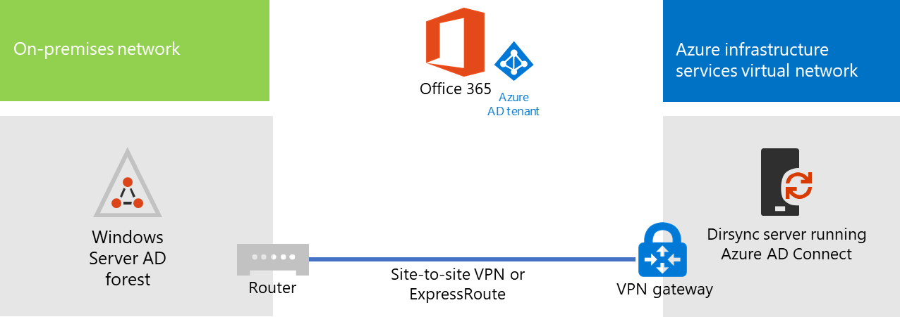

# Implantar a sincronização de diretórios do Microsoft 365 no Microsoft Azure

O Azure Active Directory (Azure AD) Connect (anteriormente conhecido como a ferramenta de sincronização de diretório, a ferramenta de sincronização de diretório ou a ferramenta de DirSync.exe) é um aplicativo que você instala em um servidor associado a um domínio para sincronizar seus usuários do AD DS (serviços de domínio Active Directory) local para o locatário do Azure AD da sua assinatura do Microsoft 365. A Microsoft 365 usa o Azure AD para o serviço de diretório. Sua assinatura do Microsoft 365 inclui um locatário do Azure AD. Esse locatário também pode ser usado para o gerenciamento de identidades da sua organização com outras cargas de trabalho de nuvem, incluindo outros aplicativos SaaS e aplicativos no Azure.

Você pode instalar o Azure AD Connect em um servidor local, mas pode também instalá-lo em uma máquina virtual no Azure pelos seguintes motivos:
  
- Você pode provisionar e configurar servidores baseados na nuvem mais depressa, disponibilizando os serviços aos usuários com mais antecedência.
- O Azure oferece melhor disponibilidade de sites com menos esforço.
- Você pode reduzir o número de servidores locais em sua organização.

Essa solução requer conectividade entre sua rede local e sua Rede Virtual do Azure. Para saber mais, confira o artigo [Conectar uma rede local a uma rede virtual do Microsoft Azure](connect-an-on-premises-network-to-a-microsoft-azure-virtual-network.md). 
  
> [!NOTE]
> Este artigo descreve a sincronização de um único domínio em uma única floresta. O Azure AD Connect sincroniza todos os domínios do AD DS em sua floresta do Active Directory com o Microsoft 365. Se você tiver várias florestas do Active Directory para sincronizar com o Microsoft 365, confira [sincronização de diretórios com várias florestas com o cenário de logon único](https://go.microsoft.com/fwlink/p/?LinkId=393091). 
  
## Visão geral da implantação da sincronização de diretório do Microsoft 365 no Azure

O diagrama a seguir mostra o Azure AD Connect em execução em uma máquina virtual no Azure (o servidor de sincronização de diretório) que sincroniza uma floresta local do AD DS com uma assinatura do Microsoft 365.
  

  
No diagrama, há duas redes conectadas por meio de uma conexão VPN site a site ou ExpressRoute. Há uma rede local em que os controladores de domínio do AD DS estão localizados e há uma rede virtual do Azure com um servidor de sincronização de diretório, uma máquina virtual que executa o [Azure AD Connect](https://www.microsoft.com/download/details.aspx?id=47594). Existem dois fluxos de tráfego principais provenientes do servidor de sincronização de diretório:
  
-  O Azure AD Connect consulta um controlador de domínio na rede local para detectar alterações em contas e senhas.
-  O Azure AD Connect envia as alterações para contas e senhas para a instância do Azure AD da sua assinatura do Microsoft 365. Como o servidor de sincronização de diretório está em uma parte estendida da sua rede local, essas alterações são enviadas pelo servidor de proxy da rede local.
    
> [!NOTE]
> Esta solução descreve a sincronização de um único domínio do Active Directory, uma única floresta do Active Directory. O Azure AD Connect sincroniza todos os domínios do Active Directory em sua floresta do Active Directory com o Microsoft 365. Se você tiver várias florestas do Active Directory para sincronizar com o Microsoft 365, confira [sincronização de diretórios com várias florestas com o cenário de logon único](https://go.microsoft.com/fwlink/p/?LinkId=393091). 
  
Há duas etapas principais quando você implanta essa solução:
  
1. Criar uma rede virtual do Azure e estabelecer uma conexão VPN de site a site para a sua rede local. Para saber mais, confira o artigo [Conectar uma rede local a uma rede virtual do Microsoft Azure](connect-an-on-premises-network-to-a-microsoft-azure-virtual-network.md).
    
2. Instale o [Azure ad Connect](https://www.microsoft.com/download/details.aspx?id=47594) em uma máquina virtual associada ao domínio no Azure e sincronize o AD DS local com o Microsoft 365. Isso envolve:
    
    Criar uma Máquina Virtual do Azure para executar o Azure AD Connect.
    
    Instalar e configurar o [Azure AD Connect](https://www.microsoft.com/download/details.aspx?id=47594).
    
    Configurar o Azure AD Connect requer as credenciais (nome de usuário e senha) de uma conta de administrador do Azure AD e uma conta de administrador corporativo do AD DS. O Azure AD Connect é executado imediatamente e continuamente para sincronizar a floresta do AD DS local com o Microsoft 365.
    
Antes de implantar essa solução em produção, você pode usar as instruções da [configuração de base corporativa simulada](simulated-ent-base-configuration-microsoft-365-enterprise.md) para definir essa configuração como prova de conceito, para demonstrações ou para experimentos.
  
> [!IMPORTANT]
> Quando a configuração do Azure AD Connect for concluída, ele não salvará as credenciais de conta de administrador corporativo do AD DS. 
  
> [!NOTE]
> Esta solução descreve a sincronização de uma única floresta do AD DS para o Microsoft 365. A topologia abordada neste artigo representa apenas uma das maneiras de implementar essa solução. A topologia de sua organização pode ser diferente, com base em requisitos de rede e considerações de segurança exclusivos. 
  
## Planejar a hospedagem de um servidor de sincronização de diretório para o Microsoft 365 no Azure

### Pré-requisitos

Antes de começar, examine os seguintes pré-requisitos para essa solução:
  
- Examine o conteúdo de planejamento relacionado em [Planejar sua rede virtual do Azure](connect-an-on-premises-network-to-a-microsoft-azure-virtual-network.md#plan-your-azure-virtual-network).
    
- Verifique se você atende a todos os [pré-requisitos](connect-an-on-premises-network-to-a-microsoft-azure-virtual-network.md#prerequisites) para configurar a Rede Virtual do Azure.
    
- Ter uma assinatura do Microsoft 365 que inclua o recurso integração com o Active Directory. Para obter informações sobre assinaturas do Microsoft 365, vá para a [página de assinatura do microsoft 365](https://products.office.com/compare-all-microsoft-office-products?tab=2).
    
- Provisione uma máquina virtual do Azure que executa o Azure AD Connect para sincronizar sua floresta do AD DS local com o Microsoft 365.
    
    Você deve ter as credenciais (nomes e senhas) para a conta de administrador corporativo do AD DS e uma conta de Administrador do Azure AD.
    
### Suposições de design de arquitetura da solução

A lista a seguir descreve as opções de design feitas para essa solução.
  
- Essa solução usa uma única rede virtual do Azure com uma conexão VPN de site a site. A rede virtual do Azure hospeda uma única sub-rede que contém um servidor, o servidor de sincronização de diretório que está executando o Azure AD Connect. 
    
- Na rede local, existem servidores DNS e um controlador de domínio.
    
- O Azure AD Connect realiza a sincronização de hash de senha, em vez de logon único. Você não precisa implantar uma infraestrutura de AD FS (Serviços de Federação do Active Directory). Para saber mais sobre as opções de sincronização de hash de senha e logon único, confira [Escolher o método de autenticação correto para sua solução de identidade híbrida do Azure Active Directory](https://aka.ms/auth-options).
    
Há opções adicionais de design que você pode considerar ao implantar essa solução em seu ambiente. Elas incluem o seguinte:
  
- Se houver servidores DNS em uma rede virtual existente do Azure, determine se você deseja que seu servidor de sincronização de diretório os use para resolução de nomes em vez dos servidores DNS da rede local.
    
- Se houver controladores de domínio em uma rede virtual do Azure existente, determine se a configuração de Serviços e Sites do Active Directory pode ser uma opção melhor para você. O servidor de sincronização de diretório pode consultar controladores de domínio na rede virtual do Azure para procurar alterações em contas e senhas em vez de controladores de domínio na rede local.
    
## Roteiro de implantação

A implantação do Azure AD Connect em uma máquina virtual no Azure tem três etapas:
  
- Fase 1: Criar e configurar a rede virtual do Azure
    
- Fase 2: Criar e configurar a máquina virtual do Azure
    
- Fase 3: Instalar e configurar o Azure AD Connect
    
Após a implantação, você também deve atribuir locais e licenças para as novas contas de usuário no Microsoft 365.

### Fase 1: Criar e configurar a rede virtual do Azure

Para criar e configurar a rede virtual do Azure, conclua a [Fase 1: preparar sua rede local](connect-an-on-premises-network-to-a-microsoft-azure-virtual-network.md#phase-1-prepare-your-on-premises-network) e a [Fase 2: criar a rede virtual entre locais no Azure](connect-an-on-premises-network-to-a-microsoft-azure-virtual-network.md#phase-2-create-the-cross-premises-virtual-network-in-azure) no roteiro de implantação de [Conectar uma rede local a uma rede virtual do Microsoft Azure](connect-an-on-premises-network-to-a-microsoft-azure-virtual-network.md).
  
Esta é a configuração resultante.
  

  
Esta figura mostra uma rede local conectada a uma rede virtual do Azure por meio de uma conexão VPN ou ExpressRoute de site a site.
  
### Fase 2: Criar e configurar a máquina virtual do Azure

Criar a máquina virtual no Azure usando as instruções [Criar sua primeira máquina virtual do Windows no portal do Azure](https://go.microsoft.com/fwlink/p/?LinkId=393098). Use as seguintes configurações:
  
- No painel **Básico**, selecione a mesma assinatura, local e grupo de recursos que sua rede virtual. Armazene o nome de usuário e a senha em um local seguro. Você precisará dessas informações posteriormente para se conectar à máquina virtual.
    
- No painel **Escolher um tamanho**, escolha o tamanho **A2 Padrão**.
    
- No painel **Configurações**, na seção **Armazenamento**, escolha o tipo de armazenamento **Padrão**. Na seção **Rede**, escolha o nome da rede virtual e a sub-rede para hospedar o servidor de sincronização de diretório (não a GatewaySubnet). Deixe todas as outras configurações com seus valores padrão.
    
Para conferir se o servidor de sincronização de diretório está usando o DNS corretamente, verifique o DNS interno para garantir que um registro de endereço (A) foi adicionado à máquina virtual com o respectivo endereço IP. 
  
Use as instruções em [Conectar-se à máquina virtual e fazer login](https://docs.microsoft.com/azure/virtual-machines/windows/connect-logon) para conectar-se ao servidor de sincronização de diretório com uma Conexão de Área de Trabalho Remota. Depois de entrar, ingresse na máquina virtual do domínio local AD DS.
  
Para que o Azure AD Connect acesse os recursos da Internet, você deve configurar o servidor de sincronização de diretório para usar o servidor proxy da rede local. Entre em contato com o administrador da rede para etapas de configuração adicionais para executar.
  
Esta é a configuração resultante.
  

  
Esta figura mostra a máquina virtual do servidor de sincronização de diretório na rede virtual entre locais do Azure.
  
### Fase 3: Instalar e configurar o Azure AD Connect

Faça o procedimento a seguir:
  
1. Conecte-se ao servidor de sincronização de diretório usando uma Conexão de Área de Trabalho Remota com uma conta de domínio do AD DS que tenha privilégios de administrador local. Confira [Conectar-se à máquina virtual e fazer login](https://docs.microsoft.com/azure/virtual-machines/windows/connect-logon).
    
2. No servidor de sincronização de diretório, abra o artigo [Configurar a sincronização de diretório para o Microsoft 365](set-up-directory-synchronization.md) e siga as instruções para a sincronização de diretório com a sincronização de hash de senha.
    
> [!CAUTION]
> A instalação cria a conta **AAD_xxxxxxxxxxxx** na unidade organizacional (UO) Usuários Locais. Não mova nem remova essa conta ou a sincronização falhará.
  
Esta é a configuração resultante.
  

  
Esta figura mostra o servidor de sincronização de diretório com o Azure AD Connect na rede virtual entre locais do Azure.
  
### Atribuir locais e licenças aos usuários no Microsoft 365

O Azure AD Connect adiciona contas à sua assinatura do Microsoft 365 do AD DS local, mas, para que os usuários entrem no Microsoft 365 e usem seus serviços, as contas devem ser configuradas com um local e licenças. Use essas etapas para adicionar o local e as licenças ativas às devidas contas de usuário:
  
1. Entre no centro de [Administração do Microsoft 365](https://admin.microsoft.com)e, em seguida, clique em **administrador**.
    
2. Na navegação à esquerda, clique em **Usuários > Usuários ativos**.
    
3. Na lista das contas de usuário, marque a caixa de seleção ao lado do usuário que você deseja ativar.
    
4. Na página do usuário, clique em **Editar** para **Licenças de produto**.
    
5. Na página **Licenças de produto**, selecione um local para o usuário em **Local** e habilite as licenças apropriadas para ele.
    
6. Ao concluir, clique em **Salvar** e, em seguida, clique em **Fechar** duas vezes.
    
7. Volte à etapa 3 para usuários adicionais.
    
## Confira também

[Centro de soluções e arquitetura do Microsoft 365](../solutions/solution-architecture-center.md)
  
[Conectar uma rede local a uma rede virtual do Microsoft Azure](connect-an-on-premises-network-to-a-microsoft-azure-virtual-network.md)

[Baixar o Azure AD Connect](https://www.microsoft.com/download/details.aspx?id=47594)
  
[Configurar a sincronização de diretórios para o Microsoft 365](set-up-directory-synchronization.md)
  
