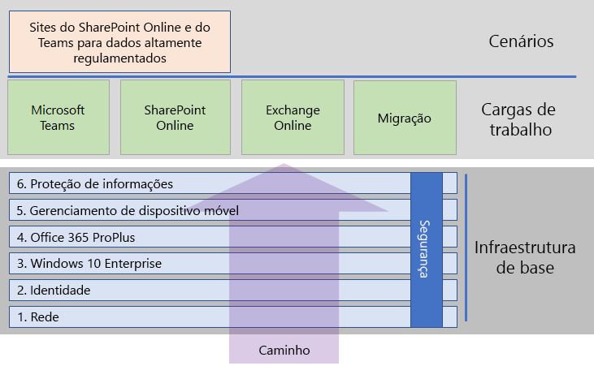

# Implantar o Microsoft 365 EnterpriseDeploy Microsoft 365 Enterprise

O Microsoft 365 Enterprise é uma combinação do Office 365, Enterprise Mobility + Security (EMS) e Windows 10 Enterprise que:Microsoft 365 Enterprise is a combination of Office 365, Enterprise Mobility + Security (EMS), and Windows 10 Enterprise that: 

- tem segurança inteligente;Has intelligent security.
- está integrado para oferecer simplicidade;Is integrated for simplicity.
- desbloqueia a criatividade;Unlocks creativity.
- foi criado para trabalho em equipe.Is built for teamwork.

Esses benefícios não são alcançados apenas ao obter as licenças para os três produtos, mas ao implantá-las e implantar seus recursos de uma forma específica que inclui a integração e segurança de ponta.These benefits are not realized just by obtaining the licenses for the three products, but by deploying them and their features in a specific way that includes integration and state-of-the-art security.

Há três formas principais de implantar o Microsoft 365 Enterprise:There are three main ways to deploy Microsoft 365 Enterprise:

- Implante-o com engenheiros da Microsoft usando o FastTrack para o Microsoft 365.Do it with Microsoft engineers using FastTrack for Microsoft 365.
- Implante-o com a ajuda dos Serviços de Consultoria da Microsoft ou com um [parceiro da Microsoft](https://partner.microsoft.com/).Do it with help from Microsoft Consulting Services or a [Microsoft partner](https://partner.microsoft.com/).
- Implante-o sozinho com o guia de implantação do Microsoft 365 Enterprise.Do it yourself with the Microsoft 365 Enterprise deployment guide.

## FastTrack para o Microsoft 365FastTrack for Microsoft 365

O FastTrack é um benefício contínuo e repetível—disponível como parte de sua assinatura—que é entregue por engenheiros da Microsoft para ajudá-lo a mover para a nuvem no seu próprio ritmo.FastTrack is an ongoing and repeatable benefit—available as part of your subscription—that is delivered by Microsoft engineers to help you move to the cloud at your own pace. O FastTrack também lhe dá acesso a parceiros qualificados para serviços adicionais.FastTrack also gives you access to qualified partners for additional services. Com mais de 40.000 clientes habilitados até o momento, FastTrack ajuda a maximizar o ROI, acelerar a implantação e aumentar a adoção em toda a sua organização.With over 40,000 customers enabled to date, FastTrack helps maximize ROI, accelerate deployment, and increase adoption across your organization. Conferir [FastTrack para Microsoft 365](https://fasttrack.microsoft.com/microsoft365).See [FastTrack for Microsoft 365](https://fasttrack.microsoft.com/microsoft365).

Se deseja aproveitar as vantagens do FastTrack para implantar o Microsoft 365 Enterprise, você pode usar o [consultor de implantação do Microsoft 365](https://aka.ms/microsoft365setupguide) do FastTrack para obter instruções sobre como implantar e configurar a infraestrutura de base.If you want to take advantage of FastTrack to deploy Microsoft 365 Enterprise, you can use the FastTrack [Microsoft 365 deployment advisor](https://aka.ms/microsoft365setupguide) for guidance on how to deploy and set up your foundation infrastructure. Você deve estar conectado como administrador global em um locatário do Office 365 ou do Microsoft 365 para acessar esta página.You must be signed in as a global administrator in an Office 365 or Microsoft 365 tenant to access this page.

Comece sua jornada de implantação de ponta a ponta com FastTrack [aqui](https://fasttrack.microsoft.com/microsoft365).Get started on your end-to-end deployment journey with FastTrack [here](https://fasttrack.microsoft.com/microsoft365).

## Guia de implantação do Microsoft 365 EnterpriseMicrosoft 365 Enterprise deployment guide

O guia de implantação do Microsoft 365 Enterprise orienta você sobre a configuração correta e necessária dos produtos e recursos do Microsoft 365 Enterprise.The Microsoft 365 Enterprise deployment guide steps you through the correct and required configuration of Microsoft 365 Enterprise products and features.

Para implantar o Microsoft 365 Enterprise sozinho, você pode:To deploy Microsoft 365 Enterprise yourself, you can:

- Implantar a [infraestrutura de base](deploy-foundation-infrastructure.md) para segurança interna e integração para gerenciamento simplificado, que facilita a garantia de que o software do cliente seja atualizado com os aprimoramentos mais recentes de produtividade e segurança.Deploy the [foundation infrastructure](deploy-foundation-infrastructure.md) for built-in security and integration for simplified management, which makes it easier to ensure your client software is updated with the latest productivity and security enhancements. 
 
  A infraestrutura de base é organizada como uma série de fases numeradas que se complementam em direção a um ambiente que ofereça suporte para cargas de trabalhos e cenários do Microsoft 365 Enterprise.The foundation infrastructure is organized as a series of numbered phases that build upon each other and towards an environment that supports Microsoft 365 Enterprise workloads and scenarios. 

  **Se você é uma organização menor ou mais recente**, siga as fases em ordem para criar sua infraestrutura de forma metódica.**If you are a smaller or newer organization**, follow the phases in order to methodically build out your infrastructure.

  Entretanto, você pode implantar fases ou as porções de fases desta infraestrutura em qualquer ordem conforme necessário, [uma após a outra ou em paralelo](deployment-strategies-microsoft-365-enterprise.md), para se integrar à sua infraestrutura atual, encaixar-se com seus planos e recursos de TI e atender às suas necessidades de negócios.However, you can deploy phases or the portions of phases of this infrastructure in any order as needed, [one after the other or in parallel](deployment-strategies-microsoft-365-enterprise.md), to integrate with your current infrastructure, fit your IT plans and resources, and meet your business needs. 

  **Se você é uma organização corporativa**, veja as fases como as camadas de infraestrutura de TI em vez de um caminho definido e determine qual é a melhor maneira de chegar à adesão eventual às exigências de cada camada em toda a sua organização.**If you are an enterprise organization**, view the phases as layers of IT infrastructure, rather than a defined path, and determine how to best work toward eventual adherence to the requirements of each layer across your organization.

- Implantar as principais[cargas de trabalho e cenários](deploy-workloads.md) de produtividade acima de sua infraestrutura.Deploy key productivity [workloads and scenarios](deploy-workloads.md) on top of your infrastructure. Isso desbloqueia a criatividade e o trabalho em equipe em sua organização.These unlock creativity and teamwork in your organization.

Este é o relacionamento entre a infraestrutura de base, as cargas de trabalho e os cenários.Here's the relationship between the foundation infrastructure and the workloads and scenarios.

As cargas de trabalho e os cenários operam acima da infraestrutura de base.Workloads and scenarios operate over the top of the foundation infrastructure. Entretanto, você não precisa ter todas as fases da infraestrutura de base prontas para começar a usar cargas de trabalho para produtividade e colaboração.However, you do not have to have all of the foundation infrastructure phases built out to begin using workloads for productivity and collaboration.

Comece sozinho em sua jornada de implantação de ponta a ponta [aqui](deploy-foundation-infrastructure.md).Get self-started on your end-to-end deployment journey [here](deploy-foundation-infrastructure.md).

## Faça um test driveTake a test drive

“*É fazendo que se aprende a fazer aquilo que se deve aprender a fazer.*”“*For the things we have to learn before we can do them, we learn by doing them.*” - Aristóteles- Aristotle

Se você está começando a usar Microsoft 365 Enterprise ou um produto específico ou recurso, uma das melhores formas de aprender é criar algo sozinho e ver isso funcionar.If you're new to Microsoft 365 Enterprise or to a specific product or feature, one of the best ways to gain understanding is to build it out yourself and see it working.

Nós facilitamos isso com os Guias de Laboratório de Teste (TLGs), que o orienta pela configuração da infraestrutura ou de um recurso em um ambiente simplificado mas representativo usando uma assinatura de avaliação ou uma assinatura paga.We've made this easier with Test Lab Guides (TLGs), which step you through the configuration of infrastructure or a feature in a simplified but representative environment using trial or paid subscriptions.

Com TLGs, você pode aprender sozinho, demonstrar, personalizar ou criar uma prova de conceito de uma configuração complexa, carga de trabalho ou cenário de ponta a ponta.With TLGs, you can self-learn, demonstrate, customize, or build a proof of concept of a complex configuration, workload, or end-to-end scenario.

Para saber mais, confira [Guias do Laboratório de Teste do Microsoft 365 Enterprise](m365-enterprise-test-lab-guides.md).For more information, see [Microsoft 365 Enterprise Test Lab Guides](m365-enterprise-test-lab-guides.md).

## Como os outros fizeram isso?How did others do it?

Use esses recursos para entender como os outros implantaram e estão usando o Microsoft 365 Enterprise.Use these resources to understand how others have deployed and are using Microsoft 365 Enterprise.

### Como os clientes usam o Microsoft 365 EnterpriseHow customers use Microsoft 365 Enterprise

Use o site Histórias de Clientes para conferir como os clientes da Microsoft usam o Microsoft 365 Enterprise.Use the Customer Stories site to see how Microsoft customers are using Microsoft 365 Enterprise.

1. Vá para [https://customers.microsoft.com/](https://customers.microsoft.com/) e clique em **Pesquisar**.Go to [https://customers.microsoft.com/](https://customers.microsoft.com/) and click **Search**.
2. No painel esquerdo, selecione o idioma em **Idioma**.In the left pane, select your language in **Language**.
3. Selecione o setor da organização em **Setor**.Select your organization's industry in **Industry**.
4. Selecione **Microsoft 365** em **Produto**.Select **Microsoft 365** in **Product**.
5. Clique em um cartão para o estudo de caso do cliente.Click on a card for the customer's case study.
  

### Como a Microsoft usa o Microsoft 365 EnterpriseHow Microsoft uses Microsoft 365 Enterprise

Definir uma cultura digital é uma das principais prioridades para todo líder que se esforça para promover um espaço de trabalho moderno.Defining a digital culture is a major priority for every leader who strives to foster a modern workplace. O Microsoft 365 foi projetado para oferecer suporte a esse tipo de mudança cultural, ajudando líderes a capacitarem todas as pessoas em suas empresas a estimularem a criatividade e a colaboração.Microsoft 365 was designed to support this kind of cultural shift, helping leaders empower everyone at their companies to unleash creativity and collaboration. Na Microsoft, estabelecer nosso infraestrutura fundamental desencadeou exatamente esse tipo de mudança da cultura digital.At Microsoft, establishing our foundational infrastructure has sparked precisely this kind of digital culture shift. Implementar o Microsoft 365 Enterprise nos permitiu implantar a tecnologia de colaboração, como o Microsoft Teams e Exchange Online, e compartilhar dados confidenciais online em sites seguros de intranet do SharePoint.Implementing Microsoft 365 Enterprise has allowed us to deploy collaboration technology, like Microsoft Teams and Exchange Online, and to share sensitive data online across secure SharePoint intranet sites.

Ao mesmo tempo, recursos de segurança inteligentes e integração de produto ajudam a simplificar as necessidades de gerenciamento e a minimizar o custo total de propriedade no ciclo de vida de TI.At the same time, intelligent security features and product integration helps streamline management needs and minimize the total cost of ownership across the IT lifecycle. 

Saiba como o Core Services Engineering and Operations (antigo Microsoft IT) [planejou e implantou uma base](https://www.microsoft.com/en-us/itshowcase/deploying-and-managing-microsoft-365) para dar suporte aos aplicativos e serviços que estimulam a criatividade e o trabalho em equipe em um ambiente seguro.Learn how Core Services Engineering and Operations (formerly Microsoft IT) [planned and deployed a foundation](https://www.microsoft.com/en-us/itshowcase/deploying-and-managing-microsoft-365) to support the applications and services that unlock creativity and foster teamwork in a secure environment.

> [!Note]
> Esta página da Web só está disponível em inglês.This web page is only available in English.

### Como a Contoso Corporation implantou o Microsoft 365 EnterpriseHow the Contoso Corporation deployed Microsoft 365 Enterprise

Contoso Corporation é uma corporação fictícia mas representante global do conglomerado de produção com sede em Paris, França.The Contoso Corporation is a fictional but representative global manufacturing conglomerate with its headquarters in Paris, France. Veja como [Contoso implantou o Microsoft 365 Enterprise](contoso-case-study.md) e abordou as principais decisões de design e detalhes de implementação para a rede, identidade, Windows 10 Enterprise, Office 365 ProPlus, gerenciamento de dispositivo móvel, proteção de informações e segurança.See how [Contoso deployed Microsoft 365 Enterprise](contoso-case-study.md) and addressed major design decisions and implementation details for networking, identity, Windows 10 Enterprise, Office 365 ProPlus, mobile device management, information protection, and security. 

## Próximo passo para implantar o Microsoft 365 EnterpriseNext step to deploy Microsoft 365 Enterprise

Para fazer isso com assistência direta da Microsoft, use [FastTrack](https://fasttrack.microsoft.com/microsoft365).To do it with direct Microsoft assistance, use [FastTrack](https://fasttrack.microsoft.com/microsoft365).

Para fazer isso com um consultor, contate os Serviços de Consultoria da Microsoft ou um [parceiro da Microsoft](https://partner.microsoft.com/).To do it with a consultant, contact Microsoft Consulting Services or a [Microsoft partner](https://partner.microsoft.com/).

Para começar fazendo sozinho, confira a [infraestrutura de base](deploy-foundation-infrastructure.md).To get started doing it yourself, see the [foundation infrastructure](deploy-foundation-infrastructure.md).
