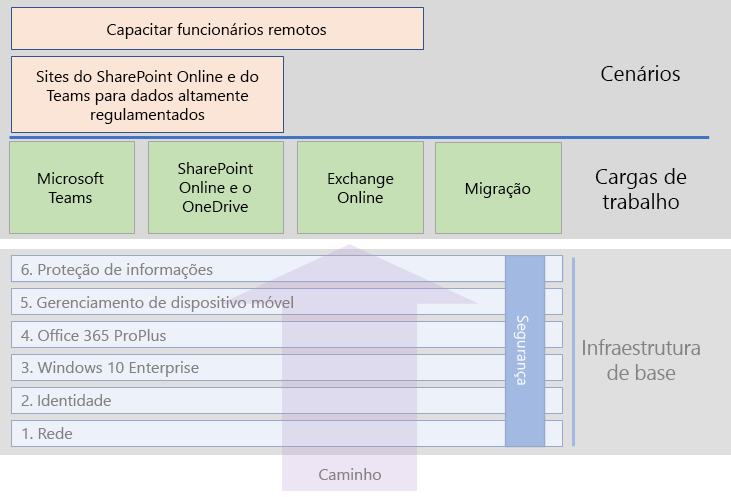

# Cenários e cargas de trabalho do Microsoft 365 para empresas

Para aproveitar os benefícios da criatividade e do trabalho em equipe do Microsoft 365 para empresas, implante essas cargas de trabalho em sua infraestrutura de base:

- [Microsoft Teams](teams-workload.md)
- [Exchange Online](exchangeonline-workload.md)
- [SharePoint e OneDrive](sharepoint-online-onedrive-workload.md)

Confira o artigo [migração](migration-microsoft-365-enterprise-workload.md) para obter um roteiro para migrar toda a sua organização para o Microsoft 365 para empresas, o que inclui os produtos de cliente do Microsoft Office, produtos do Office Server local e os dispositivos da Microsoft baseados no Windows.

Os cenários usam recursos e serviços do Microsoft 365 para empresas de forma integrada para atender às necessidades empresariais. 

É necessário garantir que seus funcionários trabalhem de forma produtiva e segura quando não estão conectados diretamente à sua intranet. Confira o cenário [Capacitar funcionários remotos](empower-people-to-work-remotely.md) para obter um roteiro para implantar os elementos da infraestrutura e conduzir o usuário remoto na adoção das principais cargas de trabalho, como o Teams e o Exchange Online.

Outra dessas necessidades é proteger dados altamente regulamentados armazenados no Microsoft 365. Os dados altamente regulamentados incluem ativos digitais:

- Sujeitos a regulamentações regionais.
- Mais importantes de sua organização, como segredos comerciais, financeiros ou informações de recursos humanos e estratégias da organização.

Para proteger esses dados contra ameaças internas e externas, confira:

- [Teams para dados altamente controlados](secure-teams-highly-regulated-data-scenario.md)
- [Sites do SharePoint para dados altamente regulamentados](teams-sharepoint-online-sites-highly-regulated-data.md). 

Este cenário oferece orientações passo a passo sobre como configurar um site do SharePoint ou uma equipe do Microsoft Teams para armazenar com segurança seus dados mais importantes.

Veja a seguir os cenários e cargas de trabalho no guia de implantação geral do Microsoft 365 para empresas:

Confira a [Biblioteca de Produtividade do Microsoft 365](https://aka.ms/productivitylibrary) https://aka.ms/productivitylibrary) para ver cenários adicionais. 

## Pré-requisitos da infraestrutura de base

*Idealmente*, você deve implantar as cargas de trabalho e os cenários depois de configurar todas as fases da [infraestrutura de base](deploy-foundation-infrastructure.md). Isso garante que todas as camadas de base subjacentes estejam prontas para oferecer integração, segurança e a melhor experiência para seus usuários e dispositivos.

| Fase | Resultado |
|:-------|:-----|
| Rede | A rede é atualizada para obter um desempenho ideal para os serviços de nuvem do Microsoft 365. |
| Identidade | A identidade é sincronizada e protegida com a autenticação forte de contas de usuário e a proteção para contas de administrador. |
| Windows 10 Enterprise | Os computadores com o Windows 7 ou Windows 8.1 podem ser atualizados para o Windows 10 Enterprise, e os novos dispositivos recebem a instalação do Windows 10 Enterprise. |
| Microsoft 365 Apps para empresas | Os usuários existentes do Microsoft Office podem ser atualizados no Microsoft 365 Apps para empresas. |
| Gerenciamento de dispositivo móvel | Os dispositivos podem ser registrados e gerenciados. |
| Proteção de informações | Os recursos de proteção de informações do Microsoft 365 estão configurados e sua confidencialidade ou os rótulos de proteção de informações do Azure estão prontos para proteger documentos e emails. |

Lembre-se de que esse processo é o ideal e pode levar algum tempo para planejar, configurar, testar e desenvolver um piloto, especialmente em grandes organizações com infraestrutura existente e diversos locais. Não é necessário completar todas essas fases em todos os locais para aproveitar mais rapidamente o valor empresarial do Microsoft 365 para empresas. 

Estas estão algumas cargas de trabalho comuns para implantar imediatamente: 

- Depois que a fase de **Identidade** da infraestrutura de base é implementada para os usuários, muitas organizações implantam:
  - [Microsoft 365 Apps para empresas](office365proplus-infrastructure.md) combinados com o [OneDrive](https://docs.microsoft.com/onedrive/plan-onedrive-enterprise). O Microsoft 365 Apps para empresas fornece a segurança da autenticação moderna e a experiência do usuário do cliente mais recente do Microsoft Office. A migração dos arquivos pessoais do usuário para o OneDrive reduz a infraestrutura e a necessidade de dar suporte a pastas base e drivers.
  - O [Exchange Online](exchangeonline-workload.md), para que os usuários possam começar a usar o email baseado na nuvem.
- Se não houver a necessidade imediata de armazenar ativos digitais altamente regulamentados na nuvem, implante o [Microsoft Teams](teams-workload.md) e o [SharePoint](sharepoint-online-onedrive-workload.md) para seus usuários, antes da fase de **Proteção de informações**.

É preciso decidir qual é maneira mais adequada de ordenar e implantar a configuração das fases de pré-requisito da infraestrutura de base a fim de atender às necessidades de seus negócios.

### Prática recomendada

É altamente recomendável implantar e implementar a fase de **Identidade** da infraestrutura de base antes de ingressar os usuários nas cargas de trabalho ou nos cenários.

A fase de **Identidade** garante que sua identidade baseada na nuvem, seja ela somente na nuvem ou sincronizada com o Active Directory Domain Services (AD DS) local, contenha as contas e os grupos de usuário e de computador para gerenciar a autenticação e o acesso. É necessária a autenticação forte para todos os usuários com proteção forte de contas de administrador, antes de colocar os ativos digitais da organização na nuvem do Microsoft 365.

Embora seja fundamental e muito importante para o desempenho geral, a implementação da fase de **Rede** pode estar em andamento enquanto os usuários estiverem ingressando nas cargas de trabalho; tenha em mente quea carga de trabalho e o desempenho do serviço do Microsoft 365 melhorarão ao longo do tempo. Isso vale especialmente para organizações corporativas com vários locais e uma combinação de dispositivos de borda e de conexões com a Internet.
