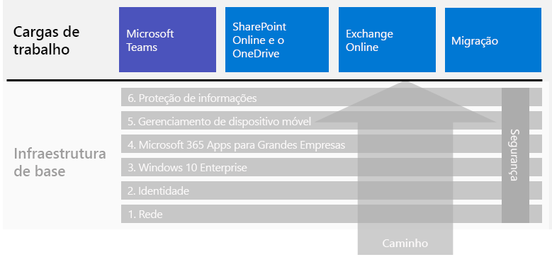

# Cenários e cargas de trabalho do Microsoft 365 para empresasMicrosoft 365 for enterprise workloads and scenarios

Para aproveitar os benefícios da criatividade e do trabalho em equipe do Microsoft 365 para empresas, implante essas cargas de trabalho em sua infraestrutura de base:To get the creativity and teamwork benefits of Microsoft 365 for enterprise, deploy these workloads over your foundation infrastructure:

- [Microsoft TeamsMicrosoft Teams](teams-workload.md)
- [Exchange OnlineExchange Online](exchangeonline-workload.md)
- [SharePoint e OneDriveSharePoint and OneDrive](sharepoint-online-onedrive-workload.md)

Confira o artigo [migração](migration-microsoft-365-enterprise-workload.md) para obter um roteiro para migrar toda a sua organização para o Microsoft 365 para empresas, o que inclui os produtos de cliente do Microsoft Office, produtos do Office Server local e os dispositivos da Microsoft baseados no Windows.See the [migration](migration-microsoft-365-enterprise-workload.md) article for a general roadmap to migrate your entire organization to Microsoft 365 for enterprise, which includes Microsoft Office client products, on-premises Office Server products, and Microsoft Windows-based devices.

Os cenários usam recursos e serviços do Microsoft 365 para empresas de forma integrada para atender às necessidades empresariais.Scenarios use features and services from across Microsoft 365 for enterprise in an integrated way to address a business need. 

É necessário garantir que seus funcionários trabalhem de forma produtiva e segura quando não estão conectados diretamente à sua intranet.One such need is to ensure that your employees can work productively and securely when they're not directly connected to your intranet. Confira o cenário [Capacitar funcionários remotos](empower-people-to-work-remotely.md) para obter um roteiro para implantar os elementos da infraestrutura e conduzir o usuário remoto na adoção das principais cargas de trabalho, como o Teams e o Exchange Online.See the [Empower remote workers](empower-people-to-work-remotely.md) scenario for a roadmap to deploy the infrastructure elements and drive remote user adoption for key workloads, such as Teams and Exchange Online.

Outra dessas necessidades é proteger dados altamente regulamentados armazenados no Microsoft 365.Another such need is to protect highly regulated data stored in Microsoft 365. Os dados altamente regulamentados incluem ativos digitais:Highly regulated data includes digital assets that are:

- Sujeitos a regulamentações regionais.Subject to regional regulations.
- Mais importantes de sua organização, como segredos comerciais, financeiros ou informações de recursos humanos e estratégias da organização.The most valuable data for your organization, such as trade secrets, financial or human resources information, and organization strategy.

Para proteger esses dados contra ameaças internas e externas, confira:To protect this data from internal and external threats, see:

- [Teams para dados altamente controladosTeams for highly regulated data](secure-teams-highly-regulated-data-scenario.md)
- [Sites do SharePoint para dados altamente regulamentados](teams-sharepoint-online-sites-highly-regulated-data.md).[SharePoint sites for highly regulated data](teams-sharepoint-online-sites-highly-regulated-data.md). 

Este cenário oferece orientações passo a passo sobre como configurar um site do SharePoint ou uma equipe do Microsoft Teams para armazenar com segurança seus dados mais importantes.These scenarios step you through configuring a Microsoft Teams team or SharePoint site to securely store your most valuable data.

Veja a seguir os cenários e cargas de trabalho no guia de implantação geral do Microsoft 365 para empresas:Here are the workloads and scenarios in the overall Microsoft 365 for enterprise deployment guide:

Confira a [Biblioteca de Produtividade do Microsoft 365](https://aka.ms/productivitylibrary) https://aka.ms/productivitylibrary) para ver cenários adicionais.See the [Microsoft 365 Productivity Library](https://aka.ms/productivitylibrary) (https://aka.ms/productivitylibrary) for additional scenarios. 

## Pré-requisitos da infraestrutura de baseFoundation infrastructure prerequisites

*Idealmente*, você deve implantar as cargas de trabalho e os cenários depois de configurar todas as fases da [infraestrutura de base](deploy-foundation-infrastructure.md).*Ideally*, you should deploy workloads and scenarios after you have configured all of the phases of the [foundation infrastructure](deploy-foundation-infrastructure.md). Isso garante que todas as camadas de base subjacentes estejam prontas para oferecer integração, segurança e a melhor experiência para seus usuários e dispositivos.This ensures that all of the underlying foundation layers are in place to provide integration, security, and the best experience for your users and their devices.

| FasePhase | ResultadoResult |
|:-------|:-----|
| RedeNetwork | A rede é atualizada para obter um desempenho ideal para os serviços de nuvem do Microsoft 365.Your network is updated for optimum performance to Microsoft 365 cloud services. |
| IdentidadeIdentity | A identidade é sincronizada e protegida com a autenticação forte de contas de usuário e a proteção para contas de administrador.Identity is synchronized and secured with strong authentication for user accounts and protection for admin accounts. |
| Windows 10 EnterpriseWindows 10 Enterprise | Os computadores com o Windows 7 ou Windows 8.1 podem ser atualizados para o Windows 10 Enterprise, e os novos dispositivos recebem a instalação do Windows 10 Enterprise.Your computers running Windows 7 or Windows 8.1 can upgrade to Windows 10 Enterprise and new devices are installed with Windows 10 Enterprise. |
| Office 365 ProPlusOffice 365 ProPlus | Os usuários existentes do Microsoft Office podem ser atualizados para o Office 365 ProPlus.Your existing users of Microsoft Office can upgrade to Office 365 ProPlus. |
| Gerenciamento de dispositivo móvelMobile device management | Os dispositivos podem ser registrados e gerenciados.Your devices can be enrolled and managed. |
| Proteção de informaçõesInformation protection | Os recursos de proteção de informações do Microsoft 365 estão configurados e sua confidencialidade ou os rótulos de proteção de informações do Azure estão prontos para proteger documentos e emails.Microsoft 365 information protection features are configured and your sensitivity or Azure Information Protection labels are ready to protect documents and email. |

Lembre-se de que esse processo é o ideal e pode levar algum tempo para planejar, configurar, testar e desenvolver um piloto, especialmente em grandes organizações com infraestrutura existente e diversos locais.Remember that this is ideal and can take some time to plan for, configure, test, and pilot, especially in large organizations with existing infrastructure and multiple locations. Não é necessário completar todas essas fases em todos os locais para aproveitar mais rapidamente o valor empresarial do Microsoft 365 para empresas.Completing all of these phases in all locations is not necessary for you to more quickly get business value from Microsoft 365 for enterprise. 

Estas estão algumas cargas de trabalho comuns para implantar imediatamente:Here are some common workloads to deploy right away: 

- Depois que a fase de **Identidade** da infraestrutura de base é implementada para os usuários, muitas organizações implantam:After the **Identity** phase of the foundation infrastructure is rolled out to users, many organizations deploy:
  - O [Office 365 ProPlus](office365proplus-infrastructure.md) em conjunto com o [OneDrive](https://docs.microsoft.com/onedrive/plan-onedrive-enterprise).[Office 365 ProPlus](office365proplus-infrastructure.md) combined with [OneDrive](https://docs.microsoft.com/onedrive/plan-onedrive-enterprise). O Office 365 ProPlus fornece a segurança da autenticação moderna e a experiência do usuário do cliente mais recente do Microsoft Office.Office 365 ProPlus provides the security of modern authentication and the user experience of the latest Microsoft Office client. A migração dos arquivos pessoais do usuário para o OneDrive reduz a infraestrutura e a necessidade de dar suporte a pastas base e drivers.The migration of user's personal files to OneDrive reduces infrastructure and the need to support home folders and drives.
  - O [Exchange Online](exchangeonline-workload.md), para que os usuários possam começar a usar o email baseado na nuvem.[Exchange Online](exchangeonline-workload.md) so that users can begin using cloud-based email.
- Se não houver a necessidade imediata de armazenar ativos digitais altamente regulamentados na nuvem, implante o [Microsoft Teams](teams-workload.md) e o [SharePoint](sharepoint-online-onedrive-workload.md) para seus usuários, antes da fase de **Proteção de informações**.If you don't have an immediate need for storing highly regulated digital assets in the cloud, deploy [Microsoft Teams](teams-workload.md) and [SharePoint](sharepoint-online-onedrive-workload.md) for your users prior to the **Information protection** phase.

É preciso decidir qual é maneira mais adequada de ordenar e implantar a configuração das fases de pré-requisito da infraestrutura de base a fim de atender às necessidades de seus negócios.You must decide on how to best order and deploy the configuration of prerequisite phases of foundation infrastructure to meet your business needs.

### Prática recomendadaBest practice

É altamente recomendável implantar e implementar a fase de **Identidade** da infraestrutura de base antes de ingressar os usuários nas cargas de trabalho ou nos cenários.We highly recommend that you deploy and roll out the **Identity** phase of the foundation infrastructure prior to onboarding your users to any workloads or scenarios.

A fase de **Identidade** garante que sua identidade baseada na nuvem, seja ela somente na nuvem ou sincronizada com o Active Directory Domain Services (AD DS) local, contenha as contas e os grupos de usuário e de computador para gerenciar a autenticação e o acesso.The **Identity** phase ensures that your cloud-based identity, whether cloud-only or synchronized with your on-premises Active Directory Domain Services (AD DS), contains the user and computer accounts and groups to manage authentication and access. É necessária a autenticação forte para todos os usuários com proteção forte de contas de administrador, antes de colocar os ativos digitais da organização na nuvem do Microsoft 365.Strong authentication for all your users along with strong protection of admin accounts is required before placing your organization's digital assets in the Microsoft 365 cloud.

Embora seja fundamental e muito importante para o desempenho geral, a implementação da fase de **Rede** pode estar em andamento enquanto os usuários estiverem ingressando nas cargas de trabalho; tenha em mente quea carga de trabalho e o desempenho do serviço do Microsoft 365 melhorarão ao longo do tempo.Although foundational and very important to overall performance, the rollout of the **Networking** phase can be in progress while onboarding your users to workloads, with the understanding that Microsoft 365 workload and service performance will improve over time. Isso vale especialmente para organizações corporativas com vários locais e uma combinação de dispositivos de borda e de conexões com a Internet.This is especially true for enterprise organizations with multiple locations and a mixture of edge devices and Internet connections.
