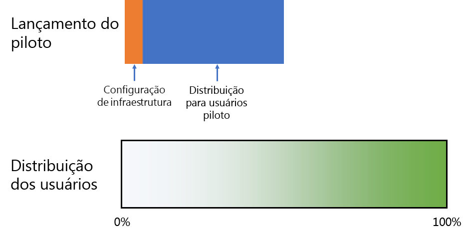
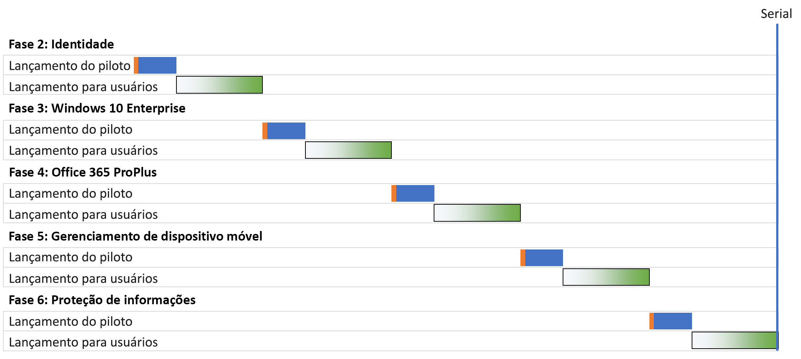
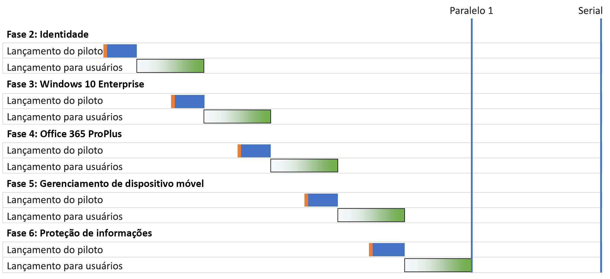
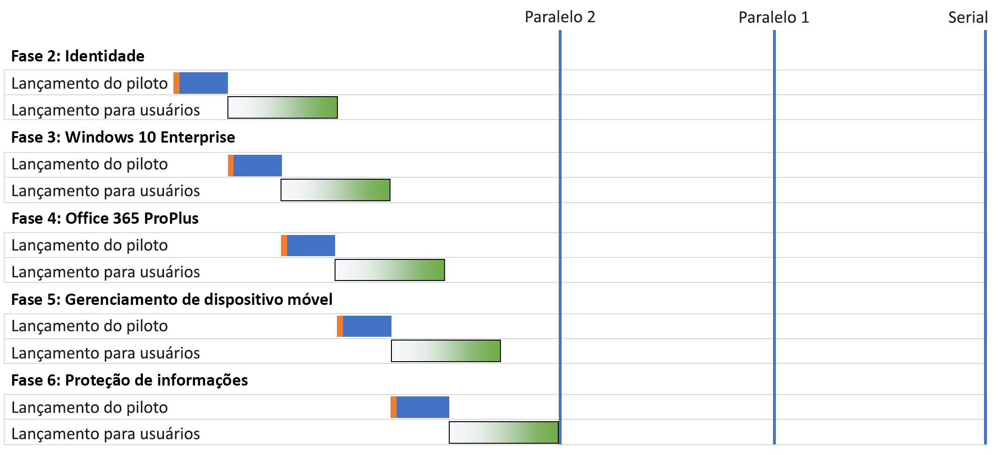
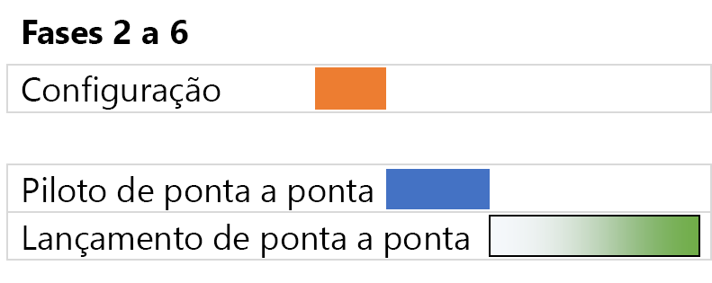

# Estratégias de implantação da infraestrutura de base do Microsoft 365 Enterprise

Há várias maneiras de implantar as fases da [infraestrutura de base](deploy-foundation-infrastructure.md) do Microsoft 365 Enterprise e distribuir os respectivos recursos, software e serviços para os usuários. Para iniciar o gerenciamento de projeto desta ação, que pode ser grande e complexa a depender do tamanho da sua organização e da infraestrutura existente, considere as estratégias de implantação a seguir:

- Implantação em série
- Implantação paralela com lançamento não sobreposto para o usuário
- Implantação paralela com lançamento sobreposto para o usuário
- Infraestrutura inicial e lançamento da configuração de ponta a ponta

Use essas estratégias como ideias sobre como gerenciar o projeto em geral e por em prática mais rapidamente as vantagens do Microsoft 365 Enterprise.

>[!Note]
>Este artigo contém pressuposições e simplificações para um modo consistente de descrever as estratégias de implantação. Essas estratégias são generalizadas e seu objetivo não é de impor qualquer cronograma específico nem se destinam para aplicação em todas as situações e organizações.
>

## Elementos de gerenciamento de projetos de TI para organizações corporativas típicas

A infraestrutura de TI inclui serviços de back-end e o lançamento de recursos novos ou aprimorados ou software instalado para usuários finais. Normalmente, os departamentos de TI implantam elementos de uma infraestrutura de TI de maneira metódica. Uma abordagem de implantação bem-sucedida de um elemento de infraestrutura de TI consiste de:

- Um lançamento piloto 

  Isso inclui a configuração inicial da infraestrutura e o lançamento para um conjunto piloto de usuários, testes e modificações subsequentes na configuração da infraestrutura.

- Um lançamento para usuários

  Inclui o lançamento para o restante da organização com base nas regiões, departamentos, grupos ou outros tipos de propagação sistemática de configuração ou software.

O conjunto de usuários do lançamento piloto não é o mesmo que o do lançamento os usuários.

Este artigo usa o gráfico a seguir para representar essas definições: 

 

O sombreamento do gráfico de porcentagem para os usuários indica o lançamento de 0% a 100% em sua organização, usando uma abordagem metódica ou estruturada como grupos, departamentos ou regiões.

## Estratégias de implantação

Considere as seguintes estratégias de implantação:

- Implantação em série
- Implantação paralela com lançamento não sobreposto para o usuário
- Implantação paralela com lançamento sobreposto para o usuário
- Infraestrutura inicial e lançamento da configuração de ponta a ponta

### Implantação em série

Com uma implantação em série, você lança totalmente uma fase, permitindo que ela atinja 100% de conclusão da implantação para todos os usuários antes de seguir para a próxima etapa. Veja alguns dos motivos que justificam essa implantação:

- Redução de riscos
- Restrições de alocação de recursos
- Ciclos de financiamento para o departamento de TI
- Dependências de tecnologia do TI
- Gestão de mudança nos negócios e resistência dos usuários finais

Este gráfico de Gantt mostra uma implantação em série simplificada das etapas 2 a 6 da infraestrutura de base para o Microsoft 365 Enterprise.

 
 
Para simplificar a discussão e o exemplo, presume-se que cada fase e segmento de implantação de cada etapa duram o mesmo tempo.

>[!Note]
>Fase 1: a fase de rede da infraestrutura de base do Microsoft 365 Enterprise é de responsabilidade exclusiva do TI. Os usuários colhem os benefícios de uma conectividade otimizada com os recursos de nuvem da Microsoft, mas não sofrem pressão para alcançá-los.
>

Exemplo simplificado da experiência piloto do usuário:

- Em dezembro, preciso usar meu smartphone para MFA. (Identidade)
- Em março, instalo o Windows 10 Enterprise no meu computador com Windows 8.1. (Windows 10 Enterprise)
- Em junho, instalo o Office 365 ProPlus em substituição ao Office 2013. (Office 365 ProPlus)
- Em setembro, registro o dispositivo e aplico as políticas de acesso condicional e do aplicativo. (Gerenciamento de dispositivo móvel)
- Em dezembro, instalo o cliente de Proteção de Informações do Azure e aprendo como aplicar rótulos a documentos. (Proteção de Informações)

O resultado é uma cadência de 90 dias entre lançamentos piloto sucessivos.

Exemplo simplificado de experiência do usuário final:

- Em janeiro, preciso usar meu smartphone para MFA. (Identidade)
- Em abril, instalo o Windows 10 Enterprise no meu computador com Windows 8.1. (Windows 10 Enterprise)
- Em julho, instalo o Office 365 ProPlus em substituição ao Office 2013. (Office 365 ProPlus)
- Em outubro, registro o dispositivo e aplico as políticas de acesso condicional e do aplicativo. (Gerenciamento de dispositivo móvel)
- Em janeiro do ano subsequente, instalo o cliente de Proteção de Informações do Azure e aprendo como aplicar rótulos a documentos. (Proteção de Informações)

O resultado é uma cadência de 90 dias entre lançamentos sucessivos para o usuário.

A desvantagem dessa estratégia de implantação é que pode levar muito tempo para implantar totalmente a infraestrutura de base do Microsoft 365 Enterprise.

### Implantação paralela com lançamento não sobreposto para o usuário (Paralelo 1)

Para essa estratégia de implantação, o lançamento piloto da fase seguinte começa durante a última parte do lançamento para o usuário da fase atual. Esta é a implantação das etapas 2 a 6 quando o lançamento piloto ocorre enquanto o lançamento para o usuário da fase anterior está se encerrando.

Esta é uma comparação simplificada entre as estratégias de implantação em série e paralela.

 
 
O resultado final é que o lançamento para o usuário da fase atual se encerra em sua organização antes de começar a seguinte. Os usuários que não fazem parte do lançamento piloto não lidam com os lançamentos de várias fases ao mesmo tempo, mas os lançamentos piloto acontecem em paralelo aos lançamentos para o usuário.

Exemplo simplificado da experiência piloto do usuário: 

- Em dezembro, preciso usar meu smartphone para MFA. (Identidade)
- Em fevereiro, instalo o Windows 10 Enterprise no meu computador com Windows 8.1. (Windows 10 Enterprise)
- Em abril, instalo o Office 365 ProPlus em substituição ao Office 2013. (Office 365 ProPlus)
- Em junho, registro o dispositivo e aplico as políticas de acesso condicional e do aplicativo. (Gerenciamento de dispositivo móvel)
- Em agosto, instalo o cliente de Proteção de Informações do Azure e aprendo como aplicar rótulos a documentos. (Proteção de Informações)

O resultado é uma cadência de 60 dias entre lançamentos piloto sucessivos.

Exemplo simplificado de experiência do usuário final:

- Em janeiro, preciso usar meu smartphone para MFA. (Identidade)
- Em março, instalo o Windows 10 Enterprise no meu computador com Windows 8.1. (Windows 10 Enterprise)
- Em maio, instalo o Office 365 ProPlus em substituição ao Office 2013. (Office 365 ProPlus)
- Em julho, registro o dispositivo e aplico as políticas de acesso condicional e do aplicativo. (Gerenciamento de dispositivo móvel)
- Em setembro, instalo o cliente de Proteção de Informações do Azure e aprendo como aplicar rótulos a documentos. (Proteção de Informações)

O resultado é uma cadência de 60 dias entre lançamentos sucessivos para o usuário.

A vantagem dessa estratégia de implantação é que pode levar menos tempo para implantar totalmente a infraestrutura de base do Microsoft 365 Enterprise, sem forçar seu departamento de TI e os usuários a lidar com vários lançamentos simultâneos.

### Implantação paralela com lançamento sobreposto para o usuário (Paralelo 2)

Para essa estratégia de implantação, inicie:

- O lançamento piloto da fase seguinte durante a última parte do lançamento para o usuário da fase atual.
- O lançamento para o usuário da fase seguinte durante o lançamento para o usuário da fase atual de forma que nenhum usuário precise lidar com o lançamento das várias fases ao mesmo tempo. Isso supõe que você esteja lançando cada fase da infraestrutura de base da mesma forma, nas regiões, departamentos ou outros.

Esta é uma comparação simplificada entre as diversas estratégias de implantação.

 

O resultado final é que:

- Os lançamentos piloto passam de uma fase para a próxima sem pausas.
- O lançamento para o usuário de uma fase começa antes da conclusão do lançamento para o usuário da fase anterior, mas nenhum usuário individual está lançando mais de uma fase por vez.

Exemplo simplificado da experiência piloto do usuário: 

- Em dezembro, preciso usar meu smartphone para MFA. (Identidade)
- Em janeiro, instalo o Windows 10 Enterprise no meu computador com Windows 8.1. (Windows 10 Enterprise)
- Em fevereiro, instalo o Office 365 ProPlus em substituição ao Office 2013. (Office 365 ProPlus)
- Em março, registro o dispositivo e aplico as políticas de acesso condicional e do aplicativo. (Gerenciamento de dispositivo móvel)
- Em abril, instalo o cliente de Proteção de Informações do Azure e aprendo como aplicar rótulos a documentos. (Proteção de Informações)

O resultado é uma cadência de 30 dias entre lançamentos piloto sucessivos.

Exemplo simplificado de experiência do usuário final:

- Em janeiro, preciso usar meu smartphone para MFA. (Identidade)
- Em fevereiro, instalo o Windows 10 Enterprise no meu computador com Windows 8.1. (Windows 10 Enterprise)
- Em março, instalo o Office 365 ProPlus em substituição ao Office 2013. (Office 365 ProPlus)
- Em abril, registro o dispositivo e aplico as políticas de acesso condicional e do aplicativo. (Gerenciamento de dispositivo móvel)
- Em maio, instalo o cliente de Proteção de Informações do Azure e aprendo como aplicar rótulos a documentos. (Proteção de Informações)

O resultado é uma cadência de 30 dias entre lançamentos sucessivos para o usuário.

A vantagem dessa estratégia de implantação é que pode levar até menos tempo para implantar totalmente a infraestrutura de base do Microsoft 365 Enterprise, sem fazer com que os usuários individuais tenham que lidar com vários lançamentos simultâneos. No entanto, os usuários não têm uma pausa entre fases sucessivas.

### Infraestrutura inicial e lançamento da configuração de ponta a ponta

Para empresas menores com a capacidade de compactar as etapas 2 a 6 em um único segmento de implantação, a implantação resultante tem esta aparência:
 
 

O departamento de TI configura a infraestrutura das fases 2 a 6 e faz o lançamento para os usuários piloto para verificar a funcionalidade de ponta a ponta. Por exemplo, os usuários piloto recebem todas essas funcionalidades ao mesmo tempo:

- A MFA e outros recursos de identidade (Identidade)
- O Windows 10 Enterprise em dispositivos Windows (Windows 10 Enterprise)
- O Office 365 ProPlus para o pacote do Office (Office 365 ProPlus)
- Políticas de acesso condicional e a aplicativos (Gerenciamento de dispositivos móveis)
- Instalação do cliente de Proteção de Informações do Azure e treinamento sobre como aplicar rótulos a documentos. (Proteção de Informações)

Após a conclusão do lançamento piloto, começa o lançamento para os usuários, em que cada usuário recebe todas as funcionalidades ao mesmo tempo.

## Próxima etapa

Iniciar a implantação do Microsoft 365 Enterprise com a [infraestrutura de base](deploy-foundation-infrastructure.md).
