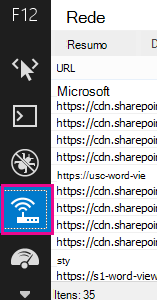
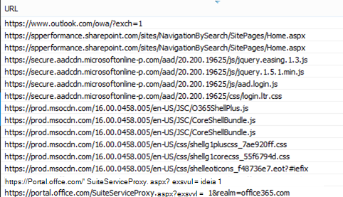
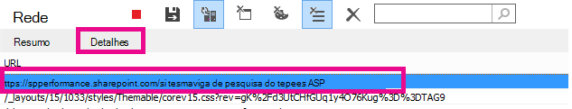
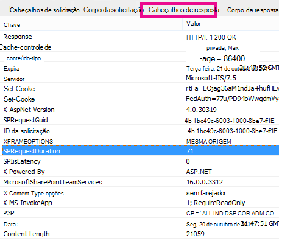

# Diagnosticando problemas de desempenho no SharePoint OnlineDiagnosing performance issues with SharePoint Online

Este artigo mostra como você pode diagnosticar problemas comuns com seu site do SharePoint Online usando as ferramentas de desenvolvedor do Internet Explorer.This article shows you how you can diagnose common issues with your SharePoint Online site using Internet Explorer developer tools.
  
Há três maneiras diferentes de identificar que uma página em um site do SharePoint Online tem um problema de desempenho com as personalizações.There are three different ways that you can identify that a page on a SharePoint Online site has a performance problem with the customizations.
  
- O monitor de rede da barra de ferramentas F12The F12 tool bar network monitor

- Comparação com uma linha de base não personalizadaComparison to a non-customized baseline

- Métricas do header de resposta do SharePoint OnlineSharePoint Online response header metrics

Este tópico descreve como usar cada um desses métodos para diagnosticar problemas de desempenho.This topic describes how to use each of these methods to diagnose performance issues. Depois de descobrir a causa do problema, você pode trabalhar em direção a uma solução usando os artigos sobre como melhorar o desempenho do SharePoint que você pode encontrar em https://aka.ms/tune .Once you've figured out the cause of the problem, you can work toward a solution using the articles about improving SharePoint performance that you can find on https://aka.ms/tune.
  
## Usando a barra de ferramentas F12 para diagnosticar o desempenho no SharePoint OnlineUsing the F12 tool bar to diagnose performance in SharePoint Online

Neste artigo, usamos o Internet Explorer 11.In this article we use Internet Explorer 11. As versões das ferramentas de desenvolvedor F12 em outros navegadores têm recursos semelhantes, embora possam parecer um pouco diferentes.Versions of the F12 developer tools on other browsers have similar features though they may look slightly different. Para obter informações sobre as ferramentas de desenvolvedor F12, consulte:For information on the F12 developer tools, see:
  
- [Novidades nas Ferramentas F12What's new in F12 Tools](https://go.microsoft.com/fwlink/p/?LinkId=522545)

- [Usando as ferramentas de desenvolvedor F12Using the F12 developer tools](https://go.microsoft.com/fwlink/p/?LinkId=522546)

Para abrir as ferramentas de desenvolvedor, pressione **F12** e clique no Wi-Fi ícone:To bring up the developer tools press **F12** and then click the Wi-Fi icon:
  

  
Na guia **Rede,** pressione o botão verde reproduzir para carregar uma página.On the **Network** tab, press the green play button to load a page. A ferramenta retorna todos os arquivos que o navegador solicita para obter a página que você solicitou.The tool returns all of the files that the browser requests in order to get the page you asked for. A captura de tela a seguir mostra uma lista desse tipo.The following screen shot shows one such list.
  

  
Você também pode ver os horários de download dos arquivos no lado direito, conforme mostrado nesta captura de tela.You can also see the download times of the files on the right side as shown in this screen shot.
  

  
Isso oferece uma representação visual de quanto tempo o arquivo levou para ser carregado.This gives you a visual representation of how long the file took to load. A linha verde representa quando a página está pronta para ser renderizada pelo navegador.The green line represents when the page is ready to be rendered by the browser. Isso pode lhe dar uma exibição rápida dos diferentes arquivos que podem estar causando carregamentos lentos de página no seu site.This can give you a quick view of the different files that might be causing slow page loads on your site.
  
## Configurando uma linha de base não personalizada para o SharePoint OnlineSetting up a non-customized baseline for SharePoint Online

A melhor maneira de determinar os pontos fracos de desempenho do seu site é configurar um conjunto de sites totalmente pronto para uso no SharePoint Online.The best way to determine your site's performance weak points is to set up a completely out-of-the-box site collection in SharePoint Online. Dessa forma, você pode comparar todos os vários aspectos do seu site com o que obteria sem personalização na página.This way you can compare all the various aspects of your site with what you would get with no customization on the page. A home page do OneDrive for Business é um bom exemplo de um conjunto de sites separado que provavelmente não tem personalizações.The OneDrive for Business home page is a good example of a separate site collection that is unlikely to have any customizations.
  
## Exibindo informações do header de resposta do SharePointViewing SharePoint response header information

No SharePoint Online, você pode acessar as informações que são enviadas de volta para o navegador no header de resposta para cada arquivo.In SharePoint Online, you can access the information that is sent back to the browser in the response header for each file. O valor mais útil para diagnosticar problemas de desempenho é **SPRequestDuration**, que exibe a quantidade de tempo que a solicitação levou no servidor para ser processada.The most useful value for diagnosing performance issues is **SPRequestDuration**, which displays the amount of time that the request took on the server to be processed. Isso pode ajudar a determinar se a solicitação é muito pesada e utiliza muitos recursos.This can help determine if the request is very heavy and resource intensive. Este é o melhor insight que você tem sobre quanto trabalho o servidor está fazendo para servir a página.This is the best insight you have into how much work the server is doing to serve the page.

### Para exibir informações do header de resposta do SharePointTo view SharePoint response header information
  
1. Verifique se você tem as ferramentas F12 instaladas.Ensure that you have the F12 tools installed. Para obter mais informações sobre como baixar e instalar essas ferramentas, consulte [Novidades nas ferramentas F12.](https://go.microsoft.com/fwlink/p/?LinkId=522545)For more information on downloading and installing these tools, see [What's new in F12 tools](https://go.microsoft.com/fwlink/p/?LinkId=522545).

2. Nas ferramentas F12, na **guia** Rede, pressione o botão verde reproduzir para carregar uma página.In the F12 tools, on the **Network** tab, press the green play button to load a page.

3. Clique em um dos arquivos .aspx retornados pela ferramenta e clique em **DETALHES.**Click one of the .aspx files returned by the tool and then click **DETAILS**.

    
  
4. Clique **em Headers de Resposta.**Click **Response headers**.

    
  
## O que está causando problemas de desempenho no SharePoint Online?What's causing performance issues in SharePoint Online?

O artigo Opções de navegação para [SharePoint Online](navigation-options-for-sharepoint-online.md) mostra um exemplo de uso do valor SPRequestDuration para determinar que a navegação estrutural complicada estava fazendo com que a página demorava muito para processar no servidor.The article [Navigation options for SharePoint Online](navigation-options-for-sharepoint-online.md) shows an example of using the SPRequestDuration value to determine that the complicated structural navigation was causing the page to take a long time to process on the server. Ao usar um valor para um site de linha de base (sem personalização), é possível determinar se um determinado arquivo está demorando muito para ser carregado.By taking a value for a baseline site (without customization), it is possible to determine if any given file is taking a long time to load. O exemplo usado nas [opções de navegação do SharePoint Online](navigation-options-for-sharepoint-online.md) é o arquivo .aspx principal.The example used in [Navigation options for SharePoint Online](navigation-options-for-sharepoint-online.md) is the main .aspx file. Esse arquivo contém a maior parte do ASP.NET que é executado para o carregamento da página.That file contains most of the ASP.NET code that runs for your page load. Dependendo do modelo de site usado, isso pode ser start.aspx, home.aspx, default.aspx ou outro nome se você personalizar a home page.Depending on the site template you use, this could be start.aspx, home.aspx, default.aspx, or another name if you customize the home page. Se esse número for consideravelmente maior que seu site de linha de base, então é uma boa indicação de que há algo complexo acontecendo em sua página que está causando problemas de desempenho.If this number is considerably higher than your baseline site, then it's a good indication that there is something complex going on in your page that is causing performance issues.
  
Depois de identificar um problema específico do seu site, a maneira recomendada de descobrir o que está causando um desempenho ruim é eliminar todas as causas possíveis, como personalizações de página, e, em seguida, adicioná-las novamente ao site uma a uma.Once you have identified that an issue specific to your site, the recommended way to figure out what is causing poor performance is to eliminate all of the possible causes, like page customizations, and then add them back to the site one by one. Depois de remover personalizações suficientes para que a página tenha um bom desempenho, você poderá adicionar personalizações específicas uma a uma.Once you have removed enough customizations that the page is performing well, you can then add back specific customizations one by one.
  
Por exemplo, se você tiver uma navegação muito complexa, tente alterar a navegação para não mostrar subs sites, verifique as ferramentas de desenvolvedor para ver se isso faz a diferença.For example, if you have a very complex navigation try changing the navigation to not show sub-sites then check the developer tools to see if this makes a difference. Ou, se você tiver uma grande quantidade de roll-ups de conteúdo, tente removê-los da sua página e veja se isso melhora tudo.Or if you have a large amount of content roll-ups try removing them from your page and see if this improves things. Se você eliminar todas as causas possíveis e adicioná-las novamente em uma de cada vez, poderá identificar facilmente quais recursos são o maior problema e, em seguida, trabalhar em direção a uma solução.If you eliminate all of the possible causes and add them back in one at a time, you can easily identify which features are the biggest problem and then work towards a solution.
