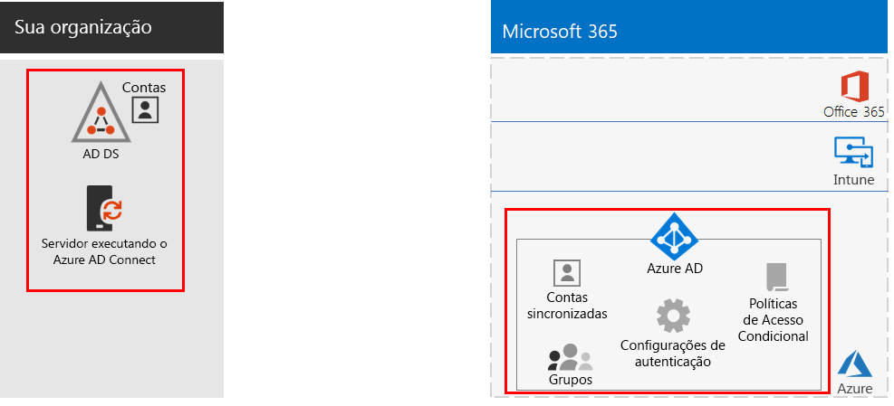
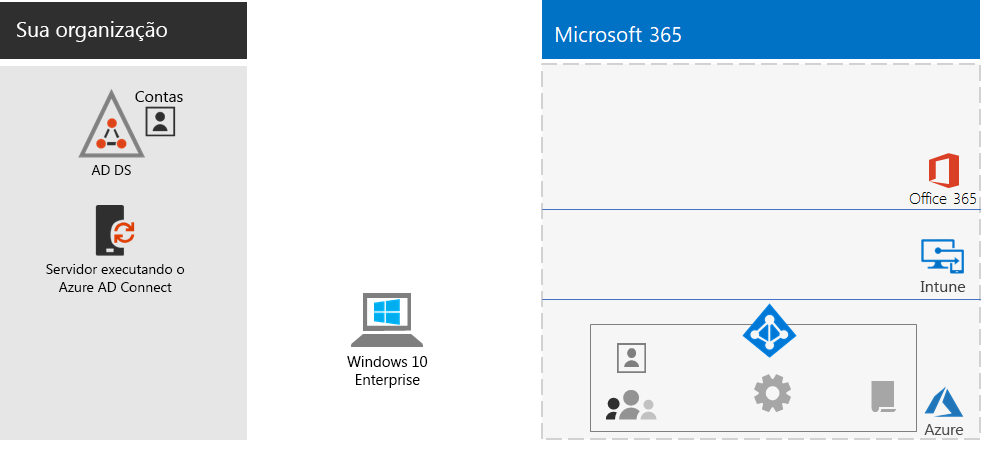
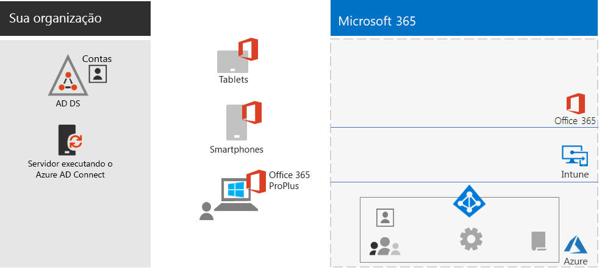
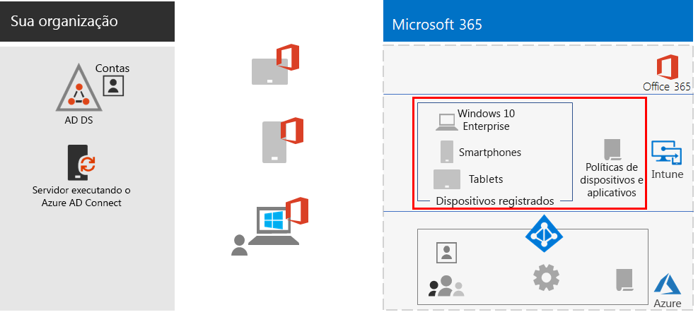
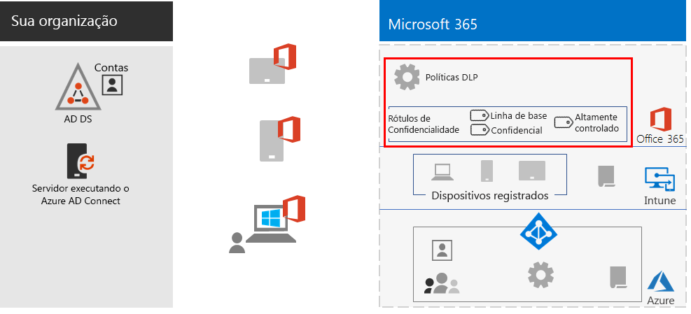
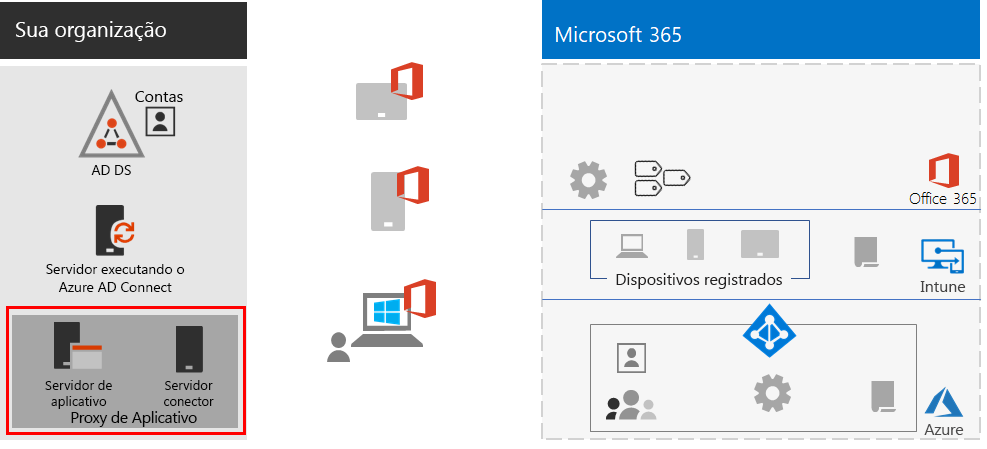
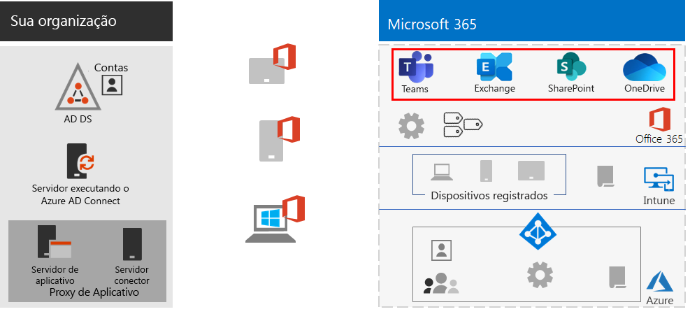
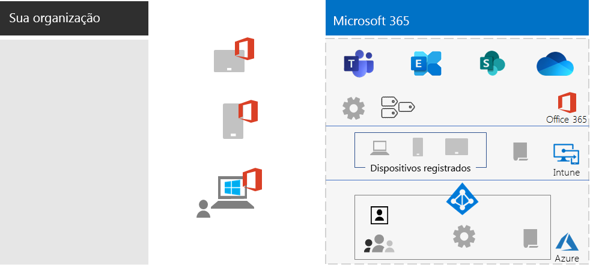

# Capacitar funcionários remotos

*Este cenário aplica-se às versões E3 e E5 do Microsoft 365 Enterprise*

Permitir aos funcionários trabalhar fora do escritório sem problemas e com segurança é algo muito importante para várias organizações, pois permite economizar espaço, contratar e manter funcionários que não desejem ser realocados e reduzir a deslocação dos funcionários, deixando-os mais produtivos e permitindo que eles realizem atividades de redução de estresse fora do trabalho.

O trabalho remoto, também conhecido como teletrabalho, pode abranger um espectro que inclui:

- Funcionários que estão ocasionalmente fora do escritório para conferências ou reuniões com clientes.
- Alguns funcionários que trabalham remotamente em tempo integral.
- Uma organização totalmente remota na qual não há nenhum escritório e todos os funcionários são remotos.

Para dar suporte a funcionários remotos, uma combinação de recursos no Microsoft 365 Enterprise permite aos funcionários remotos colaborar de forma ativa, como por exemplo:

- Reuniões online e sessões de chat.
- Espaços de trabalho compartilhados para armazenamento de arquivos na nuvem com acessibilidade global e colaboração em tempo real.
- Tarefas e fluxos de trabalho compartilhados para dividir o trabalho e realizar as tarefas.

Para segurança forte, o Microsoft 365 Enterprise inclui:

- Requisitos de autenticação imposta, detecção e resposta a entradas de alto risco e bloqueio de aplicativos selecionados e dispositivos que não estejam em conformidade.
- Conexões criptografadas e ativos digitais na nuvem.
- Permissões para definir quem pode fazer o que com os arquivos.
- Prevenção contra perda de dados (DLP) para evitar o vazamento de dados altamente regulamentados.

Para atender a esses critérios para funcionários remotos, use os seguintes recursos do Microsoft 365 Enterprise:

- Identidade do usuário e segurança de entrada
  - Contas de usuário do Azure Active Directory (Azure AD) com autenticação multifator (MFA)
  - Políticas de acesso condicional para exigir MFA para entradas potencialmente perigosas
- Plataformas de colaboração
  - Microsoft Teams, SharePoint e OneDrive, com os quais funcionários remotos podem agendar e participar de reuniões online e trabalhar nos mesmos documentos ao mesmo tempo
- Acesso protegido aos recursos
  - Grupos e permissões para o Teams, sites do SharePoint e o OneDrive, para que somente usuários autenticados e permitidos tenham acesso
- Proteção contra divulgação não autorizada de arquivos
  - Políticas DLP do Office 365
  - Rótulos de sensibilidade para criptografia e permissões que viajam com arquivos
- Gerenciamento e segurança de dispositivos com o Microsoft Intune
  - Registro de dispositivos gerenciados
  - Configurações de aplicativo para dispositivos pessoais
  - Políticas de dispositivos e aplicativos
- Aplicativos de produtividade para dispositivos
  - Aplicativos do Office 365 ProPlus para experiências colaborativas com o Teams, o SharePoint e o OneDrive 
- Windows 10 Enterprise
  - Recursos de segurança abrangentes para proteção contra ataques cibernéticos e prevenção de vazamento de dados
- Acesso a aplicativos locais
  - Organizações que tenham identidade híbrida podem usar o Proxy de Aplicativo do Azure AD em vez de conexões VPN (rede virtual privada)

As fases a seguir o ajudarão a implantar o recurso do Microsoft 365 Enterprise para permitir o acesso remoto e impulsionar a adoção de funcionários remotos. Se você já tiver implantado os elementos dessas fases, certifique-se de que eles atendam aos requisitos descritos antes de passar para o próximo elemento.

## Fase 1: implantar os recursos e as funcionalidades do Microsoft 365 para funcionários remotos

Devido a amplitude e a quantidade de recursos e capacidades necessárias para esse cenário, vamos guiá-lo pelos elementos necessários das seções de infraestrutura e cargas de trabalho do [Guia de Implantação do Microsoft 365 Enterprise](deploy-microsoft-365-enterprise.md).

### Etapa 1: fundamentos da infraestrutura para funcionários remotos

Nesta etapa, veremos as fases da [infraestrutura de base](deploy-foundation-infrastructure.md) e listamos os elementos necessários para habilitar funcionários remotos.

Para a [Fase 2: identidade](identity-infrastructure.md), implante o seguinte para identidade do usuário e segurança de entrada:

- Para identidade híbrida, contas de usuários e grupos sincronizados de Serviços de Domínio do Active Directory (AD DS) locais.
- Para atribuir permissões de grupos sincronizados ou do Azure AD com os membros apropriados.
- Configurações de autenticação, como exigir a MFA.
- As políticas de acesso condicional exigem a MFA para entradas potencialmente perigosas e bloqueiam clientes que não tenham suporte para autenticação moderna.

Esta é a configuração resultante com os elementos de identidade realçados.

 
Para a [Fase 3: Windows 10 Enterprise](windows10-infrastructure.md), implante:

- A infraestrutura para implantar novos dispositivos com Windows 10 Enterprise e atualizar seus dispositivos do Windows 7 ou Windows 8.1 para o Windows 10 Enterprise
- Habilitar recursos de segurança abrangentes de identidade, identificação de ameaças e proteção de informações

Esta é a configuração resultante com dispositivos do Windows 10 Enterprise.

 
Para a [Fase 4: Office 365 ProPlus](office365proplus-infrastructure.md), implante a infraestrutura para instalar o Office 365 ProPlus ou atualizar seu pacote do Office instalado no momento, como o Office 2010 ou o Office 2013, para o Office 365 ProPlus nos dispositivos da sua organização. Isso dará aos seus usuários a melhor segurança e experiências colaborativas.

Esta é a configuração que resulta da instalação do Office 365 ProPlus nos dispositivos.

 
Para a [Fase 5: gerenciamento de dispositivos móveis](mobility-infrastructure.md), implante o gerenciamento de dispositivos e aplicativos do Intune para:

- Registrar os dispositivos do Windows 10 Enterprise, iOS, macOS, Android e Android Enterprise para que eles recebam recursos e configurações de segurança definidos pela sua organização.
- Configurações de aplicativos para segurança extra e com capacidade de permitir ou bloquear aplicativos, mesmo em dispositivos pessoais de propriedade dos funcionários.
- Políticas de conformidade com Acesso Condicional para impedir que dispositivos que não estejam em conformidade se conectem.

Esta é a configuração resultante com as políticas e dispositivos registrados do Intune realçados.

 
Para a [Fase 6: proteção de informações](infoprotect-infrastructure.md), crie e configure a proteção para seus ativos digitais com:

- Políticas DLP do Office 365.
- Rótulos de sensibilidade do Office 365 para criptografia e permissões que acompanham os arquivos.

Esta é a configuração resultante com políticas DLP e rótulos de confidencialidade realçados.

 
Para acessar os aplicativos locais, você pode usar o [Proxy de Aplicativo do Azure AD](https://docs.microsoft.com/azure/active-directory/manage-apps/application-proxy), que requer um ambiente de identidade híbrido.

Esta é a configuração resultante com os componentes de proxy de aplicativo realçados.

 
### Etapa 2: cargas de trabalho para funcionários remotos

Para [Exchange Online](exchangeonline-workload.md), implante as caixas de correio do Exchange Online para cada um dos seus usuários.

Para o [Teams](teams-workload.md), implante o Teams para seus usuários e grupos.

Para o [SharePoint e o OneDrive](sharepoint-online-onedrive-workload.md), implante sites de comunicação ou de equipe do SharePoint e pastas do OneDrive.

Esta é a configuração resultante com as cargas de trabalho realçadas.

 
### Resultados da implantação

Depois de implantar a infraestrutura de fundação e cargas de trabalho e distribuir o Windows 10 Enterprise e o Office 365 ProPlus, os funcionários remotos:

- Ficam sujeitos a autenticação forte e a proteção de identidade.
- Recebem a versão mais recente e mais segura do Windows em seus dispositivos Windows.
- Recebem a versão mais recente e mais produtiva do pacote Office em seus dispositivos.
- Ficam sujeitos a políticas de conformidade de dispositivos e gerenciamento de aplicativos.
- Ficam sujeitos a restrições e políticas DLP.
- Podem atribuir rótulos de confidencialidade para criptografia e permissões que viajam com arquivos e email.
- Podem acessar aplicativos locais sem uma conexão VPN.
- Podem executar seu próprio trabalho e participar de colaboração em tempo real com colegas de trabalho por meio de chats, reuniões e arquivos no Teams, SharePoint e OneDrive.

Quando estiver offline (não conectado à Internet), seus funcionários remotos podem alterar cópias locais de arquivos. Ao se reconectar à Internet, o OneDrive sincroniza cópias locais com os arquivos armazenados na sua assinatura do Microsoft 365. 

Esta é a configuração resultante para funcionários remotos da sua organização se você usar a identidade híbrida.

 
 
Esta é a configuração resultante para funcionários remotos sua organização, caso você use a identidade somente na nuvem.

## Fase 2: orientar a adoção do usuário para funcionários remotos

Agora que a infraestrutura de fundação e as cargas de trabalho estão em vigor, é hora de direcionar o uso contínuo desses recursos para seus funcionários remotos, para que eles possam ser produtivos em qualquer lugar e a qualquer momento.

### Etapa 1: treinar os usuários

Treinar seus funcionários remotos em:

- Procedimentos de entrada apropriados, incluindo o registro da MFA, e como as entradas podem ser desafiadas quando o risco é detectado.
- O uso dos dispositivos e como as políticas podem ser usadas para bloquear o acesso a dispositivos que não estejam em conformidade.
- O uso de aplicativos permitidos e como as políticas do aplicativo Intune podem ser usadas para bloquear aplicativos.
- Recursos de segurança do Windows 10 Enterprise.
- Como usar o Outlook para email e calendário.
- Como usar o [Teams](https://docs.microsoft.com/microsoftteams/training-microsoft-teams-landing-page) para chat, conferências baseadas em vídeo, compartilhamento de documentos e conversas encadeadas.
- Como usar sites da equipe ou comunicações do SharePoint e pastas do OneDrive para procurar arquivos na biblioteca de um usuário e os que pertencem a um grupo.
- Como usar e aplicar rótulos de sensibilidade para arquivos que contenham dados confidenciais ou altamente regulados, para versões locais e online dos arquivos.

Este treinamento deve incluir exercícios práticos para que os usuários possam experimentar esses recursos e os resultados.

### Etapa 2: realizar revisões periódicas de uso e de agir sobre comentários dos funcionários

Nas semanas após o treinamento:

- Aja rapidamente sobre os comentários de trabalhadores remotos e ajuste políticas e configurações.
- Analise o uso de equipes, sites do SharePoint e pastas do OneDrive e compare-o a expectativas de uso.
- Verifique se os arquivos confidenciais ou altamente regulamentados foram corretamente rotulados com o rótulo de sensibilidade apropriado.

Repita o treinamento dos usuários conforme necessário.

### Resultados de adoção do usuário

Seus funcionários remotos podem usar o Windows 10 Enterprise ou outros dispositivos e o Office 365 ProPlus para acessar e trabalhar em serviços compartilhados e recursos de nuvem do Microsoft 365 Enterprise em um ambiente seguro, para participar de reuniões, criar e colaborar em tempo real.

## Confira também

[Cargas de trabalho e cenários](deploy-workloads.md)

[Biblioteca de produtividade do Microsoft 365](https://aka.ms/productivitylibrary) (https://aka.ms/productivitylibrary)

[Guia de implantação](deploy-microsoft-365-enterprise.md)
