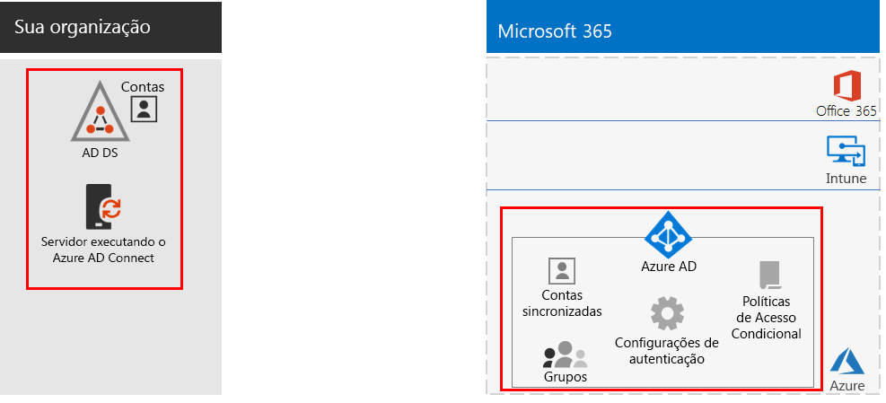
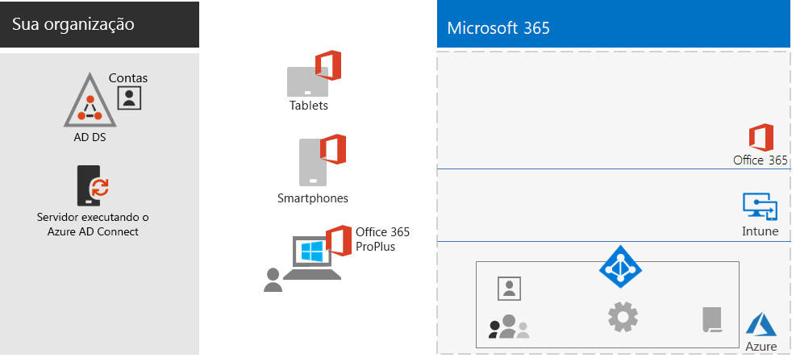
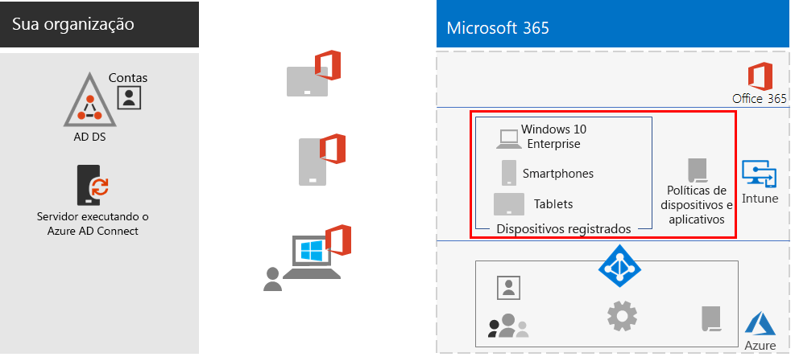
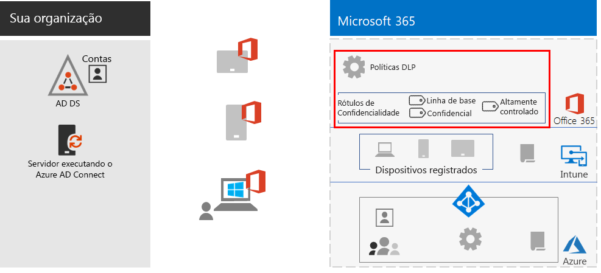
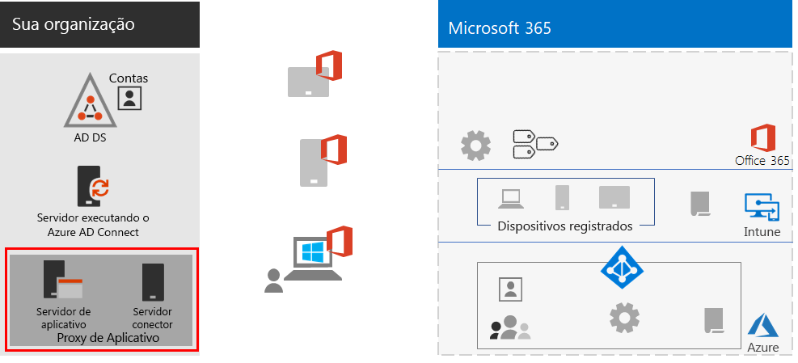
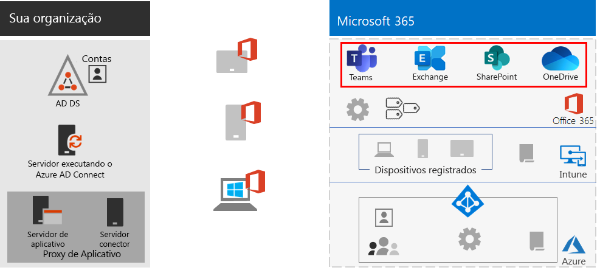
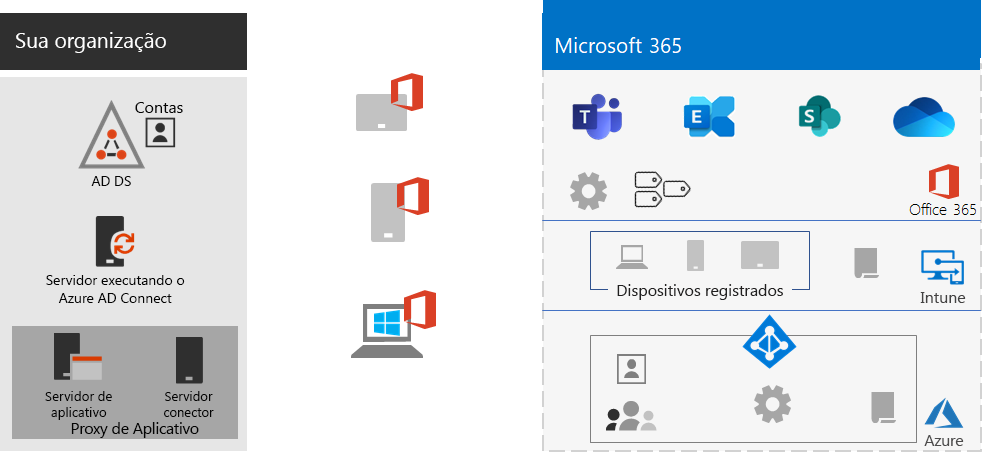
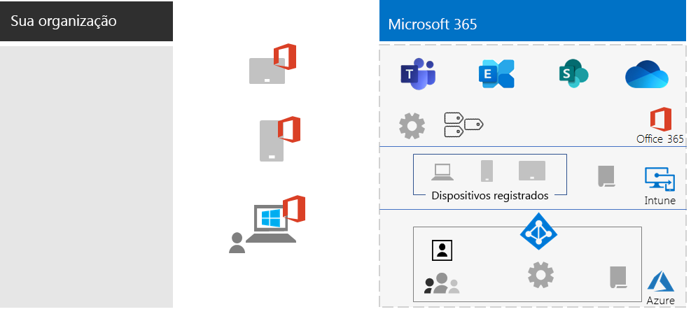

# Capacitar funcionários remotosEmpower remote workers

*Este cenário aplica-se às versões E3 e E5 do Microsoft 365 Enterprise**This scenario applies to both the E3 and E5 versions of Microsoft 365 Enterprise*

Permitir aos funcionários trabalhar fora do escritório sem problemas e com segurança é algo muito importante para várias organizações, pois permite economizar espaço, contratar e manter funcionários que não desejem ser realocados e reduzir a deslocação dos funcionários, deixando-os mais produtivos e permitindo que eles realizem atividades de redução de estresse fora do trabalho.Allowing employees to work away from the office seamlessly and securely is important for many organizations to save on office space, hire and retain employees who are unwilling to relocate, and reduce employee commuting, leaving them with more time to be productive and for stress-reducing activities outside of work.

O trabalho remoto, também conhecido como teletrabalho, pode abranger um espectro que inclui:Remote working, also known as teleworking, can span a spectrum that includes:

- Funcionários que estão ocasionalmente fora do escritório para conferências ou reuniões com clientes.Employees that are occasionally away from the office for conferences or client meetings.
- Alguns funcionários que trabalham remotamente em tempo integral.Some employees that work remotely full-time.
- Uma organização totalmente remota na qual não há nenhum escritório e todos os funcionários são remotos.A fully remote organization in which there is no office and all employees are remote.

Para dar suporte a funcionários remotos, uma combinação de recursos no Microsoft 365 Enterprise permite aos funcionários remotos colaborar de forma ativa, como por exemplo:To support remote workers, a combination of features in Microsoft 365 Enterprise enables your remote workers in a highly collaborative way, such as:

- Reuniões online e sessões de chat.Online meetings and chat sessions.
- Espaços de trabalho compartilhados para armazenamento de arquivos na nuvem com acessibilidade global e colaboração em tempo real.Shared workspaces for cloud-based file storage with global accessibility and real-time collaboration.
- Tarefas e fluxos de trabalho compartilhados para dividir o trabalho e realizar as tarefas.Shared tasks and workflows to divide up the work and get things done.

Para segurança forte, o Microsoft 365 Enterprise inclui:For strong security, Microsoft 365 Enterprise includes:

- Requisitos de autenticação imposta, detecção e resposta a entradas de alto risco e bloqueio de aplicativos selecionados e dispositivos que não estejam em conformidade.Enforced authentication requirements, detecting and responding to high-risk sign-ins, and blocking selected apps and non-compliant devices.
- Conexões criptografadas e ativos digitais na nuvem.Encrypted connections and digital assets in the cloud.
- Permissões para definir quem pode fazer o que com os arquivos.Permissions to define who can do what with files.
- Prevenção contra perda de dados (DLP) para evitar o vazamento de dados altamente regulamentados.Data loss prevention (DLP) to prevent leakage of highly regulated data.

Para atender a esses critérios para funcionários remotos, use os seguintes recursos do Microsoft 365 Enterprise:To meet these criteria for remote workers, use the following Microsoft 365 Enterprise features:

- Identidade do usuário e segurança de entradaUser identity and sign-in security
  - Contas de usuário do Azure Active Directory (Azure AD) com autenticação multifator (MFA)Azure Active Directory (Azure AD) user accounts with multi-factor authentication (MFA)
  - Políticas de acesso condicional para exigir MFA para entradas potencialmente perigosasConditional Access policies to require MFA for risky sign-ins
- Plataformas de colaboraçãoCollaboration platforms
  - Microsoft Teams, SharePoint e OneDrive, com os quais funcionários remotos podem agendar e participar de reuniões online e trabalhar nos mesmos documentos ao mesmo tempoMicrosoft Teams, SharePoint, and OneDrive, with which remote workers can schedule and attend online video-based meetings and work on the same documents at the same time
- Acesso protegido aos recursosSecure access to resources
  - Grupos e permissões para o Teams, sites do SharePoint e o OneDrive, para que somente usuários autenticados e permitidos tenham acessoGroups and permissions for Teams, SharePoint sites, and OneDrive so that only authenticated and permitted users have access
- Proteção contra divulgação não autorizada de arquivosProtection for leaked files
  - Políticas DLP do Office 365Office 365 DLP policies
  - Rótulos de sensibilidade para criptografia e permissões que viajam com arquivosSensitivity labels for encryption and permissions that travel with files
- Gerenciamento e segurança de dispositivos com o Microsoft IntuneDevice management and security with Microsoft Intune
  - Registro de dispositivos gerenciadosEnrollment for managed devices
  - Configurações de aplicativo para dispositivos pessoaisApp settings for personal devices
  - Políticas de dispositivos e aplicativosDevice and app policies
- Aplicativos de produtividade para dispositivosProductivity apps for devices
  - Aplicativos do Office 365 ProPlus para experiências colaborativas com o Teams, o SharePoint e o OneDriveOffice 365 ProPlus apps for collaborative experiences with Teams, SharePoint, and OneDrive 
- Windows 10 EnterpriseWindows 10 Enterprise
  - Recursos de segurança abrangentes para proteção contra ataques cibernéticos e prevenção de vazamento de dadosComprehensive security features to protect against cyberattacks and prevent data leakage
- Acesso a aplicativos locaisAccess to on-premises apps
  - Organizações que tenham identidade híbrida podem usar o Proxy de Aplicativo do Azure AD em vez de conexões VPN (rede virtual privada)Organizations that have hybrid identity can use Azure AD Application Proxy instead of virtual private network (VPN) connections

As fases a seguir o ajudarão a implantar o recurso do Microsoft 365 Enterprise para permitir o acesso remoto e impulsionar a adoção de funcionários remotos.The following phases step you through deploying the feature of Microsoft 365 Enterprise for remote access and driving adoption for remote workers. Se você já tiver implantado os elementos dessas fases, certifique-se de que eles atendam aos requisitos descritos antes de passar para o próximo elemento.If you have already deployed elements of these phases, ensure that they meet the stated requirements before moving on to the next element.

Para ver um resumo de uma página desse cenário, consulte o pôster [Capacitar funcionários remotos](../media/empower-people-to-work-remotely/empower-remote-workers-scenario.pdf).For a 1-page summary of this scenario, see the [Empower remote workers poster](../media/empower-people-to-work-remotely/empower-remote-workers-scenario.pdf).

Você também pode baixar este pôster nos formatos [PDF](https://github.com/MicrosoftDocs/microsoft-365-docs/raw/public/microsoft-365/media/empower-people-to-work-remotely/empower-remote-workers-scenario.pdf) ou [PowerPoint](https://github.com/MicrosoftDocs/microsoft-365-docs/raw/public/microsoft-365/media/empower-people-to-work-remotely/Empower-Remote-Workers-Poster.pptx) e imprimir em papel carta, oficial ou tabloide (11 x 17).You can also download this poster in [PDF](https://github.com/MicrosoftDocs/microsoft-365-docs/raw/public/microsoft-365/media/empower-people-to-work-remotely/empower-remote-workers-scenario.pdf) or [PowerPoint](https://github.com/MicrosoftDocs/microsoft-365-docs/raw/public/microsoft-365/media/empower-people-to-work-remotely/Empower-Remote-Workers-Poster.pptx) formats and print it on letter, legal, or tabloid (11 x 17)-sized paper.

## Fase 1: implantar os recursos e as funcionalidades do Microsoft 365 para funcionários remotosPhase 1: Deploy Microsoft 365 features and capabilities for remote workers

Devido a amplitude e a quantidade de recursos e capacidades necessárias para esse cenário, vamos guiá-lo pelos elementos necessários das seções de infraestrutura e cargas de trabalho do [Guia de Implantação do Microsoft 365 Enterprise](deploy-microsoft-365-enterprise.md).Because of the breadth and number of features and capabilities required for this scenario, we’ll step you through the required elements of the foundation infrastructure and workloads sections of the [Microsoft 365 Enterprise Deployment Guide](deploy-microsoft-365-enterprise.md).

### Etapa 1: fundamentos da infraestrutura para funcionários remotosStep 1: Foundation infrastructure requirements for remote workers

Nesta etapa, veremos as fases da [infraestrutura de base](deploy-foundation-infrastructure.md) e listamos os elementos necessários para habilitar funcionários remotos.In this step, we’ll visit the phases of the [foundation infrastructure](deploy-foundation-infrastructure.md) and list the required elements to enable remote workers.

Para a [Fase 2: identidade](identity-infrastructure.md), implante o seguinte para identidade do usuário e segurança de entrada:For [Phase 2: Identity](identity-infrastructure.md), deploy the following for user identity and sign-in security:

- Para identidade híbrida, contas de usuários e grupos sincronizados de Serviços de Domínio do Active Directory (AD DS) locais.For hybrid identity, user accounts and groups synchronized from on-premises Active Directory Domain Services (AD DS).
- Para atribuir permissões de grupos sincronizados ou do Azure AD com os membros apropriados.For assigning permissions, synchronized or Azure AD groups with the appropriate members.
- Configurações de autenticação, como exigir a MFA.Authentication settings, such as requiring MFA.
- As políticas de acesso condicional exigem a MFA para entradas potencialmente perigosas e bloqueiam clientes que não tenham suporte para autenticação moderna.Conditional Access policies to require MFA for risky sign-ins and block clients that don’t support modern authentication.

Esta é a configuração resultante com os elementos de identidade realçados.Here's the resulting configuration with the identity elements highlighted.

 
Para a [Fase 3: Windows 10 Enterprise](windows10-infrastructure.md), implante:For [Phase 3: Windows 10 Enterprise](windows10-infrastructure.md), deploy:

- A infraestrutura para implantar novos dispositivos com Windows 10 Enterprise e atualizar seus dispositivos do Windows 7 ou Windows 8.1 para o Windows 10 EnterpriseThe infrastructure to deploy new devices with Windows 10 Enterprise and to upgrade of your Windows 7 or Windows 8.1 devices to Windows 10 Enterprise
- Habilitar recursos de segurança abrangentes de identidade, identificação de ameaças e proteção de informaçõesEnabling comprehensive security features for identity, threat, and information protection

Esta é a configuração resultante com dispositivos do Windows 10 Enterprise.Here's the resulting configuration with Windows 10 Enterprise devices.

 
Para a [Fase 4: Office 365 ProPlus](office365proplus-infrastructure.md), implante a infraestrutura para instalar o Office 365 ProPlus ou atualizar seu pacote do Office instalado no momento, como o Office 2010 ou o Office 2013, para o Office 365 ProPlus nos dispositivos da sua organização.For [Phase 4: Office 365 ProPlus](office365proplus-infrastructure.md), deploy the infrastructure to install Office 365 ProPlus or upgrade your currently installed Office suite, such as Office 2010 or Office 2013, to Office 365 ProPlus on your organization devices. Isso dará aos seus usuários a melhor segurança e experiências colaborativas.This will give your users the best security and collaborative experiences.

Esta é a configuração que resulta da instalação do Office 365 ProPlus nos dispositivos.Here's the resulting configuration with Office 365 ProPlus installed on devices.

 
Para a [Fase 5: gerenciamento de dispositivos móveis](mobility-infrastructure.md), implante o gerenciamento de dispositivos e aplicativos do Intune para:For [Phase 5: Mobile device management](mobility-infrastructure.md), deploy Intune device and app management for:

- Registrar os dispositivos do Windows 10 Enterprise, iOS, macOS, Android e Android Enterprise para que eles recebam recursos e configurações de segurança definidos pela sua organização.Enrollment of your Windows 10 Enterprise, iOS, macOS, Android, and Android Enterprise devices so they receive features and security settings defined by your organization.
- Configurações de aplicativos para segurança extra e com capacidade de permitir ou bloquear aplicativos, mesmo em dispositivos pessoais de propriedade dos funcionários.App settings for extra security and to allow or block apps, even on employee-owned personal devices.
- Políticas de conformidade com Acesso Condicional para impedir que dispositivos que não estejam em conformidade se conectem.Compliance policies with Conditional Access to prevent non-compliant devices from connecting.

Esta é a configuração resultante com as políticas e dispositivos registrados do Intune realçados.Here's the resulting configuration with Intune enrolled devices and policies highlighted.

 
Para a [Fase 6: proteção de informações](infoprotect-infrastructure.md), crie e configure a proteção para seus ativos digitais com:For [Phase 6: Information protection](infoprotect-infrastructure.md), design and configure protection for your digital assets with:

- Políticas DLP do Office 365.Office 365 DLP policies.
- Rótulos de sensibilidade do Office 365 para criptografia e permissões que acompanham os arquivos.Office 365 sensitivity labels for encryption and permissions that travel with files.

Esta é a configuração resultante com políticas DLP e rótulos de confidencialidade realçados.Here's the resulting configuration with DLP policies and sensitivity labels highlighted.

 
Para acessar os aplicativos locais, você pode usar o [Proxy de Aplicativo do Azure AD](https://docs.microsoft.com/azure/active-directory/manage-apps/application-proxy), que requer um ambiente de identidade híbrido.For access to on-premises apps, you can use [Azure AD Application Proxy](https://docs.microsoft.com/azure/active-directory/manage-apps/application-proxy), which requires a hybrid identity environment.

Esta é a configuração resultante com os componentes de proxy de aplicativo realçados.Here's the resulting configuration with the application proxy components highlighted.

 
### Etapa 2: cargas de trabalho para funcionários remotosStep 2: Workloads for remote workers

Para [Exchange Online](exchangeonline-workload.md), implante as caixas de correio do Exchange Online para cada um dos seus usuários.For [Exchange Online](exchangeonline-workload.md), deploy Exchange Online mailboxes to each of your users.

Para o [Teams](teams-workload.md), implante o Teams para seus usuários e grupos.For [Teams](teams-workload.md), deploy Teams to your users and groups.

Para o [SharePoint e o OneDrive](sharepoint-online-onedrive-workload.md), implante sites de comunicação ou de equipe do SharePoint e pastas do OneDrive.For [SharePoint and OneDrive](sharepoint-online-onedrive-workload.md), deploy SharePoint team or communication sites and OneDrive folders.

Esta é a configuração resultante com as cargas de trabalho realçadas.Here's the resulting configuration with the workloads highlighted.

 
### Resultados da implantaçãoDeployment results

Depois de implantar a infraestrutura de fundação e cargas de trabalho e distribuir o Windows 10 Enterprise e o Office 365 ProPlus, os funcionários remotos:After deploying the foundation infrastructure and workloads and rolling out Windows 10 Enterprise and Office 365 ProPlus, remote workers:

- Ficam sujeitos a autenticação forte e a proteção de identidade.Are subject to strong authentication and identity protection.
- Recebem a versão mais recente e mais segura do Windows em seus dispositivos Windows.Have the latest and most secure version of Windows on their Windows devices.
- Recebem a versão mais recente e mais produtiva do pacote Office em seus dispositivos.Have the latest and most productive version of the Office suite on their devices.
- Ficam sujeitos a políticas de conformidade de dispositivos e gerenciamento de aplicativos.Are subject to app management and device compliance policies.
- Ficam sujeitos a restrições e políticas DLP.Are subject to DLP policies and restrictions.
- Podem atribuir rótulos de confidencialidade para criptografia e permissões que viajam com arquivos e email.Can assign sensitivity labels for encryption and permissions that travel with files and email.
- Podem acessar aplicativos locais sem uma conexão VPN.Can access on-premises apps without a VPN connection.
- Podem executar seu próprio trabalho e participar de colaboração em tempo real com colegas de trabalho por meio de chats, reuniões e arquivos no Teams, SharePoint e OneDrive.Can perform their own work and participate in real-time collaboration with co-workers with chats, meetings, and files in Teams and files in SharePoint and OneDrive.

Quando estiver offline (não conectado à Internet), seus funcionários remotos podem alterar cópias locais de arquivos.When offline (not connected to the Internet), your remote workers can change local copies of files. Ao se reconectar à Internet, o OneDrive sincroniza cópias locais com os arquivos armazenados na sua assinatura do Microsoft 365.When they reconnect to the Internet, OneDrive synchronizes local copies with the files stored in your Microsoft 365 subscription. 

Esta é a configuração resultante para funcionários remotos da sua organização se você usar a identidade híbrida.Here's the resulting configuration for remote workers of your organization if you use hybrid identity.

 
 
Esta é a configuração resultante para funcionários remotos sua organização, caso você use a identidade somente na nuvem.Here's the resulting configuration for remote workers your organization if you use cloud-only identity.

## Fase 2: orientar a adoção do usuário para funcionários remotosPhase 2: Drive user adoption for remote workers

Agora que a infraestrutura de fundação e as cargas de trabalho estão em vigor, é hora de direcionar o uso contínuo desses recursos para seus funcionários remotos, para que eles possam ser produtivos em qualquer lugar e a qualquer momento.Now that the foundation infrastructure and workloads are in place, it’s time to drive the ongoing usage of these capabilities to your remote workers so they can be productive anywhere and at any time.

### Etapa 1: treinar os usuáriosStep 1: Train your users

Treinar seus funcionários remotos em:Train your remote workers on:

- Procedimentos de entrada apropriados, incluindo o registro da MFA, e como as entradas podem ser desafiadas quando o risco é detectado.Proper sign-in procedures, including MFA registration, and how sign ins can be challenged when risk is detected.
- O uso dos dispositivos e como as políticas podem ser usadas para bloquear o acesso a dispositivos que não estejam em conformidade.The use of devices and how policies can be used to block access for non-compliant devices.
- O uso de aplicativos permitidos e como as políticas do aplicativo Intune podem ser usadas para bloquear aplicativos.The use of allowed apps and how Intune app polices can be used to block apps.
- Recursos de segurança do Windows 10 Enterprise.Windows 10 Enterprise security features.
- Como usar o Outlook para email e calendário.How to use Outlook for email and calendaring.
- Como usar o [Teams](https://docs.microsoft.com/microsoftteams/training-microsoft-teams-landing-page) para chat, conferências baseadas em vídeo, compartilhamento de documentos e conversas encadeadas.How to use [Teams](https://docs.microsoft.com/microsoftteams/training-microsoft-teams-landing-page) for chat, video-based conferencing, document sharing, and threaded conversations.
- Como usar sites da equipe ou comunicações do SharePoint e pastas do OneDrive para procurar arquivos na biblioteca de um usuário e os que pertencem a um grupo.How to use SharePoint team or communication sites and OneDrive folders to browse files in a user's library and those belonging to a group.
- Como usar e aplicar rótulos de sensibilidade para arquivos que contenham dados confidenciais ou altamente regulados, para versões locais e online dos arquivos.How to use and apply sensitivity labels for files containing sensitive or highly regulated data, for both local and online versions of files.

Este treinamento deve incluir exercícios práticos para que os usuários possam experimentar esses recursos e os resultados.This training should include hands-on exercises so that your students can experience these capabilities and their results.

### Etapa 2: realizar revisões periódicas de uso e de agir sobre comentários dos funcionáriosStep 2: Conduct periodic reviews of usage and address worker feedback

Nas semanas após o treinamento:In the weeks after training:

- Aja rapidamente sobre os comentários de trabalhadores remotos e ajuste políticas e configurações.Quickly address remote worker feedback and fine tune polices and configurations.
- Analise o uso de equipes, sites do SharePoint e pastas do OneDrive e compare-o a expectativas de uso.Analyze usage for teams, SharePoint sites, and OneDrive folders and compare it with usage expectations.
- Verifique se os arquivos confidenciais ou altamente regulamentados foram corretamente rotulados com o rótulo de sensibilidade apropriado.Verify that sensitive or highly regulated files have been properly labeled with the appropriate sensitivity label.

Repita o treinamento dos usuários conforme necessário.Retrain your users as needed.

### Resultados de adoção do usuárioUser adoption results

Seus funcionários remotos podem usar o Windows 10 Enterprise ou outros dispositivos e o Office 365 ProPlus para acessar e trabalhar em serviços compartilhados e recursos de nuvem do Microsoft 365 Enterprise em um ambiente seguro, para participar de reuniões, criar e colaborar em tempo real.Your remote workers can use their Windows 10 Enterprise or other devices and Office 365 ProPlus to access and work on shared Microsoft 365 Enterprise cloud services and resources in a secure environment, and they’re meeting, creating, and collaborating in real time.

## Confira tambémSee also

[Cargas de trabalho e cenáriosWorkloads and scenarios](deploy-workloads.md)

[Biblioteca de produtividade do Microsoft 365](https://aka.ms/productivitylibrary) (https://aka.ms/productivitylibrary)[Microsoft 365 Productivity Library](https://aka.ms/productivitylibrary) (https://aka.ms/productivitylibrary)

[Guia de implantaçãoDeployment guide](deploy-microsoft-365-enterprise.md)
