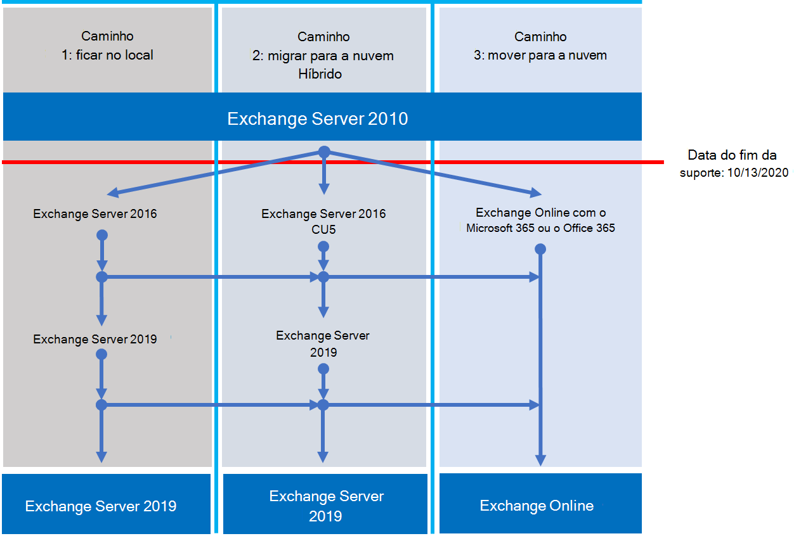

# Roteiro do encerramento de suporte do Exchange 2010Exchange 2010 end of support roadmap

*Esse artigo se aplica ao Microsoft 365 Enterprise e ao Office 365 Enterprise.**This article applies to both Microsoft 365 Enterprise and Office 365 Enterprise.*

Em **13 de outubro de 2020**, o Exchange Server 2010 atingirá o fim do suporte.On **October 13, 2020**, Exchange Server 2010 will reach end of support. Se você ainda não começou sua migração do Exchange 2010 para a Microsoft 365, Office 365 ou Exchange 2016, agora é hora de iniciar o planejamento.If you haven't already begun your migration from Exchange 2010 to Microsoft 365, Office 365, or Exchange 2016, now's the time to start your planning.

## O que significa o fim do suporte?What does end of support mean?

O Exchange Server, como quase todos os produtos da Microsoft, tem um ciclo de vida de suporte durante o qual fornecemos novos recursos, correções de erros, correções de segurança e assim por diante.Exchange Server, like almost all Microsoft products, has a support lifecycle during which we provide new features, bug fixes, security fixes, and so on. Esse ciclo de vida normalmente dura 10 anos a partir da data da versão inicial do produto, e o final desse ciclo de vida é conhecido como o fim do suporte do produto.This lifecycle typically lasts for 10 years from the date of the product's initial release, and the end of this lifecycle is known as the product's end of support.
Quando o Exchange 2010 atingir o fim do suporte em 13 de outubro de 2020, a Microsoft não fornecerá mais:When Exchange 2010 reaches its end of support on October 13, 2020, Microsoft will no longer provide:

- Suporte técnico para problemas que podem ocorrer;Technical support for problems that may occur;
- Correções de erros descobertas e que podem afetar a estabilidade e a usabilidade do servidor;Bug fixes for issues that are discovered and that may impact the stability and usability of the server;
- Correções de segurança para vulnerabilidades descobertas e que podem tornar o servidor vulnerável a falhas de segurança;Security fixes for vulnerabilities that are discovered and that may make the server vulnerable to security breaches;
- Atualizações de fuso horário.Time zone updates.

A instalação do Exchange 2010 continuará a ser executada após essa data.Your installation of Exchange 2010 will continue to run after this date. No entanto, devido às alterações listadas acima, é altamente recomendável migrar do Exchange 2010 o mais rápido possível.However, because of the changes listed above, we strongly recommend that you migrate from Exchange 2010 as soon as possible.

Para obter mais informações sobre os servidores do Office 2010 próximos ao fim do suporte, confira [recursos para ajudá-lo a atualizar de clientes e servidores do office 2010](upgrade-from-office-2010-servers-and-products.md).For more information about Office 2010 servers nearing the end of support, see [Resources to help you upgrade from Office 2010 servers and clients](upgrade-from-office-2010-servers-and-products.md).

## Quais são as minhas opções?What are my options?

Com o Exchange 2010 alcançando o fim do suporte, esse é um excelente momento para explorar suas opções e preparar um plano de migração.With Exchange 2010 reaching its end of support, this is a great time to explore your options and prepare a migration plan. Você pode:You can:

- Migre totalmente para a Microsoft 365.Migrate fully to Microsoft 365. Migrar caixas de correio usando substituição, uma migração híbrida mínima ou completa e, em seguida, remover os servidores do Exchange locais e o Active Directory.Migrate mailboxes using cutover, minimal hybrid, or full hybrid migration, then remove on-premises Exchange servers and Active Directory.
- Migre seus servidores Exchange 2010 para o Exchange 2016 em seus servidores locais.Migrate your Exchange 2010 servers to Exchange 2016 on your on-premises servers.

> [!IMPORTANT]
> Se sua organização optar por migrar as caixas de correio para a Microsoft 365, mas pretende manter o DirSync ou o Azure AD Connect in-loco para continuar Gerenciando contas de usuário do Active Directory local, você precisará manter pelo menos um servidor Exchange local.If your organization chooses to migrate mailboxes to Microsoft 365 but intends to keep DirSync or Azure AD Connect in place to continue managing user accounts from on-premises Active Directory, you need to keep at least one Exchange server on-premises. Se o último servidor do Exchange for removido, você não poderá fazer alterações nos destinatários do Exchange no Exchange Online.If the last Exchange server is removed, you won't be able to make changes to Exchange recipients in Exchange Online. Isso ocorre porque a fonte de autoridade permanece no Active Directory local e as alterações precisam ser feitas ali.This is because the source of authority remains in your on-premises Active Directory and changes need to be made there. Neste cenário, você tem as seguintes opções:In this scenario, you have the following options:

- (**Recomendado**) Se você puder migrar suas caixas de correio para o Microsoft 365 e atualizar seus servidores em 13 de outubro de 2020, use o Exchange 2010 para se conectar ao Microsoft 365 e migrar caixas de correio.(**Recommended**) If you can migrate your mailboxes to Microsoft 365 and upgrade your servers by October 13, 2020, use Exchange 2010 to connect to Microsoft 365 and migrate mailboxes. Em seguida, migre o Exchange 2010 para o Exchange 2016 e encerre os servidores do Exchange 2010 restantes.Next, migrate Exchange 2010 to Exchange 2016 and decommission any remaining Exchange 2010 servers.
- Se você não conseguir concluir a migração de caixa de correio e a atualização do servidor local em 13 de outubro de 2020, atualize seus servidores locais do Exchange 2010 para o Exchange 2016 primeiro e, em seguida, use o Exchange 2016 para se conectar ao Microsoft 365 e migrar caixas de correio.If you can't complete the mailbox migration and on-premises server upgrade by October 13, 2020, upgrade your on-premises Exchange 2010 servers to Exchange 2016 first, then use Exchange 2016 to connect to Microsoft 365 and migrate mailboxes.

> [!NOTE]
> Embora um pouco mais complicado, você também pode migrar caixas de correio para a Microsoft 365 enquanto migra seus servidores locais do Exchange 2010 para o Exchange 2016.While a little more complicated, you may also migrate mailboxes to Microsoft 365 while migrating your on-premises Exchange 2010 servers to Exchange 2016.

Estes são os três caminhos que você pode executar para evitar o fim do suporte para o Exchange Server 2010.Here are the three paths you can take to avoid the end of support for Exchange Server 2010.

As seções a seguir exploram cada opção em mais detalhes.The following sections explore each option in more detail.

## Migre para o Microsoft 365Migrate to Microsoft 365

Migrar seu email para a Microsoft 365 é a opção mais simples e fácil de ajudá-lo a retirar sua implantação do Exchange 2010.Migrating your email to Microsoft 365 is your best and simplest option to help you retire your Exchange 2010 deployment. Com uma migração para o Microsoft 365, você pode fazer um único salto da tecnologia antiga para os recursos de ponta, como:With a migration to Microsoft 365, you can make a single hop from old technology to state-of-the-art features, like:

- Recursos de conformidade, como políticas de retenção, bloqueio in-loco e de litígio, descoberta eletrônica in-loco e mais;Compliance capabilities such as Retention Policies, In-Place and Litigation Hold, in-place eDiscovery, and more;
- Microsoft Teams;Microsoft Teams;
- Power BI;Power BI;
- Caixa de entrada destaques;Focused Inbox;
- MyAnalyticsMyAnalytics;

O Microsoft 365 também obtém novos recursos e experiências primeiro, e você e seus usuários podem começar a usá-los imediatamente.Microsoft 365 also gets new features and experiences first and you and your users can usually start using them right away. Além de novos recursos, você não precisa se preocupar com:In addition to new features, you won't have to worry about:

- Compra e manutenção de hardware;Purchasing and maintaining hardware;
- Pagar a calefação e refrigeração de seus servidores;Paying for heating and cooling of your servers;
- Manter-se atualizado sobre correções de segurança, produtos e fuso horário;Keeping up to date on security, product, and time zone fixes;
- Manutenção de armazenamento e software para atender aos requisitos de conformidade;Maintaining storage and software to support compliance requirements;
- Atualizando para uma nova versão do Exchange-você está sempre na versão mais recente do Exchange no Microsoft 365.Upgrading to a new version of Exchange - you're always on the latest version   of Exchange in Microsoft 365.

### Como migrar para o Microsoft 365?How should I migrate to Microsoft 365?

Dependendo da sua organização, você tem algumas opções que o ajudarão a acessar o Microsoft 365.Depending on your organization, you have a few options that will help you get to Microsoft 365. Ao escolher uma opção de migração, você precisa considerar algumas coisas como o número de assentos ou caixas de correio que precisa mover, quanto tempo deseja que a migração seja a última e se precisa de uma integração perfeita entre a sua instalação local e o Microsoft 365 durante a migração.When choosing a migration option, you need to consider a few things like the number of seats or mailboxes you need to move, how long you want the migration to last, and whether you need a seamless integration between your on-premises installation and Microsoft 365 during the migration. Esta tabela mostra as opções de migração e os fatores mais importantes que determinarão o método que você usará.This table shows your migration options and the most important factors that will determine which method you'll use.

| **Opção de migração****Migration option**     | **Tamanho da organização****Organization size** | **Duration****Duration**        |
|--------------------------|-----------------------|---------------------|
| Migração de substituiçãoCutover migration        | Menos de 150 estaçõesFewer than 150 seats  | Uma semana ou menosA week or less      |
| Migração híbrida mínimaMinimal hybrid migration | Menos de 150 estaçõesFewer than 150 seats  | Algumas semanas ou menosA few weeks or less |
| Migração híbrida completaFull hybrid migration    | Mais de 150 assentosMore than 150 seats   | Algumas semanas ou maisA few weeks or more |

As seções a seguir fornecem uma visão geral desses métodos.The following sections give you an overview of these methods. Confira [decida em um caminho de migração](https://support.office.com/article/Decide-on-a-migration-path-0d4f2396-9cef-43b8-9bd6-306d01df1e27) para aprender os detalhes de cada método.Check out [Decide on a migration path](https://support.office.com/article/Decide-on-a-migration-path-0d4f2396-9cef-43b8-9bd6-306d01df1e27) to learn the details of each method.

### Migração de substituiçãoCutover migration

Uma migração de substituição é aquela em que, em uma data e hora previamente selecionadas, você migrará todas as suas caixas de correio, grupos de distribuição, contatos e assim por diante, para o Office 365; Quando tiver terminado, você desligará seus servidores locais do Exchange e começará a usar o Microsoft 365 exclusivamente.A cutover migration is one where, at a pre-selected date and time, you'll migrate all your mailboxes, distribution groups, contacts, and so on, to Office 365; when you've finished, you'll shut down your on-premises Exchange servers and start using Microsoft 365 exclusively.

O método de migração de substituição é ótimo para pequenas organizações que não têm muitas caixas de correio, que desejam obter o Microsoft 365 rapidamente e não querem lidar com algumas das complexidades dos outros métodos.The cutover migration method is great for small organizations that don't have very many mailboxes, want to get to Microsoft 365 quickly, and don't want to deal with some of the complexities of the other methods. Mas também é um tanto limitado porque deve ser concluída em uma semana ou menos, pois requer que os usuários reconfigurem seus perfis do Outlook.But it's also somewhat limited because it should be completed in a week or less and because it requires users to reconfigure their Outlook profiles. Embora a migração de substituição possa lidar com até 2.000 caixas de correio, é altamente recomendável migrar um máximo de 150 caixas de correio com esse método.While cutover migration can handle up to 2,000 mailboxes, we strongly recommend you migrate a maximum of 150 mailboxes with this method. Se você tentar migrar mais de 150 caixas de correio, você pode ficar sem tempo para transferir todas as caixas de correio antes do seu prazo, e sua equipe de suporte de ti pode se tornar sobrecarregado para ajudar os usuários a reconfigurar o Outlook.If you try to migrate more than 150 mailboxes, you could run out of time to transfer all the mailboxes before your deadline, and your IT support staff may get overwhelmed helping users reconfigure Outlook.

Se você estiver pensando em realizar uma migração de substituição, aqui estão alguns pontos a considerar:If you're thinking about doing a cutover migration, here are a few things to consider:

- O Microsoft 365 precisará se conectar aos seus servidores do Exchange 2010 usando o Outlook Anywhere pela porta TCP 443;Microsoft 365 will need to connect to your Exchange 2010 servers using Outlook   Anywhere over TCP port 443;
- Todas as caixas de correio locais serão movidas para o Microsoft 365;All on-premises mailboxes will be moved to Microsoft 365;
- Você precisará de uma conta de administrador local que tenha acesso para ler o conteúdo das caixas de correio dos usuários;You'll need an on-premises administrator account that has access to read the   contents of your users' mailboxes;
- Os domínios aceitos do Exchange 2010 que você deseja usar no Microsoft 365 precisam ser adicionados como domínios verificados no serviço;The Exchange 2010 accepted domains that you want to use in Microsoft 365 need   to be added as verified domains in the service;
- Entre o momento em que você iniciar a migração e quando começar a fase de conclusão, o Microsoft 365 sincronizará periodicamente as caixas de correio locais e 365 da Microsoft.Between the time you start the migration and when you begin the completion phase, Microsoft 365 will periodically synchronize the Microsoft 365 and on-premises mailboxes. Isso permite que você conclua a migração sem se preocupar com emails que estão sendo deixados em suas caixas de correio locais;This lets you complete the migration without worrying about email being left behind in your on-premises mailboxes;
- Os usuários receberão novas senhas temporárias para sua conta do Microsoft 365 que eles precisarão alterar quando fizerem logon em suas caixas de correio pela primeira vez;Users will receive new temporary passwords for their Microsoft 365 account that   they'll need to change when they log in to their mailboxes for the first   time;
- Você precisará de uma licença do Microsoft 365 que inclua o Exchange Online para cada caixa de correio de usuário que você migrar;You'll need a Microsoft 365 license that includes Exchange Online for each   user mailbox you migrate;
- Os usuários precisarão configurar um novo perfil do Outlook em cada um dos seus dispositivos e baixar seus emails novamente.Users will need to set up a new Outlook profile on each of their devices and download their email again. A quantidade de email que o Outlook fará download pode variar.The amount of email that Outlook will download can vary. Para obter mais informações, confira [alterar a quantidade de emails que serão mantidas offline](https://support.office.com/article/Change-how-much-mail-to-keep-offline-f3a1251c-6dd5-4208-aef9-7c8c9522d633?ui=en-US&rs=en-US&ad=US&fromAR=1).For more information, take a look at [Change how much mail to keep offline](https://support.office.com/article/Change-how-much-mail-to-keep-offline-f3a1251c-6dd5-4208-aef9-7c8c9522d633?ui=en-US&rs=en-US&ad=US&fromAR=1).

Para saber mais sobre a migração de substituição, confira:To learn more about cutover migration, take a look at:

- [O que você precisa saber sobre uma migração de substituição de email para o Office 365What you need to know about a cutover email migration to Office   365](https://support.office.com/article/What-you-need-to-know-about-a-cutover-email-migration-to-Office-365-961978ef-f434-472d-a811-1801733869da)
- [Executar uma migração de substituição de email para o Office 365Perform a cutover migration of email to Office   365](https://support.office.com/article/Perform-a-cutover-migration-of-email-to-Office-365-9496e93c-1e59-41a8-9bb3-6e8df0cd81b4)

### Migração híbrida mínimaMinimal hybrid migration

Uma migração híbrida ou expressa mínima é aquela em que você tem algumas centenas de caixas de correio que você deseja migrar para o Microsoft 365, pode concluir a migração dentro de algumas semanas e não precisa de qualquer um dos recursos de migração híbrida avançados, como informações de calendário de disponibilidade compartilhadas.A minimal hybrid, or express, migration is one where you have a few hundred mailboxes that you want to migrate to Microsoft 365, can complete the migration within a few weeks, and don't need any of the advanced hybrid migration features like shared Free/Busy calendar information.

A migração híbrida mínima é excelente para as organizações que precisam levar mais tempo para migrar suas caixas de correio para a Microsoft 365, mas ainda planeja concluir a migração dentro de algumas semanas.Minimal hybrid migration is great for organizations that need to take more time to migrate their mailboxes to Microsoft 365, but still plan to complete the migration within a few weeks. Você obtém alguns benefícios da migração híbrida completa mais avançada sem muitas das complexidades.You get some benefits of the more advanced full hybrid migration without many of the complexities. Você pode controlar quantas e quais caixas de correio são migradas em um determinado momento; As caixas de correio do Microsoft 365 serão criadas com o nome de usuário e as senhas de suas contas locais; e, diferentemente das migrações de substituição, seus usuários não precisarão recriar os perfis do Outlook.You can control how many, and which, mailboxes are migrated at a given time; Microsoft 365 mailboxes will be created with the username and passwords of their on-premises accounts; and, unlike cutover migrations, your users won't need to recreate their Outlook profiles.

Se você estiver pensando em realizar uma migração híbrida mínima, aqui estão alguns pontos a considerar:If you're thinking about doing minimal hybrid migration, here are a few things to consider:

- Você precisará executar uma sincronização de diretório única entre seus servidores do Active Directory local e o Microsoft 365;You'll need to perform a one-time directory synchronization between your   on-premises Active Directory servers and Microsoft 365;
- Os usuários poderão fazer logon em sua caixa de correio do Microsoft 365 usando o mesmo nome de usuário e senha que estavam usando quando a caixa de correio foi migrada;Users will be able to log in to their Microsoft 365 mailbox using the same   username and password they were using when their mailbox was migrated;
- Você precisará de uma licença do Microsoft 365 que inclua o Exchange Online para cada caixa de correio de usuário que você migrar;You'll need a Microsoft 365 license that includes Exchange Online for each   user mailbox you migrate;
- Os usuários não precisam configurar um novo perfil do Outlook na maioria de seus dispositivos (alguns telefones Android antigos podem precisar de um novo perfil) e não precisam baixar novamente seus emails.Users don't need to set up a new Outlook profile on most of their devices   (some older Android phones might need a new profile) and won't need to   re-download their email.

Para saber mais sobre a migração híbrida mínima, dê uma olhada em [usar o mínimo híbrido para migrar rapidamente as caixas de correio do Exchange para o Office 365](https://support.office.com/article/Use-Minimal-Hybrid-to-quickly-migrate-Exchange-mailboxes-to-Office-365-fdecceed-0702-4af3-85be-f2a0013937ef)To learn more about minimal hybrid migration, take a look at [Use Minimal Hybrid to quickly migrate Exchange mailboxes to Office 365](https://support.office.com/article/Use-Minimal-Hybrid-to-quickly-migrate-Exchange-mailboxes-to-Office-365-fdecceed-0702-4af3-85be-f2a0013937ef)

### Híbrido completoFull hybrid

Uma migração híbrida completa é aquela em que sua organização tem muitas centenas, até dezenas de milhares, de caixas de correio e você deseja mover algumas ou todas elas para a Microsoft 365.A full hybrid migration is one where your organization has many hundreds, up to tens of thousands, of mailboxes and you want to move some or all of them to Microsoft 365. Como essas migrações são geralmente de longo prazo, as migrações híbridas tornam possível:Because these migrations are typically longer-term, hybrid migrations make it possible to:

- Mostrar usuários locais as informações de calendário de disponibilidade para usuários no Microsoft 365 e vice-versa;Show on-premises users the free/busy calendar information for users in   Microsoft 365, and vice versa;
- Veja uma lista de endereços global unificada que contém destinatários no local e no Microsoft 365;See a unified global address list that contains recipients in both   on-premises and Microsoft 365;
- Exibir Propriedades completas de destinatários do destinatário do Outlook para todos os usuários, independentemente de estarem ou não no local ou no Microsoft 365;View full Outlook recipient recipient properties for all users, regardless of whether   they're on-premises or in Microsoft 365;
- Comunicação segura de email entre servidores locais do Exchange e o Office 365 usando TLS e certificados;Secure email communication between on-premises Exchange servers and Office   365 using TLS and certificates;
- Tratar mensagens enviadas entre os servidores locais do Exchange e o Microsoft 365 como interno, permitindo que eles:Treat messages sent between on-premises Exchange servers and Microsoft 365 as   internal, enabling them to:
- Ser avaliado e processado corretamente por agentes de conformidade e de conformidade direcionados a mensagens internas;Be properly evaluated and processed by transport and compliance agents   targeting internal messages;
- Ignorar filtros antispam.Bypass anti-spam filters.

As migrações híbridas completas são melhores para as organizações que esperam permanecer em uma configuração híbrida por muitos meses ou mais.Full hybrid migrations are best for organizations that expect to stay in a hybrid configuration for many months or more. Você receberá os recursos listados anteriormente nesta seção, além de sincronização de diretórios, melhores recursos de conformidade integrados e a capacidade de mover caixas de correio de e para a Microsoft 365 usando movimentações de caixa de correio online.You'll get the features listed earlier in this section, plus directory synchronization, better integrated compliance features, and the ability to move mailboxes to and from Microsoft 365 using online mailbox moves. O Microsoft 365 se torna uma extensão de sua organização local.Microsoft 365 becomes an extension of your on-premises organization.

Se você estiver pensando em realizar uma migração híbrida completa, aqui estão alguns pontos a considerar:If you're thinking about doing a full hybrid migration, here are a few things to consider:

- As migrações híbridas completas não são adequadas a todos os tipos de organizações.Full hybrid migrations aren't suited to all types of organizations. Devido à complexidade de migrações híbridas completas, as organizações com menos de algumas cem caixas de correio não costumam ver benefícios que justificam o esforço e o custo necessário para definir um.Due to the complexity of full hybrid migrations, organizations with less than a few hundred mailboxes don't typically see benefits that justify the effort and cost needed to set one up. Se isso soa como sua organização, recomendamos enfaticamente que você considere a substituição ou as migrações híbridas mínimas;If this sounds like your organization, we strongly recommend that you consider Cutover or Minimal hybrid migrations instead;
- Você precisará configurar a sincronização de diretório usando o Azure Active Directory (Azure AD) se conectar entre seus servidores do Active Directory local e o Microsoft 365;You'll need to set up directory synchronization using Azure Active Directory   (Azure AD) Connect between your on-premises Active Directory servers and   Microsoft 365;
- Os usuários poderão fazer logon em sua caixa de correio do Microsoft 365 usando o mesmo nome de usuário e senha que eles usam ao fazer logon na rede local (requer o Azure AD Connect com sincronização de senha e/ou serviços de Federação do Active Directory);Users will be able to log in to their Microsoft 365 mailbox using the same   username and password they use when they log into the local network   (requires Azure AD Connect with password synchronization   and/or Active Directory Federation Services);
- Você precisará de uma licença do Microsoft 365 que inclua o Exchange Online para cada caixa de correio de usuário que você migrar;You'll need a Microsoft 365 license that includes Exchange Online for each   user mailbox you migrate;
- Os usuários não precisam configurar um novo perfil do Outlook na maioria de seus dispositivos (alguns telefones Android antigos podem precisar de um novo perfil) e não precisam baixar novamente seus emails.Users don't need to set up a new Outlook profile on most of their devices   (some older Android phones might need a new profile) and won't need to   re-download their email.

> [!IMPORTANT]
> Se sua organização optar por migrar as caixas de correio para a Microsoft 365, mas pretende manter o DirSync ou o Azure AD Connect in-loco para continuar Gerenciando contas de usuário do Active Directory local, você precisará manter pelo menos um servidor Exchange local.If your organization chooses to migrate mailboxes to Microsoft 365 but intends to keep DirSync or Azure AD Connect in place to continue managing user accounts from on-premises Active Directory, you need to keep at least one Exchange server on-premises. Se o último servidor do Exchange for removido, você não poderá fazer alterações nos destinatários do Exchange no Exchange Online.If the last Exchange server is removed, you won't be able to make changes to Exchange recipients in Exchange Online. Isso ocorre porque a fonte de autoridade permanece no Active Directory local e as alterações precisam ser feitas ali.This is because the source of authority remains in your on-premises Active Directory and changes need to be made there.

Se uma migração híbrida completa for adequada para você, dê uma olhada nos seguintes recursos para ajudá-lo com a migração:If a full hybrid migration sounds right for you, take a look at the following resources to help you with your migration:

- [Assistente de implantação do ExchangeExchange Deployment Assistant](https://aka.ms/exdeploy)
- [Implantações híbridas do Exchange ServerExchange Server Hybrid Deployments](https://technet.microsoft.com/library/jj200581%28v=exchg.150%29.aspx)
- [Assistente de Configuração HíbridaHybrid Configuration wizard](https://technet.microsoft.com/library/hh529921%28v=exchg.150%29.aspx)
- [Perguntas frequentes do Assistente de Configuração HíbridaHybrid Configuration wizard FAQs](https://technet.microsoft.com/library/mt488940%28v=exchg.150%29.aspx)
- [Pré-requisitos de implantação híbridaHybrid deployment prerequisites](https://technet.microsoft.com/library/hh534377%28v=exchg.150%29.aspx)

## Atualizar para uma versão mais recente do Exchange Server localUpgrade to a newer version of Exchange Server On-Premises

Embora acreditemos que você possa obter o melhor valor e a experiência do usuário migrando totalmente para a Microsoft 365, também entendemos que algumas organizações precisam manter alguns servidores do Exchange locais.While we strongly believe that you can achieve the best value and user experience by migrating fully to Microsoft 365, we also understand that some organizations need to keep some Exchange Servers on-premises. Isso pode ter ocorrido por causa dos requisitos normativos, para garantir que os dados não sejam armazenados em um Datacenter localizado em outro país ou que você tenha configurações ou requisitos exclusivos que não podem ser atendidos na nuvem, ou pode simplesmente ser que você precise do Exchange para gerenciar caixas de correio na nuvem, pois ainda usa o Active Directory no local.This could be because of regulatory requirements, to guarantee data isn't stored in a datacenter located in another country, or it might be because you have unique settings or requirements that can't be met in the cloud, or it could simply be that you need Exchange to manage cloud mailboxes because you still use Active Directory on-premises. Em qualquer caso em que você escolher ou precisar manter o Exchange local, você deve garantir que seu ambiente do Exchange 2010 seja atualizado para pelo menos o Exchange 2013 ou Exchange 2016 e o Exchange 2010 seja removido antes da data de término do suporte.In any case for which you choose or need to keep Exchange on-premises, you should ensure your Exchange 2010 environment is upgraded to at least Exchange 2013 or Exchange 2016 and Exchange 2010 is removed before the End of Support date.

Para obter a melhor experiência, recomendamos que você atualize seu ambiente local restante para o Exchange 2016.For the best experience, we recommend that you upgrade your remaining on-premises environment to Exchange 2016. Você não precisa instalar o Exchange Server 2013 se quiser ir diretamente do Exchange Server 2010 para o Exchange Server 2016.You don't need to install Exchange Server 2013 if you want to go straight from Exchange Server 2010 to Exchange Server 2016.

O Exchange 2016 inclui todos os recursos e avanços incluídos nas versões anteriores do Exchange e mais uma delas corresponde à experiência disponível com o Microsoft 365 (embora alguns recursos estejam disponíveis somente no Microsoft 365).Exchange 2016 includes all the features and advancements included with previous releases of Exchange, and it most closely matches the experience available with Microsoft 365 (although some features are available only in Microsoft 365). Confira apenas algumas das coisas que você esteve perdendo:Check out just a few of the things you've been missing:

| **Versão do Exchange****Exchange release**                     | **Recursos****Features**                                                                                                                                                                                                                                         |
|------------------------------------------|------------------------------------------------------------------------------------------------------------------------------------------------------------------------------------------------------------------------------------------------------|
| Exchange 2013Exchange 2013                            | Arquitetura simplificada reduzindo o número de funções de servidor para três (caixa de correio, acesso para cliente, transporte de borda)Simplified architecture reducing the number of server roles to three (Mailbox, Client Access, Edge Transport)                                                                                                                                        |
|                                          | Políticas de prevenção contra perda de dados (DLP) que ajudam a manter informações confidenciais contra vazamentoData loss prevention policies (DLP) that help keep sensitive information from leaking                                                                                                                                                                |
|                                          | Experiência do Outlook Web App significativamente aprimoradaSignificantly improved Outlook Web App Experience                                                                                                                                                                                                    |
| Exchange 2016Exchange 2016                            | *Recursos do Exchange 2013 e...**Features from Exchange 2013 and…*                                                                                                                                                                                                                   |
|                                          | Funções de servidor simplificadas para apenas o transporte de borda e caixa de correioFurther simplified server roles to just Mailbox and Edge Transport                                                                                                                                                                                   |
|                                          | DLP aprimorado junto com a integração com o SharePointImproved DLP along with integration with SharePoint                                                                                                                                                                                                  |
|                                          | Resiliência de banco de dados aprimoradaImproved database resilience                                                                                                                                                                                                                         |
|                                          | Colaboração de documentos onlineOnline document collaboration                                                                                                                                                                                                                        |

| **Relação****Consideration**                        | **Mais informações****More Info**                                                                                                                                                                                                                                        |
|------------------------------------------|------------------------------------------------------------------------------------------------------------------------------------------------------------------------------------------------------------------------------------------------------|
| Datas de fim de suporteEnd of support dates                     | Como o Exchange 2010, cada versão do Exchange tem seu próprio fim de data de suporte:Like Exchange 2010, each version of Exchange has its own end of support date:                                                                                                                                                                        |
|                                          | **Exchange 2013** -abril de 2023**Exchange 2013** - April 2023                                                                                                                                                                                                                       |
|                                          | **Exchange 2016** -outubro de 2025**Exchange 2016** - October 2025                                                                                                                                                                                                                     |
|                                          | Antes do fim da data de suporte, mais cedo você precisará executar outra migração.The earlier the end of support date, the sooner you'll need to perform another migration. Abril de 2023 é muito mais próximo do que você imagina!April 2023 is a lot closer than you think!                                                                                                                 |
| Caminho de migração para o Exchange 2013 ou 2016Migration path to Exchange 2013 or 2016  | O caminho de migração do Exchange 2010 para uma versão mais recente é o mesmo se você escolher o Exchange 2013 ou o Exchange 2016:The migration path from Exchange 2010 to a newer version is the same whether you choose Exchange 2013 or Exchange 2016:                                                                                                                              |
|                                          | Instalar o Exchange 2013 ou 2016 em seus serviços de movimentação de organização do Exchange 2010 existente e outra infraestrutura para o Exchange 2013 ou 2016 mover caixas de correio e pastas públicas para o Exchange 2013 ou 2016 encerrar servidores Exchange 2010 restantesInstall Exchange 2013 or 2016 into your existing Exchange 2010 organization Move services and other infrastructure to Exchange 2013 or 2016 Move mailboxes and public folders to Exchange 2013 or 2016 Decommission remaining Exchange 2010 servers  |
| Coexistência de versõesVersion coexistence                      | Ao migrar para o Exchange 2013 ou o Exchange 2016, você pode instalar a versão em uma organização existente do Exchange 2010.When migrating to Exchange 2013 or Exchange 2016, you can install either version into an existing Exchange 2010 organization. Isso permite que você instale um ou mais servidores do Exchange 2013 ou do Exchange 2016 e realize sua migração.This enables you to install one or more Exchange 2013 or Exchange 2016 servers and perform your migration.             |
| Hardware de servidorServer hardware                          | Os requisitos de hardware do servidor foram alterados do Exchange 2010.Server hardware requirements have changed from Exchange 2010. Você precisará certificar-se de que o hardware que você vai usar é compatível.You'll need to make sure the hardware you're going to use is compatible. Você pode saber mais sobre os requisitos de hardware para cada versão aqui:You can find out more about hardware requirements for each version here:                                      |
|                                          | [Requisitos de sistema do Exchange 2016Exchange 2016 System Requirements](https://technet.microsoft.com/library/aa996719%28v=exchg.160%29.aspx)                                                                                                                                      |
|                                          | [Requisitos de sistema do Exchange 2013Exchange 2013 System Requirements](https://technet.microsoft.com/library/aa996719%28v=exchg.150%29.aspx)                                                                                                                                      |
|                                          | Você descobrirá que com os aprimoramentos significativos no desempenho do Exchange e com a capacidade de armazenamento e o aumento de energia em servidores mais recentes, provavelmente precisará de menos servidores para suportar o mesmo número de caixas de correio.You'll find that with the significant improvements in Exchange performance, and the increased computing power and storage capacity in newer servers, you'll likely need fewer servers to support the same number of mailboxes.                       |
| Versão do sistema operacionalOperating system version                 | As versões mínimas de sistema operacional com suporte para cada versão são:The minimum supported operating system versions for each version are:                                                                                                                                                                                |
|                                          | **Exchange 2016** Windows Server 2012**Exchange 2016** Windows Server 2012                                                                                                                                                                                                                |
|                                          | **Exchange 2013** Windows Server 2008 R2 SP1**Exchange 2013** Windows Server 2008 R2 SP1                                                                                                                                                                                                         |
|                                          | Você pode encontrar mais informações sobre o suporte do sistema operacional na [matriz de suporte do Exchange](https://technet.microsoft.com/library/ff728623%28v=exchg.150%29.aspx).You can find more information about operating system support at [Exchange Supportability Matrix](https://technet.microsoft.com/library/ff728623%28v=exchg.150%29.aspx).                                                                        |
| Nível funcional da floresta do Active DirectoryActive Directory forest functional level | Os níveis mínimos funcionais de floresta do Active Directory com suporte para cada versão são:The minimum supported Active Directory forest functional levels for each version are:                                                                                                                                                                |
|                                          | **Exchange 2016** Windows Server 2008 R2 SP1**Exchange 2016** Windows Server 2008 R2 SP1                                                                                                                                                                                                         |
|                                          | **Exchange 2013** Windows Server 2003**Exchange 2013** Windows Server 2003                                                                                                                                                                                                                |
|                                          | Você pode encontrar mais informações sobre o suporte de nível funcional da floresta na [matriz de suporte do Exchange](https://technet.microsoft.com/library/ff728623%28v=exchg.150%29.aspx).You can find more information about forest functional level support at [Exchange Supportability Matrix](https://technet.microsoft.com/library/ff728623%28v=exchg.150%29.aspx).                                                                 |
| Versões de cliente do OfficeOffice client versions                   | As versões mínimas compatíveis do cliente do Office para cada versão são:The minimum supported Office client versions for each version are:                                                                                                                                                                                   |
|                                          | **Exchange 2016** Office 2010 (com as atualizações mais recentes)**Exchange 2016** Office 2010 (with the latest updates)                                                                                                                                                                                              |
|                                          | **Exchange 2013** Office 2007 SP3**Exchange 2013** Office 2007 SP3                                                                                                                                                                                                                    |
|                                          | Você pode encontrar mais informações sobre o suporte do cliente do Office na [matriz de suporte do Exchange](https://technet.microsoft.com/library/ff728623%28v=exchg.150%29.aspx).You can find more information about Office client support at [Exchange Supportability Matrix](https://technet.microsoft.com/library/ff728623%28v=exchg.150%29.aspx).                                                                           |

Você pode usar os seguintes recursos para ajudá-lo com a migração:You can use the following resources to help you with your migration:

- [Assistente de implantação do ExchangeExchange Deployment Assistant](https://aka.ms/exdeploy)
- Alterações de esquema do Active Directory para o Exchange [2016](https://technet.microsoft.com/library/bb738144%28v=exchg.160%29.aspx), [2013](https://technet.microsoft.com/library/bb738144%28v=exchg.150%29.aspx)Active Directory schema changes for Exchange [2016](https://technet.microsoft.com/library/bb738144%28v=exchg.160%29.aspx), [2013](https://technet.microsoft.com/library/bb738144%28v=exchg.150%29.aspx)
- Requisitos do sistema para o Exchange [2016](https://technet.microsoft.com/library/aa996719%28v=exchg.160%29.aspx), [2013](https://technet.microsoft.com/library/aa996719%28v=exchg.150%29.aspx)System requirements for Exchange [2016](https://technet.microsoft.com/library/aa996719%28v=exchg.160%29.aspx), [2013](https://technet.microsoft.com/library/aa996719%28v=exchg.150%29.aspx)
- Pré-requisitos para o Exchange [2016](https://technet.microsoft.com/library/bb691354%28v=exchg.160%29.aspx), [2013](https://technet.microsoft.com/library/bb691354%28v=exchg.150%29.aspx)Prerequisites for Exchange [2016](https://technet.microsoft.com/library/bb691354%28v=exchg.160%29.aspx), [2013](https://technet.microsoft.com/library/bb691354%28v=exchg.150%29.aspx)

## Resumo das opções de cliente e servidores do Office 2010 e do Windows 7Summary of options for Office 2010 client and servers and Windows 7

Para obter um resumo visual das opções de atualização, migração e mover para nuvem para clientes e servidores do Office 2010 e Windows 7, confira o [pôster sobre o fim do suporte](../downloads/Office2010Windows7EndOfSupport.pdf).For a visual summary of the upgrade, migrate, and move-to-the-cloud options for Office 2010 clients and servers and Windows 7, see the [end of support poster](../downloads/Office2010Windows7EndOfSupport.pdf).

Este pôster de uma página é uma maneira rápida de entender os vários caminhos que podem ser tomados para impedir que os produtos de cliente e servidor do Office 2010 e o Windows 7 cheguem ao final do suporte, com destaque para os caminhos preferenciais e o suporte de opções no Microsoft 365 Enterprise.This one-page poster is a quick way to understand the various paths you can take to prevent Office 2010 client and server products and Windows 7 from reaching end of support, with preferred paths and option support in Microsoft 365 Enterprise highlighted.

Você também pode [baixar](https://github.com/MicrosoftDocs/microsoft-365-docs/raw/public/microsoft-365/media/migration-microsoft-365-enterprise-workload/Office2010Windows7EndOfSupport.pdf)esse pôster e imprimir em formatos de carta, oficial ou tablóide (11x17).You can also [download](https://github.com/MicrosoftDocs/microsoft-365-docs/raw/public/microsoft-365/media/migration-microsoft-365-enterprise-workload/Office2010Windows7EndOfSupport.pdf) this poster and print it in letter, legal, or tabloid (11 x 17) formats.
      
## E se eu precisar de ajuda?What if I need help?

Se você estiver migrando para o Microsoft 365, poderá estar qualificado para usar nosso serviço Microsoft FastTrack.If you're migrating to Microsoft 365, you might be eligible to use our Microsoft FastTrack service. O FastTrack oferece práticas recomendadas, ferramentas e recursos para tornar sua migração para a Microsoft 365 o mais simples possível.FastTrack provides best practices, tools, and resources to make your migration to Microsoft 365 as seamless as possible. O melhor de tudo é que você terá um engenheiro de suporte real que orientará você durante a migração, do planejamento e do design de toda a forma de migração da última caixa de correio.Best of all, you'll have a real support engineer that will walk you through your migration, from planning and design all the way to migrating your last mailbox. Se você quiser saber mais sobre o FastTrack, dê uma olhada no [Microsoft FastTrack](https://fasttrack.microsoft.com/).If you want to know more about FastTrack, take a look at [Microsoft FastTrack](https://fasttrack.microsoft.com/).

Se você tiver problemas durante a migração para o Microsoft 365 e não estiver usando o FastTrack ou sua migração para uma versão mais recente do Exchange Server, estamos aqui para ajudar.If you run into any problems during your migration to Microsoft 365 and you aren't using FastTrack, or your migration to a newer version of Exchange Server, we're here to help. Veja alguns recursos que você pode usar:Here are some resources you can use:

- [Comunidade técnicaTechnical community](https://social.technet.microsoft.com/Forums/office/home?category=exchangeserver)
- [Suporte ao clienteCustomer support](https://support.microsoft.com/gp/support-options-for-business)

## Tópicos relacionadosRelated topics

[Recursos para ajudá-lo a atualizar clientes e servidores do Office 2010Resources to help you upgrade from Office 2010 servers and clients](upgrade-from-office-2010-servers-and-products.md)